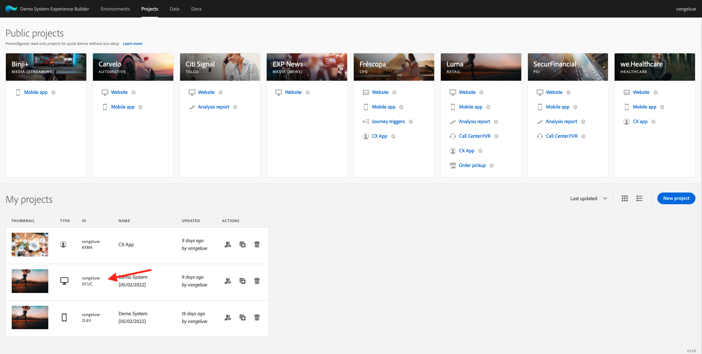
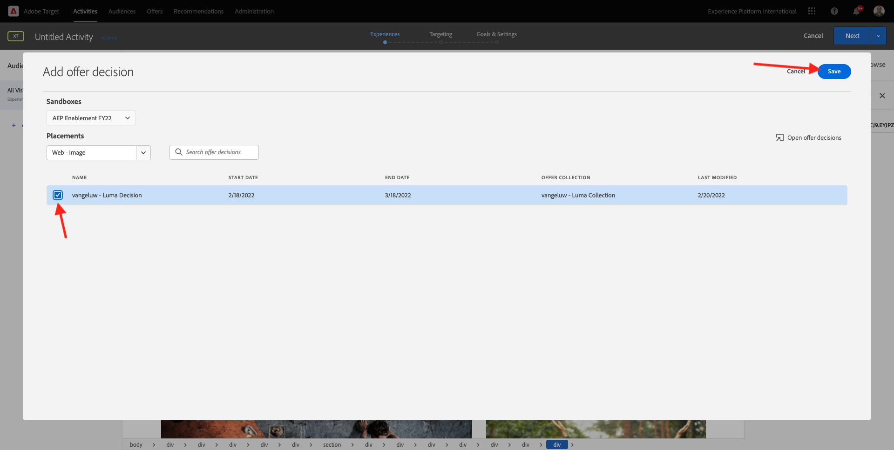
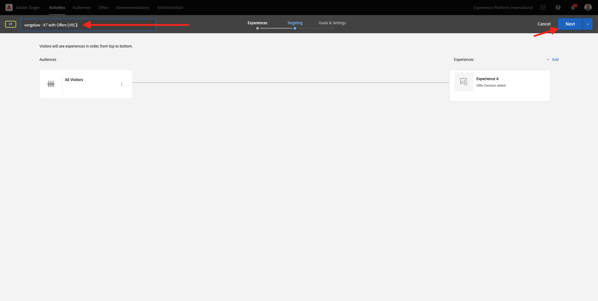

# 9.4 Adobe Target과 Offer decisioning 결합

## 9.4.1 데모 프로젝트의 공유 가능한 링크를 수집합니다

Adobe Target에서 데모 웹 사이트 프로젝트를 로드하려면 먼저 Adobe Target에서 데모 웹 사이트 프로젝트를 로드할 수 있도록 하는 특수 링크를 수집해야 합니다.

이렇게 하려면 다음 위치로 이동하십시오. [https://builder.adobedemo.com/projects](https://builder.adobedemo.com/projects). Adobe ID으로 로그인하면 다음이 표시됩니다. 웹 사이트 프로젝트를 클릭하여 엽니다.

이제 이게 보입니다. **공유**&#x200B;를 클릭합니다.

클릭 **링크 생성** 그런 다음 클립보드에 링크를 복사합니다.

이동 [https://bitly.com](https://bitly.com)복사한 링크를 붙여넣고 를 클릭합니다 **단축**. 이제 다음과 같은 단축 링크가 제공됩니다. `https://bit.ly/3JxN7aG`. 다음 연습에서는 그 링크가 필요합니다.

## 9.4.2 수집

이제 이동하여 Adobe Experience Cloud 홈 페이지로 이동합니다 [https://experiencecloud.adobe.com/](https://experiencecloud.adobe.com/). 클릭 **Target**.

설정 **Adobe Target** homepage에는 기존의 모든 활동이 표시됩니다.

클릭 **+ 활동 만들기** 새 활동을 만들려면

선택 **경험 타깃팅**.

이제 을(를) 선택합니다. **시각적** 단축 링크를 필드에 붙여넣습니다. **활동 URL 입력**. **다음**&#x200B;을 클릭합니다.

그러면 시각적 경험 작성기에 로드되는 데모 웹 사이트 프로젝트가 표시됩니다.

이동 **찾아보기** 클릭 모드 **모두 허용** 를 클릭합니다.

텍스트가 포함된 영역을 클릭합니다 **주요 카테고리**. 클릭 **다음 항목 앞에 삽입** 그런 다음 **오퍼 결정**.

그러면 이 팝업이 표시됩니다. 샌드박스 선택 `--aepSandboxId--` 그런 다음 배치를 선택합니다 **웹 - 이미지**.

다음으로, 결정을 선택합니다 `--demoProfileLdap-- - Luma Decision`. **저장**&#x200B;을 클릭합니다.

그러면 이게 보입니다. 추가 템플릿 규칙을 추가해야 합니다 **URL** **다음 포함** **your-project-name**. 클릭 **저장**.

그러면 이게 보입니다. **다음**&#x200B;을 클릭합니다.

오퍼의 이름을 입력하고 다음 이름을 사용합니다. `--demoProfileLdap-- - XT with Offers (VEC)`. **다음**&#x200B;을 클릭합니다.

그러면 이게 보입니다. 을(를) 정의합니다 **목표 지표** 표시된 대로. **저장 및 닫기**&#x200B;를 클릭합니다.

이제 오퍼가 생성되고 게시되고 있습니다.

오퍼가 게시되면 활성화할 수 있습니다.

다음 단계: [9.5 이메일 및 sms에서 결정 사용](./ex5.md)

[모듈 9로 돌아가기](./offer-decisioning.md)

[모든 모듈로 돌아가기](./../../overview.md)
