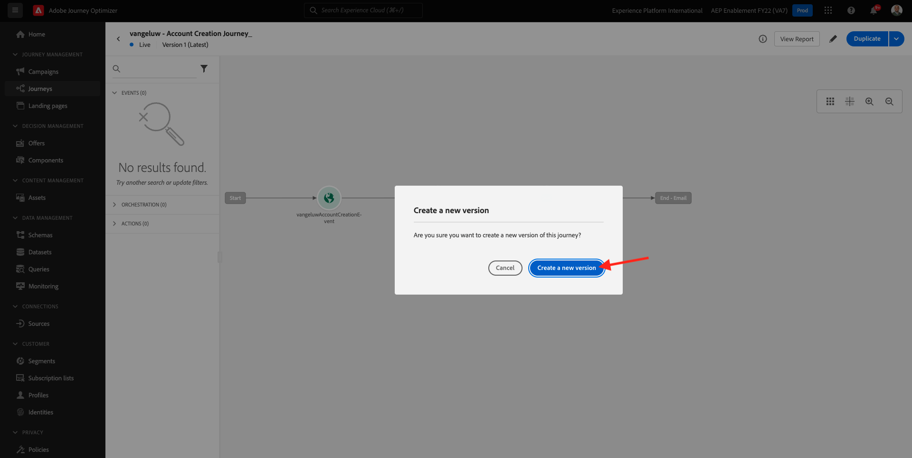
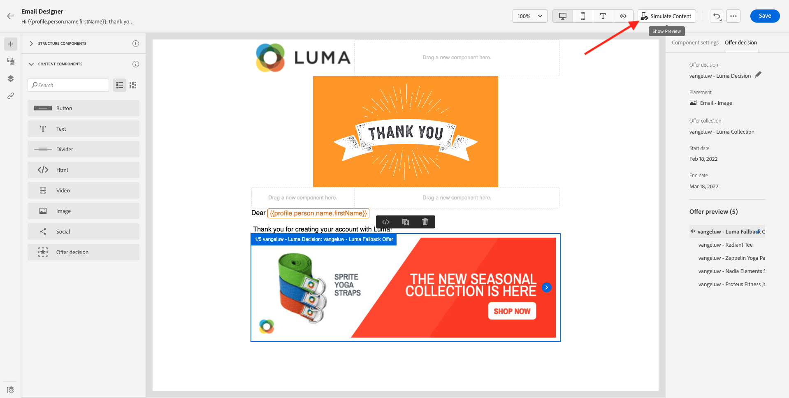
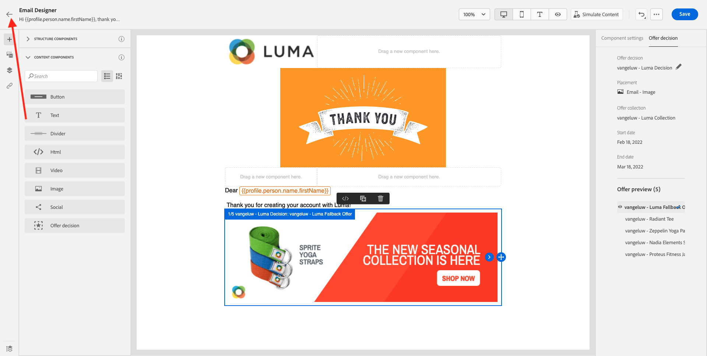
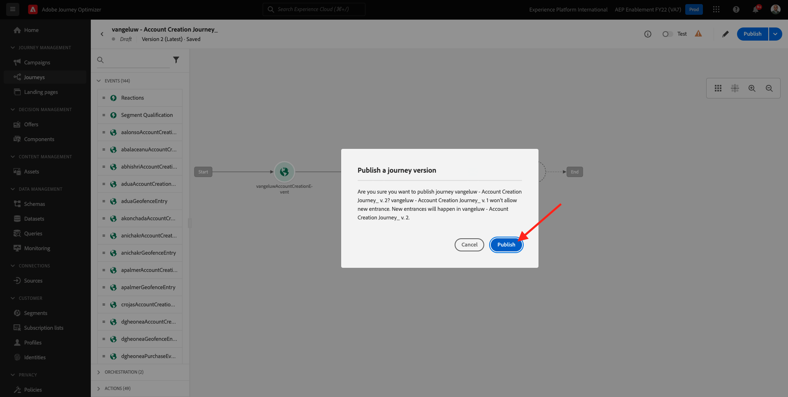
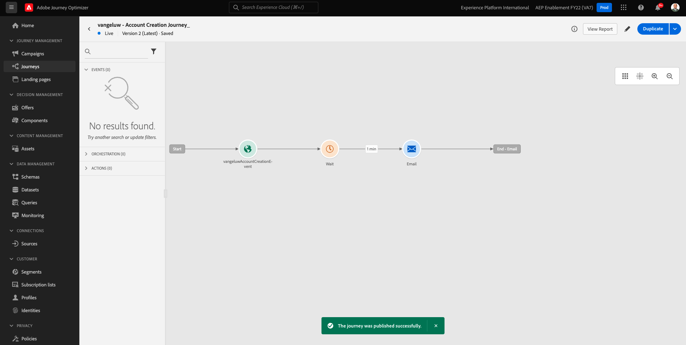

# 9.5 이메일에 결정 사용

이 연습에서는 이메일 및 SMS 게재를 개인화하는 데 결정을 사용합니다.

이동 **여정**. experience 7.2에서 만든 여정( 라고 함)를 찾습니다 `--demoProfileLdap-- - Account Creation Journey`. 여정을 클릭하여 엽니다.

그러면 이게 보입니다. 클릭 **새 버전 만들기**.

클릭 **새 버전 만들기**.

을(를) 클릭합니다. **이메일** 작업을 수행한 다음 **컨텐츠 편집**.

그러면 메시지 대시보드가 표시됩니다. 클릭 **이메일 디자이너**.

그러면 이게 보입니다.

그러면 이게 보입니다. 새 드래그 **1:1 열** 구성 요소를 캔버스에 업로드합니다.

메뉴에서 **컨텐츠 구성 요소**. 을(를) 선택합니다 **오퍼 결정** 구성 요소를 마우스로 가리킨 다음, 이메일의 컨텐츠 오퍼 자리 표시자에 있는 이 구성 요소를 드래그하여 놓습니다. 그런 다음 **추가**.

이메일에 포함할 배치 유형을 선택합니다. 에서 **배치** 드롭다운 메뉴 선택 **이메일 - 이미지**&#x200B;을 선택한 다음 결정을 선택합니다 `--demoProfileLdap-- - Luma Decision`. **추가를 클릭합니다**.

이제 이메일 디자이너 내에서 시각화된 모든 개인화된 오퍼와 대체 오퍼가 표시됩니다. 클릭  **컨텐츠 시뮬레이션** 실제 고객 프로필로 이메일 메시지를 미리 보려면

미리 보기에 사용할 프로필을 식별하여 시작합니다. 을(를) 선택합니다 **이메일** 네임스페이스 를 입력하고 데모 웹 사이트에서 만든 고객 프로필의 이메일 주소를 입력합니다. 다음을 클릭합니다. **미리 보기**.

이메일이 표시되고 오퍼가 올바르게 표시되면 **닫기** 버튼을 클릭합니다.

마지막으로 **저장**.

이제 화살표를 클릭하여 이전 화면으로 돌아갑니다.

그러면 이게 보입니다. 왼쪽 상단 모서리의 화살표를 클릭하여 여정으로 돌아갑니다.

클릭 **확인** 을(를) 닫습니다. **이메일** 작업.

클릭 **게시** 업데이트된 여정을 게시하려면 다음을 수행하십시오.

을 클릭하여 확인 **게시** 다시 한 번

이제 메시지가 게시되었습니다.

데모 웹 사이트에서 새 계정을 만들면 다음과 같은 이메일이 제공됩니다.

너는 이 운동을 끝마쳤다.

다음 단계: [9.6 API를 사용하여 의사 결정 테스트](./ex6.md)

[모듈 9로 돌아가기](./offer-decisioning.md)

[모든 모듈로 돌아가기](./../../overview.md)
