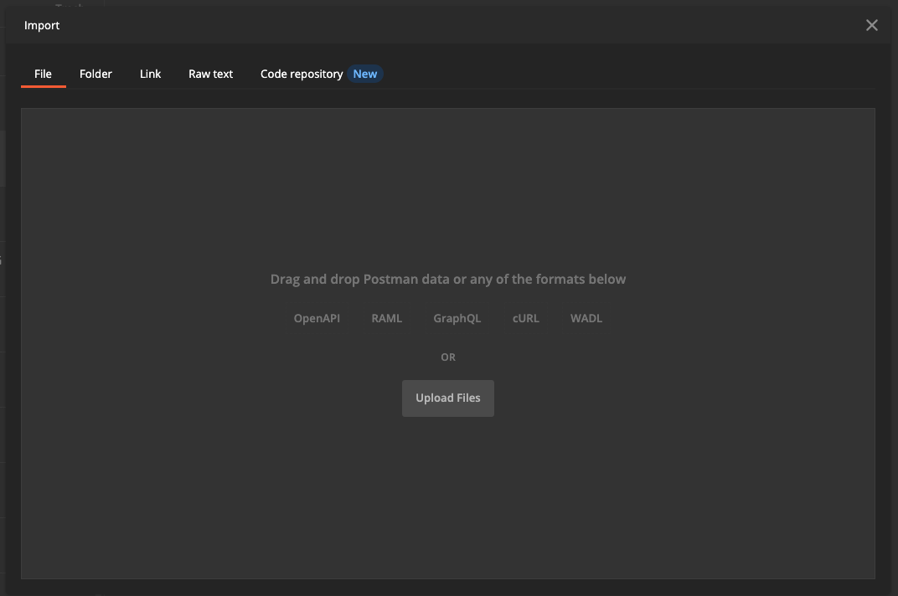

# 9.6 API를 사용하여 의사 결정을 테스트합니다

## 9.6.1 Postman을 사용하여 Offer decisioning API 작업

다운로드 [offer decisioning을 위한 이 Postman 컬렉션](./../../assets/postman/postman_offer-decisioning.zip) 바탕 화면으로 이동하여 압축을 해제합니다. 그러면 다음 항목이 제공됩니다.

이제 바탕 화면에 다음 파일이 있습니다.

- [!UICONTROL _Module 14-Decisioning Service.postman_collection.json]

in [연습 3.3.3 - Adobe I/O에 대한 Postman 인증](./../../modules/module3/ex3.md) Postman을 설치했습니다. 이 연습에서는 Postman을 다시 사용해야 합니다.

Postman을 엽니다. **[!UICONTROL 가져오기]**&#x200B;를 클릭합니다.

클릭 **[!UICONTROL 파일 업로드]**.

파일을 선택합니다 **[!UICONTROL _Module 14-Decisioning Service.postman_collection.json]** 을(를) 클릭합니다. **[!UICONTROL 열기]**.

그런 다음 Postman에서 이 컬렉션을 사용할 수 있습니다.

이제 API를 통해 Adobe Experience Platform과 상호 작용할 수 있도록 Postman에 필요한 모든 것이 제공됩니다.

### 9.6.1.1 목록 컨테이너

를 클릭하여 요청을 엽니다 **[!UICONTROL GET - 컨테이너 나열]**.

아래 **[!UICONTROL 매개 변수]**, 다음 항목이 표시됩니다.

- 속성: `_instance.parentName==aepenablementfy22`

해당 매개 변수에서 **[!UICONTROL aepenablementfy22]** 은 Adobe Experience Platform에 사용되는 샌드박스의 이름입니다. 사용해야 하는 샌드박스는 다음과 같습니다 `--aepSandboxId--`. 텍스트 바꾸기 **[!UICONTROL aepenablementfy22]** by `--aepSandboxId--`.

샌드박스 이름을 바꾼 후 **[!UICONTROL 보내기]**.

지정한 샌드박스의 오퍼 컨테이너를 표시하는 응답입니다. 을(를) 복사하십시오 **[!UICONTROL container instanceId]** 아래에 표시된 대로 컴퓨터의 텍스트 파일에 기록해 두십시오. 이 도구를 사용해야 합니다 **[!UICONTROL container instanceId]** 다음 운동을 위해!

### 9.6.1.2 목록 배치

를 클릭하여 요청을 엽니다 **[!UICONTROL GET - 배치 나열]**. **[!UICONTROL 보내기]**&#x200B;를 클릭합니다.

이제 오퍼 컨테이너에 사용 가능한 모든 배치를 볼 수 있습니다. 표시되는 배치는 Adobe Experience Platform UI에서 볼 수 있듯이 정의됩니다 [연습 9.1.3](./ex1.md).

### 9.6.1.3 목록 의사 결정 규칙

를 클릭하여 요청을 엽니다 **[!UICONTROL GET - 의사 결정 규칙 나열]**. **[!UICONTROL 보내기]**&#x200B;를 클릭합니다.

응답에는 Adobe Experience Platform UI에서 정의한 결정 규칙이 표시됩니다. [연습 9.1.4](./ex1.md).

### 9.6.1.4 개인화된 오퍼 목록

를 클릭하여 요청을 엽니다 **[!UICONTROL GET - 개인화된 오퍼 나열]**. **[!UICONTROL 보내기]**&#x200B;를 클릭합니다.

응답에는 Adobe Experience Platform UI에서 정의한 개인화된 오퍼 가 표시됩니다. [연습 9.2.1](./ex2.md).

### 9.6.1.5 대체 오퍼 나열

를 클릭하여 요청을 엽니다 **[!UICONTROL GET - 대체 오퍼 나열]**. **[!UICONTROL 보내기]**&#x200B;를 클릭합니다.

응답에는 의 Adobe Experience Platform UI에 정의한 대체 오퍼가 표시됩니다 [연습 9.2.2](./ex2.md).

### 9.6.1.6 목록 컬렉션

를 클릭하여 요청을 엽니다 **[!UICONTROL GET - 컬렉션 나열]**.

응답에는 의 Adobe Experience Platform UI에서 정의한 컬렉션이 표시됩니다 [연습 9.2.3](./ex2.md).

### 9.6.1.7 고객 프로필에 대한 세부 오퍼 가져오기

를 클릭하여 요청을 엽니다 **[!UICONTROL POST - 고객 프로필에 대한 세부 오퍼 가져오기]**. 이 요청은 이전 요청과 유사하지만, 실제로 이미지 URL, 텍스트 등과 같은 세부 사항을 반환합니다.

이 요청의 경우, 유사한 요구 사항이 있는 이전 연습과 유사하게, **[!UICONTROL xdm:placementId]** 및 **[!UICONTROL xdm:activityId]** 를 입력하여 고객에 대한 특정 오퍼 세부 사항을 검색할 수 있습니다.

필드 **[!UICONTROL xdm:activityId]** 작성해야 합니다. 아래 표시된 대로 Adobe Experience Platform UI에서 검색할 수 있습니다.

필드 **[!UICONTROL xdm:placementId]** 작성해야 합니다. 아래 표시된 대로 Adobe Experience Platform UI에서 검색할 수 있습니다. 아래 예에서는 배치에 대한 placementId를 볼 수 있습니다 **[!UICONTROL 웹 - 이미지]**.

이동 **[!UICONTROL 본문]** 오퍼를 요청할 고객의 이메일 주소를 입력합니다. **[!UICONTROL 보내기]**&#x200B;를 클릭합니다.

마지막으로 개인화된 오퍼의 유형과 이 고객에게 표시해야 하는 자산을 확인할 수 있습니다.

이제 이 연습을 완료했습니다.

다음 단계: [요약 및 이점](./summary.md)

[모듈 9로 돌아가기](./offer-decisioning.md)

[모든 모듈로 돌아가기](./../../overview.md)
