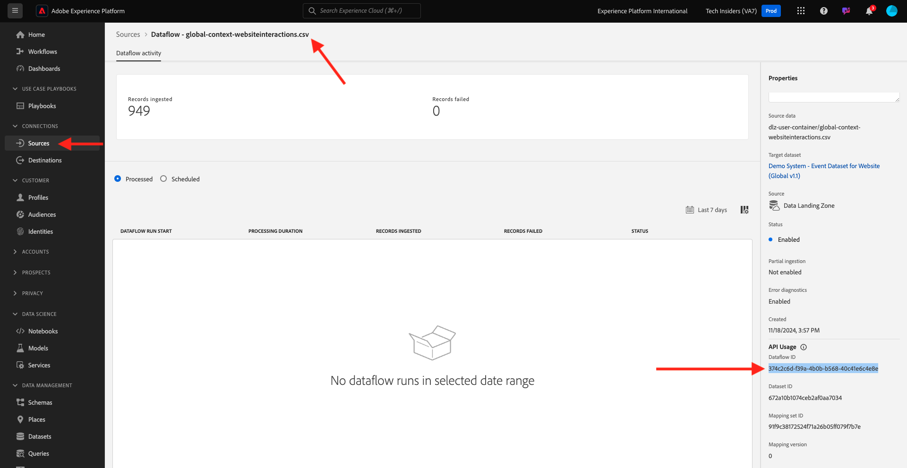
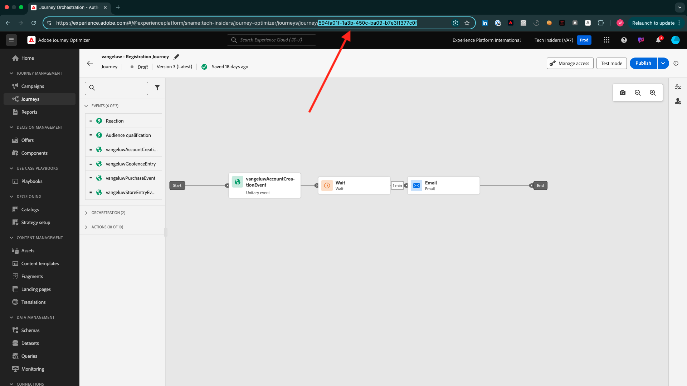

# 완료는 어떻게 측정됩니까?

[https://certification.adobe.com](https://certification.adobe.com)(으)로 이동하여 강의 **XXX**(으)로 이동합니다.

모듈을 완료하려면 완료 증명을 제공해야 합니다.

아래는 모든 모듈에 대해 예상되는 완료 증명입니다.

## 시작하기

**시작하기** 모듈에 대한 예상 완료 증명은 사용자가 만든 웹용 데모 시스템 프로젝트의 ID입니다.

웹 형식에 대한 데모 시스템 프로젝트의 ID는 다음과 같습니다. `--aepUserLdap-- - QIMU`.

## 1.1 Adobe Experience Platform 데이터 수집 및 Web SDK 확장

**데이터 수집 및 웹 SDK** 모듈의 예상 완료 증명은 웹용 데이터 수집 속성의 **환경 ID**&#x200B;입니다.

웹 형식에 대한 데이터 수집 속성의 환경 ID는 다음과 같습니다. `EN5211f7792b4442f8a45deb68f8902d3a`.

## 1.2 데이터 수집

**데이터 수집** 모듈의 예상 완료 증명은 데이터 랜딩 영역 Source 연결의 데이터 흐름 ID입니다.

데이터 흐름 ID는 다음과 같습니다. **374c2c6d-f39a-4b0b-b568-40c41e6c4e8e**.

## 1.3 페더레이션 대상 구성

**Federated Audience Composition** 모듈에 대해 예상되는 완료 증명은 사용자가 만든 페더레이션 데이터 모델의 ID입니다.

페더레이션 데이터 모델의 ID는 다음과 같습니다. **DMO5110**. 아래 이미지에 표시된 URL에서 가져올 수 있습니다.

## 2.1 실시간 고객 프로필

**실시간 고객 프로필** 모듈에 대해 예상되는 완료 증명은 UI `--aepUserLdap-- - Male customers with interest in iPhone 15 Pro`을(를) 통해 만든 대상의 **대상 ID**&#x200B;입니다.

대상 ID는 다음과 같습니다. **81a9acbe-12e6-424b-b658-abba3a435c83**.

## 2.2 지능형 서비스

**Intelligent Services** 모듈에 대한 예상 완료 증명은 UI `--aepUserLdap-- - Customer AI High Propensity`을(를) 통해 만든 대상의 **대상 ID**&#x200B;입니다.

대상 ID는 다음과 같습니다. **cb6db21d-8fa3-484a-93ac-25aa1ab48412**.

## 2.3 Real-Time CDP: 대상자를 빌드하고 조치를 취하십시오!

**Real-Time CDP 모듈의 예상 완료 증명: 대상자를 빌드하고 조치를 취하십시오!**&#x200B;은(는) **대상 SDK Webhook 대상**&#x200B;의 ID입니다.

웹후크 대상의 ID는 다음과 같습니다. **b5b4b959-3166-40e2-8279-8223d00c3987** 아래 이미지에 표시된 URL에서 가져올 수 있습니다.

## 2.4 Real-Time CDP: Microsoft Azure Event Hub Audience Activation

**Real-Time CDP: Microsoft Azure Event Hub에 Audience Activation** 모듈의 예상 완료 증명은 Adobe Experience Platform의 **Microsoft Azure Event Hub** 대상 ID입니다.

아래 표시된 대로 URL에서 이 **43cf85bc-3d01-49fd-80c9-a2913db45e3c**&#x200B;와(과) 유사한 **Microsoft Azure 이벤트 허브 대상 ID**&#x200B;를 찾을 수 있습니다.

## 2.5 Real-Time CDP 연결: 이벤트 전달

모듈 **Real-Time CDP 연결: 이벤트 전달**&#x200B;에 대한 예상 완료 증명은 **이벤트 전달 속성 ID**&#x200B;입니다.

아래 이미지에 표시된 대로 URL에서 이 **PRa18819171c1241dfb16d74a49993dd5b**&#x200B;과(와) 같은 **이벤트 전달 속성 ID**&#x200B;을(를) 찾을 수 있습니다.

## 2.6 Apache Kafka에서 Real-Time CDP으로 데이터 스트리밍

**Apache Kafka에서 Real-Time CDP으로 데이터 스트리밍**&#x200B;에 대해 예상되는 완료 증명은 소스 커넥터 `--aepUserLdap-- - Kafka`의 ID입니다.

ID는 이 **f843d50a-ee30-4ca8-a766-0e4f3d29a2f7**&#x200B;와(과) 유사하며 여기에서 찾을 수 있습니다.

## 3.1 Adobe Journey Optimizer: 오케스트레이션

**Adobe Journey Optimizer: 오케스트레이션** 여정에 대해 예상되는 완료 증명은 사용자가 만든 모듈의 ID입니다.

여정의 ID는 다음과 같습니다. **594fa01f-1a3b-450c-ba09-b7e3ff377c0f**. 아래 이미지에 표시된 URL에서 가져올 수 있습니다.

## 3.2 Adobe Journey Optimizer: 외부 데이터 소스 및 사용자 지정 작업

**Adobe Journey Optimizer: 외부 데이터 원본 및 사용자 지정 작업** 모듈에 대한 예상 완료 증명은 사용자가 만든 여정의 ID입니다.

여정의 ID는 다음과 같습니다. **6962d3bc-4f44-4f9c-b326-83978f245f2a**. 아래 이미지에 표시된 URL에서 가져올 수 있습니다.

## 3.3 Adobe Journey Optimizer: Offer decisioning

**Adobe Journey Optimizer: Offer decisioning** 모듈에 대한 예상 완료 증명은 사용자가 만든 **결정**&#x200B;의 ID입니다.

**결정 ID**&#x200B;을 찾을 수 있습니다. 이 ID는 **dps:offer-activity:1a08ba4b529b2fb2**&#x200B;와(과) 유사합니다.

## 3.4 Adobe Journey Optimizer: 이벤트 기반 여정

**Adobe Journey Optimizer: 이벤트 기반 여정** 모듈의 예상 완료 증명은 사용자가 만든 여정의 ID입니다.

여정의 ID는 다음과 같습니다. **5f5efc7e-49f7-44c1-85df-b23482b38d32**. 아래 이미지에 표시된 URL에서 가져올 수 있습니다.

## 4.1 Customer Journey Analytics: Analysis Workspace을 사용하여 대시보드 빌드

**Customer Journey Analytics 모듈: Analysis Workspace을 사용하여 대시보드를 빌드**&#x200B;하는 데 필요한 완료 증명은 프로젝트 `--aepUserLdap-- - Omnichannel Analysis`의 ID입니다.

형식은 다음과 같습니다. **677bcb247064db3c7de2a0e4**. 프로젝트를 열면 URL에서 찾을 수 있습니다.

## 4.2 Customer Journey Analytics: BigQuery Source 커넥터를 사용하여 Adobe Experience Platform에서 Google Analytics 데이터 수집 및 분석

**Customer Journey Analytics: BigQuery Source 커넥터를 사용하여 Adobe Experience Platform에서 Google Analytics 데이터 수집 및 분석**&#x200B;에 대해 예상되는 완료 증명은 **BigQuery** 소스 연결의 ID입니다.

다음 위치에서 이 **b63a810c-a8cc-4c6b-a57e-dcb7e3368cf8**&#x200B;과(와) 유사한 **BigQuery 연결 ID**&#x200B;을(를) 찾을 수 있습니다.

## 5.1 쿼리 서비스

**쿼리 서비스** 모듈에 대해 예상되는 완료 증명은 모듈을 완료한 후 받는 `--aepUserLdap--_callcenter_interaction_analysis` 데이터 세트 ID(데이터 세트)입니다.

ID는 다음과 같습니다. **675033c903fb3b2aefed8a0a**.

{width="50px" align="left"}

>[!NOTE]
>
>질문이 있는 경우 향후 콘텐츠에 대한 제안 사항에 대한 일반적인 피드백을 공유하려면 기술 인사이더에게 **techinsiders@adobe.com**&#x200B;로 전자 메일을 보내 직접 문의하십시오.

[모든 모듈로 돌아가기](./overview.md)