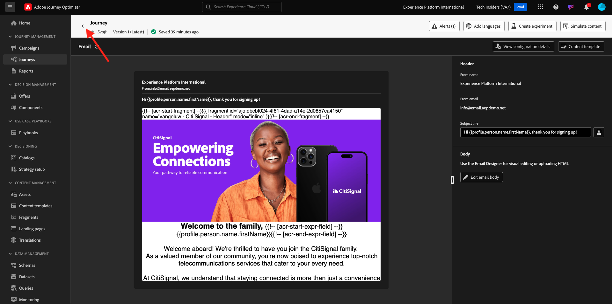
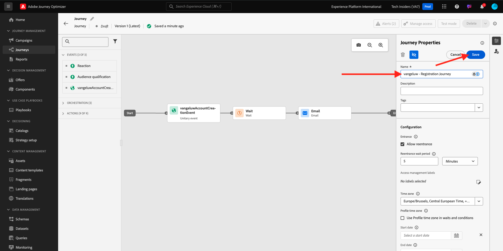

# 3.1.2 여정 및 이메일 메시지 만들기

이 연습에서는 데모 웹 사이트에서 다른 사람이 계정을 만들 때 트리거해야 하는 여정 및 메시지를 구성합니다.

[Adobe Journey Optimizer](https://experience.adobe.com)(으)로 이동하여 Adobe Experience Cloud에 로그인합니다. **Journey Optimizer**&#x200B;을(를) 클릭합니다.

Journey Optimizer의 **Home** 보기로 리디렉션됩니다. 먼저 올바른 샌드박스를 사용하고 있는지 확인하십시오. 사용할 샌드박스를 `--aepSandboxName--`이라고 합니다. 한 샌드박스에서 다른 샌드박스로 변경하려면 **프로덕션 프로덕션(VA7)**&#x200B;을 클릭하고 목록에서 샌드박스를 선택합니다. 이 예제에서는 샌드박스 이름을 **AEP 지원 FY22**&#x200B;로 지정합니다. 그러면 샌드박스 `--aepSandboxName--`의 **홈** 보기에 있게 됩니다.

## 3.1.2.1 여정 만들기

왼쪽 메뉴에서 **여정**&#x200B;을 클릭합니다. 그런 다음 **여정 만들기**&#x200B;를 클릭하여 새 여정을 만듭니다.

그러면 빈 여정 화면이 표시됩니다.

이전 연습에서는 새 **이벤트**&#x200B;를 만들었습니다. 이 `ldapAccountCreationEvent`과(와) 같이 이름을 지정하고 `ldap`을(를) ldap로 바꾸었습니다. 이는 이벤트 생성의 결과였습니다.

이제 이 이벤트를 이 여정의 시작으로 간주해야 합니다. 이렇게 하려면 화면 왼쪽으로 이동하여 이벤트 목록에서 이벤트를 검색할 수 있습니다.

이벤트를 선택하고 여정 캔버스에 끌어서 놓습니다. 이제 여정은 다음과 같습니다.

여정의 두 번째 단계로 **대기** 단계를 짧게 추가해야 합니다. 화면의 왼쪽으로 이동하여 **오케스트레이션** 섹션을 찾습니다. 프로필 속성을 사용하게 되며 이러한 속성이 실시간 고객 프로필에 채워져 있는지 확인해야 합니다.

이제 여정은 다음과 같습니다. 화면 오른쪽에서 대기 시간을 구성해야 합니다. 1분으로 설정합니다. 이렇게 하면 이벤트가 실행된 후에 프로필 속성을 사용할 수 있는 충분한 시간이 제공됩니다.

변경 내용을 저장하려면 **확인**&#x200B;을 클릭하세요.

여정의 세 번째 단계로 **전자 메일** 작업을 추가해야 합니다. 화면의 왼쪽으로 이동하여 **작업**&#x200B;을(를) 선택하고 **전자 메일** 작업을 선택한 다음 여정의 두 번째 노드에 끌어서 놓습니다. 이제 이 항목을 볼 수 있습니다.

**카테고리**&#x200B;을(를) **마케팅**(으)로 설정하고 전자 메일을 보낼 수 있는 전자 메일 표면을 선택합니다. 이 경우 선택할 전자 메일 표면은 **전자 메일**&#x200B;입니다. **이메일 클릭 수** 및 **이메일 열기**&#x200B;에 대한 확인란이 모두 활성화되어 있는지 확인하십시오.

다음 단계는 메시지를 만드는 것입니다. 이렇게 하려면 **콘텐츠 편집**&#x200B;을 클릭하세요.

## 3.1.2.2 메시지 만들기

메시지를 만들려면 **콘텐츠 편집**&#x200B;을 클릭하세요.

이제 이 항목을 볼 수 있습니다.

**제목 줄** 텍스트 필드를 클릭합니다.

텍스트 영역에서 **안녕하세요** 쓰기를 시작합니다.

제목란은 아직 완성되지 않았습니다. 다음으로 `profile.person.name.firstName` 아래에 저장된 필드 **이름**&#x200B;에 대한 개인화 토큰을 가져와야 합니다. 왼쪽 메뉴에서 아래로 스크롤하여 **Person** 요소를 찾은 다음 화살표를 클릭하여 더 깊은 레벨로 이동합니다.

이제 **전체 이름** 요소를 찾아 화살표를 클릭하면 더 깊은 레벨로 이동합니다.

마지막으로 **이름** 필드를 찾은 다음 옆에 있는 **+** 기호를 클릭합니다. 그러면 개인화 토큰이 텍스트 필드에 표시되는 것을 볼 수 있습니다.

다음으로 **텍스트를 추가하십시오. 등록해 주셔서 감사합니다!** 질문에 답합니다. **저장**&#x200B;을 클릭합니다.

그럼 다시 여기로 오십시오. 전자 메일 콘텐츠를 만들려면 **전자 메일 Designer**&#x200B;을(를) 클릭합니다.

다음 화면에서는 전자 메일 콘텐츠를 제공하는 3가지 방법이 표시됩니다.

- **처음부터 디자인**: 빈 캔버스로 시작하고 WYSIWYG 편집기를 사용하여 구조 및 콘텐츠 구성 요소를 끌어서 놓아 전자 메일의 콘텐츠를 시각적으로 빌드합니다.
- **직접 코딩하기**: HTML을 사용하여 코딩하여 전자 메일 템플릿을 만드십시오.
- **HTML 가져오기**: 편집할 수 있는 기존 HTML 템플릿을 가져옵니다.

**처음부터 디자인**&#x200B;을 클릭합니다.

왼쪽 메뉴에서 이메일(행 및 열) 구조를 정의하는 데 사용할 수 있는 구조 구성 요소를 찾을 수 있습니다.

메뉴에서 캔버스로 **1:2 열 Left**&#x200B;을(를) 끌어서 놓습니다. 로고 이미지의 자리 표시자가 됩니다.

이전 구성 요소 아래에 **1:1 열**&#x200B;을(를) 끌어서 놓습니다. 배너 블록이 됩니다.

이전 구성 요소 아래에 **1:2 열 Left**&#x200B;을(를) 끌어서 놓습니다. 왼쪽에 이미지가 있고 오른쪽에 텍스트가 있는 실제 콘텐츠입니다.

그런 다음 이전 구성 요소 아래에 **1:1 열**&#x200B;을(를) 끌어서 놓습니다. 이메일의 바닥글이 됩니다. 이제 캔버스는 다음과 같이 표시됩니다.

다음으로 콘텐츠 구성 요소를 사용하여 이러한 블록 내에 콘텐츠를 추가하겠습니다. **콘텐츠 구성 요소** 메뉴 항목을 클릭합니다.

첫 번째 행의 첫 번째 셀에 **Image** 구성 요소를 끌어서 놓습니다. **찾아보기**&#x200B;를 클릭합니다.

그러면 이걸 보게 될 거야. **enablement-assets** 폴더로 이동하고 **luma-logo.png** 파일을 선택합니다. **선택**&#x200B;을 클릭합니다.

이제 다시 돌아왔습니다.

**콘텐츠 구성 요소**(으)로 이동하여 첫 번째 행의 첫 번째 셀에 **이미지** 구성 요소를 끌어다 놓습니다. **찾아보기**&#x200B;를 클릭합니다.

**Assets** 팝업에서 **enablement-assets** 폴더로 이동합니다. 이 폴더에서는 크리에이티브 팀이 이전에 준비하고 업로드한 모든 에셋을 찾을 수 있습니다. **module23-thankyou-new.png**&#x200B;를 선택하고 **선택**&#x200B;을 클릭합니다.

그러면 다음 항목이 제공됩니다.

이미지를 선택하고 오른쪽 메뉴에서 **크기** 너비 슬라이더 구성 요소가 표시될 때까지 아래로 스크롤합니다. 슬라이더를 사용하여 너비를 f.i.로 변경합니다. **60%**.

그런 다음 **콘텐츠 구성 요소**(으)로 이동하여 네 번째 행의 구조 구성 요소에서 **텍스트** 구성 요소를 끌어서 놓습니다.

기본 텍스트 **을(를) 선택하십시오. 여기에 텍스트를 입력하십시오.모든 텍스트 편집기와 마찬가지로**&#x200B;합니다. 대신 **Dear**&#x200B;을(를) 작성하세요. 텍스트 모드에 있는 경우 텍스트 도구 모음이 표시됩니다.

도구 모음에서 **개인화 추가** 아이콘을 클릭합니다.

`profile.person.name.firstName`에 저장된 **이름** 개인화 토큰을 가져와야 합니다. 메뉴에서 **Person** 요소를 찾아 **전체 이름** 요소로 드릴다운한 다음 **+** 아이콘을 클릭하여 이름 필드를 식 편집기에 추가합니다.

**저장**&#x200B;을 클릭합니다.

이제 개인화 필드가 텍스트에 추가된 방식을 알 수 있습니다.

같은 텍스트 필드에서 **Enter**&#x200B;를 두 번 눌러 두 줄을 추가하고 **Luma로 계정을 만들어 주셔서 감사합니다!**.

이메일을 미리 볼 준비가 되었는지 확인하기 위해 수행할 마지막 검사는 **콘텐츠 시뮬레이션** 단추를 클릭합니다.

미리보기에 사용할 프로필을 식별하여 시작합니다. **ID 네임스페이스 입력** 필드 옆에 있는 아이콘을 클릭하여 **전자 메일** 네임스페이스를 선택합니다.

ID 네임스페이스 목록에서 **전자 메일** 네임스페이스를 선택합니다.

**ID 값** 필드에 실시간 고객 프로필에 이미 저장된 이전 데모 프로필의 전자 메일 주소를 입력합니다. 예를 들어 **woutervangeluwe+06022022-01@gmail.com**&#x200B;을(를) 클릭하고 **테스트 프로필 찾기** 단추를 클릭합니다.

프로필이 테이블에 표시되면 **미리 보기** 탭을 클릭하여 미리 보기 화면에 액세스합니다.

미리보기가 준비되면 제목 줄에서 개인화가 올바른지 확인하고 본문 텍스트와 구독 취소 링크가 하이퍼링크로 강조 표시됩니다.

미리 보기를 닫으려면 **닫기**&#x200B;를 클릭하십시오.

메시지를 저장하려면 **저장**&#x200B;을 클릭하세요.

왼쪽 상단 모서리의 제목 줄 텍스트 옆에 있는 **화살표**&#x200B;를 클릭하여 메시지 대시보드로 돌아갑니다.

이제 등록 이메일 작성을 완료했습니다. 왼쪽 상단 모서리의 화살표를 클릭하여 여정으로 돌아갑니다.

**확인**&#x200B;을 클릭합니다.

## 3.1.2.3 여정 Publish

여정 이름을 계속 지정해야 합니다. 화면 오른쪽 상단의 **속성** 아이콘을 클릭하면 됩니다.

그런 다음 여기에 여정 이름을 입력할 수 있습니다. `--aepUserLdap-- - Account Creation Journey`을(를) 사용하십시오. 변경 내용을 저장하려면 **확인**&#x200B;을 클릭하세요.

이제 **Publish**&#x200B;을(를) 클릭하여 여정을 게시할 수 있습니다.

**Publish**&#x200B;을 다시 클릭합니다.

그러면 이제 여정이 게시되었다는 녹색 확인 표시줄이 표시됩니다.

이제 이 연습을 완료했습니다.

다음 단계: [3.1.3 데이터 수집 속성 업데이트 및 여정 테스트](./ex3.md)

[모듈 3.1로 돌아가기](./journey-orchestration-create-account.md)

[모든 모듈로 돌아가기](../../../overview.md)
