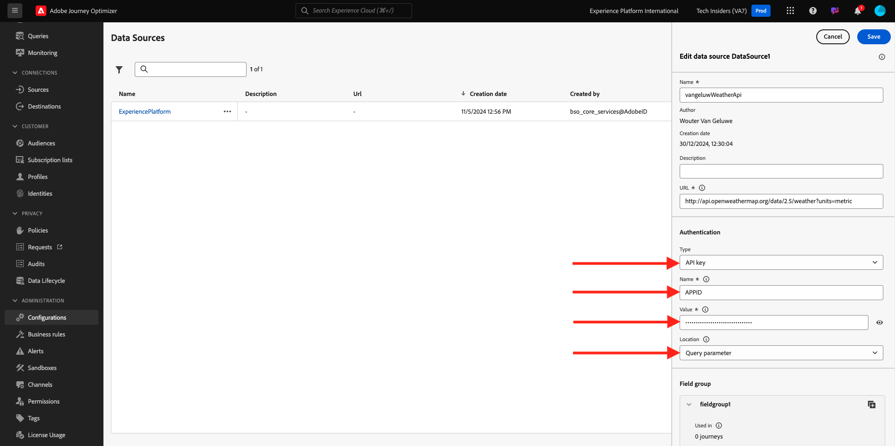
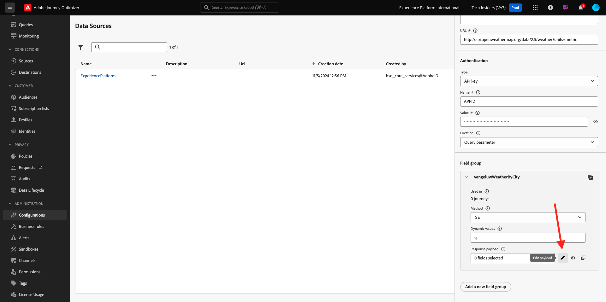

# 3.2.2 외부 데이터 소스 정의

이 연습에서는 Adobe Journey Optimizer을 사용하여 사용자 지정 외부 데이터 소스를 만듭니다.

[Adobe Journey Optimizer](https://experience.adobe.com)(으)로 이동하여 Adobe Experience Cloud에 로그인합니다. **Journey Optimizer**&#x200B;을(를) 클릭합니다.


Journey Optimizer의 **Home** 보기로 리디렉션됩니다. 먼저 올바른 샌드박스를 사용하고 있는지 확인하십시오. 사용할 샌드박스를 `--aepSandboxName--`이라고 합니다. 그러면 샌드박스 `--aepSandboxName--`의 **홈** 보기에 있게 됩니다.


왼쪽 메뉴에서 아래로 스크롤하여 **구성**&#x200B;을 클릭합니다. 그런 다음 **데이터 원본**&#x200B;에서 **관리** 단추를 클릭합니다.


그러면 **데이터 원본** 목록이 표시됩니다.
데이터 원본 추가를 시작하려면 **데이터 Source 만들기**&#x200B;를 클릭하세요.


빈 데이터 소스 팝업이 표시됩니다.


이 구성을 시작하려면 **Open Weather Map** 서비스에 계정이 필요합니다. 다음 단계에 따라 계정을 만들고 API 키를 가져옵니다.

[https://openweathermap.org/](https://openweathermap.org/)(으)로 이동합니다. 홈페이지에서 **로그인**&#x200B;을 클릭합니다.


**계정 만들기**&#x200B;를 클릭합니다.


자세한 내용을 작성하십시오. **계정 만들기**&#x200B;를 클릭합니다.


그러면 계정 페이지로 리디렉션됩니다.


메뉴에서 **API 키**&#x200B;를 클릭하여 API 키를 검색합니다. 이 API 키는 사용자 지정 외부 데이터 원본을 설정해야 합니다.


**API 키**&#x200B;은(는) 다음과 같습니다. `b2c4c36b6bb59c3458d6686b05311dc3`.

**현재 날씨** [여기](https://openweathermap.org/current)에 대한 **API 설명서**&#x200B;를 찾을 수 있습니다.

이 사용 사례의 경우 **도시 이름별 기본 제공 API 요청**&#x200B;을 사용하여 고객이 거주하는 도시를 기반으로 개방형 날씨 지도와의 연결을 구현합니다.


**Adobe Journey Optimizer**(으)로 돌아가서 빈 **외부 데이터 Source** 팝업으로 이동합니다.


데이터 원본의 이름으로 `--aepUserLdap--WeatherApi`을(를) 사용합니다.

설명을 `Access to the Open Weather Map`(으)로 설정합니다.

Open Weather Map API의 URL: **http://api.openweathermap.org/data/2.5/weather?units=metric**


그런 다음 사용할 인증을 선택해야 합니다.

다음 변수를 사용합니다.

| 필드 | 값 |
|:-----------------------:| :-----------------------|
| 유형 | **API 키** |
| 이름 | **APPID** |
| 값 | **API 키** |
| 위치 | **쿼리 매개 변수** |



마지막으로 Weather API로 보낼 기본적으로 요청인 **FieldGroup**&#x200B;을(를) 정의해야 합니다. 여기서는 도시의 이름을 사용하여 해당 도시의 &quot;현재 날씨&quot;를 요청합니다.


Weather API 설명서에 따라 매개 변수 `q=City`을(를) 보내야 합니다.


예상되는 API 요청과 일치하도록 필드 그룹을 다음과 같이 구성합니다.

>[!IMPORTANT]
>
>필드 그룹 이름은 고유해야 합니다. 이 명명 규칙을 사용하십시오. `--aepUserLdap--WeatherByCity`


응답 페이로드의 경우 Weather API에서 전송할 응답의 예를 붙여넣어야 합니다.

API 설명서 페이지 [여기](https://openweathermap.org/current)의 **JSON** 제목 아래에서 예상 API JSON 응답을 찾을 수 있습니다.


또는 여기에서 JSON 응답을 복사할 수 있습니다.

```json
{
   "coord": {
      "lon": 7.367,
      "lat": 45.133
   },
   "weather": [
      {
         "id": 501,
         "main": "Rain",
         "description": "moderate rain",
         "icon": "10d"
      }
   ],
   "base": "stations",
   "main": {
      "temp": 284.2,
      "feels_like": 282.93,
      "temp_min": 283.06,
      "temp_max": 286.82,
      "pressure": 1021,
      "humidity": 60,
      "sea_level": 1021,
      "grnd_level": 910
   },
   "visibility": 10000,
   "wind": {
      "speed": 4.09,
      "deg": 121,
      "gust": 3.47
   },
   "rain": {
      "1h": 2.73
   },
   "clouds": {
      "all": 83
   },
   "dt": 1726660758,
   "sys": {
      "type": 1,
      "id": 6736,
      "country": "IT",
      "sunrise": 1726636384,
      "sunset": 1726680975
   },
   "timezone": 7200,
   "id": 3165523,
   "name": "Province of Turin",
   "cod": 200
}    
```

위의 JSON 응답을 클립보드에 복사한 다음 사용자 지정 데이터 소스 구성 화면으로 이동합니다.

**페이로드 편집** 아이콘을 클릭합니다.



위의 JSON 응답을 붙여 넣어야 하는 팝업이 표시됩니다.


JSON 응답을 붙여 넣으면 이 메시지가 표시됩니다. **저장**&#x200B;을 클릭합니다.


이제 사용자 지정 데이터 소스 구성이 완료되었습니다. 위로 스크롤하여 **저장**&#x200B;을 클릭합니다.


이제 데이터 원본이 만들어졌고 **데이터 원본** 목록에 속합니다.


다음 단계: [3.2.3 사용자 지정 작업 정의](./ex3.md)

[모듈 3.2로 돌아가기](journey-orchestration-external-weather-api-sms.md)

[모든 모듈로 돌아가기](../../../overview.md)
