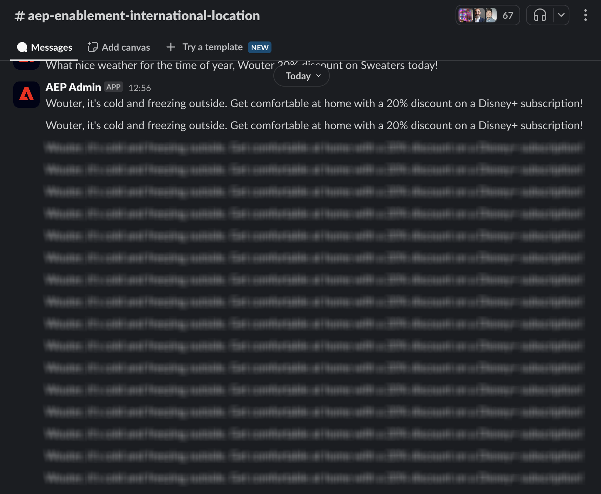
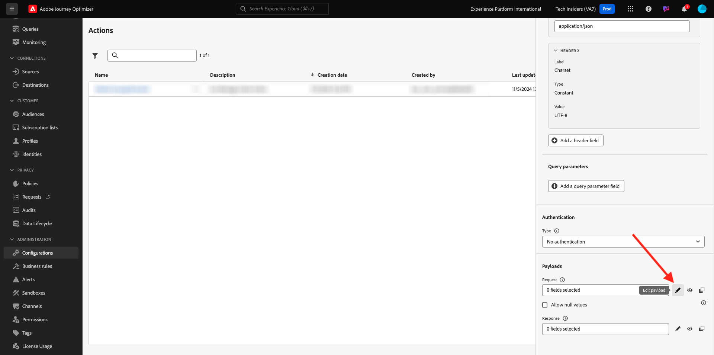

# 3.2.3 사용자 지정 작업 정의

이 연습에서는 Adobe Journey Optimizer을 함께 사용하여 두 가지 사용자 지정 작업을 만듭니다.

[Adobe Journey Optimizer](https://experience.adobe.com)(으)로 이동하여 Adobe Experience Cloud에 로그인합니다. **Journey Optimizer**&#x200B;을(를) 클릭합니다.


Journey Optimizer의 **Home** 보기로 리디렉션됩니다. 먼저 올바른 샌드박스를 사용하고 있는지 확인하십시오. 사용할 샌드박스를 `--aepSandboxName--`이라고 합니다. 한 샌드박스에서 다른 샌드박스로 변경하려면 **프로덕션 프로덕션(VA7)**&#x200B;을 클릭하고 목록에서 샌드박스를 선택합니다. 이 예제에서는 샌드박스 이름을 **AEP 지원 FY22**&#x200B;로 지정합니다. 그러면 샌드박스 `--aepSandboxName--`의 **홈** 보기에 있게 됩니다.


왼쪽 메뉴에서 아래로 스크롤하여 **구성**&#x200B;을 클릭합니다. 그런 다음 **작업**&#x200B;에서 **관리** 단추를 클릭합니다.


그러면 **작업** 목록이 표시됩니다.


Slack 채널에 텍스트를 전송하는 작업을 하나 정의합니다.

## 3.2.3.1 작업: Slack 채널로 텍스트 보내기

이제 기존 Slack 채널을 사용하여 해당 Slack 채널로 메시지를 전송합니다. Slack은 사용하기 쉬운 API를 포함하며, Adobe Journey Optimizer을 사용하여 해당 API를 트리거합니다.



새 작업 추가를 시작하려면 **작업 만들기**&#x200B;를 클릭하세요.


빈 작업 팝업이 표시됩니다.


작업의 이름으로 `--aepUserLdap--TextSlack`을(를) 사용합니다. 이 예제에서 작업 이름은 `vangeluwTextSlack`입니다.

설명을 `Send Text to Slack`(으)로 설정합니다.


**URL 구성**&#x200B;의 경우 다음을 사용하십시오.

- URL: `https://2mnbfjyrre.execute-api.us-west-2.amazonaws.com/prod`
- 메서드: **POST**

>[!NOTE]
>
>위의 URL은 위에서 언급한 대로 요청을 Slack 채널에 전달하는 AWS Lambda 함수를 참조합니다. 이 작업은 Adobe 소유 Slack 채널에 대한 액세스를 보호하기 위해 수행됩니다. 고유한 Slack 채널이 있는 경우 [https://api.slack.com/](https://api.slack.com/)을(를) 통해 Slack 앱을 만들어야 합니다. 그런 다음 해당 Slack 앱에서 들어오는 Webhook을 만든 다음 위의 URL을 들어오는 Webhook URL로 바꿔야 합니다.

헤더 필드를 변경할 필요가 없습니다.


**인증**&#x200B;을 **인증 안 함**(으)로 설정해야 합니다.


**작업 매개 변수**&#x200B;의 경우 Slack에 보낼 필드를 정의해야 합니다. 논리적으로 Adobe Journey Optimizer과 Adobe Experience Platform이 개인화의 뇌가 되기를 원하므로 Slack에게 보낼 텍스트는 Adobe Journey Optimizer에서 정의한 다음 Slack에게 보내어 실행해야 합니다.

따라서 **작업 매개 변수**&#x200B;에 대해 **페이로드 편집** 아이콘을 클릭하십시오.



그러면 빈 팝업 창이 표시됩니다.


아래 텍스트를 복사하여 빈 팝업 창에 붙여넣습니다.

```json
{
 "text": {
  "toBeMapped": true,
  "dataType": "string",
  "label": "textToSlack"
 }
}
```

참고: 아래 필드를 지정하면 고객 여정에서 이러한 필드에 액세스할 수 있으며 여정에서 동적으로 채울 수 있습니다.

**&quot;toBeMapped&quot;: true,**

**&quot;dataType&quot;: &quot;string&quot;,**

**&quot;label&quot;: &quot;textToSlack&quot;**

그러면 다음과 같은 결과가 표시됩니다.


**저장**&#x200B;을 클릭합니다.


위로 스크롤하고 **저장**&#x200B;을 한 번 더 클릭하여 사용자 지정 작업을 저장합니다.


이제 사용자 지정 작업이 **작업** 목록에 속합니다.


이벤트, 외부 데이터 소스 및 작업을 정의했습니다. 이제 이러한 모든 것을 하나의 여정에 통합해 보겠습니다.

다음 단계: [3.2.4 여정 및 메시지 만들기](./ex4.md)

[모듈 8로 돌아가기](journey-orchestration-external-weather-api-sms.md)

[모든 모듈로 돌아가기](../../../overview.md)
