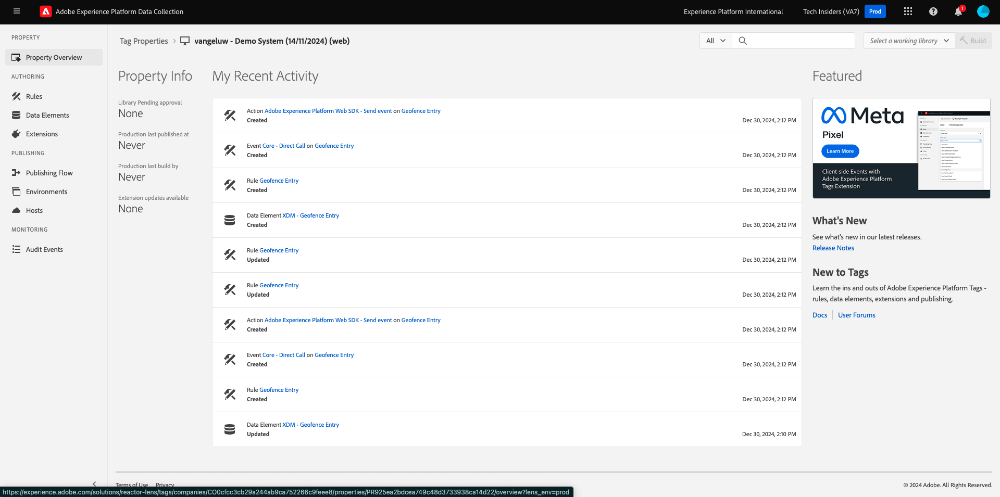
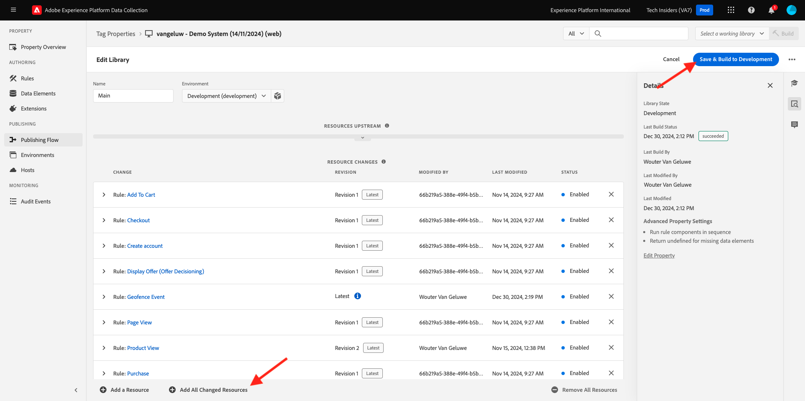

# 3.2.5 여정 트리거

이 연습에서는 이 모듈에서 구성한 여정을 테스트하고 트리거합니다.

## 3.2.5.1 Geofence 이벤트 구성 업데이트

[Adobe Experience Platform 데이터 수집](https://experience.adobe.com/launch/)(으)로 이동하여 **태그**&#x200B;를 선택합니다.

이전에 보았던 Adobe Experience Platform 데이터 수집 속성 페이지입니다.

모듈 0에서 데모 시스템은 웹 사이트용 클라이언트 속성과 모바일 앱용 클라이언트 속성 두 개를 만들었습니다. **[!UICONTROL 검색]** 상자에서 `--aepUserLdap--`을(를) 검색하여 찾으십시오. **Web** 속성을 열려면 클릭하세요.

그러면 이걸 보게 될 거야.

왼쪽 메뉴에서 **규칙**(으)로 이동하여 규칙 **Geofence 이벤트**&#x200B;를 검색합니다. 규칙 **Geofence 이벤트**&#x200B;를 클릭하여 엽니다.

그러면 이 규칙의 세부 사항이 표시됩니다. **AEP로 &quot;geofence event&quot; 보내기 - JO 트리거** 작업을 열려면 클릭하세요.

그런 다음 이 작업이 트리거되면 특정 데이터 요소를 사용하여 XDM 데이터 구조를 정의하는 것을 볼 수 있습니다. 해당 데이터 요소를 업데이트해야 하며 [연습 8.1](./ex1.md)에서 구성한 이벤트의 **이벤트 ID**&#x200B;을(를) 정의해야 합니다.

이제 데이터 요소 **XDM - Geofence 이벤트**&#x200B;를 업데이트해야 합니다. 이렇게 하려면 **데이터 요소**(으)로 이동하십시오. **XDM - Geofence 이벤트**&#x200B;를 검색하고 클릭하여 해당 데이터 요소를 엽니다.

그러면 다음과 같은 결과가 표시됩니다.

`_experience.campaign.orchestration.eventID` 필드로 이동합니다. 현재 값을 제거하고 eventID를 붙여넣습니다.

다시 말해서 이벤트 ID는 **구성 > 이벤트**&#x200B;의 Adobe Journey Optimizer에서 찾을 수 있으며 이벤트 ID는 이벤트 페이로드의 샘플 페이로드에서 찾을 수 있습니다. 이러한 페이로드는 `"eventID": "fa42ab7982ba55f039eacec24c1e32e5c51b310c67f0fa559ab49b89b63f4934"`과(와) 같습니다.

그런 다음 이 데이터 요소에서 도시를 정의해야 합니다. **placeContext > 지역 > 구/군/시**(으)로 이동하여 선택한 구/군/시를 입력하십시오. **저장** 또는 **라이브러리에 저장**&#x200B;을 클릭합니다.

마지막으로 변경 사항을 게시해야 합니다. 왼쪽 메뉴에서 **흐름 게시**(으)로 이동합니다.

**변경된 모든 리소스 추가**&#x200B;를 클릭한 다음 **개발에 저장 및 빌드**&#x200B;를 클릭합니다.

## 3.2.5.2 여정 트리거

[https://builder.adobedemo.com/projects](https://builder.adobedemo.com/projects)(으)로 이동합니다. Adobe ID으로 로그인하면 이 메시지가 표시됩니다. 웹 사이트 프로젝트를 클릭하여 엽니다.

그러면 데모 웹 사이트가 열리는 것을 볼 수 있습니다. URL을 선택하고 클립보드에 복사합니다.

새 시크릿 브라우저 창을 엽니다.

이전 단계에서 복사한 데모 웹 사이트의 URL을 붙여 넣습니다. 그런 다음 Adobe ID을 사용하여 로그인하라는 메시지가 표시됩니다.

계정 유형을 선택하고 로그인 프로세스를 완료합니다.

그러면 웹 사이트가 시크릿 브라우저 창에 로드되는 것을 볼 수 있습니다. 모든 데모에 대해 새로운 시크릿 브라우저 창을 사용하여 데모 웹 사이트 URL을 로드해야 합니다.

화면 왼쪽 상단 모서리에 있는 Adobe 로고 아이콘을 클릭하여 프로필 뷰어를 엽니다.

프로필 뷰어 패널과 현재 알 수 없는 이 고객의 기본 식별자로 **Experience Cloud ID**&#x200B;를 사용하는 실시간 고객 프로필을 살펴보십시오.

등록/로그인 페이지로 이동합니다. **계정 만들기**&#x200B;를 클릭합니다.

자세한 내용을 입력하고 **등록**&#x200B;을 클릭하면 이전 페이지로 리디렉션됩니다.

프로필 뷰어 패널을 열고 실시간 고객 프로필로 이동합니다. 프로필 뷰어 패널에 새로 추가된 이메일 및 전화 식별자와 같은 모든 개인 데이터가 표시됩니다.

프로필 뷰어 패널에서 **유틸리티**&#x200B;를 클릭합니다. `geofenceevent`을(를) 입력하고 **보내기**&#x200B;를 클릭합니다.

몇 초 후에 Adobe Journey Optimizer에서 SMS를 수신하게 됩니다.

다음 단계: [요약 및 이점](./summary.md)

[모듈 3.2로 돌아가기](journey-orchestration-external-weather-api-sms.md)

[모든 모듈로 돌아가기](../../../overview.md)
