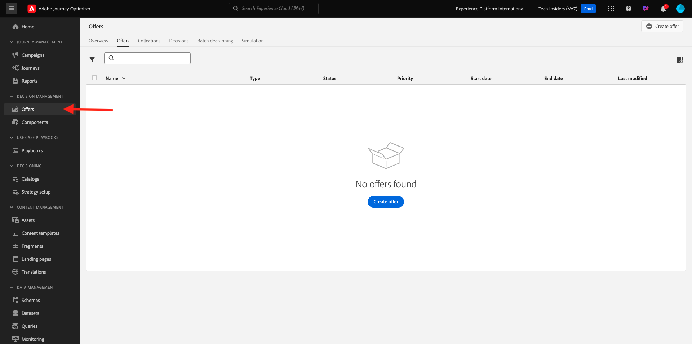
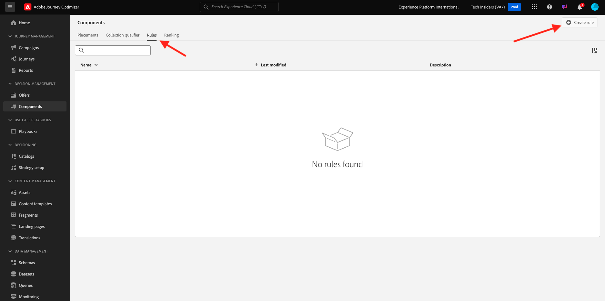
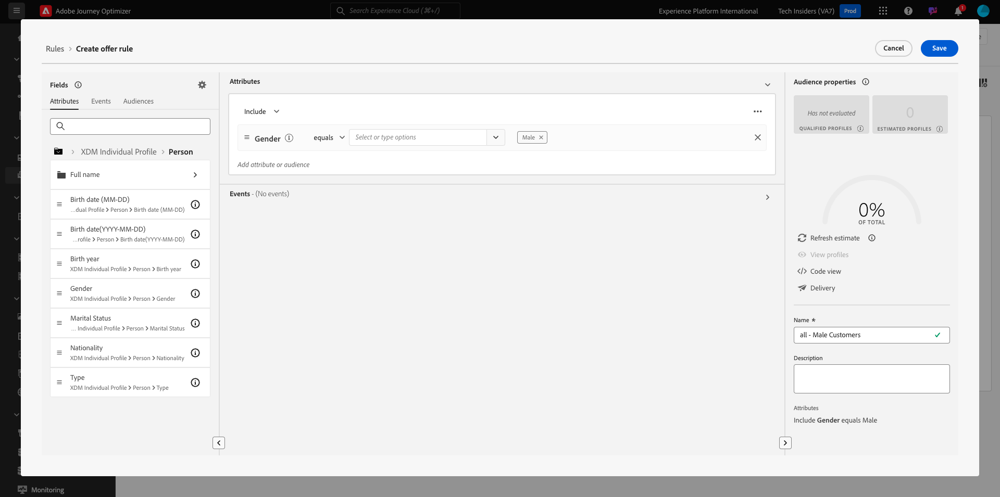
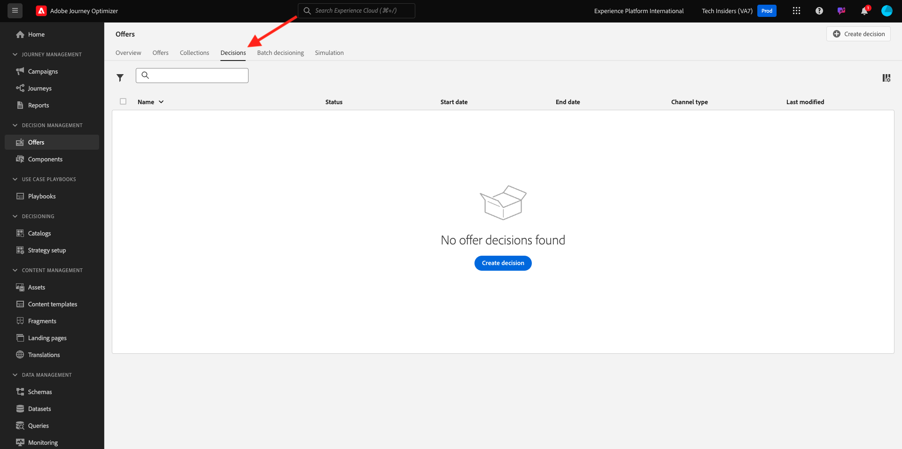

# 3.3.1 Offer decisioning 101

## 3.3.1.1 용어

offer decisioning에 대한 이해를 높이려면 Offer decisioning 응용 프로그램 서비스가 Adobe Experience Platform에서 작동하는 방식에 대한 [개요](https://experienceleague.adobe.com/docs/journey-optimizer/using/offer-decisioniong/get-started-decision/starting-offer-decisioning.html?lang=en)를 읽는 것이 좋습니다.

offer decisioning을 사용하여 작업하려면 다음 개념을 이해해야 합니다.

| 용어 | 설명 |
| ------------------------- | -------------------------------------------------------------------------------------------------------------------------------------------------------------------------------------------------------------------------------------------------------- |
| **오퍼** | 오퍼는 오퍼를 볼 자격이 있는 사람을 지정하는 규칙과 관련된 마케팅 메시지입니다. 오퍼의 상태는 초안, 승인됨 또는 보관됨입니다. |
| **배치** | 최종 사용자를 위한 오퍼가 표시되는 위치(또는 채널 유형)와 컨텍스트(또는 컨텐츠 유형)의 조합입니다. 효과적으로 모바일, 웹, 소셜, 인스턴트 메시징 및 비 디지털 채널의 텍스트, HTML, 이미지, JSON의 조합입니다. |
| **규칙** | 오퍼에 대한 최종 사용자의 자격을 정의하고 제어하는 논리입니다. |
| **개인 맞춤화된 오퍼** | 자격 규칙 및 제약 조건을 기반으로 한 사용자 지정 가능한 마케팅 메시지입니다. |
| **대체 오퍼** | 최종 사용자가 사용된 컬렉션에 있는 오퍼에 대한 자격이 없을 때 표시되는 기본 오퍼입니다. |
| **최대 가용량** | 오퍼를 총 몇 번이나 특정 사용자에게 제시할 수 있는지 정의하는 데 오퍼 정의에 사용됩니다. |
| **우선 순위** | 수준 : 오퍼의 결과 세트에서 우선 순위 등급을 결정합니다. |
| **컬렉션** | offer decisioning 프로세스 속도를 높이기 위해 개인화된 오퍼 목록에서 오퍼의 하위 세트를 필터링하는 데 사용됩니다. |
| **결정** | 마케터는 의사 결정 엔진에서 최상의 오퍼를 제공하도록 오퍼, 배치 및 프로필 세트의 조합입니다. |
| **AEM Assets Essentials** | Adobe Experience Cloud 솔루션 및 Adobe Experience Platform에서 자산을 저장, 검색 및 선택할 수 있는 범용 및 중앙 집중식 경험입니다. |

{style="table-layout:auto"}

## 3.3.1.2Offer decisioning

[Adobe Journey Optimizer](https://experience.adobe.com)(으)로 이동하여 Adobe Experience Cloud에 로그인합니다. **Journey Optimizer**&#x200B;을(를) 클릭합니다.

Journey Optimizer의 **Home** 보기로 리디렉션됩니다. 먼저 올바른 샌드박스를 사용하고 있는지 확인하십시오. 사용할 샌드박스를 `--aepSandboxName--`이라고 합니다. 한 샌드박스에서 다른 샌드박스로 변경하려면 **프로덕션 프로덕션(VA7)**&#x200B;을 클릭하고 목록에서 샌드박스를 선택합니다. 이 예제에서는 샌드박스 이름을 **AEP 지원 FY22**&#x200B;로 지정합니다. 그러면 샌드박스 `--aepSandboxName--`의 **홈** 보기에 있게 됩니다.

왼쪽 메뉴에서 **오퍼**&#x200B;를 클릭합니다. 이제 오퍼, 컬렉션 및 의사 결정과 같은 것이 포함된 오퍼 메뉴가 표시됩니다.

**구성 요소**&#x200B;를 클릭합니다. 이제 배치, 태그, 규칙 및 순위 등이 포함된 오퍼 메뉴가 표시됩니다.

## 3.3.1.3 배치

**배치**(으)로 이동합니다.

**배치** 탭에서 오퍼에 대한 배치를 정의할 수 있습니다. 의사 결정을 정의할 때 배치는 결과 오퍼가 표시되는 위치(채널 유형)와 모양 또는 양식(콘텐츠 유형)을 정의합니다.

Adobe Experience Platform 인스턴스에 배치가 표시되지 않으면 아래 및 스크린샷과 같이 만드십시오.

| 이름 | 채널 유형 | 콘텐츠 유형 |
| ---------------------- | ------------ | ------------ |
| **디지털이 아님 - 텍스트** | 비 디지털 | 텍스트 |
| **웹 - JSON** | 웹 | JSON |
| **웹 - HTML** | 웹 | HTML |
| **웹 - 텍스트** | 웹 | 텍스트 |
| **웹 - 이미지** | 웹 | 이미지 |
| **전자 메일 - JSON** | 이메일 | JSON |
| **전자 메일 - HTML** | 이메일 | HTML |
| **전자 메일 - 텍스트** | 이메일 | 텍스트 |
| **전자 메일 - 이미지** | 이메일 | 이미지 |

{style="table-layout:auto"}

**참고**: 이미 사용 가능한 배치로 변경하지 마십시오.

배치를 클릭하여 설정을 시각화합니다.

이제 배치의 모든 필드가 표시됩니다.

- 배치의 **이름**
- **배치 ID**
- 배치에 대한 **채널 유형**
- **텍스트**, **HTML**, **이미지** 또는 **JSON**&#x200B;일 수 있는 배치의 **콘텐츠 형식**
- 배치에 대한 설명을 추가할 수 있는 **설명** 필드

## 3.3.1.4 결정 규칙

규칙(자격 규칙이라고도 함)은 **대상자**&#x200B;와 동일합니다. 실제로 규칙은 오퍼 와 함께 규칙을 사용하여 Adobe Experience Platform에서 프로필에 최상의 오퍼를 제공할 수 있는 유일한 차이점을 가진 대상 자체입니다.

이전 지원 모듈을 기반으로 대상을 정의하는 방법을 이미 알고 있으므로 세그멘테이션 환경을 신속하게 다시 살펴보겠습니다.

**규칙**(으)로 이동합니다. **+ 규칙 만들기**&#x200B;를 클릭합니다.

그러면 Adobe Experience Platform의 세그멘테이션 환경이 표시됩니다.

이제 실시간 고객 프로필에 대한 결합 스키마의 일부인 모든 필드에 액세스할 수 있으며 모든 규칙을 작성할 수 있습니다.

또한 **대상** > ``--aepTenantId--``(으)로 이동하여 Adobe Experience Platform에서 이미 정의된 대상을 간단히 재사용할 수 있다는 것도 흥미롭습니다.

그러면 다음과 같은 결과가 표시됩니다.

원하는 경우 이제 나만의 규칙을 구성할 수 있습니다. 이 연습에서는 두 가지 규칙이 필요합니다.

- 모두 - 남성 고객
- 모두 - 여성 고객

이러한 규칙이 아직 존재하지 않는 경우 규칙을 만드십시오. 이미 존재하는 경우 해당 규칙을 사용하고 새 규칙을 만들지 마십시오.

규칙을 만드는 데 사용할 특성은 **XDM 개인 프로필** > **개인** > **성별**&#x200B;입니다.

예를 들어, **모두 - 남성 고객** 규칙에 대한 규칙 정의는 다음과 같습니다.

예를 들어, **모두 - 여성 고객** 규칙에 대한 규칙 정의는 다음과 같습니다.

## 3.3.1.5 오퍼

**오퍼**(으)로 이동한 다음 **오퍼**&#x200B;을(를) 선택합니다. **+ 오퍼 만들기**&#x200B;를 클릭합니다.

그러면 이 팝업이 표시됩니다.

지금은 오퍼를 만들지 않습니다. 다음 연습에서 이 작업을 수행합니다.

이제 두 가지 유형의 오퍼가 있습니다.

- 개인화된 오퍼
- 대체 오퍼

개인화된 오퍼는 특정 상황에서 표시되어야 하는 특정 콘텐츠입니다. 개인화된 오퍼는 특정 기준이 충족되는 경우 개인적이고 상황별 경험을 제공하기 위해 특별히 제작됩니다.

대체 오퍼는 개인화된 오퍼에 대한 기준이 충족되지 않는 경우 표시되는 오퍼입니다.

## 3.3.1.6 결정

의사 결정은 우선 순위, 자격 제한 및 총/사용자 상한과 같은 개별 개인화된 오퍼 특성을 각각 기반으로 특정 프로필에 가장 적합한 오퍼를 찾기 위해 Offer decisioning 엔진에서 궁극적으로 사용할 배치, 개인화된 오퍼의 컬렉션 및 대체 오퍼를 결합합니다.

**결정**&#x200B;을 구성하려면 **결정**&#x200B;을 클릭하십시오.

다음 연습에서는 오퍼 및 결정을 직접 구성합니다.

다음 단계: [3.3.2 오퍼 및 의사 결정 구성](./ex2.md)

[모듈 3.3으로 돌아가기](./offer-decisioning.md)

[모든 모듈로 돌아가기](./../../../overview.md)
