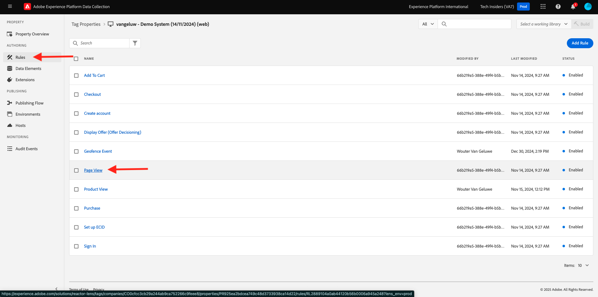
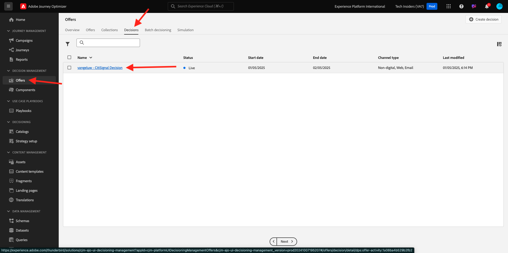
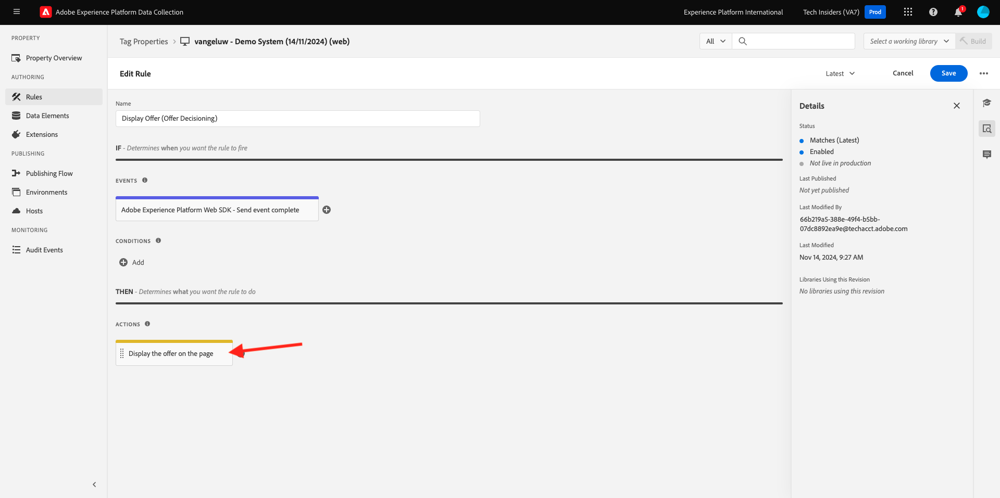
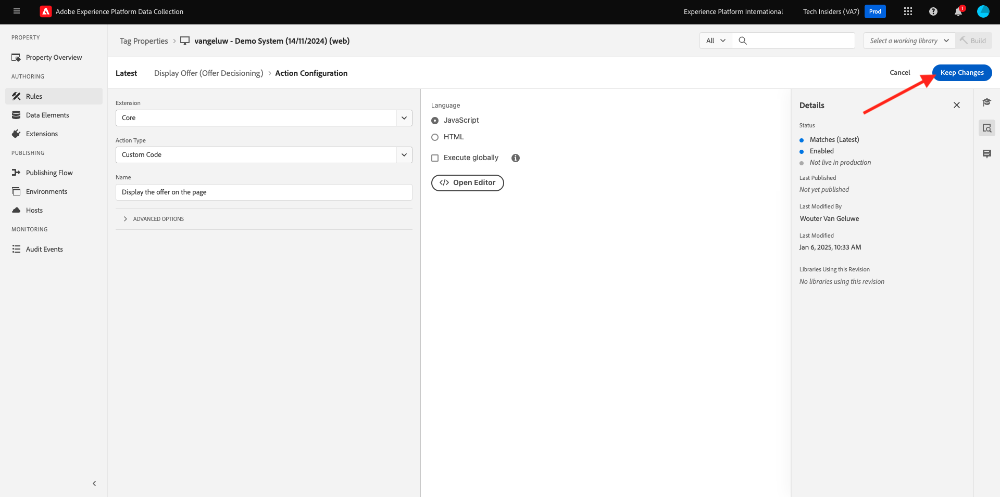
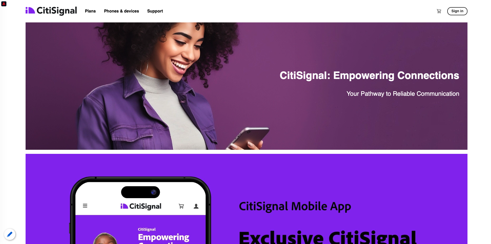

# 3.3.3 Offer decisioning을 위해 Adobe Experience Platform 데이터 수집 클라이언트 속성 및 Web SDK 설정 준비

## 3.3.3.1 데이터스트림 업데이트

[시작하기](./../../../modules/gettingstarted/gettingstarted/ex2.md)에서 고유한 **데이터스트림**&#x200B;을(를) 만들었습니다. 그런 다음 `--aepUserLdap-- - Demo System Datastream` 이름을 사용했습니다.

이 연습에서는 **Offer decisioning**&#x200B;에서 작동하도록 **데이터 스트림**&#x200B;을 구성해야 합니다.

이렇게 하려면 [https://experience.adobe.com/#/data-collection/](https://experience.adobe.com/#/data-collection/)(으)로 이동하십시오. 그러면 이걸 보게 될 거야. **데이터 스트림**&#x200B;을 클릭합니다.

화면 오른쪽 상단에서 샌드박스 이름을 선택합니다. 이름은 `--aepSandboxName--`이어야 합니다.


이름이 `--aepUserLdap-- - Demo System Datastream`인 **데이터스트림**&#x200B;을 검색합니다. **데이터 스트림**&#x200B;을 클릭하여 엽니다.


그러면 이걸 보게 될 거야. **Adobe Experience Platform** 옆에 있는 **..**&#x200B;을 클릭한 다음 **편집**&#x200B;을 클릭합니다.


**Offer decisioning**&#x200B;을(를) 사용하려면 **Offer decisioning** 확인란을 선택하세요. **저장**&#x200B;을 클릭합니다.


**데이터 스트림**&#x200B;이(가) 이제 **Offer decisioning**(으)로 작업할 준비가 되었습니다.


## 3.3.3.2 개인화된 오퍼를 요청하도록 Adobe Experience Platform 데이터 수집 클라이언트 속성 구성

[https://experience.adobe.com/#/data-collection/](https://experience.adobe.com/#/data-collection/), **태그**(으)로 이동합니다. 이름이 `--aepUserLdap-- - Demo System (DD/MM/YYYY)`인 데이터 수집 속성을 검색합니다. 웹용 데이터 수집 클라이언트 속성을 엽니다.


속성에서 **규칙**(으)로 이동하여 규칙 **페이지 보기**&#x200B;를 엽니다.



**&quot;페이지 보기&quot; 경험 이벤트 보내기** 작업을 열려면 클릭하세요.


그러면 이걸 보게 될 거야. **Personalization**&#x200B;에서 **범위**&#x200B;에 대한 옵션을 확인할 수 있습니다.


Edge 및 Adobe Experience Platform으로 전송된 모든 요청에 대해 하나 이상의 **결정 범위**&#x200B;를 제공할 수 있습니다. **결정 범위**&#x200B;은(는) 두 요소의 조합입니다.

- 결정 ID
- 배치 ID

먼저 그 두 가지 요소를 찾을 수 있는 곳을 살펴보자.

### 3.3.3.2.1 배치 ID 검색

배치 ID는 필요한 에셋의 위치와 유형을 식별합니다. 예를 들어 CitiSignal 웹 사이트 홈페이지의 영웅 이미지는 웹 - 이미지에 대한 배치 ID에 해당합니다.

>[!NOTE]
>
>연습 2.3.5 의 일부로, 스크린샷에서 볼 수 있듯이 홈 페이지에서 주인공 위치의 이미지를 변경할 Adobe Target Experience Targeting 활동을 이미 구성했습니다. 이 연습에서는 스크린샷에 표시된 대로 오퍼가 영웅 이미지 아래의 이미지에 나타나도록 합니다.


웹 - 이미지의 배치 ID를 찾으려면 [Adobe Experience Cloud](https://experience.adobe.com)(으)로 이동하여 Adobe Journey Optimizer으로 이동하십시오. **Journey Optimizer**&#x200B;을(를) 클릭합니다.


Journey Optimizer의 **Home** 보기로 리디렉션됩니다. 먼저 올바른 샌드박스를 사용하고 있는지 확인하십시오. 사용할 샌드박스를 `--aepSandboxName--`이라고 합니다. 그러면 샌드박스 `--aepSandboxName--`의 **홈** 보기에 있게 됩니다.


그런 다음 구성 요소로 이동한 다음 배치로 이동합니다. 자세한 내용을 보려면 **웹 - 이미지** 배치를 클릭하십시오.


위의 이미지에서 볼 수 있듯이 이 예제에서 배치 ID는 `dps:offer-placement:1a08a14ccfe533b6`입니다. 다음 연습에서 필요할 때 웹 배치 ID - 이미지 를 적어 두십시오.

### 3.3.3.2.2 오퍼 결정 ID 검색

**오퍼 결정 ID**&#x200B;은(는) 사용할 개인화된 오퍼와 대체 오퍼의 조합을 식별합니다. 이전 연습에서는 직접 의사 결정을 만들어 이름을 `--aepUserLdap-- - CitiSignal Decision`로 지정했습니다.

`--aepUserLdap-- - CitiSignal Decision`에 대한 오퍼 결정 ID를 찾으려면 [오퍼]로 이동한 다음 [결정]으로 이동합니다. 결정(`--aepUserLdap-- - CitiSignal Decision`)을 선택하려면 클릭하세요.


위의 이미지에서 볼 수 있듯이 이 예에서는 결정 ID가 `dps:offer-activity:1a08ba4b529b2fb2`입니다. 결정 `--aepUserLdap-- - CitiSignal Decision`에 대한 오퍼 결정 ID를 다음 연습에서 필요할 수 있으므로 적어 두십시오.

**결정 범위**&#x200B;를 만드는 데 필요한 두 요소를 검색했으므로 결정 범위 인코딩이 포함된 다음 단계를 계속할 수 있습니다.

### 3.3.3.2.3 BASE64 인코딩

입력해야 하는 **결정 범위**&#x200B;는 BASE64로 인코딩된 문자열입니다. 이 BASE64로 인코딩된 문자열은 아래에서 볼 수 있듯이 배치 ID와 결정 ID의 조합입니다.

```json
{
  "xdm:activityId": "dps:offer-activity:1a08ba4b529b2fb2",
  "xdm:placementId": "dps:offer-placement:1a08a14ccfe533b6"
}
```

Adobe Experience Platform에서 BASE64로 인코딩된 문자열을 검색할 수 있습니다. [결정]으로 이동하고 클릭하여 [결정]을 엽니다. 이름은 `--aepUserLdap-- - CitiSignal Decision`입니다.



`--aepUserLdap-- - CitiSignal Decision`을(를) 열면 이 메시지가 표시됩니다. 배치 웹 - 이미지를 찾아 **복사** 단추를 클릭합니다. **인코딩된 결정 범위**&#x200B;를 클릭합니다. **결정 범위**&#x200B;가 이제 클립보드에 복사되었습니다.


그런 다음 Launch로 돌아가서 **AEP 웹 SDK - 이벤트 보내기** 작업으로 이동합니다.


인코딩된 결정 범위를 입력 필드에 붙여넣습니다. **[!UICONTROL 변경 내용 유지]**&#x200B;를 클릭하여 **AEP 웹 SDK - 이벤트 보내기** 작업에 변경 내용을 저장합니다.


그런 다음 **[!UICONTROL 저장]**&#x200B;을 클릭합니다.


Adobe Experience Platform 데이터 수집에서 **[!UICONTROL 게시 흐름]**(으)로 이동하여 **[!UICONTROL 개발 라이브러리]**(이름: **[!UICONTROL Main]**)를 엽니다. **[!UICONTROL + 변경된 모든 리소스 추가]**&#x200B;를 클릭한 다음 **[!UICONTROL 개발을 위한 저장 및 빌드]**&#x200B;를 클릭합니다. 이제 변경 사항이 데모 웹 사이트에 게시됩니다.


예를 들어 데모 웹 사이트의 홈페이지와 같이 지금 **일반 페이지**&#x200B;를 로드할 때마다 Offer decisioning은 해당 오퍼가 무엇인지 평가하고 표시할 오퍼의 세부 정보와 함께 응답을 웹 사이트로 다시 반환합니다. 웹 사이트에 오퍼를 표시하려면 추가 구성이 필요하며 다음 단계에서 이를 수행합니다.

## 3.3.3.3 개인화된 오퍼를 받고 적용하도록 Adobe Experience Platform 데이터 수집 클라이언트 속성 구성

[https://experience.adobe.com/#/data-collection/](https://experience.adobe.com/#/data-collection/), **[!UICONTROL 속성]**(으)로 이동합니다. 이름이 `--aepUserLdap-- - Demo System (DD/MM/YYYY)`인 데이터 수집 속성을 검색합니다. 웹용 데이터 수집 속성을 엽니다.


속성에서 **규칙**(으)로 이동합니다. **오퍼 표시(Offer decisioning)** 규칙을 검색하여 엽니다.


그러면 이걸 보게 될 거야. **페이지에 오퍼 표시** 작업을 엽니다.



**[!UICONTROL 편집기 열기]**&#x200B;를 클릭합니다


아래 코드를 편집기에 붙여넣어 코드를 덮어씁니다.

```javascript
if (!Array.isArray(event.decisions)) {
  console.log("No personalization decisions");
  return;
}

console.log("Received response from Offer Decisioning", event.decisions);

event.decisions.forEach(function (payload) {
  payload.items.forEach(function (item) {
    console.log("Offer", item.data.deliveryURL);

    if (!item.data || item.data?.deliveryURL==null) {
      return;
    }
    console.log("item.data.deliveryURL", item.data.deliveryURL)
    //document.querySelector(".TopRibbon").innerHTML = item.data.content;
    document.querySelector("#SpectrumProvider > div.App > div > div.Page.home > main > div:nth-child(2)").innerHTML = "";
    document.querySelector("#SpectrumProvider > div.App > div > div.Page.home > main > div:nth-child(2) > img").style.backgroundRepeat="no-repeat";
    document.querySelector("#SpectrumProvider > div.App > div > div.Page.home > main > div:nth-child(2) > img").style.backgroundPosition="center center";
    document.querySelector("#SpectrumProvider > div.App > div > div.Page.home > main > div:nth-child(2) > img").style.backgroundSize = "contain";
  });
});
```

17행은 Offer decisioning에 의해 반환되고 있는 이미지를 웹사이트에 적용할 것이다. **[!UICONTROL 저장]**&#x200B;을 클릭합니다.


**[!UICONTROL 변경 내용 유지]**&#x200B;를 클릭합니다.



그런 다음 **[!UICONTROL 저장]**&#x200B;을 클릭합니다.


Adobe Experience Platform 데이터 수집에서 **[!UICONTROL 게시 흐름]**(으)로 이동하여 **[!UICONTROL 개발 라이브러리]**(이름: **[!UICONTROL Main]**)를 엽니다. **[!UICONTROL + 변경된 모든 리소스 추가]**&#x200B;를 클릭한 다음 **[!UICONTROL 개발을 위한 저장 및 빌드]**&#x200B;를 클릭합니다. 이제 변경 사항이 데모 웹 사이트에 게시됩니다.


이 변경 사항으로 인해 Adobe Experience Platform 데이터 수집의 이 규칙은 이제 웹 SDK 응답의 일부인 Offer decisioning의 응답을 수신하게 되며, 응답을 받게 되면, 홈 페이지에 오퍼 이미지가 표시됩니다.

데모 웹 사이트를 보면 이 이미지가 현재 대체됩니다. 이제 기본 CitiSignal 웹 사이트 이미지 대신 다음과 같은 오퍼가 표시됩니다. 이 경우 대체 오퍼가 표시됩니다.



이제 두 가지 유형의 개인화를 구성했습니다.

- 연습 2.3.5에서 Adobe Target을 사용하는 1 경험 타깃팅 활동
- 데이터 수집 속성을 사용한 1 Offer decisioning 구현

다음 연습에서는 Adobe Journey Optimizer에서 만든 오퍼 및 의사 결정을 Adobe Target 경험 타깃팅 활동과 결합하는 방법을 알아봅니다.

다음 단계: [3.3.4 Adobe Target과 Offer decisioning 결합](./ex4.md)

[모듈 3.3으로 돌아가기](./offer-decisioning.md)

[모든 모듈로 돌아가기](./../../../overview.md)
