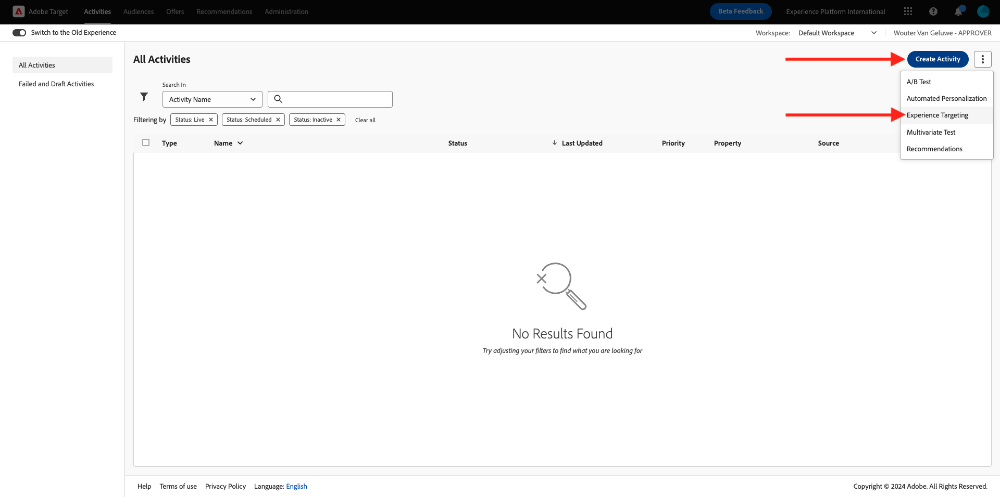
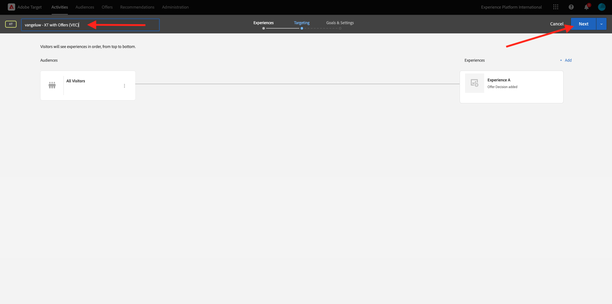
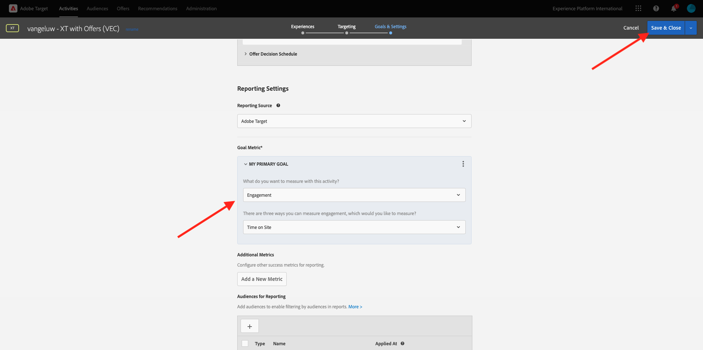
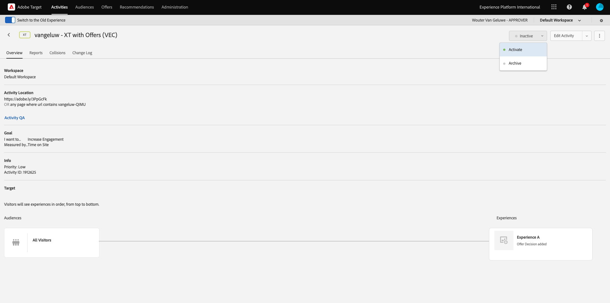

# 3.3.4 Adobe Target과 Offer decisioning 결합

## 3.3.4.1 데모 프로젝트의 공유 가능한 링크 수집

Adobe Target에서 데모 웹 사이트 프로젝트를 로드하려면 먼저 Adobe Target에서 데모 웹 사이트 프로젝트를 로드할 수 있는 특수 링크를 수집해야 합니다.

이렇게 하려면 [https://dsn.adobe.com/projects](https://builder.adobedemo.com/projects)(으)로 이동하십시오. Adobe ID으로 로그인하면 이 메시지가 표시됩니다. 웹 사이트 프로젝트를 클릭하여 엽니다.

이제 이 항목을 볼 수 있습니다. **공유**(으)로 이동합니다. **링크 생성**&#x200B;을 클릭한 다음 클립보드에 링크를 복사합니다.

[https://bitly.com](https://bitly.com)(으)로 이동하여 복사한 링크를 붙여넣고 **링크 만들기**&#x200B;를 클릭합니다.

`https://adobe.ly/3PpGcFk`과(와) 같은 축약된 링크가 제공됩니다. 다음 연습에서는 해당 링크가 필요합니다.

## 3.3.4.2 수집

이제 [https://experiencecloud.adobe.com/](https://experiencecloud.adobe.com/)(으)로 이동하여 Adobe Experience Cloud 홈페이지로 이동합니다. **대상**&#x200B;을 클릭합니다.

**Adobe Target** 홈 페이지에 기존의 모든 활동이 표시됩니다. **활동 만들기**&#x200B;를 클릭한 다음 **경험 타깃팅**&#x200B;을 클릭합니다.

이제 **시각적**&#x200B;을(를) 선택하고 필드 **활동 URL 입력**&#x200B;에 축약된 링크를 붙여 넣으십시오. **만들기**&#x200B;를 클릭합니다.

그러면 데모 웹 사이트 프로젝트가 시각적 경험 작성기에 로드되는 것을 볼 수 있습니다.

>[!NOTE]
>
>웹 사이트가 올바르게 로드되지 않는 경우 Chrome 웹 스토어에서 이 Chrome 확장 기능 **Adobe Target VEC Helper**&#x200B;을(를) 설치하고 활성화한 다음 다시 시도하십시오.

Disney+ 오퍼가 있는 영역을 클릭합니다. 전체 **컨테이너**&#x200B;를 선택하십시오. **다음 항목 앞에 삽입**&#x200B;을 클릭한 다음 **오퍼 결정**&#x200B;을 선택합니다.

그러면 이 팝업이 표시됩니다. 샌드박스 `--aepSandboxName--`을(를) 선택한 다음 **웹 - 이미지** 배치를 선택하십시오.

그런 다음 `--aepUserLdap-- - CitiSignal Decision` 결정을 선택합니다. **저장**&#x200B;을 클릭합니다.

그러면 이걸 보게 될 거야. **규칙 검토**&#x200B;를 클릭합니다.

추가 템플릿 규칙 **URL** **포함** **프로젝트 이름**&#x200B;을(를) 추가했는지 확인하십시오. **저장**&#x200B;을 클릭합니다.

그러면 이걸 보게 될 거야. **다음**&#x200B;을 클릭합니다.

오퍼 이름을 입력하십시오. `--aepUserLdap-- - XT with Offers (VEC)` 이름을 사용하십시오. **다음**&#x200B;을 클릭합니다.

그러면 이걸 보게 될 거야. 표시된 대로 **목표 지표**&#x200B;를 정의합니다. **저장 및 닫기**&#x200B;를 클릭합니다.

이제 오퍼가 만들어지고 게시되고 있습니다. 오퍼가 게시되면 활성화할 수 있습니다.

다음 단계: [3.3.5 전자 메일 및 SMS에서 결정 사용](./ex5.md)

[모듈 3.3으로 돌아가기](./offer-decisioning.md)

[모든 모듈로 돌아가기](./../../../overview.md)
