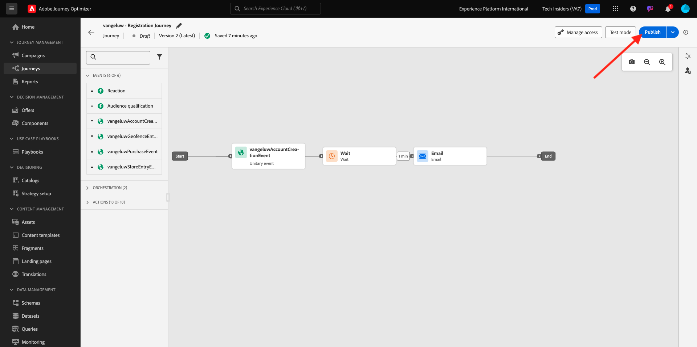

# 3.3.5 이메일에서 의사 결정 사용

이 연습에서는 의사 결정을 사용하여 이메일 및 SMS 게재를 개인화합니다.

**여정**(으)로 이동합니다. 연습 7.2에서 만든 여정(`--demoProfileLdap-- - Account Creation Journey`)를 찾습니다. 여정을 클릭하여 엽니다.

그러면 이걸 보게 될 거야. **새 버전 만들기**&#x200B;를 클릭합니다.

**새 버전 만들기**&#x200B;를 클릭합니다.

**전자 메일** 작업을 클릭한 다음 **콘텐츠 편집**&#x200B;을 클릭합니다.

그러면 메시지 대시보드가 표시됩니다. **전자 메일 Designer**&#x200B;을 클릭합니다.

그러면 이걸 보게 될 거야.

그러면 이걸 보게 될 거야. 새 **1:1 열** 구조 구성 요소를 캔버스로 드래그합니다.

메뉴에서 **콘텐츠 구성 요소**(으)로 이동합니다. **오퍼 결정** 구성 요소를 선택하고 이 구성 요소를 표시된 대로 전자 메일의 콘텐츠 오퍼 자리 표시자로 끌어서 놓습니다. **추가**&#x200B;를 클릭합니다.

이메일에 포함할 배치 유형을 선택합니다. **배치** 드롭다운 메뉴에서 **전자 메일 - 이미지**&#x200B;를 선택한 다음 결정 `--demoProfileLdap-- - Luma Decision`을(를) 선택합니다. **추가를 클릭합니다**.

이제 모든 개인화된 오퍼와 대체 오퍼가 이메일 디자이너 내에서 시각화되는 것을 볼 수 있습니다. 실제 고객 프로필로 전자 메일 메시지를 미리 보려면 **콘텐츠 시뮬레이션**&#x200B;을 클릭하세요.

미리보기에 사용할 프로필을 식별하여 시작합니다. **전자 메일** 네임스페이스를 선택하고 데모 웹 사이트에서 만든 고객 프로필의 전자 메일 주소를 입력하십시오. **미리 보기**&#x200B;를 클릭합니다.

전자 메일이 표시되고 오퍼가 올바르게 표시되면 **닫기** 단추를 클릭합니다.

마지막으로 **저장**&#x200B;을 클릭합니다.

이제 화살표를 클릭하여 이전 화면으로 돌아갑니다.

그러면 이걸 보게 될 거야. 왼쪽 상단 모서리의 화살표를 클릭하여 여정으로 돌아갑니다.

**전자 메일** 작업을 닫으려면 **확인**&#x200B;을 클릭하세요.

업데이트된 여정을 게시하려면 **Publish**&#x200B;을 클릭하세요.

**Publish**&#x200B;을(를) 다시 클릭하여 확인합니다.

이제 메시지가 게시되었습니다.

데모 웹 사이트에서 새 계정을 만들면 이제 다음 이메일을 받게 됩니다.

이 연습을 완료했습니다.

다음 단계: [3.3.6 API를 사용하여 의사 결정 테스트](./ex6.md)

[모듈 3.3으로 돌아가기](./offer-decisioning.md)

[모든 모듈로 돌아가기](./../../../overview.md)
