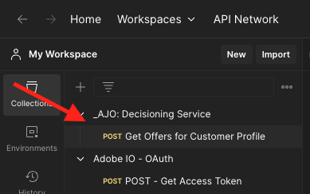
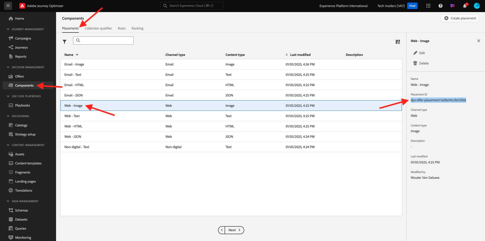
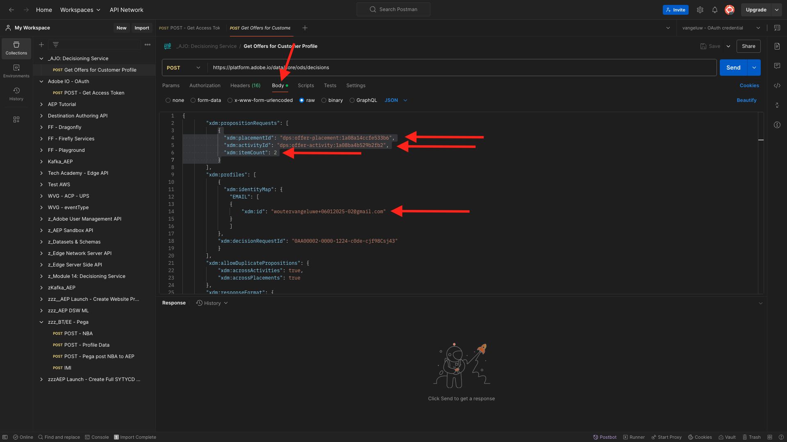

# 3.3.6 API를 사용하여 의사 결정 테스트

## 3.3.6.1 Postman을 사용하여 Offer decisioning API 작업

데스크톱에 [Offer decisioning에 대한 이 Postman 컬렉션](./../../../assets/postman/postman_offer-decisioning.zip)을 다운로드하고 압축을 풉니다. 그러면 다음 항목이 제공됩니다.

이제 바탕 화면에 이 파일이 있습니다.

- [!UICONTROL _Module 14- Decisioning Service.postman_collection.json]

[연습 2.1.3 - Adobe I/O에 대한 Postman 인증](./../../../modules/rtcdp-b2c/module2.1/ex3.md)에서 Postman을 설치했습니다. 이 연습에서는 Postman을 다시 사용해야 합니다.

Postman을 엽니다. **[!UICONTROL 가져오기]**&#x200B;를 클릭합니다.

**[!UICONTROL 파일 업로드]**&#x200B;를 클릭합니다.

**[!UICONTROL _Module 14- Decisioning Service.postman_collection.json]** 파일을 선택하고 **[!UICONTROL 열기]**&#x200B;를 클릭합니다.

그런 다음 Postman에서 이 컬렉션을 사용할 수 있습니다.

이제 Postman에서 API를 통해 Adobe Experience Platform과 상호 작용하기 시작하는 데 필요한 모든 것을 갖추고 있습니다.

### 3.3.6.1.1 목록 컨테이너

**[!UICONTROL GET - 목록 컨테이너]** 요청을 열려면 클릭하세요.

**[!UICONTROL 매개 변수]**&#x200B;에서 다음이 표시됩니다.

- 속성: `_instance.parentName==aepenablementfy22`

이 매개 변수에서 **[!UICONTROL aepenablementfy22]**&#x200B;은 Adobe Experience Platform에서 사용되는 샌드박스 이름입니다. 사용해야 하는 샌드박스는 `--aepSandboxId--`입니다. **[!UICONTROL aepenablementfy22]** 텍스트를 `--aepSandboxId--`(으)로 바꿉니다.

샌드박스 이름을 바꾼 후 **[!UICONTROL 보내기]**&#x200B;를 클릭합니다.

지정한 샌드박스에 대한 오퍼 컨테이너를 표시하는 응답입니다. 아래 표시된 대로 **[!UICONTROL container instanceId]**&#x200B;을(를) 복사하고 컴퓨터의 텍스트 파일에 기록하십시오. 다음 연습에서는 이 **[!UICONTROL 컨테이너 instanceId]**&#x200B;을(를) 사용해야 합니다!

### 3.3.6.1.2 배치 목록

**[!UICONTROL GET - 배치 나열]** 요청을 열려면 클릭하세요. **[!UICONTROL 보내기]**&#x200B;를 클릭합니다.

이제 오퍼 컨테이너에 사용 가능한 모든 배치가 표시됩니다. 표시되는 배치는 [연습 3.3.1.3](./ex1.md)에서 볼 수 있듯이 Adobe Experience Platform UI에 정의되어 있습니다.

### 3.3.6.1.3 의사 결정 규칙 나열

**[!UICONTROL GET - 목록 결정 규칙]** 요청을 열려면 클릭하세요. **[!UICONTROL 보내기]**&#x200B;를 클릭합니다.

응답에는 [연습 3.3.1.4](./ex1.md)에서 볼 수 있듯이 Adobe Experience Platform UI에서 정의한 결정 규칙이 표시됩니다.

### 3.3.6.1.4 개인화된 오퍼 나열

**[!UICONTROL GET - 개인화된 오퍼 나열]** 요청을 열려면 클릭하세요. **[!UICONTROL 보내기]**&#x200B;를 클릭합니다.

응답에는 [연습 3.3.2.1](./ex2.md)에서 Adobe Experience Platform UI에 정의한 개인화된 오퍼가 표시됩니다.

### 3.3.6.1.5 대체 오퍼 나열

**[!UICONTROL GET - 대체 오퍼 나열]** 요청을 열려면 클릭하세요. **[!UICONTROL 보내기]**&#x200B;를 클릭합니다.

응답에는 [연습 3.3.2.2](./ex2.md)에서 Adobe Experience Platform UI에 정의한 대체 오퍼가 표시됩니다.

### 3.3.6.1.6 목록 컬렉션

**[!UICONTROL GET - 목록 컬렉션]** 요청을 열려면 클릭하세요.

응답에는 [연습 3.3.2.3](./ex2.md)에서 Adobe Experience Platform UI에 정의한 컬렉션이 표시됩니다.

### 3.3.6.1.7 고객 프로필에 대한 세부 오퍼 가져오기

**[!UICONTROL POST - 고객 프로필에 대한 자세한 오퍼 가져오기]** 요청을 열려면 클릭하세요. 이 요청은 이전 요청과 유사하지만, 실제로 이미지 URL, 텍스트 등과 같은 세부 정보를 반환합니다.

이 요청의 경우 유사한 요구 사항이 있는 이전 연습과 마찬가지로 **[!UICONTROL xdm:placementId]** 및 **[!UICONTROL xdm:activityId]**&#x200B;에 대한 값을 제공하여 고객에 대한 특정 오퍼 세부 정보를 검색해야 합니다.

필드 **[!UICONTROL xdm:activityId]**&#x200B;을(를) 입력해야 합니다. 아래 표시된 대로 Adobe Experience Platform UI에서 검색할 수 있습니다.

필드 **[!UICONTROL xdm:placementId]**&#x200B;을(를) 입력해야 합니다. 아래 표시된 대로 Adobe Experience Platform UI에서 검색할 수 있습니다. 아래 예제에서는 배치 **[!UICONTROL 웹 - 이미지]**&#x200B;에 대한 placementId를 볼 수 있습니다.

**[!UICONTROL 본문]**(으)로 이동하여 오퍼를 요청할 고객의 이메일 주소를 입력하십시오. **[!UICONTROL 보내기]**&#x200B;를 클릭합니다.

마지막으로, 어떤 종류의 개인화된 오퍼와 이 고객에게 표시해야 하는 자산에 대한 결과를 볼 수 있습니다.

이제 이 연습을 완료했습니다.

다음 단계: [요약 및 이점](./summary.md)

[모듈 3.3으로 돌아가기](./offer-decisioning.md)

[모든 모듈로 돌아가기](./../../../overview.md)
