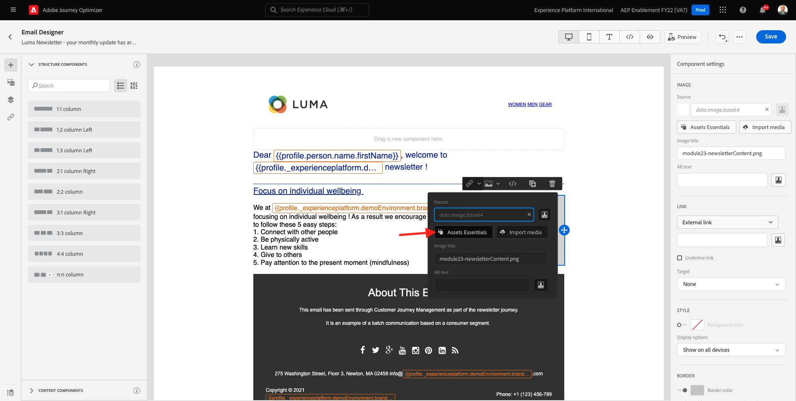
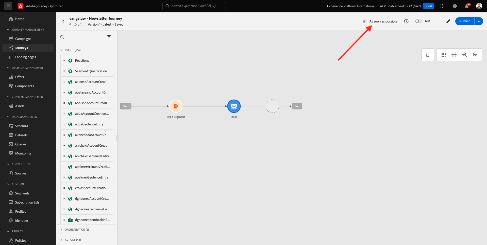

# 3.4.2 일괄 처리 기반 뉴스레터 여정 구성

[Adobe Journey Optimizer](https://experience.adobe.com)(으)로 이동하여 Adobe Experience Cloud에 로그인합니다. **Journey Optimizer**&#x200B;을(를) 클릭합니다.

Journey Optimizer의 **Home** 보기로 리디렉션됩니다. 먼저 올바른 샌드박스를 사용하고 있는지 확인하십시오. 사용할 샌드박스를 `--aepSandboxName--`이라고 합니다. 한 샌드박스에서 다른 샌드박스로 변경하려면 **프로덕션 프로덕션(VA7)**&#x200B;을 클릭하고 목록에서 샌드박스를 선택합니다. 이 예제에서는 샌드박스 이름을 **AEP 지원 FY22**&#x200B;로 지정합니다. 그러면 샌드박스 `--aepSandboxName--`의 **홈** 보기에 있게 됩니다.

## 3.4.2.1 뉴스레터 여정 만들기

이제 일괄 처리 기반 여정을 만듭니다. 들어오는 경험 이벤트 또는 세그먼트 시작 또는 종료에 의존하여 1개의 특정 고객에 대한 여정을 트리거하는 이전 연습의 여정 기반 이벤트와 달리 배치 기반 여정은 뉴스레터, 일회성 프로모션 또는 일반 정보와 같은 고유 콘텐츠나 생일 캠페인 및 미리 알림과 같은 정기적으로 전송되는 유사한 콘텐츠로 전체 세그먼트를 한 번 타겟팅합니다.

메뉴에서 **여정**(으)로 이동하여 **여정 만들기**&#x200B;를 클릭합니다.

오른쪽에는 여정 이름과 설명을 지정해야 하는 양식이 표시됩니다. 다음 값을 입력합니다.

- **이름**: `--aepUserLdap-- - Newsletter Journey`. 예: **vangeluw - 뉴스레터 여정**.
- **설명**: 월간 뉴스레터

**확인**&#x200B;을 클릭합니다.

**오케스트레이션**&#x200B;에서 **세그먼트 읽기**&#x200B;를 캔버스로 끌어서 놓습니다. 즉, 게시되면 여정은 전체 세그먼트 대상을 검색하는 것으로 시작되고, 이렇게 되면 여정 및 메시지의 타겟 대상이 됩니다. **세그먼트 선택**&#x200B;을 클릭합니다.

**세그먼트 선택** 팝업에서 ldap를 검색하고 [모듈 2.3 - Real-time CDP - 세그먼트 작성 및 작업](./../../../modules/rtcdp-b2c/module2.3/real-time-cdp-build-a-segment-take-action.md)에서 만든 세그먼트를 선택합니다. `--aepUserLdap-- - Interest in PROTEUS FITNESS JACKSHIRT`. 예: vangeluw - Interest in PROTEUS FITNESS JACKSHIRT. **저장**&#x200B;을 클릭합니다.

**확인**&#x200B;을 클릭합니다.

왼쪽 메뉴에서 **작업** 섹션을 찾아 **전자 메일** 작업을 캔버스로 끌어서 놓습니다.

**카테고리**&#x200B;을(를) **마케팅**(으)로 설정하고 전자 메일을 보낼 수 있는 전자 메일 표면을 선택합니다. 이 경우 선택할 전자 메일 표면은 **전자 메일**&#x200B;입니다. **이메일 클릭 수** 및 **이메일 열기**&#x200B;에 대한 확인란이 모두 활성화되어 있는지 확인하십시오.

다음 단계는 메시지를 만드는 것입니다. 이렇게 하려면 **콘텐츠 편집**&#x200B;을 클릭하세요.

이제 이 항목을 볼 수 있습니다. **제목 줄** 텍스트 필드를 클릭합니다.

제목 줄 `Luma Newsletter - your monthly update has arrived.`에 대해 이 텍스트를 입력하십시오. **저장**&#x200B;을 클릭합니다.

그럼 다시 여기로 오십시오. 전자 메일 콘텐츠를 만들려면 **전자 메일 Designer**&#x200B;을(를) 클릭하세요.

그러면 이걸 보게 될 거야. **HTML 가져오기**&#x200B;를 클릭합니다.

팝업 화면에서 이메일의 HTML 파일을 드래그 앤 드롭해야 합니다. HTML 서식 파일은 [여기](./../../../assets/html/ajo-newsletter.html.zip)에서 찾을 수 있습니다. HTML 템플릿이 있는 zip 파일을 로컬 컴퓨터에 다운로드하고 데스크탑에 압축 해제합니다.

**ajo-newsletter.html** 파일을 끌어다 놓아 Journey Optimizer에 업로드하십시오. **가져오기**&#x200B;를 클릭합니다.

이 이메일 콘텐츠에는 모든 예상 개인화, 이미지 및 텍스트가 있으므로 이동할 준비가 되었습니다. 오퍼 자리 표시자만 비어 있습니다.

에셋을 가져오는 동안 **오류**&#x200B;라는 오류 메시지가 나타날 수 있습니다. 이메일의 이미지에 연결됩니다.

이 오류가 발생하면 이미지를 선택하고 **이미지 편집** 단추를 클릭하십시오.

AEM Assets Essentials 라이브러리로 돌아가려면 **Assets Essentials**&#x200B;을 클릭하세요.

그러면 이 팝업이 표시됩니다. **enablement-assets** 폴더로 이동하고 **luma-newsletterContent.png** 이미지를 선택합니다. **선택**&#x200B;을 클릭합니다.

이제 기본 뉴스레터 이메일이 준비되었습니다. **저장**&#x200B;을 클릭합니다.

왼쪽 상단 모서리의 제목 줄 텍스트 옆에 있는 **화살표**&#x200B;를 클릭하여 메시지 대시보드로 돌아갑니다.

왼쪽 상단 모서리의 화살표를 클릭하여 여정으로 돌아갑니다.

전자 메일 작업을 닫으려면 **확인**&#x200B;을 클릭하세요.

이제 뉴스레터 여정을 게시할 준비가 되었습니다. 그러기 전에 이 여정을 일회성으로 전환할 수 있는 **일정** 섹션을 확인하십시오. **일정** 단추를 클릭합니다.

그러면 이걸 보게 될 거야. **한 번**&#x200B;을 선택하세요.

여정을 테스트할 수 있도록 다음 시간 내에서 날짜 및 시간을 선택하십시오. **확인**&#x200B;을 클릭합니다.

>[!NOTE]
>
>메시지 전송 날짜 및 시간은 1시간 이상이어야 합니다.

**Publish**&#x200B;을(를) 클릭합니다.

**Publish**&#x200B;을 다시 클릭합니다.

이제 기본 뉴스레터 여정이 게시되었습니다. 뉴스레터 이메일 메시지는 일정에서 정의한 대로 전송되며 마지막 이메일이 전송되는 즉시 여정이 중지됩니다.

이 연습을 완료했습니다.

다음 단계: [3.4.3 전자 메일 메시지에 개인화 적용](./ex3.md)

[모듈 3.4로 돌아가기](./journeyoptimizer.md)

[모든 모듈로 돌아가기](../../../overview.md)
