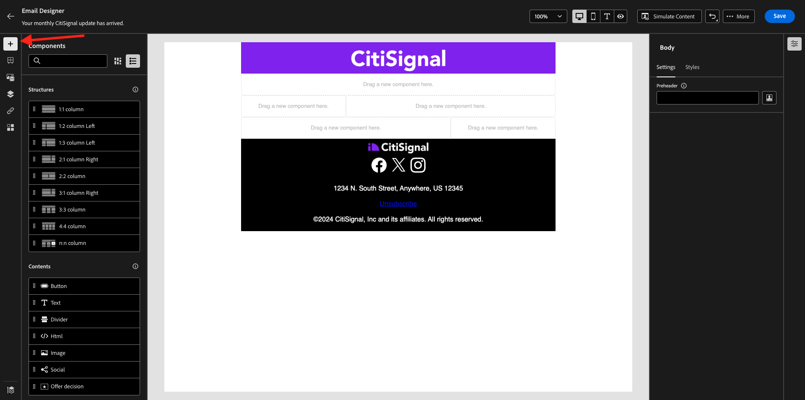
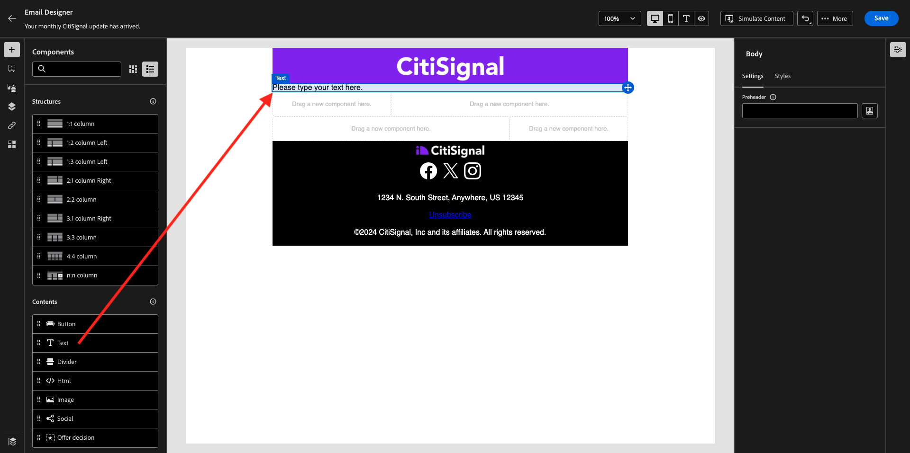

# 3.4.2 Campaign 구성

[Adobe Journey Optimizer](https://experience.adobe.com)(으)로 이동하여 Adobe Experience Cloud에 로그인합니다. **Journey Optimizer**&#x200B;을(를) 클릭합니다.


Journey Optimizer의 **Home** 보기로 리디렉션됩니다. 먼저 올바른 샌드박스를 사용하고 있는지 확인하십시오. 사용할 샌드박스를 `--aepSandboxName--`이라고 합니다. 그러면 샌드박스 `--aepSandboxName--`의 **홈** 보기에 있게 됩니다.


## 3.4.2.1 대상자 만들기

캠페인을 만들기 전에 캠페인을 받을 대상을 정의해야 합니다. 대상자를 만들려면 왼쪽 메뉴에서 **대상자**(으)로 이동하십시오. 이전에 만든 모든 대상자가 표시됩니다.

**+ 대상 만들기**&#x200B;를 클릭합니다.


**규칙 빌드**&#x200B;를 선택하고 **만들기**&#x200B;를 클릭합니다.


**XDM 개별 프로필 > 개인 이메일 > 주소** 필드를 선택하고 캔버스에 추가합니다. 규칙 조건을 **존재**(으)로 설정합니다.

공유 교육 환경에서 다른 사용자에게 전자 메일을 보내지 않도록 **이름이 -이름과 같음-**&#x200B;과 같은 필터를 추가할 수도 있습니다.

대상자의 이름을 `--aepUserLdap-- - All customers with email`(으)로 설정하고 **Publish**&#x200B;을(를) 클릭합니다.


이제 대상자가 게시되었으며 캠페인에서 사용할 수 있습니다.

## 3.4.2.2 뉴스레터 캠페인 만들기

이제 캠페인을 만듭니다. 들어오는 경험 이벤트 또는 대상 항목 또는 종료에 의존하여 1개의 특정 고객에 대한 여정을 트리거하는 이전 연습의 이벤트 기반 여정과 달리, 캠페인은 뉴스레터, 일회성 프로모션 또는 일반 정보와 같은 고유한 콘텐츠나 생일 캠페인 및 미리 알림과 같이 정기적으로 전송되는 유사한 콘텐츠로 전체 대상을 한 번 타겟팅합니다.

메뉴에서 **캠페인**(으)로 이동하여 **캠페인 만들기**&#x200B;를 클릭합니다.


**예약됨 - 마케팅**&#x200B;을 선택하고 **만들기**&#x200B;를 클릭합니다.


캠페인 생성 화면에서 다음을 구성합니다.

- **이름**: `--aepUserLdap-- - CitiSignal Newsletter`.
- **설명**: 월간 뉴스레터
- **ID 유형**: 전자 메일로 변경

**대상 선택**&#x200B;을 클릭합니다.


**대상**&#x200B;에 대해 이전 단계에서 만든 대상 `--aepUserLdap-- - All customers with email`을(를) 선택하십시오. **저장**&#x200B;을 클릭합니다.


**작업**&#x200B;에 대해 **전자 메일**&#x200B;을 선택하고 기존 **전자 메일 구성**&#x200B;을 선택하세요. 2분 정도 후에 콘텐츠를 편집할 수 있습니다.


**일정**&#x200B;에 대해 **특정 날짜 및 시간에**&#x200B;을(를) 선택하고 선택한 시간을 설정하십시오.


이제 이메일 메시지 자체를 만들 수 있습니다. 위로 살짝 스크롤한 다음 **콘텐츠 편집**&#x200B;을 클릭합니다.


그러면 이걸 보게 될 거야. **제목 줄**&#x200B;에 대해 `Your monthly CitiSignal update has arrived.`을(를) 사용합니다. **전자 메일 본문 편집**&#x200B;을 클릭합니다.


**처음부터 디자인**&#x200B;을 선택하세요.


그러면 이걸 보게 될 거야. 왼쪽 메뉴에서 이메일(행 및 열) 구조를 정의하는 데 사용할 수 있는 구조 구성 요소를 찾을 수 있습니다.

캔버스에 **1:1 열**&#x200B;을 3번, 왼쪽으로 1:2 열을 1번, 오른쪽으로 2:1 열을 1번 끌어서 놓으십시오. 이렇게 하면 다음 구조를 사용할 수 있습니다.


왼쪽 메뉴에서 **조각**(으)로 이동합니다. [연습 3.1.2.1](./../module3.1/ex2.md)에서 이전에 만든 헤더를 캔버스에서 첫 번째 구성 요소로 드래그합니다. [연습 3.1.2.2](./../module3.1/ex2.md)에서 이전에 만든 바닥글을 캔버스에서 마지막 구성 요소로 드래그합니다.


왼쪽 메뉴에서 **+** 아이콘을 클릭합니다. 캔버스에 콘텐츠를 추가하려면 **콘텐츠**(으)로 이동하십시오.



두 번째 행에 **Text** 구성 요소를 끌어서 놓습니다.



구성 요소 **에서 기본 텍스트를 선택하십시오. 여기에 텍스트를 입력하십시오.**&#x200B;을(를) 아래 텍스트로 바꿉니다. 정렬을 **가운데 맞춤**(으)로 변경합니다.

```javascript
Hi {{profile.person.name.firstName}}

As a CitiSignal member, you're part of a dynamic community that's constantly evolving to meet your needs. We're committed to delivering innovative solutions that enhance your digital lifestyle and keep you ahead of the curve.

Stay connected.
```


**이미지** 구성 요소를 세 번째 행과 네 번째 행에 끌어다 놓습니다. 세 번째 행에서 **찾아보기**&#x200B;를 클릭합니다.


**citi-signal-images** 폴더를 열고 **Offer_AirPods.jpg** 이미지를 클릭하여 선택한 다음 **선택**&#x200B;을 클릭합니다.


네 번째 행의 이미지 자리 표시자에서 **찾아보기**&#x200B;를 클릭합니다.


**citi-signal-images** 폴더를 열고 **Offer_Phone.jpg** 이미지를 클릭하여 선택한 다음 **선택**&#x200B;을 클릭합니다.


**Text** 구성 요소를 세 번째 행과 네 번째 행에 끌어다 놓습니다.


세 번째 행 **의 구성 요소에서 기본 텍스트를 선택합니다. 여기에 텍스트를 입력하십시오.**&#x200B;을(를) 아래 텍스트로 바꿉니다.

```javascript
Get AirPods for free:

Experience seamless connectivity like never before with CitiSignal. Sign up for select premium plans and receive a complimentary pair of Apple AirPods. Stay connected in style with our unbeatable offer.
```

네 번째 행 **의 구성 요소에서 기본 텍스트를 선택합니다. 여기에 텍스트를 입력하십시오.**&#x200B;을(를) 아래 텍스트로 바꿉니다.

```javascript
We'll pay off your phone:

Make the switch to CitiSignal and say goodbye to phone payments! Switching to CitiSignal has never been more rewarding. Say farewell to hefty phone bills as we help pay off your phone, up to 800$!
```


이제 기본 뉴스레터 이메일이 준비되었습니다. **저장**&#x200B;을 클릭합니다.


왼쪽 상단 모서리의 제목 줄 텍스트 옆에 있는 **화살표**&#x200B;를 클릭하여 캠페인 대시보드로 돌아갑니다.


활성화하려면 **검토**&#x200B;를 클릭하세요.


그러면 이 오류가 발생할 수 있습니다. 이 경우 대상자가 평가될 때까지 최대 24시간 대기한 다음 캠페인을 다시 활성화해야 할 수 있습니다. 나중에 실행하기 위해 캠페인의 일정을 업데이트해야 할 수도 있습니다.

**활성화**&#x200B;를 클릭합니다.


활성화하면 캠페인이 실행되도록 예약됩니다.


이제 캠페인이 활성화되었습니다. 뉴스레터 이메일 메시지는 일정에서 정의한 대로 전송되며, 마지막 이메일이 전송되면 캠페인이 중지됩니다.

이전에 만든 데모 프로필에 사용한 이메일 주소로도 이메일을 받게 됩니다.


이 연습을 완료했습니다.

다음 단계: [3.4.3 전자 메일 메시지에 세그먼트 기반 개인화 적용](./ex3.md)

[모듈 3.4로 돌아가기](./journeyoptimizer.md)

[모든 모듈로 돌아가기](../../../overview.md)
