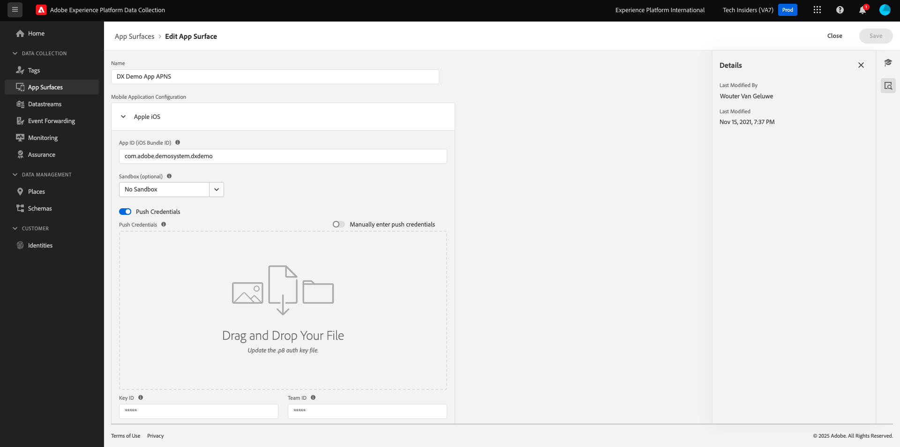
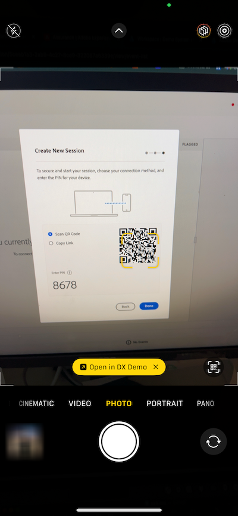
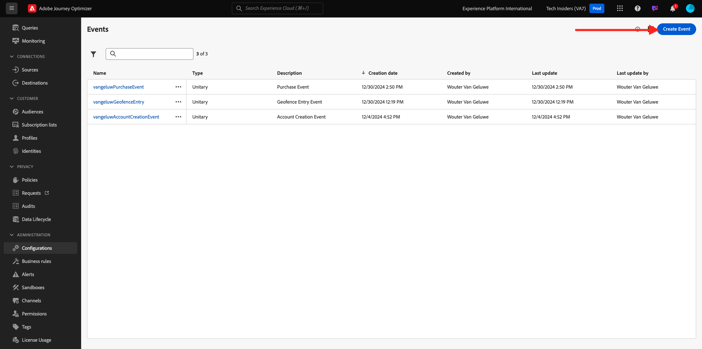
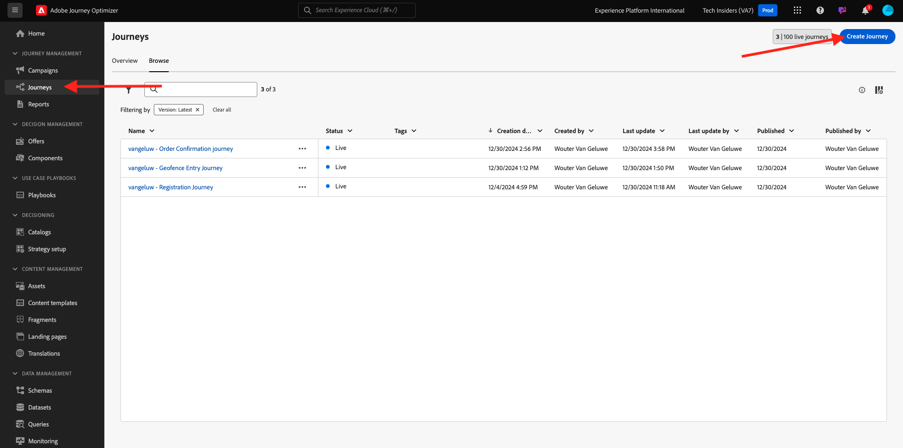
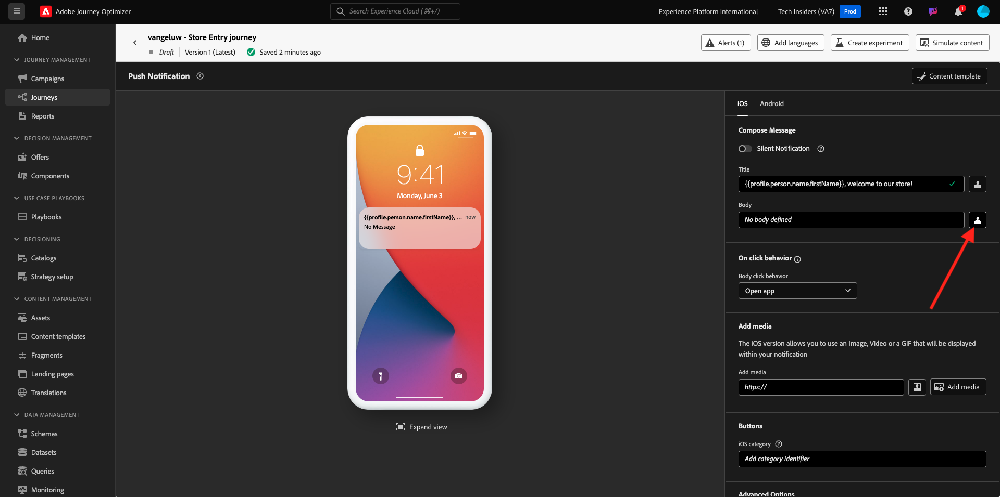

# 3.4.4 iOS용 푸시 알림 설정 및 사용

Adobe Journey Optimizer에서 푸시 알림을 사용하기 위해 확인하고 알아야 할 다양한 설정이 있습니다.

확인할 모든 설정은 다음과 같습니다.

- Adobe Experience Platform의 데이터 세트 및 스키마
- 모바일용 데이터스트림
- 모바일용 데이터 수집 속성
- 푸시 인증서의 앱 표면
- AEP Assurance을 사용하여 푸시 설정 테스트

이것을 하나씩 검토해 봅시다.

[Adobe Journey Optimizer](https://experience.adobe.com)(으)로 이동하여 Adobe Experience Cloud에 로그인합니다. **Journey Optimizer**&#x200B;을(를) 클릭합니다.

Journey Optimizer의 **Home** 보기로 리디렉션됩니다. 먼저 올바른 샌드박스를 사용하고 있는지 확인하십시오. 사용할 샌드박스를 `--aepSandboxName--`이라고 합니다. 그러면 샌드박스 `--aepSandboxName--`의 **홈** 보기에 있게 됩니다.

## 3.4.4.1 푸시 데이터 세트

Adobe Journey Optimizer은 데이터 세트를 사용하여 모바일 장치의 푸시 토큰 또는 푸시 메시지(예: 보낸 메시지, 열린 메시지 등)와의 상호 작용 등을 Adobe Journey Optimizer 데이터 세트에 저장합니다.

화면 왼쪽의 메뉴에서 **[!UICONTROL 데이터 세트]**(으)로 이동하여 이러한 데이터 세트를 찾을 수 있습니다. 시스템 데이터 세트를 표시하려면 필터 아이콘을 클릭합니다.

**시스템 데이터 세트 표시** 옵션을 활성화하고 **AJO**&#x200B;을 검색합니다. 그러면 푸시 알림에 사용되는 데이터 세트가 표시됩니다.

## 3.4.4.2 모바일용 데이터스트림

[https://experience.adobe.com/#/data-collection/](https://experience.adobe.com/#/data-collection/)(으)로 이동합니다.

왼쪽 메뉴에서 **[!UICONTROL 데이터스트림]**(으)로 이동하여 [연습 0.2](./../../../modules/gettingstarted/gettingstarted/ex2.md)에서 만든 데이터스트림(`--aepUserLdap-- - Demo System Datastream (Mobile)`)을 검색합니다. 클릭하여 엽니다.

**Adobe Experience Platform** 서비스에서 **편집**&#x200B;을 클릭합니다.

그러면 정의된 데이터 스트림 설정과 이벤트 및 프로필 속성이 저장될 데이터 세트가 표시됩니다.

변경 사항이 필요하지 않습니다. 이제 모바일용 데이터 수집 클라이언트 속성에서 데이터 스트림을 사용할 준비가 되었습니다.

## 3.4.4.3 모바일용 데이터 수집 속성 검토

[https://experience.adobe.com/#/data-collection/](https://experience.adobe.com/#/data-collection/)(으)로 이동합니다. [연습 0.1](./../../../modules/gettingstarted/gettingstarted/ex1.md)의 일부로 2개의 데이터 수집 속성이 만들어졌습니다.
이러한 데이터 수집 클라이언트 속성을 이전 모듈의 일부로 이미 사용하고 있습니다.

모바일에 대한 데이터 수집 속성을 열려면 를 클릭합니다.

데이터 수집 속성에서 **확장**(으)로 이동합니다. 모바일 앱에 필요한 다양한 확장이 표시됩니다. 확장 **Adobe Experience Platform Edge Network**&#x200B;을 열려면 클릭하세요.

그러면 모바일용 데이터스트림이 여기에 연결되어 있는 것을 볼 수 있습니다. 다음으로 **취소**&#x200B;를 클릭하여 확장 개요로 돌아갑니다.

그럼 다시 여기로 돌아오게 될 거야 **AEP Assurance**&#x200B;의 확장이 표시됩니다. AEP Assurance은 모바일 앱에서 데이터를 수집하거나 경험을 제공하는 방법을 검사, 증명, 시뮬레이션 및 확인하는 데 도움이 됩니다. AEP Assurance 및 프로젝트 그리폰에 대한 자세한 내용은 [https://aep-sdks.gitbook.io/docs/beta/project-griffon](https://aep-sdks.gitbook.io/docs/beta/project-griffon)에서 확인할 수 있습니다.

그런 다음 **구성**&#x200B;을 클릭하여 확장 **Adobe Journey Optimizer**&#x200B;을(를) 엽니다.

그런 다음 푸시 이벤트 추적을 위한 데이터 세트가 여기에서 연결되는지 확인합니다.

데이터 수집 속성을 변경할 필요가 없습니다.

## 3.4.4.4 앱 표면 설정 검토

[https://experience.adobe.com/#/data-collection/](https://experience.adobe.com/#/data-collection/)(으)로 이동합니다. 왼쪽 메뉴에서 **앱 표면**(으)로 이동하여 **DX 데모 앱 APNS**&#x200B;용 앱 표면을 여십시오.

그러면 iOS 및 Android에 대해 구성된 앱 표면이 표시됩니다.

## 3.4.4.5 AEP Assurance을 사용하여 푸시 알림 설정을 테스트합니다.

앱이 설치되면 디바이스의 홈 화면에서 찾을 수 있습니다. 아이콘을 클릭하여 앱을 엽니다.

앱을 처음 사용하는 경우 Adobe ID을 사용하여 로그인하라는 메시지가 표시됩니다. 로그인 프로세스를 완료합니다.

로그인하면 알림 전송 권한을 요청하는 알림이 표시됩니다. 자습서의 일부로 알림을 전송하므로 **허용**&#x200B;을 클릭하세요.

그러면 앱의 홈페이지가 표시됩니다. **설정**(으)로 이동합니다.

설정에서 현재 **공개 프로젝트**&#x200B;가 앱에 로드되어 있습니다. **사용자 지정 프로젝트**&#x200B;를 클릭합니다.

이제 사용자 지정 프로젝트를 로드할 수 있습니다. 프로젝트를 쉽게 로드하려면 QR 코드를 클릭하십시오.

0.1 운동 후, 당신은 이 결과를 얻었습니다. 자동으로 만든 **Mobile Retail 프로젝트**&#x200B;를 열려면 클릭하세요.

실수로 브라우저 창을 닫은 경우 또는 향후 데모 또는 지원 세션을 위해 [https://builder.adobedemo.com/projects](https://builder.adobedemo.com/projects)(으)로 이동하여 웹 사이트 프로젝트에 액세스할 수도 있습니다. Adobe ID으로 로그인하면 이 메시지가 표시됩니다. 모바일 앱 프로젝트를 클릭하여 엽니다.

그러면 이걸 보게 될 거야. **통합**&#x200B;을 클릭합니다.

연습 0.1에서 만든 모바일 데이터 수집 속성을 선택해야 합니다. 그런 다음 **실행**&#x200B;을 클릭합니다.

그러면 QR 코드가 포함된 이 팝업이 표시됩니다. 모바일 앱 내에서 이 QR 코드를 스캔합니다.

그러면 앱에 프로젝트 ID가 표시되고 **저장**&#x200B;을 클릭할 수 있습니다.

이제 앱의 **홈**(으)로 돌아갑니다. 이제 앱을 사용할 준비가 되었습니다.

이제 QR 코드를 스캔하여 모바일 장치를 AEP Assurance 세션에 연결해야 합니다.

AEP Assurance 세션을 시작하려면 [https://experience.adobe.com/#/@experienceplatform/griffon](https://experience.adobe.com/#/@experienceplatform/griffon)(으)로 이동합니다. **세션 만들기**&#x200B;를 클릭합니다.

**시작**&#x200B;을 클릭합니다.

값을 입력합니다.

- 세션 이름: `--aepUserLdap-- - push debugging`을(를) 사용하고 ldap를 ldap로 바꾸기
- 기본 URL: **dxdemo://default** 사용

**다음**&#x200B;을 클릭합니다.

그러면 화면에 QR 코드가 표시되며, 이 코드를 iOS 장치로 스캔해야 합니다.

모바일 장치에서 카메라 앱을 열고 AEP Assurance에 표시되는 QR 코드를 스캔합니다.

그러면 PIN 코드를 입력하라는 팝업 화면이 표시됩니다. AEP Assurance 화면에서 PIN 코드를 복사하고 **연결**&#x200B;을 클릭합니다.

그러면 이걸 보게 될 거야.

이제 AEP Assurance에서 AEP Assurance 세션에 장치가 있음을 볼 수 있습니다.

**Push Debug**(으)로 이동합니다. 이런 걸 보게 될 거야

자세한 설명:

- 첫 번째 열인 **Client**&#x200B;에는 iOS 장치에서 사용 가능한 식별자가 표시됩니다. ECID와 푸시 토큰이 표시됩니다.
- 두 번째 열에는 푸시 토큰이 있는 플랫폼(APNS 또는 APNSSandbox)에 대한 추가 정보와 함께 **프로필** 정보가 표시됩니다. **Inspect 프로필** 단추를 클릭하면 Adobe Experience Platform으로 이동하며 전체 실시간 고객 프로필이 표시됩니다.
- 세 번째 열에는 연습 **3.4.5.4 Launch에서 앱 구성 만들기**&#x200B;의 일부로 설정된 **앱 구성**&#x200B;이 표시됩니다.

푸시 구성 설정을 테스트하려면 **푸시 알림 보내기** 단추를 클릭하십시오.

**푸시 알림 보내기** 단추를 클릭할 때 **DX 데모** 앱이 열려 있지 않은지 확인해야 합니다. 앱이 열려 있으면 푸시 알림이 백그라운드에서 수신되어 표시되지 않을 수 있습니다.

그런 다음 모바일 장치에 표시되는 것과 같은 푸시 알림이 표시됩니다.

푸시 알림을 받았다면 설정이 올바르고 제대로 작동하고 있음을 의미합니다.

## 3.4.4.6 새 이벤트 만들기

메뉴에서 **여정 관리**(으)로 이동하여 **이벤트**&#x200B;에서 **관리**&#x200B;을(를) 클릭합니다.

**이벤트** 화면에 다음과 유사한 보기가 표시됩니다. **이벤트 만들기**&#x200B;를 클릭합니다.

그러면 빈 이벤트 구성이 표시됩니다.

먼저 이벤트에 다음과 같은 이름(`--aepUserLdap--StoreEntryEvent`)을 지정하고 설명을 `Store Entry Event`(으)로 설정하십시오.

다음은 **이벤트 유형** 선택입니다. **단일**&#x200B;을(를) 선택합니다.

다음은 **이벤트 ID 유형** 선택 항목입니다. **시스템 생성** 선택

다음은 스키마 선택 사항입니다. 이 연습을 위해 스키마가 준비되었습니다. 스키마 `Demo System - Event Schema for Mobile App (Global v1.1) v.1`을(를) 사용하십시오.

스키마를 선택하면 **페이로드** 섹션에서 여러 필드를 선택할 수 있습니다. 이제 이벤트가 완전히 구성되었습니다.

그럼 이걸 보셔야죠 **저장**&#x200B;을 클릭합니다.

이제 이벤트가 구성 및 저장되었습니다. 이벤트를 다시 클릭하여 **이벤트 편집** 화면을 다시 엽니다.

**페이로드** 필드 위로 마우스를 가져간 후 **페이로드 보기** 아이콘을 클릭합니다.

이제 예상 페이로드의 예를 볼 수 있습니다.

이벤트에는 고유한 오케스트레이션 eventID가 있으며 `_experience.campaign.orchestration.eventID`이(가) 표시될 때까지 해당 페이로드에서 아래로 스크롤하여 찾을 수 있습니다.

이벤트 ID는 다음 단계에서 빌드할 여정을 트리거하기 위해 Adobe Experience Platform에 전송해야 하는 ID입니다. 다음 단계에서 필요하므로 이 eventID를 기록하십시오.
`"eventID": "e3a8f0bdc0b609667cd96a72a6b1e5aafa0ddaf6ccf121c574e6a2030860a633"`

**확인**, **취소**&#x200B;를 차례로 클릭합니다.

## 3.4.4.7 여정 만들기

메뉴에서 **여정**(으)로 이동하여 **여정 만들기**&#x200B;를 클릭합니다.

그러면 이걸 보게 될 거야. 여정 이름을 지정합니다. `--aepUserLdap-- - Store Entry journey` 사용. **확인**&#x200B;을 클릭합니다.

먼저 이벤트를 여정 시작점으로 추가해야 합니다. `--aepUserLdap--StoreEntryEvent` 이벤트를 검색하여 캔버스에 끌어서 놓습니다. **확인**&#x200B;을 클릭합니다.

그런 다음 **Actions**&#x200B;에서 **Push** 작업을 검색합니다.
**Push** 작업을 캔버스로 끌어서 놓습니다.

**카테고리**&#x200B;을(를) **마케팅**(으)로 설정하고 푸시 알림을 보낼 수 있는 푸시 표면을 선택하십시오. 이 경우 선택할 전자 메일 표면은 **Push-iOS-Android**&#x200B;입니다.

다음 단계는 메시지를 만드는 것입니다. 이렇게 하려면 **콘텐츠 편집**&#x200B;을 클릭하세요.

그러면 이걸 보게 될 거야. **제목** 필드에 대한 **개인화** 아이콘을 클릭합니다.

그러면 이걸 보게 될 거야. 이제 실시간 고객 프로필에서 프로필 속성을 직접 선택할 수 있습니다.

**이름** 필드를 검색한 다음 **이름** 필드 옆에 있는 **+** 아이콘을 클릭합니다. 그러면 이름 **{{profile.person.name.firstName}}**&#x200B;에 대한 개인화 토큰이 추가됩니다.

**텍스트를 추가합니다. 스토어에 오신 것을 환영합니다!**{{profile.person.name.firstName}}**뒤에**&#x200B;이(가) 있습니다.

**저장**&#x200B;을 클릭합니다.

이제 이걸 가지셨네요. **본문** 필드에 대한 **개인화** 아이콘을 클릭합니다.

이 텍스트를 입력하십시오. **오늘 구입하면 10% 할인을 받으려면 여기를 클릭하세요!**&#x200B;을(를) 클릭하고 **저장**&#x200B;을(를) 클릭합니다.

그럼 이걸로 드셔보세요 왼쪽 상단 모서리의 화살표를 클릭하여 여정으로 돌아갑니다.

푸시 작업을 닫으려면 **확인**&#x200B;을 클릭하세요.

**Publish**&#x200B;을(를) 클릭합니다.

**Publish**&#x200B;을 다시 클릭합니다.

이제 여정이 게시되었습니다.

## 3.4.4.8 여정 및 푸시 메시지 테스트

DX 데모 2.0 모바일 응용 프로그램에서 **설정** 화면으로 이동합니다. **항목 저장** 단추를 클릭합니다.

>[!NOTE]
>
>**스토어 항목** 단추가 현재 구현되고 있습니다. 앱에서 아직 찾을 수 없습니다.

**스토어 시작** 아이콘을 클릭한 후 바로 앱을 닫아야 합니다. 그렇지 않으면 푸시 메시지가 표시되지 않습니다.

몇 초 후에 메시지가 나타납니다.

이 연습을 완료했습니다.

다음 단계: [3.4.5 비즈니스 이벤트 여정 만들기](./ex5.md)

[모듈 3.4로 돌아가기](./journeyoptimizer.md)

[모든 모듈로 돌아가기](../../../overview.md)
