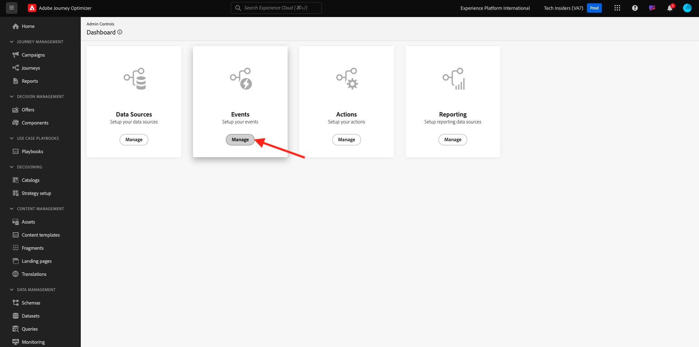

# 3.4.5 비즈니스 이벤트 여정 만들기

[Adobe Journey Optimizer](https://experience.adobe.com)(으)로 이동하여 Adobe Experience Cloud에 로그인합니다. **Journey Optimizer**&#x200B;을(를) 클릭합니다.


Journey Optimizer의 **Home** 보기로 리디렉션됩니다. 먼저 올바른 샌드박스를 사용하고 있는지 확인하십시오. 사용할 샌드박스를 `--aepSandboxId--`이라고 합니다. 한 샌드박스에서 다른 샌드박스로 변경하려면 **프로덕션 프로덕션(VA7)**&#x200B;을 클릭하고 목록에서 샌드박스를 선택합니다. 이 예제에서는 샌드박스 이름을 **AEP 지원 FY22**&#x200B;로 지정합니다. 그러면 샌드박스 `--aepSandboxId--`의 **홈** 보기에 있게 됩니다.


## 3.4.5.1 비즈니스 이벤트 만들기

왼쪽 메뉴에서 **구성**&#x200B;을 클릭합니다. **이벤트** 카드 내의 **관리** 단추를 클릭합니다.



비즈니스 이벤트는 Journey Optimizer 내에서 만들 수 있는 새로운 유형의 이벤트입니다. 이전 모듈에서 만든 **Unitary** 이벤트와 달리 비즈니스 이벤트는 고객이 아닌 조직에서 트리거됩니다. 이제 비즈니스 이벤트를 만듭니다.

**이벤트 만들기**&#x200B;를 클릭합니다.


이벤트 생성 양식에 다음 값을 입력합니다.

- **이름**: `--demoProfileLdap--ItemBackInStock`. 예: **vangeluwItemBackInStock**
- **설명**: 이 이벤트는 제품이 재입고될 때 트리거됩니다.
- **유형**: 드롭다운에서 **비즈니스**&#x200B;를 선택합니다.


스키마에 대해 **데모 시스템 - JO 비즈니스 이벤트(글로벌 v1.1) v.1**&#x200B;용 이벤트 스키마를 선택합니다. 이제 사용 사례에 필요한 스키마 필드를 선택해야 합니다.


다음 단계를 수행하십시오.

필드의 **연필** 아이콘을 클릭하면 **1개 필드가 선택됨**&#x200B;으로 표시됩니다.


스키마에서 사용 가능한 모든 필드를 선택한 다음 **확인**&#x200B;을 클릭합니다.


조건: 이 스키마에서 비즈니스 이벤트를 트리거할 레코드를 지정해야 합니다.

다음 단계를 수행하십시오.

필드에 **조건 추가**&#x200B;라고 표시된 **연필** 아이콘을 클릭합니다.


왼쪽에서 `--aepTenantId--` 개체를 확장하고 **joBusinessEvents** 개체를 확장한 다음 **eventName** 필드를 캔버스로 끌어서 놓습니다.


**eventName** 필드에 다음 값을 입력하십시오. `--demoProfileLdap--ItemBackInStock`. 예: vangeluwItemBackInStock.
**확인**&#x200B;을 클릭합니다.


**확인**&#x200B;을 클릭합니다.


마지막으로 이벤트 생성 양식은 다음과 같아야 합니다. 비즈니스 이벤트를 저장하려면 **저장**&#x200B;을 클릭하세요.


## 3.4.5.2 비즈니스 이벤트 여정 만들기

이제 이 비즈니스 이벤트와 여정 내의 메시지를 활용할 수 있습니다. **여정**(으)로 이동합니다. **여정 만들기**&#x200B;를 클릭합니다.


오른쪽에는 여정 이름과 설명을 지정해야 하는 양식이 표시됩니다. 다음 값을 입력합니다.

- **이름**: `--demoProfileLdap-- - Item back in stock journey`. 예: vangeluw - Item back in stock 여정
- **설명**: 이 여정은 관심 있는 방문자에게 항목이 재입고되면 SMS를 보냅니다.

**확인**&#x200B;을 클릭합니다.


왼쪽 메뉴에서 **이벤트**&#x200B;에서 ldap를 검색합니다. 이전에 만든 비즈니스 이벤트 `--demoProfileLdap--ItemBackInStock`이(가) 있습니다. 여정의 시작점이 되므로 이 이벤트를 캔버스로 드래그하여 놓습니다.


**세그먼트 읽기** 활동이 캔버스에 자동으로 추가되었습니다. 비즈니스 이벤트는 여정이 특정 여정을 읽도록 하는 트리거만 보내고 특정 세그먼트에 대한 프로필 목록을 검색하기 때문입니다.

**세그먼트 읽기** 활동을 클릭합니다.
**세그먼트 읽기** 구성에서는 방금 발생한 비즈니스 이벤트를 알릴 세그먼트를 선택해야 합니다. **세그먼트 선택** 필드를 클릭합니다.


**세그먼트 선택** 팝업에서 ldap를 검색하고 [모듈 2.3 - Real-time CDP - 세그먼트 작성 및 작업](./../../../modules/rtcdp-b2c/module2.3/real-time-cdp-build-a-segment-take-action.md)에서 만든 세그먼트를 선택합니다. `--demoProfileLdap-- - Interest in PROTEUS FITNESS JACKSHIRT`. 예: vangeluw - Interest in PROTEUS FITNESS JACKSHIRT. **저장**&#x200B;을 클릭합니다.


**확인**&#x200B;을 클릭합니다.


다음 단계는 이 여정에서 수행하려는 작업을 끌어서 놓는 것입니다. **SMS** 작업을 선택한 다음 방금 추가한 조건 뒤에 끌어서 놓습니다.


**카테고리**&#x200B;을(를) **마케팅**(으)로 설정하고 SMS를 보낼 수 있는 SMS 표면을 선택합니다. 이 경우 선택할 전자 메일 표면은 **SMS**&#x200B;입니다.


다음 단계는 메시지를 만드는 것입니다. 이렇게 하려면 **콘텐츠 편집**&#x200B;을 클릭하세요.


이제 SMS 텍스트를 구성할 수 있는 메시지 대시보드가 표시됩니다. 메시지를 만들려면 **메시지 작성** 영역을 클릭하십시오.


`Hi {{profile.person.name.firstName}}, the Proteus Fitness Jackshirt is back in stock at Luma.` 텍스트를 입력하십시오. **저장**&#x200B;을 클릭합니다.


왼쪽 상단 모서리의 제목 줄 텍스트 옆에 있는 **화살표**&#x200B;를 클릭하여 메시지 대시보드로 돌아갑니다.


이제 완료된 SMS 작업이 표시됩니다. **확인**&#x200B;을 클릭합니다.


이제 여정을 게시할 준비가 되었습니다. **Publish**&#x200B;을(를) 클릭합니다.


**Publish**&#x200B;을 다시 클릭합니다.


이제 여정이 게시되었으므로 이제 테스트할 수 있습니다.


## 3.4.5.3 비즈니스 이벤트 여정 테스트

이제 Postman을 사용하여 **데모 시스템 - JO 비즈니스 이벤트(글로벌 v1.1) v.1**&#x200B;에 대한 이벤트 스키마에 대해 새 이벤트를 수집하여 제품 재입고를 시뮬레이션합니다.

왼쪽 메뉴에서 **소스**&#x200B;를 클릭한 다음 **계정** 탭을 클릭합니다.


**계정** 탭에서 **Journey Optimizer 비즈니스 이벤트**&#x200B;라는 계정을 찾을 수 있습니다. 클릭하여 엽니다.


이 계정에는 데이터 흐름이 하나만 있습니다. 데이터 흐름 이름을 클릭하여 선택하십시오.


오른쪽 메뉴에서 **스키마 페이로드 복사**&#x200B;를 클릭합니다. 이 옵션은 전체 **curl** 명령을 복사하여 **데모 시스템 - JO 비즈니스 이벤트(전역 v1.1) v.1**&#x200B;에 대한 레코드를 클립보드에 삽입합니다.


텍스트 편집기 내에 Curl 명령 붙여넣기


이 요청을 자세히 살펴보겠습니다.

- POST 요청은 DCS Inlet ID로 전송됩니다
- 요청은 스키마, 데이터 세트 및 조직 ID를 참조합니다.
- 마지막으로 데이터 세트 내에 만들려는 데이터를 나타내는 xdmEntity 노드가 포함됩니다.

이제 다음 `xdmEntity` 줄을 바꿔야 합니다.

```json
"xdmEntity": {
  "_experienceplatform": {
    "joBusinessEvents": {
      "eventDescription": "string",
      "eventName": "string",
      "stockEventId": "string"
    }
  },
  "_id": "/uri-reference",
  "eventType": "advertising.completes",
  "timestamp": "2018-11-12T20:20:39+00:00"
}
```

...이 줄에서는 여정을 트리거하기 위해 비즈니스 이벤트에 지정한 조건을 나타내는 `--demoProfileLdap--ItemBackInStock`이(가) 표시되어야 하는 대로 eventName 필드를 확인해야 합니다.

```json
"xdmEntity": {
  "_experienceplatform": {
    "joBusinessEvents": {
      "eventDescription": "Product Proteus Fitness Jackshirt is back in stock",
      "eventName": "--demoProfileLdap--ItemBackInStock",
      "stockEventId": "1"
    }
  },
  "_id": "/uri-reference",
  "eventType": "productBackInStock",
  "timestamp": "2021-04-19T15:25:39+00:00"
}
```

업데이트된 **curl** 명령은 다음과 같이 표시되어야 합니다.


모든 파일을 선택하여 클립보드에 복사합니다.

Postman을 엽니다. Postman 왼쪽에서 **가져오기**&#x200B;를 클릭합니다.


**원시 텍스트** 탭을 선택하고 이전에 복사한 명령을 여기에 붙여넣으십시오. **계속을 클릭합니다**.


**가져오기**&#x200B;를 클릭합니다.


Postman에서 **curl** 명령을 트리거할 준비가 된 REST 명령으로 자동으로 전환했습니다. **보내기** 단추를 눌러 데이터 집합 내에 해당 레코드를 만들 것을 요청하면 됩니다.


요청이 성공적으로 수신되었는지 확인합니다. postman에서 **200 OK** 상태를 찾습니다.


SMS가 휴대폰에 도착하는 데 몇 분 정도 걸릴 수 있습니다. 그렇지 않은 경우 **Proteus Fitness Jackshirt에 대한 관심** 세그먼트에 올바른 휴대폰이 있는 프로필이 포함되어 있지 않을 수 있습니다. 그렇다면 Luma 웹 사이트에서 **Proteus Fitness Jackshirt** 제품을 방문하여 올바른 휴대폰 번호를 입력했는지 확인하는 동안 등록하십시오.


이제 이 연습을 완료했습니다.

다음 단계: [요약 및 이점](./summary.md)

[모듈 3.4로 돌아가기](./journeyoptimizer.md)

[모든 모듈로 돌아가기](../../../overview.md)
