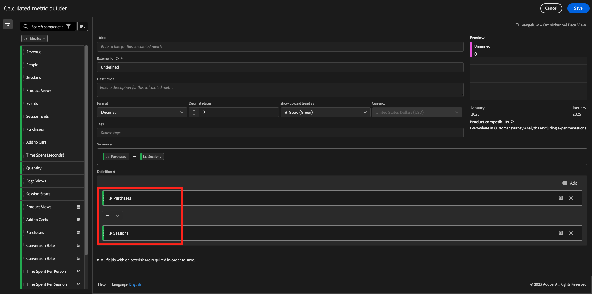
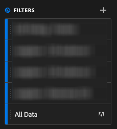

# 4.1.4 Analysis Workspace의 데이터 준비

## 목표

- CJA의 Analysis Workspace UI 이해
- Analysis Workspace의 데이터 준비 개념 이해
- 데이터 계산 방법 알아보기

## CJA의 4.1.4.1 Analysis Workspace UI

Analysis Workspace은 단일 Analytics 보고서의 모든 일반적인 제한 사항을 제거합니다. 사용자 정의 분석 프로젝트를 빌드할 수 있는 강력하고 유연한 캔버스를 제공합니다. 다양한 데이터 테이블, 시각화 및 구성 요소(차원, 지표, 세그먼트 및 시간 세부기간)를 프로젝트에 드래그하여 놓습니다. 즉시 분류 및 세그먼트를 만들고, 분석할 집단을 만들고, 경고를 만들고, 세그먼트를 비교하고, 흐름 및 폴아웃 분석을 수행하고, 비즈니스 내의 누구와도 공유할 수 있는 보고서를 선별 및 예약합니다.

Customer Journey Analytics은 플랫폼 데이터 위에 이 솔루션을 제공합니다. 이 4분 개요 비디오를 시청하는 것이 좋습니다.

>[!VIDEO](https://video.tv.adobe.com/v/35109?quality=12&learn=on&enablevpops)

Analysis Workspace을 사용하지 않았다면 이 비디오를 시청하는 것이 좋습니다.

>[!VIDEO](https://video.tv.adobe.com/v/35560?quality=12&learn=on&enablevpops&captions=kor)

### 프로젝트 만들기

이제 첫 번째 CJA 작업 영역을 만들 차례입니다. CJA 내의 **Workspace** 탭으로 이동합니다.
**프로젝트 만들기**&#x200B;를 클릭합니다.

그러면 이걸 보게 될 거야. **빈 Workspace 프로젝트**&#x200B;를 선택한 다음 **만들기**&#x200B;를 클릭합니다.

그러면 빈 프로젝트가 표시됩니다.

먼저 화면 오른쪽 상단에서 올바른 데이터 보기 를 선택하십시오. 선택할 데이터 보기는 `--aepUserLdap-- - Omnichannel Data View`입니다.

그런 다음 프로젝트를 저장하고 이름을 지정합니다. 다음 명령을 사용하여 저장할 수 있습니다.

| OS | 지름길 |
| ----------------- |-------------| 
| Windows | Control + S |
| Mac | Command+S |

이 팝업이 표시됩니다.

이 명명 규칙을 사용하십시오.

| 이름 | 설명 |
| ----------------- |-------------| 
| `--aepUserLdap-- - Omnichannel Analysis` | `--aepUserLdap-- - Omnichannel Analysis` |

그런 다음 **저장**&#x200B;을 클릭합니다.

## 4.1.4.2 계산된 지표

데이터 보기에서 모든 구성 요소를 구성했지만 비즈니스 사용자가 분석을 시작할 수 있도록 일부 구성 요소를 조정해야 합니다. 또한 분석 중에 계산된 지표를 만들어 통찰력 검색 결과에 대해 더 자세히 알아볼 수 있습니다.

예를 들어 데이터 보기에서 정의한 **구매** 지표/이벤트를 사용하여 계산된 **전환율**&#x200B;을 만듭니다.

### 전환율

계산된 지표 빌더를 열어 보겠습니다. **+**&#x200B;을(를) 클릭하여 Analysis Workspace에서 첫 번째 계산된 지표를 만듭니다.

**계산된 지표 빌더**&#x200B;이(가) 표시됩니다.

왼쪽 메뉴의 지표 목록에서 **구매**&#x200B;를 찾으십시오. **지표**&#x200B;에서 **모두 표시**&#x200B;를 클릭합니다.

이제 **구매** 지표를 계산된 지표 정의로 끌어서 놓습니다.

일반적으로 전환율은 **전환/세션**&#x200B;을 의미합니다. 이제 계산된 지표 정의 캔버스에서 동일한 계산을 수행해 보겠습니다. **세션** 지표를 찾아 **구매** 이벤트 아래의 정의 빌더로 끌어서 놓습니다.

나눗셈 연산자가 자동으로 선택됩니다.

전환율은 일반적으로 백분율로 표시됩니다. 따라서 형식을 백분율로 변경하고 소수점 2개도 선택하겠습니다.

마지막으로 계산된 지표의 이름 및 설명을 변경합니다.

| 제목 | 설명 | 외부 ID |
| ----------------- |-------------| -------------| 
| 전환율 | 전환율 | 전환율 |

그러면 이 음식을 드실 수 있습니다. **저장**&#x200B;을 클릭합니다.

**저장**&#x200B;을 다시 클릭합니다.

## 4.1.4.3 계산된 차원: 필터(세그먼테이션) 및 날짜 범위

### 필터: 계산된 차원

계산은 지표 전용이 아닙니다. 분석을 시작하기 전에 **계산된 차원**&#x200B;을 만드는 것도 좋습니다. 이는 기본적으로 Adobe Analytics의 **세그먼트**&#x200B;를 의미합니다. Customer Journey Analytics에서는 이러한 세그먼트를 **필터**&#x200B;라고 합니다.

필터를 만들면 비즈니스 사용자가 중요한 계산된 차원을 사용하여 분석을 시작할 수 있습니다. 이렇게 하면 일부 작업이 자동화될 뿐만 아니라 채택 부분도 도움이 됩니다. 다음은 몇 가지 예입니다.

1. 자신의 미디어, 유료 미디어,
2. 새 방문과 재방문
3. 장바구니를 포기한 고객

이러한 필터는 분석 파트 전 또는 중에 만들 수 있습니다(다음 연습에서 수행할 작업).

### 날짜 범위: 계산된 시간 차원

시간 차원은 다른 유형의 계산된 차원입니다. 일부는 이미 생성되었지만, 데이터 준비 단계에서 사용자 지정 시간 차원을 생성할 수도 있습니다.

이러한 계산된 시간 차원은 분석가 및 비즈니스 사용자가 중요한 날짜를 기억하고 이를 사용하여 보고 시간을 필터링하고 변경하는 데 도움이 됩니다. 분석을 수행할 때 떠오르는 일반적인 질문과 의심:

- 작년에 블랙 프라이데이가 언제였나요? 21일-29일?
- 우리가 12월에 그 TV캠페인을 한 게 언제죠?
- 2018년 여름 세일은 언제부터 언제까지 진행했습니까? 나는 그것을 2019년과 비교하고 싶다. 그런데, 2019년의 정확한 날을 알고 계시나요?

이제 CJA Analysis Workspace을 사용한 데이터 준비 연습을 완료했습니다.

다음 단계: [4.1.5 Customer Journey Analytics을 사용한 시각화](./ex5.md)

[모듈 4.1로 돌아가기](./customer-journey-analytics-build-a-dashboard.md)

[모든 모듈로 돌아가기](./../../../overview.md)
