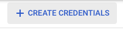
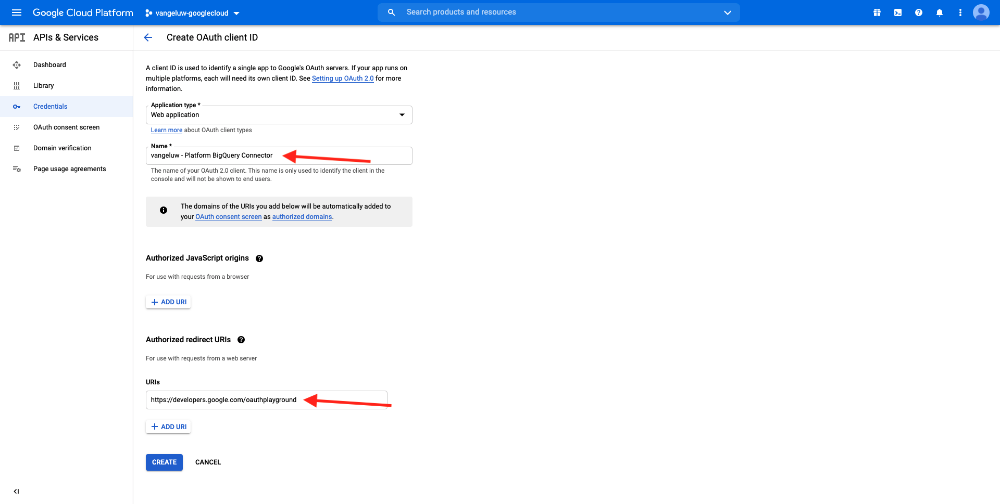
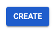
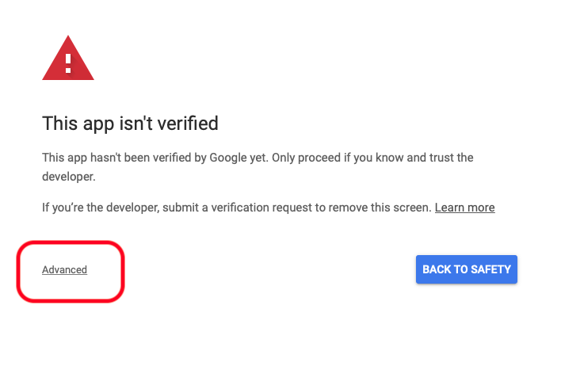

# 4.2.3 GCP 및 BigQuery를 Adobe Experience Platform에 연결

## 목표

- Google Cloud Platform 내의 API 및 서비스 살펴보기
- Google API 테스트를 위한 OAuth Playground 숙지
- Adobe Experience Platform에서 첫 번째 BigQuery 연결 만들기

## 컨텍스트

Adobe Experience Platform은 BigQuery 데이터 세트를 Adobe Experience Platform으로 가져오는 데 도움이 되는 커넥터를 **소스** 내에 제공합니다. 이 데이터 커넥터는 Google BigQuery API를 기반으로 합니다. 따라서 Adobe Experience Platform에서 API 호출을 받을 수 있도록 Google Cloud Platform 및 BigQuery 환경을 제대로 준비하는 것이 중요합니다.

Adobe Experience Platform에서 BigQuery Source 커넥터를 구성하려면 다음 4가지 값이 필요합니다.

- 프로젝트
- clientId
- 클라이언트 암호
- refreshToken

지금까지 첫 번째 ID **프로젝트 ID**&#x200B;만 있습니다. 이 **프로젝트 ID** 값은 연습 12.1에서 BigQuery 프로젝트를 만들 때 Google에서 생성한 임의의 ID입니다.

분리된 텍스트 파일에 프로젝트 ID를 복사하십시오.

| 자격 증명 | 이름 지정 | 예 |
| ----------------- |-------------| -------------|
| 프로젝트 ID | random | composed-task-306413 |

상단 메뉴 모음에서 **프로젝트 이름**&#x200B;을 클릭하여 프로젝트 ID를 언제든지 확인할 수 있습니다.

프로젝트 ID는 오른쪽에 표시됩니다.

이 연습에서는 다른 3개의 필수 필드를 가져오는 방법을 배웁니다.

- clientId
- 클라이언트 암호
- refreshToken

## 4.2.3.1 Google Cloud API 및 서비스

시작하려면 Google Cloud Platform 홈 페이지로 돌아가십시오. 이렇게 하려면 화면의 왼쪽 상단 모서리에 있는 로고를 클릭하면 됩니다.

홈 페이지를 방문하면 왼쪽 메뉴로 이동하여 **API 및 서비스**&#x200B;를 클릭한 다음 **대시보드**&#x200B;를 클릭합니다.

이제 **API 및 서비스** 홈 페이지가 표시됩니다.

이 페이지에서는 다양한 Google API 연결의 사용을 확인할 수 있습니다. Adobe Experience Platform이 BigQuery에서 읽을 수 있도록 API 연결을 설정하려면 다음 단계를 수행해야 합니다.

- 먼저 향후 인증을 활성화하려면 OAuth 동의 화면을 만들어야 합니다. Google의 보안상 이유로 프로그래밍 방식 액세스가 허용되기 전에 사람이 첫 번째 인증을 수행해야 합니다.
- 둘째, API 인증 및 BigQuery 커넥터 액세스에 사용할 API 자격 증명(clientId 및 clientSecret)이 필요합니다.

## 4.2.3.2 OAuth 동의 화면

먼저 OAuth 동의 화면 을 만들겠습니다. **API 및 서비스** 홈 페이지의 왼쪽 메뉴에서 **OAuth 동의 화면**&#x200B;을 클릭합니다.

그러면 다음과 같은 결과가 표시됩니다.

사용자 유형 선택: **외부**. **만들기**&#x200B;를 클릭합니다.

**OAuth 동의 화면 구성** 창에 표시됩니다.

**응용 프로그램 이름** 필드에 동의 화면의 이름을 입력하고 **사용자 지원 전자 메일**&#x200B;을(를) 선택하는 방법뿐입니다. 응용 프로그램 이름에 다음 명명 규칙을 사용합니다.

| 이름 지정 | 예 |
| ----------------- |-------------| 
| `--aepUserLdap-- - AEP BigQuery Connector` | vangeluw - AEP BigQuery 커넥터 |

**개발자 연락처 정보**&#x200B;가 표시될 때까지 아래로 스크롤하여 전자 메일 주소를 입력합니다.

**저장 후 계속**&#x200B;을 클릭합니다.

그러면 이걸 보게 될 거야. **저장 후 계속**&#x200B;을 클릭합니다.

그러면 이걸 보게 될 거야. **저장 후 계속**&#x200B;을 클릭합니다.

그러면 이걸 보게 될 거야. **대시보드로 돌아가기**&#x200B;를 클릭합니다.

그러면 이걸 보게 될 거야. **PUBLISH 앱**&#x200B;을 클릭합니다.

**확인**&#x200B;을 클릭합니다.

그러면 이걸 보게 될 거야.

다음 단계에서는 API 설정을 완료하고 API 자격 증명을 가져옵니다.

## 4.2.3.3 Google API 자격 증명: 클라이언트 암호 및 클라이언트 Id

왼쪽 메뉴에서 **자격 증명**&#x200B;을 클릭합니다. 그러면 다음과 같은 결과가 표시됩니다.

**+ 자격 증명 만들기** 단추를 클릭합니다.

3가지 옵션이 표시됩니다. **OAuth 클라이언트 ID**&#x200B;을(를) 클릭합니다.

다음 화면에서는 **웹 응용 프로그램**&#x200B;을 선택합니다.

몇 개의 새 필드가 표시됩니다. 이제 OAuth 클라이언트 ID의 **이름**&#x200B;을 입력하고 **승인된 리디렉션 URI**&#x200B;도 입력해야 합니다.

다음 명명 규칙을 따르십시오.

| 필드 | 값 | 예 |
| ----------------- |-------------| -------------| 
| 이름 | ldap - AEP BigQuery 커넥터 | vangeluw - Platform BigQuery 커넥터 |
| 승인된 리디렉션 URI | https://developers.google.com/oauthplayground | https://developers.google.com/oauthplayground |

**승인된 리디렉션 URI** 필드는 Adobe Experience Platform에서 BigQuery Source 커넥터 설정을 완료하는 데 필요한 RefreshToken을 가져오는 데 나중에 필요하므로 매우 중요한 필드입니다.

계속하려면 URL을 입력한 후 **Enter** 단추를 실제로 눌러 **승인된 리디렉션 URI** 필드에 값을 저장해야 합니다. **Enter** 단추를 클릭하지 않으면 나중에 **OAuth 2.0 플레이그라운드**&#x200B;에서 문제가 발생합니다.

**만들기**&#x200B;를 클릭합니다.

이제 클라이언트 ID와 클라이언트 암호가 표시됩니다.

이 두 필드를 복사하여 바탕 화면의 텍스트 파일에 붙여넣으십시오. 이러한 자격 증명은 나중에 언제든지 액세스할 수 있지만, BigQuery 프로젝트 ID 옆에 있는 텍스트 파일에 저장하면 더 쉽게 액세스할 수 있습니다.

Adobe Experience Platform에서 BigQuery Source Connector 설정을 요약 하면 이제 다음 값을 이미 사용할 수 있습니다.

| BigQuery 커넥터 자격 증명 | 값 |
| ----------------- |-------------| 
| 프로젝트 ID | 고유한 프로젝트 ID(예:: composed-task-306413) |
| clientid | clientid |
| clientsecret | yourclientsecret |

**refreshToken**&#x200B;이 아직 없습니다. 보안상의 이유로 refreshToken은 필수입니다. API의 세계에서 토큰은 일반적으로 24시간마다 만료됩니다. 따라서 Source 커넥터 설정에서 Google Cloud Platform 및 BigQuery에 계속 연결할 수 있도록 24시간마다 보안 토큰을 새로 고치려면 **refreshToken**&#x200B;이 필요합니다.

## 4.2.3.4 BigQuery API 및 refreshToken

Google Cloud Platform API에 액세스하기 위해 refreshToken을 가져오는 방법은 여러 가지가 있습니다. 이러한 옵션 중 하나는 예를 들어 Postman을 사용하는 것입니다.
하지만 Google은 API를 사용하여 테스트하고 재생할 수 있는 보다 쉬운 도구를 만들었습니다. 이 도구는 **OAuth 2.0 Playground**&#x200B;입니다.

**OAuth 2.0 Playground**&#x200B;에 액세스하려면 [https://developers.google.com/oauthplayground](https://developers.google.com/oauthplayground)(으)로 이동하십시오.

그러면 **OAuth 2.0 플레이그라운드** 홈 페이지가 표시됩니다.

화면 오른쪽 상단의 **톱니바퀴** 아이콘을 클릭합니다.

설정이 위의 이미지에서 볼 수 있는 것과 동일한지 확인하십시오.

설정을 100% 확인하려면 다시 확인하십시오.

완료되면 **자신의 OAuth 자격 증명을 사용**&#x200B;하는 확인란을 선택하세요.

두 개의 필드가 나타나야 하며 해당 필드에 대한 값이 있습니다.

이 표의 다음 필드를 입력하십시오.

| 플레이그라운드 API 설정 | Google API 자격 증명 |
| ----------------- |-------------| 
| OAuth 클라이언트 ID | 고유한 클라이언트 ID(데스크탑의 텍스트 파일 내) |
| OAuth 클라이언트 암호 | 고유한 클라이언트 암호(데스크탑의 텍스트 파일) |

데스크톱에서 만든 텍스트 파일에서 **클라이언트 ID** 및 **클라이언트 암호**&#x200B;를 복사합니다.

자격 증명을 작성했으면 **닫기**&#x200B;를 클릭하십시오.

왼쪽 메뉴에서 사용 가능한 모든 Google API를 볼 수 있습니다. **BigQuery API v2**&#x200B;을(를) 검색합니다.

그런 다음 아래 이미지에 표시된 범위를 선택합니다.

이를 선택하면 파란색 버튼에 **API 승인**&#x200B;이 표시됩니다. 클릭합니다.

GCP 및 BigQuery를 설정하는 데 사용한 Google 계정을 선택합니다.

큰 경고가 표시될 수 있습니다. **이 앱은 확인되지 않습니다**. 이 문제는 Platform BigQuery 커넥터가 아직 공식적으로 검토되지 않았기 때문에 Google은 정품 앱인지 여부를 알 수 없습니다. 이 알림은 무시해야 합니다.

**고급**&#x200B;을 클릭합니다.

**LDAP - AEP BigQuery Connector(안전하지 않음)로 이동**&#x200B;을 클릭합니다.

생성한 OAuth 동의 화면으로 리디렉션됩니다.

2단계 인증(2FA)을 사용하는 경우 전송한 인증 코드를 입력합니다.

이제 Google에 8개의 다른 **권한** 프롬프트가 표시됩니다. 8개의 권한 요청 모두에 대해 **허용**&#x200B;을 클릭합니다. (API에서 프로그래밍 방식 요청을 허용하려면 먼저 실제 사람이 한 번 따르고 확인해야 하는 절차입니다.)

다시 말하지만, **8개의 다른 팝업 창**&#x200B;이 표시되지 않습니다. 모든 팝업에 대해 **허용**&#x200B;을 클릭해야 합니다.

8개의 권한 요청 후에 이 개요가 표시됩니다. **허용**&#x200B;을 클릭하여 프로세스를 완료합니다.

마지막 **허용**&#x200B;을(를) 클릭하면 OAuth 2.0 플레이그라운드로 다시 전송되며 다음 내용이 표시됩니다.

**토큰에 대한 인증 코드 교환**&#x200B;을 클릭합니다.

몇 초 후 **2단계 - 토큰에 대한 Exchange 인증 코드** 보기가 자동으로 닫히고 **3단계 - API에 대한 요청 구성**&#x200B;이 표시됩니다.

**토큰에 대한 2단계 Exchange 인증 코드**(으)로 돌아가야 하므로 **토큰에 대한 2단계 Exchange 인증 코드**&#x200B;을 다시 클릭하여 **토큰 새로 고침**&#x200B;을 시각화하십시오.

이제 **토큰 새로 고침**&#x200B;이 표시됩니다.

**새로 고침 토큰**&#x200B;을 복사하여 바탕 화면의 텍스트 파일에 다른 BigQuery Source 커넥터 자격 증명과 함께 붙여 넣습니다.

| BigQuery Source 커넥터 자격 증명 | 값 |
| ----------------- |-------------| 
| 프로젝트 ID | 고유한 임의 프로젝트 ID(예:: apt-summer-273608) |
| clientid | clientid |
| clientsecret | yourclientsecret |
| refreshtoken | yourrefreshtoken |

다음으로 Adobe Experience Platform에서 Source 커넥터를 설정해 보겠습니다.

## 4.2.3.5 - 고유한 BigQuery 테이블과 플랫폼 연결

URL [https://experience.adobe.com/platform](https://experience.adobe.com/platform)로 이동하여 Adobe Experience Platform에 로그인합니다.

로그인하면 Adobe Experience Platform 홈페이지에 접속하게 됩니다.

계속하려면 **샌드박스**&#x200B;를 선택해야 합니다. 선택할 샌드박스 이름이 ``--aepSandboxName--``입니다. 화면 상단의 파란색 선에 있는 텍스트 **[!UICONTROL 프로덕션]**&#x200B;을(를) 클릭하면 됩니다. 적절한 샌드박스를 선택하면 화면이 변경되고 이제 전용 샌드박스에 있습니다.

왼쪽 메뉴에서 소스로 이동합니다. 그러면 **소스** 홈 페이지가 표시됩니다. **소스** 메뉴에서 **데이터베이스**&#x200B;를 클릭합니다. **Google BigQuery** 카드를 클릭합니다. **설정** 또는 **+ 구성**&#x200B;을 클릭합니다.

이제 새 연결을 만들어야 합니다.

**새 계정**&#x200B;을 클릭합니다. 이제 GCP 및 BigQuery에서 수행한 설정을 기반으로 아래 필드를 모두 작성해야 합니다.

먼저 연결의 이름을 지정하겠습니다.

이 명명 규칙을 사용하십시오.

| BigQuery 커넥터 자격 증명 | 값 | 예 |
| ----------------- |-------------| -------------| 
| 계정 이름 | `--aepUserLdap-- - BigQuery Connection` | vangeluw - BigQuery 연결 |
| 설명 | `--aepUserLdap-- - BigQuery Connection` | vangeluw - BigQuery 연결 |

Which어느 should give you like this:

그런 다음 바탕 화면의 텍스트 파일에 저장한 GCP 및 BigQuery API **계정 인증**-세부 정보를 작성합니다.

| BigQuery 커넥터 자격 증명 | 값 |
| ----------------- |-------------| 
| 프로젝트 ID | 고유한 임의 프로젝트 ID(예:: apt-summer-273608) |
| clientId | ... |
| 클라이언트 암호 | ... |
| refreshToken | ... |

**계정 인증** 세부 정보는 이제 다음과 같습니다.

이러한 필드를 모두 입력한 후 **소스에 연결**&#x200B;을(를) 클릭합니다.

**계정 인증** 세부 정보를 올바르게 작성한 경우 이제 **연결됨** 확인을 확인하여 연결이 제대로 작동하고 있는지 시각적으로 확인해야 합니다.

연결이 생성되었으므로 **다음**&#x200B;을(를) 클릭하십시오.

이제 연습 12.2 과정에서 만든 BigQuery 데이터 세트가 표시됩니다.

잘했어! 다음 연습에서는 해당 테이블의 데이터를 로드하고 Adobe Experience Platform의 스키마 및 데이터 세트에 대해 매핑합니다.

다음 단계: [4.2.4 BigQuery에서 Adobe Experience Platform으로 데이터 로드](./ex4.md)

[모듈 4.2로 돌아가기](./customer-journey-analytics-bigquery-gcp.md)

[모든 모듈로 돌아가기](./../../../overview.md)
