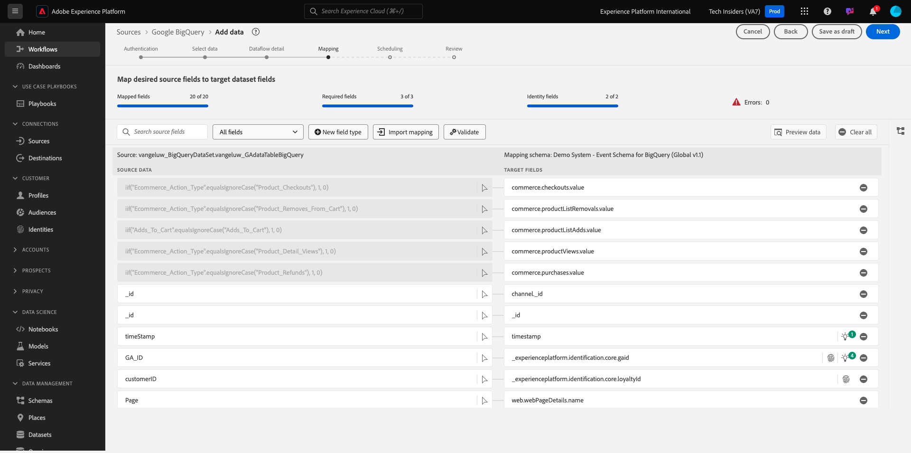

# 4.2.4 BigQuery에서 Adobe Experience Platform으로 데이터 로드

## 목표

- BigQuery 데이터를 XDM 스키마에 매핑
- Adobe Experience Platform에 BigQuery 데이터 로드
- BigQuery Source 커넥터 UI 이해하기

## 시작하기 전에

이전 연습 이후에는 Adobe Experience Platform에서 이 페이지를 열어야 합니다.

**열려 있는 경우 다음 연습을 계속합니다.**

**열려 있지 않으면 [Adobe Experience Platform](https://experience.adobe.com/platform/home).**(으)로 이동하세요.

왼쪽 메뉴에서 소스로 이동합니다. 그러면 **소스** 홈 페이지가 표시됩니다. **소스** 메뉴에서 **Google BigQuery** 소스 커넥터로 이동한 다음 **설정**&#x200B;을 클릭합니다.

그러면 Google BigQuery 계정 선택 화면이 표시됩니다. 계정을 선택하고 **다음**&#x200B;을 클릭하세요.

그러면 **데이터 선택** 화면이 표시됩니다.

## 4.2.4.1 BigQuery 테이블 선택

**데이터 선택** 화면에서 BigQuery 데이터 집합을 선택합니다. 이제 BigQuery에서 Google Analytics 데이터의 샘플 데이터 미리 보기를 볼 수 있습니다.

**다음**&#x200B;을 클릭합니다.

## 4.2.4.2 XDM 매핑

이제 다음이 표시됩니다.

이제 새 데이터 세트를 만들거나 기존 데이터 세트를 선택하여 Google Analytics 데이터를에 로드해야 합니다. 이 연습에서는 데이터 세트와 스키마를 이미 만들었습니다. 새 스키마나 데이터 세트를 만들 필요가 없습니다.

**기존 데이터 세트**&#x200B;을(를) 선택하십시오. 드롭다운 메뉴를 열어 데이터 세트를 선택합니다. 이름이 `Demo System - Event Dataset for BigQuery (Global v1.1)`인 데이터 집합을 검색하여 선택하십시오. **다음**&#x200B;을 클릭합니다.

아래로 스크롤합니다. 이제 모든 **Source 필드**&#x200B;를 Google Analytics/BigQuery에서 XDM **대상 필드**&#x200B;에 필드별로 매핑해야 합니다. 아래 매핑 연습을 통해 몇 가지 오류가 표시될 수 있습니다.

이 연습을 수행하려면 아래 매핑 테이블을 사용하십시오.

| 소스 필드 | 대상 필드 |
| ----------------- |-------------| 
| `_id` | `_id` |
| `_id` | 채널._ID |
| `timeStamp` | 타임스탬프 |
| `GA_ID` | ``--aepTenantId--``.identification.core.gaid |
| `customerID` | ``--aepTenantId--`` 질문에 답합니다. identification.core.crmId |
| `Page` | web.webPageDetails.name |
| `Device` | device.type |
| `Browser` | environment.browserDetails.vendor |
| `MarketingChannel` | marketing.trackingCode |
| `TrafficSource` | channel.typeAtSource |
| `TrafficMedium` | channel.mediaType |
| `TransactionID` | commerce.order.payments.transactionID |
| `Ecommerce_Action_Type` | eventType |
| `Pageviews` | web.webPageDetails.pageViews.value |

일부 필드의 경우 원래 매핑을 제거하고 **계산된 필드**&#x200B;에 대해 새 매핑을 만들어야 합니다.

| 계산된 필드 | 대상 필드 |
| ----------------- |-------------| 
| `iif(Unique_Purchases == null, 0, Unique_Purchases)` | commerce.purchases.value |
| `iif(Product_Detail_Views == null, 0, Product_Detail_Views)` | commerce.productViews.value |
| `iif(Adds_To_Cart == null, 0, Adds_To_Cart)` | commerce.productListAdds.value |
| `iif(Product_Removes_From_Cart == null, 0, Product_Removes_From_Cart), 1, 0)` | commerce.productListRemovals.value |
| `iif(Product_Checkouts == null, 0, Product_Checkouts)` | commerce.checkouts.value |

**계산된 필드**&#x200B;을(를) 만들려면 **+ 새 필드 형식**&#x200B;을(를) 클릭한 다음 **계산된 필드**&#x200B;을(를) 클릭합니다.

위의 규칙을 붙여넣고 위 표의 각 필드에 대해 **저장**&#x200B;을 클릭합니다.

이제 이와 같은 **매핑**&#x200B;이 있습니다.

소스 필드 **GA_ID** 및 **customerID**&#x200B;이(가) 이 XDM 스키마의 식별자에 매핑됩니다. 이를 통해 충성도 또는 콜 센터 데이터와 같은 다른 데이터 세트로 Google Analytics 데이터(웹/앱 동작 데이터)를 보강할 수 있습니다.

**다음**&#x200B;을 클릭합니다.

## 4.2.4.3 연결 및 데이터 수집 예약

이제 **예약** 탭이 표시됩니다.

**예약** 탭에서 이 **매핑** 및 데이터에 대한 데이터 수집 프로세스의 빈도를 정의할 수 있습니다.

새로 고쳐지지 않는 Google BigQuery의 데모 데이터를 사용하고 있으므로 이 연습에서는 일정을 설정할 필요가 없습니다. 선택해야 하며 쓸모없는 데이터 수집 프로세스가 너무 많지 않도록 빈도를 다음과 같이 설정해야 합니다.

- 빈도: **주**
- 간격: **200**
- 시작 시간: **다음 시간 내 임의 시간**

**중요**: **다시 채우기** 스위치를 활성화하십시오.

마지막으로 **delta** 필드를 정의해야 합니다.

**delta** 필드는 연결을 예약하고 BigQuery 데이터 집합에 들어오는 새 행만 업로드하는 데 사용됩니다. 델타 필드는 일반적으로 항상 타임스탬프 열입니다. 따라서 향후 예약된 데이터 수집의 경우 새로운 최신 타임스탬프가 있는 행만 수집됩니다.

델타 필드로 **timeStamp**&#x200B;을(를) 선택하십시오.
**다음**&#x200B;을 클릭합니다.

## 4.2.4.4 연결 검토 및 시작

이제 연결에 대한 자세한 개요를 볼 수 있습니다. XDM 매핑과 같은 일부 설정은 이후에 더 이상 변경할 수 없으므로 계속하기 전에 모든 설정이 올바른지 확인하십시오.

**마침을 클릭합니다**.

연결이 생성되면 다음과 같은 결과가 표시됩니다.

이제 Customer Journey Analytics을 사용하여 Google Analytics 데이터 위에 강력한 시각화를 구축하는 다음 연습을 계속할 준비가 되었습니다.

다음 단계: [4.2.5 Customer Journey Analytics을 사용하여 Google Analytics 데이터 분석](./ex5.md)

[모듈 4.2로 돌아가기](./customer-journey-analytics-bigquery-gcp.md)

[모든 모듈로 돌아가기](./../../../overview.md)
