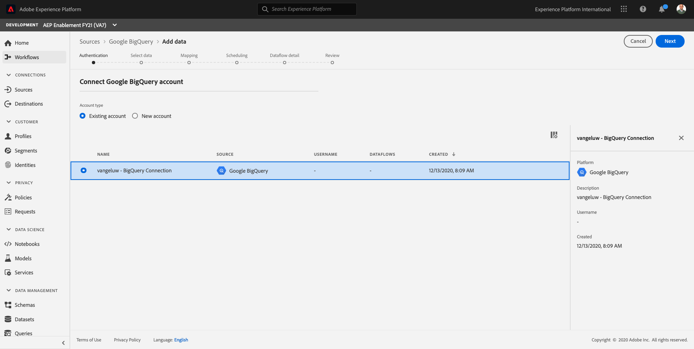
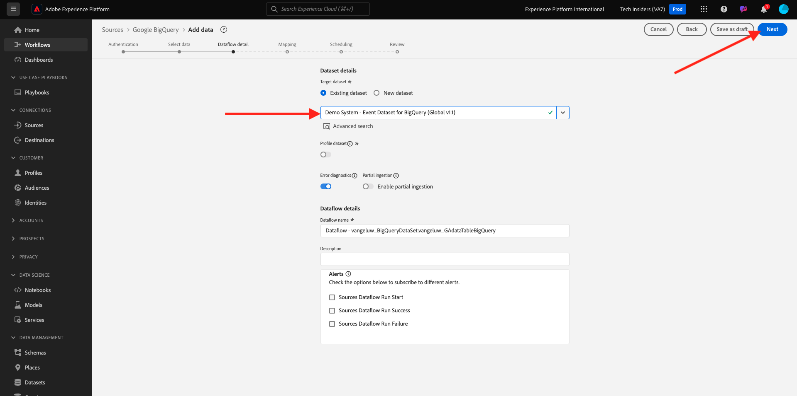

# 4.2.4 BigQuery에서 Adobe Experience Platform으로 데이터 로드

## 목표

- BigQuery 데이터를 XDM 스키마에 매핑
- Adobe Experience Platform에 BigQuery 데이터 로드
- BigQuery Source 커넥터 UI 이해하기

## 시작하기 전에

연습 문제 12.3 후에는 Adobe Experience Platform에서 이 페이지를 열어야 합니다.

**열려 있는 경우 연습 12.4.1을 계속하십시오.**

**열려 있지 않으면 [Adobe Experience Platform](https://experience.adobe.com/platform/home).**(으)로 이동하세요.

왼쪽 메뉴에서 소스로 이동합니다. 그러면 **소스** 홈 페이지가 표시됩니다. **소스** 메뉴에서 **데이터베이스**&#x200B;를 클릭합니다.

**Google BigQuery** Source 커넥터를 선택하고 **+ 구성**&#x200B;을 클릭합니다.

그러면 Google BigQuery 계정 선택 화면이 표시됩니다.

계정을 선택하고 **다음**&#x200B;을 클릭하세요.

그러면 **데이터 추가** 보기가 표시됩니다.

## 4.2.4.1 BigQuery 테이블 선택

**데이터 추가** 보기에서 BigQuery 데이터 세트를 선택합니다.

이제 BigQuery에서 Google Analytics 데이터의 샘플 데이터 미리 보기를 볼 수 있습니다.

**다음**&#x200B;을 클릭합니다.

## 4.2.4.2 XDM 매핑

이제 다음이 표시됩니다.

이제 새 데이터 세트를 만들거나 기존 데이터 세트를 선택하여 Google Analytics 데이터를에 로드해야 합니다. 이 연습에서는 데이터 세트와 스키마를 이미 만들었습니다. 새 스키마나 데이터 세트를 만들 필요가 없습니다.

**기존 데이터 세트**&#x200B;을(를) 선택하십시오. 드롭다운 메뉴를 열어 데이터 세트를 선택합니다. 이름이 `Demo System - Event Dataset for BigQuery (Global v1.1)`인 데이터 집합을 검색하여 선택하십시오. **다음**&#x200B;을 클릭합니다.

아래로 스크롤합니다. 이제 모든 **Source 필드**&#x200B;를 Google Analytics/BigQuery에서 XDM **대상 필드**&#x200B;에 필드별로 매핑해야 합니다.

이 연습을 수행하려면 아래 매핑 테이블을 사용하십시오.

| 소스 필드 | 대상 필드 |
| ----------------- |-------------| 
| **_id** | _ID |
| **_id** | 채널._ID |
| 타임스탬프 | 타임스탬프 |
| GA_ID | ``--aepTenantId--``.identification.core.gaid |
| customerID | ``--aepTenantId--``.identification.core.loyaltyId |
| 페이지 | web.webPageDetails.name |
| 디바이스 | device.type |
| 브라우저 | environment.browserDetails.vendor |
| MarketingChannel | marketing.trackingCode |
| TrafficSource | channel.typeAtSource |
| TrafficMedium | channel.mediaType |
| 거래 ID | commerce.order.payments.transactionID |
| Ecommerce_Action_Type | eventType |
| 페이지 보기 수 | web.webPageDetails.pageViews.value |
| Unique_Purchase | commerce.purchases.value |
| Product_Detail_Views | commerce.productViews.value |
| Adds_To_Cart | commerce.productListAdds.value |
| Product_Removes_From_Cart | commerce.productListRemovals.value |
| Product_Checkouts | commerce.checkouts.value |

위의 매핑을 복사하여 Adobe Experience Platform UI에 붙여넣은 후 오타 또는 선행/후행 공백으로 인해 오류가 표시되지 않는지 확인하십시오.

이제 다음과 같은 **매핑**&#x200B;이 있습니다.

소스 필드 **GA_ID** 및 **customerID**&#x200B;이(가) 이 XDM 스키마의 식별자에 매핑됩니다. 이를 통해 충성도 또는 콜 센터 데이터와 같은 다른 데이터 세트로 Google Analytics 데이터(웹/앱 동작 데이터)를 보강할 수 있습니다.

**다음**&#x200B;을 클릭합니다.

## 4.2.4.3 연결 및 데이터 수집 예약

이제 **예약** 탭이 표시됩니다.

**예약** 탭에서 이 **매핑** 및 데이터에 대한 데이터 수집 프로세스의 빈도를 정의할 수 있습니다.

새로 고쳐지지 않는 Google BigQuery의 데모 데이터를 사용하고 있으므로 이 연습에서는 일정을 설정할 필요가 없습니다. 선택해야 하며 쓸모없는 데이터 수집 프로세스가 너무 많지 않도록 빈도를 다음과 같이 설정해야 합니다.

- 빈도: **주**
- 간격: **200**

**중요**: **다시 채우기** 스위치를 활성화하십시오.

마지막으로 **delta** 필드를 정의해야 합니다.

**delta** 필드는 연결을 예약하고 BigQuery 데이터 집합에 들어오는 새 행만 업로드하는 데 사용됩니다. 델타 필드는 일반적으로 항상 타임스탬프 열입니다. 따라서 향후 예약된 데이터 수집의 경우 새로운 최신 타임스탬프가 있는 행만 수집됩니다.

델타 필드로 **timeStamp**&#x200B;을(를) 선택하십시오.

이제 이걸 가지셨네요.

**다음**&#x200B;을 클릭합니다.

## 4.2.4.4 연결 검토 및 시작

**데이터 집합 흐름 세부 정보** 보기에서. 연결의 이름을 지정해야 합니다. 이렇게 하면 나중에 찾을 수 있습니다.

이 명명 규칙을 사용하십시오.

| 필드 | 이름 지정 | 예 |
| ----------------- |-------------| -------------|
| 데이터 세트 흐름 이름 | DataFlow - ldap - BigQuery 웹 사이트 상호 작용 | DataFlow - vangeluw - BigQuery 웹 사이트 상호 작용 |
| 설명 | DataFlow - ldap - BigQuery 웹 사이트 상호 작용 | DataFlow - vangeluw - BigQuery 웹 사이트 상호 작용 |

**다음**&#x200B;을 클릭합니다.

이제 연결에 대한 자세한 개요를 볼 수 있습니다. XDM 매핑과 같은 일부 설정은 이후에 더 이상 변경할 수 없으므로 계속하기 전에 모든 설정이 올바른지 확인하십시오.

**마침을 클릭합니다**.

연결을 설정하는 데 다소 시간이 걸릴 수 있으므로 다음과 같은 경우에는 걱정하지 마십시오.

연결이 생성되면 다음과 같은 결과가 표시됩니다.

이제 Customer Journey Analytics을 사용하여 Google Analytics 데이터 위에 강력한 시각화를 구축하는 다음 연습을 계속할 준비가 되었습니다.

다음 단계: [4.2.5 Customer Journey Analytics을 사용하여 Google Analytics 데이터 분석](./ex5.md)

[모듈 4.2로 돌아가기](./customer-journey-analytics-bigquery-gcp.md)

[모든 모듈로 돌아가기](./../../../overview.md)
