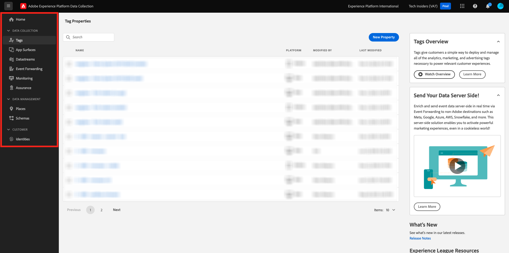

# 1.1.1 Adobe Experience Platform 데이터 수집 이해

## 컨텍스트

Adobe Experience Platform 데이터 수집은 여러 사용 사례에 브랜드에서 사용됩니다. 관련 고객 환경을 향상하는 데 필요한 모든 분석, 마케팅 및 광고 솔루션을 배포하고 관리하는 간단한 방법을 고객에게 제공하는 차세대 Tag Management 시스템(TMS)입니다. Adobe Experience Platform 데이터 수집에 대한 추가 요금은 없으며 모든 Adobe Experience Cloud 고객이 사용할 수 있습니다. 브랜드는 Adobe Experience Platform 데이터 수집을 사용하여 다음을 수행할 수 있습니다.

- Adobe Experience Platform은 물론 Adobe Experience Cloud 애플리케이션도 구현합니다.
- 관리할 고유한 **속성**&#x200B;을(를) 각 사용자에게 제공하여 조직의 여러 부분에 대한 다양한 요구 사항을 관리하십시오.
- 테스트 및 라이프사이클 관리를 허용합니다.
- 사용자 지정 Javascript 및 타사 태그를 삽입하며, 모두 한 곳에서 관리됩니다.

## UI 살펴보기

[Adobe Experience Platform 데이터 수집](https://experience.adobe.com/#/data-collection/)(으)로 이동합니다.

**태그**&#x200B;로 이동합니다. 이제 **[!UICONTROL 속성]** 보기가 표시됩니다. 여기에 나열된 속성은 튜토리얼 관리를 위한 것입니다. 다음 속성은 다음을 나타냅니다.

- 앱 및 웹 속성
- 다양한 웹 사이트가 다양한 방식으로 고객에게 제공됩니다. 예를 들어 Luma Retail에는 하나의 속성이 있고 Luma Travel에는 다른 속성이 있습니다
- 기존 및 현재 웹 사이트
- 서로 다른 여러 웹 사이트에 공통되는 특정 Adobe Analytics 디자인
- 외부 사이트와 함께 내부 인트라넷 페이지

이제 왼쪽 레일을 보세요.

- **[!UICONTROL 태그]**&#x200B;에서는 모든 클라이언트측 속성에 대한 개요를 제공합니다
- **[!UICONTROL 앱 표면]**&#x200B;은(는) 푸시 알림(Project Sierra와 함께 사용/사용)을 사용하도록 설정하는 모든 앱 구성에 대한 개요를 제공합니다.
- **[!UICONTROL 데이터스트림]**&#x200B;은(는) [다음 연습](./ex2.md)에서 탐색됩니다.
- **[!UICONTROL 이벤트 전달]**&#x200B;은(는) [모듈 2.5 - Real-Time CDP 연결: 이벤트 전달](./../../../modules/rtcdp-b2c/module2.5/aep-data-collection-ssf.md)에서 탐색된 모든 서버측 속성에 대한 개요를 제공합니다.
- **[!UICONTROL 모니터링]**&#x200B;은(는) 이벤트 전달을 통해 들어오는 이벤트 트래픽과 나가는 이벤트 트래픽에 대한 개요를 제공합니다
- **[!UICONTROL Assurance]**&#x200B;은(는) Adobe Debugger을 사용하여 구현을 디버깅하기 위한 액세스 권한을 제공합니다.
- **[!UICONTROL 위치]**&#x200B;에서는 모바일 애플리케이션에서 위치 기반 개인화에 액세스할 수 있는 POI를 관리할 수 있는 액세스 권한을 제공합니다
- **[!UICONTROL 스키마]**&#x200B;에서 Adobe Experience Platform의 스키마 편집기에 액세스할 수 있습니다.
- **[!UICONTROL ID]**&#x200B;에서 Adobe Experience Platform의 ID 그래프 설정에 액세스할 수 있습니다.

## 추가 정보

Adobe Experience Platform 데이터 수집은 Adobe Experience Platform 자습서 이상의 범위를 갖는 매우 고급 도구입니다. 조직은 태그 관리 기능에 Adobe Experience Platform 데이터 수집을 사용하지 않고, 대신 코드를 삽입하고 태그를 관리하는 Adobe 이외의 태그 관리 솔루션을 사용할 수 있습니다. Adobe 및 Adobe Professional Services에서는 비 Adobe 태그 관리 솔루션 사용이 지원됩니다.
Adobe Experience Platform 데이터 수집을 이해하는 데 관심이 있는 사람들을 위한 몇 가지 추가 읽기가 아래에 포함되어 있습니다.

- [Adobe Experience Platform 데이터 수집 사용 안내서](https://experienceleague.adobe.com/docs/experience-platform/tags/home.html)
- [Web SDK 튜토리얼을 통해 Adobe Experience Cloud 구현](https://experienceleague.adobe.com/docs/platform-learn/implement-web-sdk/overview.html?lang=ko-KR)
- [사용자 권한 설정](https://experienceleague.adobe.com/docs/experience-platform/tags/admin/user-permissions.html)
- [API 설명서](https://developer.adobelaunch.com/api/)

다음 단계: [1.1.2 Edge Network, 데이터스트림 및 서버측 데이터 수집](./ex2.md)

[모듈 1.1로 돌아가기](./data-ingestion-launch-web-sdk.md)

[모든 모듈로 돌아가기](./../../../overview.md)
