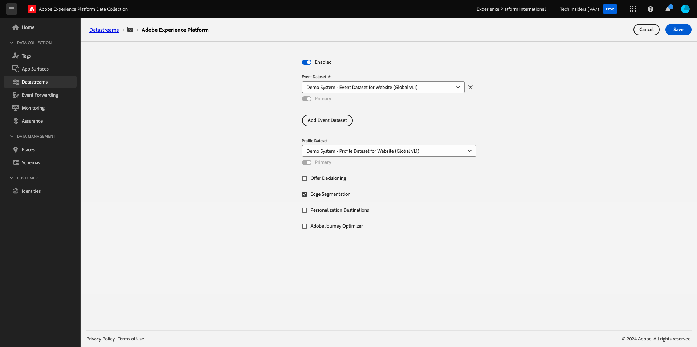

# 1.1.2 Edge Network, 데이터스트림 및 서버측 데이터 수집

## 컨텍스트

이 연습에서는 **데이터 스트림**&#x200B;을 만듭니다. **데이터스트림**&#x200B;은(는) Web SDK에서 데이터를 수집한 후 Adobe Edge 서버에 데이터를 보낼 위치를 알려줍니다. 예를 들어 데이터를 Adobe Experience Platform으로 전송하시겠습니까? Adobe Analytics? Adobe Audience Manager? Adobe Target?

데이터 스트림은 항상 Adobe Experience Platform 데이터 수집 사용자 인터페이스에서 관리되며, Web SDK를 사용하는 Adobe Experience Platform 데이터 수집에 중요합니다. Adobe이 아닌 태그 관리 솔루션으로 Web SDK를 구현하는 경우에도 Adobe Experience Platform 데이터 수집 사용자 인터페이스에서 데이터 스트림을 만들어야 합니다.

다음 연습에서는 브라우저에서 웹 SDK를 구현합니다. 그런 다음 수집 중인 데이터의 모습을 보다 명확하게 파악할 수 있습니다. 지금은 데이터 스트림을 통해 데이터를 전달할 위치를 알려줍니다.

## 데이터 스트림 만들기

[시작하기](./../../../modules/gettingstarted/gettingstarted/ex2.md)에서 이미 데이터 스트림을 만들었지만 데이터 스트림의 배경과 이유에 대해서는 설명하지 않았습니다.

satastream은 웹 SDK에서 데이터를 수집한 후 Adobe Edge 서버에 데이터를 보낼 위치를 알려줍니다. 예를 들어 데이터를 Adobe Experience Platform으로 전송하시겠습니까? Adobe Analytics? Adobe Audience Manager? Adobe Target? 데이터 스트림은 Adobe Experience Platform 데이터 수집 사용자 인터페이스에서 관리되며, Adobe Experience Platform 데이터 수집을 통해 Web SDK를 구현하는지 여부에 관계없이 Web SDK를 사용한 데이터 수집에 중요합니다.

**[!UICONTROL 데이터스트림]**&#x200B;을 검토해 보겠습니다.

[https://experience.adobe.com/launch/](https://experience.adobe.com/launch/)(으)로 이동합니다.

왼쪽 메뉴에서 **[!UICONTROL 데이터스트림]**&#x200B;을 클릭합니다.

이름이 `--aepUserLdap-- - Demo System Datastream`인 데이터 스트림을 엽니다.

그러면 데이터 스트림의 세부 사항이 표시됩니다.

**Adobe Experience Platform** 옆의 **..**&#x200B;을(를) 클릭하고 **편집**&#x200B;을(를) 클릭합니다.

그러면 이걸 보게 될 거야. 현재 Adobe Experience Platform만 활성화했습니다. 구성은 아래 구성과 유사합니다. (환경 및 Adobe Experience Platform 인스턴스에 따라 샌드박스 이름이 다를 수 있음)

아래 필드를 다음과 같이 해석해야 합니다.

이 데이터스트림의 경우...

- 수집된 모든 데이터는 Adobe Experience Platform의 `--aepSandboxName--` 샌드박스에 저장됩니다.
- 모든 경험 이벤트 데이터는 기본적으로 데이터 집합 **데모 시스템 - 웹 사이트에 대한 이벤트 데이터 집합(전역 v1.1)**&#x200B;에 수집됩니다.
- 모든 프로필 데이터는 기본적으로 데이터 세트 **데모 시스템 - 웹 사이트에 대한 프로필 데이터 세트(전역 v1.1)**&#x200B;에 수집됩니다(기본적으로 Web SDK를 사용한 프로필 데이터 수집은 현재 Web SDK에서 아직 지원되지 않음)
- 이 데이터 스트림에 **Offer decisioning** 응용 프로그램 서비스를 사용하려면 Offer decisioning 확인란을 선택해야 합니다. ([모듈 3.3](./../../../modules/ajo-b2c/module3.3/offer-decisioning.md)의 일부가 됩니다.)
- **Edge 세그멘테이션**&#x200B;은(는) 기본적으로 활성화되어 있습니다. 즉, 들어오는 트래픽이 수집되면 자격을 갖춘 대상이 에지에서 평가됩니다
- **Personalization 대상**&#x200B;을 사용하려면 Personalization 대상 확인란을 선택해야 합니다.
- 
   - 이 데이터 스트림에서 **Adobe Journey Optimizer**&#x200B;의 기능을 사용하려면 Adobe Journey Optimizer 확인란을 선택해야 합니다.

지금은 데이터 스트림에 다른 구성이 필요하지 않습니다.

다음 단계: [1.1.3 Adobe Experience Platform 데이터 수집 소개](./ex3.md)

[모듈 1.1로 돌아가기](./data-ingestion-launch-web-sdk.md)

[모든 모듈로 돌아가기](./../../../overview.md)
