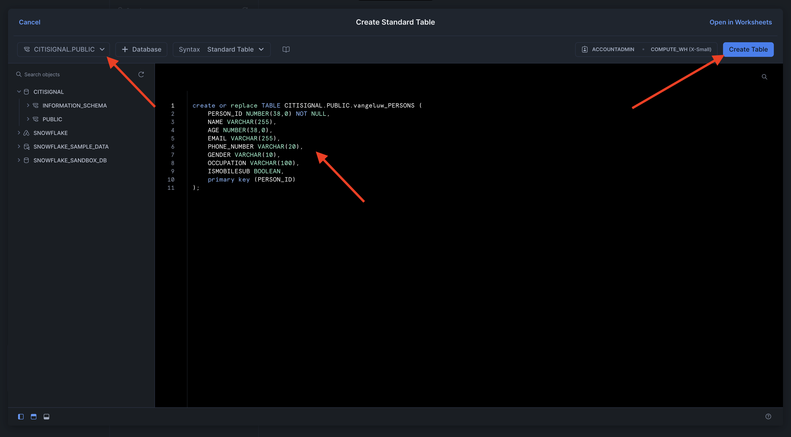
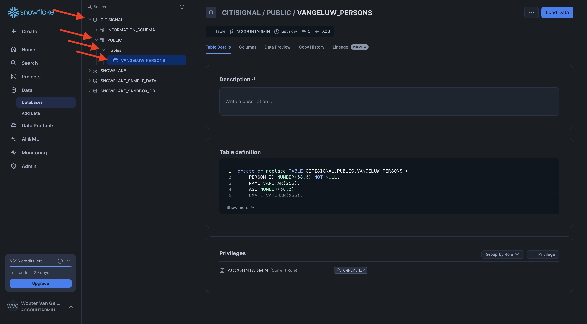

# 1.3.1 Snowflake 환경 설정

## 1.3.1.1 계정 만들기

[https://snowflake.com](https://snowflake.com)(으)로 이동합니다. **무료로 시작**&#x200B;을 클릭하세요.


세부 정보를 입력하고 **계속**&#x200B;을 클릭하세요.


세부 정보를 입력하고 클라우드 공급자를 선택한 다음 **시작하기**&#x200B;를 클릭합니다.


세부 정보를 입력하거나 **건너뛰기**(x2)를 클릭합니다.


그러면 이걸 보게 될 거야. 이메일을 확인하고 보낸 확인 이메일을 클릭합니다.


확인 이메일의 링크를 클릭하여 계정을 활성화하고 사용자 이름과 암호를 정의합니다. **시작하기**&#x200B;를 클릭합니다. 다음 연습에서는 이 사용자 이름과 암호를 사용해야 합니다.


그러면 Snowflake에 로그인됩니다. **지금 건너뛰기**&#x200B;를 클릭합니다.


## 1.3.1.2 데이터베이스 만들기

**데이터 > 데이터베이스**(으)로 이동합니다. **+ 데이터베이스**&#x200B;을(를) 클릭합니다.


데이터베이스에 **CITISIGNAL** 이름을 사용하십시오. **만들기**&#x200B;를 클릭합니다.


## 1.3.1.3 표 만들기

이제 Snowflake에서 표 만들기를 시작할 수 있습니다. 아래에 표를 만들기 위해 실행할 스크립트가 있습니다.

### 테이블 CK_PERSONS

**+ 만들기**&#x200B;를 클릭한 다음 **테이블**&#x200B;을 클릭한 다음 **표준**&#x200B;을 클릭합니다.


그러면 이걸 보게 될 거야. 아래 쿼리를 복사하여 Snowflake에 붙여넣습니다. 테이블을 만들기 전에 화면의 왼쪽 상단 모서리에서 **CITISIGNAL** 데이터베이스를 선택해야 합니다.

```sql
create or replace TABLE CITISIGNAL.PUBLIC.CK_PERSONS (
	PERSON_ID NUMBER(38,0) NOT NULL,
	NAME VARCHAR(255),
	AGE NUMBER(38,0),
	EMAIL VARCHAR(255),
	PHONE_NUMBER VARCHAR(20),
	GENDER VARCHAR(10),
	OCCUPATION VARCHAR(100),
	ISATTMOBILESUB BOOLEAN,
	primary key (PERSON_ID)
);
```

**테이블 만들기**&#x200B;를 클릭합니다.



스크립트가 실행되면 **데이터베이스 > CITISIGNAL > PUBLIC**&#x200B;에서 테이블을 찾을 수 있습니다.



### 테이블 CK_POPULATIONS

**+ 만들기**&#x200B;를 클릭한 다음 **테이블**&#x200B;을 클릭한 다음 **표준**&#x200B;을 클릭합니다.


그러면 이걸 보게 될 거야. 아래 쿼리를 복사하여 Snowflake에 붙여넣습니다. 테이블을 만들기 전에 화면의 왼쪽 상단 모서리에서 **CITISIGNAL** 데이터베이스를 선택해야 합니다.

```sql
create or replace TABLE CITISIGNAL.PUBLIC.CK_HOUSEHOLDS (
	HOUSEHOLD_ID NUMBER(38,0) NOT NULL,
	ADDRESS VARCHAR(255),
	CITY VARCHAR(100),
	STATE VARCHAR(50),
	POSTAL_CODE VARCHAR(20),
	COUNTRY VARCHAR(100),
	ISELIGIBLEFORFIBER BOOLEAN,
	PRIMARY_PERSON_ID NUMBER(38,0),
	ISFIBREENABLED BOOLEAN,
	primary key (HOUSEHOLD_ID)
);
```

**테이블 만들기**&#x200B;를 클릭합니다.


스크립트가 실행되면 **데이터베이스 > CITISIGNAL > PUBLIC**&#x200B;에서 테이블을 찾을 수 있습니다.


### 테이블 사용자(_U)

**+ 만들기**&#x200B;를 클릭한 다음 **테이블**&#x200B;을 클릭한 다음 **표준**&#x200B;을 클릭합니다.


그러면 이걸 보게 될 거야. 아래 쿼리를 복사하여 Snowflake에 붙여넣습니다. 테이블을 만들기 전에 화면의 왼쪽 상단 모서리에서 **CITISIGNAL** 데이터베이스를 선택해야 합니다.

```sql
create or replace TABLE CITISIGNAL.PUBLIC.CK_USERS (
	USER_ID NUMBER(38,0) NOT NULL,
	PERSON_ID NUMBER(38,0),
	HOUSEHOLD_ID NUMBER(38,0),
	primary key (USER_ID),
	foreign key (PERSON_ID) references CITISIGNAL.PUBLIC.CK_PERSONS(PERSON_ID),
	foreign key (HOUSEHOLD_ID) references CITISIGNAL.PUBLIC.CK_HOUSEHOLDS(HOUSEHOLD_ID)
);
```

**테이블 만들기**&#x200B;를 클릭합니다.


스크립트가 실행되면 **데이터베이스 > CITISIGNAL > PUBLIC**&#x200B;에서 테이블을 찾을 수 있습니다.


### 테이블 CK_MONTHLY_DATA_USAGE

**+ 만들기**&#x200B;를 클릭한 다음 **테이블**&#x200B;을 클릭한 다음 **표준**&#x200B;을 클릭합니다.


그러면 이걸 보게 될 거야. 아래 쿼리를 복사하여 Snowflake에 붙여넣습니다. 테이블을 만들기 전에 화면의 왼쪽 상단 모서리에서 **CITISIGNAL** 데이터베이스를 선택해야 합니다.

```sql
create or replace TABLE CITISIGNAL.PUBLIC.CK_MONTHLY_DATA_USAGE (
	USAGE_ID NUMBER(38,0) NOT NULL autoincrement start 1 increment 1 noorder,
	USER_ID NUMBER(38,0),
	MONTH DATE,
	DATA_USAGE_GB NUMBER(10,2),
	primary key (USAGE_ID)
);
```

**테이블 만들기**&#x200B;를 클릭합니다.


스크립트가 실행되면 **데이터베이스 > CITISIGNAL > PUBLIC**&#x200B;에서 테이블을 찾을 수 있습니다.


### 테이블 CK_MOBILE_DATA_USAGE

**+ 만들기**&#x200B;를 클릭한 다음 **테이블**&#x200B;을 클릭한 다음 **표준**&#x200B;을 클릭합니다.


그러면 이걸 보게 될 거야. 아래 쿼리를 복사하여 Snowflake에 붙여넣습니다. 테이블을 만들기 전에 화면의 왼쪽 상단 모서리에서 **CITISIGNAL** 데이터베이스를 선택해야 합니다.


```sql
create or replace TABLE CITISIGNAL.PUBLIC.CK_MOBILE_DATA_USAGE (
	USAGE_ID NUMBER(38,0) NOT NULL autoincrement start 1 increment 1 noorder,
	USER_ID NUMBER(38,0),
	DATE DATE,
	TIME TIME(9),
	APP_NAME VARCHAR(255),
	DATA_USAGE_MB NUMBER(10,2),
	NETWORK_TYPE VARCHAR(50),
	DEVICE_TYPE VARCHAR(50),
	COUNTRY_CODE VARCHAR(10),
	primary key (USAGE_ID)
);
```

**테이블 만들기**&#x200B;를 클릭합니다.


스크립트가 실행되면 **데이터베이스 > CITISIGNAL > PUBLIC**&#x200B;에서 테이블을 찾을 수 있습니다.


이제 모든 테이블이 만들어집니다.


## 1.3.1.4 샘플 데이터 수집

이제 샘플 데이터를 데이터베이스로 로드할 수 있습니다.

...

이제 Snowflake에서 설정을 완료했습니다.


다음 단계: [1.3.2 스키마, 데이터 모델 및 링크 만들기](./ex2.md)

[모듈 1.3으로 돌아가기](./fac.md)

[모든 모듈로 돌아가기](../../../overview.md)
