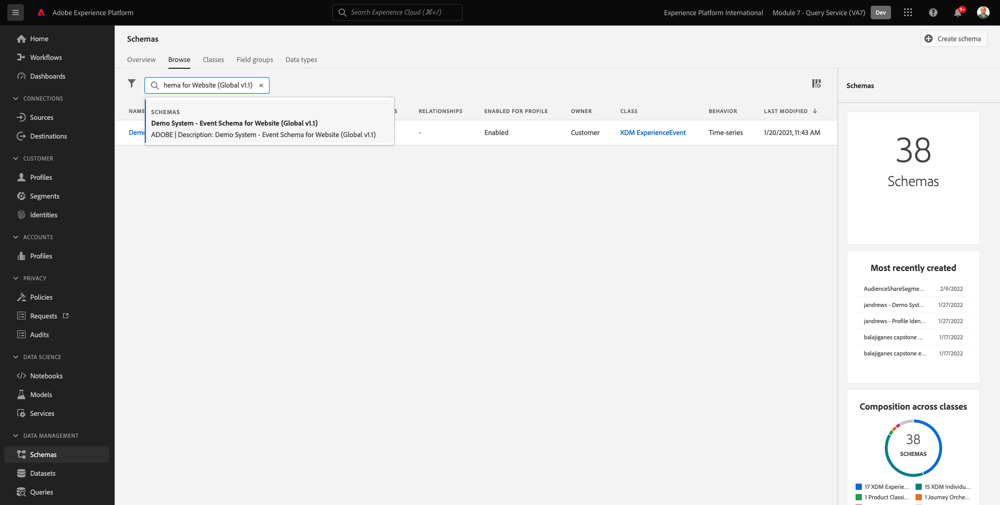

# 5.1.2 쿼리 서비스 사용

## 목표

- 데이터 세트 찾기 및 탐색
- 쿼리에서 Experience Data Models 개체 및 속성을 처리하는 방법에 대해 알아봅니다

## 컨텍스트

여기에서는 PSQL을 사용하여 사용 가능한 데이터 세트에 대한 정보를 검색하는 방법, XDM(Experience Data Model)에 대한 쿼리를 작성하는 방법, 쿼리 서비스 및 Citi 신호 데이터 세트를 사용하여 첫 번째 간단한 보고 쿼리를 작성하는 방법에 대해 알아봅니다.

## 5.1.2.1 기본 쿼리

여기에서는 사용 가능한 데이터 세트에 대한 정보를 검색하는 방법과 XDM 데이터 세트에서 쿼리를 통해 데이터를 제대로 검색하는 방법에 대해 알아봅니다.

1 초에 Adobe Experience Platform을 통해 탐색한 모든 데이터 세트는 SQL 인터페이스를 통해 표로 액세스할 수도 있습니다. 이러한 테이블을 나열하려면 **테이블 표시;** 명령을 사용할 수 있습니다.

**PSQL 명령줄 인터페이스**&#x200B;에서 **테이블 표시;**&#x200B;를 실행하십시오. (세미콜론으로 명령을 종료하는 것을 잊지 마십시오.)

**테이블 표시;** 명령을 복사하여 프롬프트에 붙여넣습니다.


다음과 같은 결과가 표시됩니다.

```text
aepenablementfy21:all=> show tables;
                            name                            |        dataSetId         |                            dataSet                             | description | resolved 
------------------------------------------------------------+--------------------------+----------------------------------------------------------------+-------------+----------
 demo_system_event_dataset_for_call_center_global_v1_1      | 5fd1a9dea30603194baeea43 | Demo System - Event Dataset for Call Center (Global v1.1)      |             | false
 demo_system_event_dataset_for_mobile_app_global_v1_1       | 5fd1a9de250e4f194bec84cd | Demo System - Event Dataset for Mobile App (Global v1.1)       |             | false
 demo_system_event_dataset_for_voice_assistants_global_v1_1 | 5fd1a9de49ee76194b85f73c | Demo System - Event Dataset for Voice Assistants (Global v1.1) |             | false
 demo_system_event_dataset_for_website_global_v1_1          | 5fd1a9dee3224d194cdfe786 | Demo System - Event Dataset for Website (Global v1.1)          |             | false
 demo_system_profile_dataset_for_loyalty_global_v1_1        | 5fd1a9de250e4f194bec84cc | Demo System - Profile Dataset for Loyalty (Global v1.1)        |             | false
 demo_system_profile_dataset_for_ml_predictions_global_v1_1 | 5fd1a9de241f58194b0cb117 | Demo System - Profile Dataset for ML Predictions (Global v1.1) |             | false
 demo_system_profile_dataset_for_mobile_app_global_v1_1     | 5fd1a9deddf353194a2e00b7 | Demo System - Profile Dataset for Mobile App (Global v1.1)     |             | false
 demo_system_profile_dataset_for_website_global_v1_1        | 5fd1a9de42a61c194dd7b810 | Demo System - Profile Dataset for Website (Global v1.1)        |             | false
 journey_step_events                                        | 5fd1a7f30268c5194bbb7e5e | Journey Step Events                                            |             | false
```

콜론에서 스페이스바를 눌러 결과 집합의 다음 페이지를 보거나 `q`을(를) 입력하여 명령 프롬프트로 되돌립니다.

Platform의 모든 데이터 세트에는 해당 Query Service 테이블이 있습니다. 데이터 세트 ui를 통해 데이터 세트의 테이블을 찾을 수 있습니다.


`demo_system_event_dataset_for_website_global_v1_1` 테이블은 `Demo System - Event Schema for Website (Global v1.1)` 데이터 세트에 해당하는 쿼리 서비스 테이블입니다.

제품을 본 위치에 대한 일부 정보를 쿼리하려면 **지역** 정보를 선택합니다.

아래 문을 복사하여 **PSQL 명령줄 인터페이스**&#x200B;의 프롬프트에 붙여 넣은 다음 Enter 키를 누릅니다.

```sql
select placecontext.geo
from   demo_system_event_dataset_for_website_global_v1_1
where  eventType = 'commerce.productViews'
and placecontext.geo.countryCode <> ''
limit 1;
```

쿼리 결과에서 Experience Data Model(XDM) 열은 스칼라 유형뿐만 아니라 복잡한 유형일 수 있습니다. 위의 쿼리에서 **commerce.productViews**&#x200B;가 발생한 지리적 위치를 식별하려고 합니다. **commerce.productViews**&#x200B;를 식별하려면 **을(를) 사용하여 XDM 모델을 탐색해야 합니다.**(점) 표기법입니다.

```text
aepenablementfy21:all=> select placecontext.geo
aepenablementfy21:all-> from   demo_system_event_dataset_for_website_global_v1_1
aepenablementfy21:all-> where  eventType = 'commerce.productViews'
aepenablementfy21:all-> and placecontext.geo.countryCode <> ''
aepenablementfy21:all-> limit 1;
                  geo                   
----------------------------------------
 ("(57.4694803,-3.1269422)",Tullich,GB)
(1 row)
```

결과는 단일 값이 아닌 플랫 객체인 것을 알 수 있습니까? **placecontext.geo** 개체에는 스키마, 국가 및 도시의 네 가지 특성이 있습니다. 개체가 열로 선언되면 전체 개체가 문자열로 반환됩니다. XDM 스키마는 익숙한 스키마보다 더 복잡할 수 있지만 매우 강력하고 다양한 솔루션, 채널 및 사용 사례를 지원하도록 설계되었습니다.

개체의 개별 속성을 선택하려면 **을(를) 사용합니다.**(점) 표기법입니다.

아래 문을 복사하여 **PSQL 명령줄 인터페이스**&#x200B;의 프롬프트에 붙여 넣으십시오.

```sql
select placecontext.geo._schema.longitude
      ,placecontext.geo._schema.latitude
      ,placecontext.geo.city
      ,placecontext.geo.countryCode
from   demo_system_event_dataset_for_website_global_v1_1
where  eventType = 'commerce.productViews'
and placecontext.geo.countryCode <> ''
limit 1;
```

위의 쿼리 결과는 다음과 같아야 합니다.
이제 결과는 단순 값 집합입니다.

```text
aepenablementfy21:all=> select placecontext.geo._schema.longitude
aepenablementfy21:all->       ,placecontext.geo._schema.latitude
aepenablementfy21:all->       ,placecontext.geo.city
aepenablementfy21:all->       ,placecontext.geo.countryCode
aepenablementfy21:all-> from   demo_system_event_dataset_for_website_global_v1_1
aepenablementfy21:all-> where  eventType = 'commerce.productViews'
aepenablementfy21:all-> and placecontext.geo.countryCode <> ''
aepenablementfy21:all-> limit 1;
 longitude  |  latitude  |  city   | countrycode 
------------+------------+---------+-------------
 -3.1269422 | 57.4694803 | Tullich | GB
(1 row)
```

걱정하지 마십시오. 특정 속성에 대한 경로를 쉽게 얻을 수있는 방법이 있습니다. 다음 부분에서는 방법을 알아봅니다.

쿼리를 편집해야 하므로 먼저 편집기를 여십시오.

Windows

Windows 도구 모음에서 **검색** 아이콘을 클릭하고 **검색** 필드에 **메모장**&#x200B;을 입력한 다음 **메모장** 결과를 클릭합니다.


Mac에서

[대괄호](https://github.com/adobe/brackets/releases/download/release-1.14/Brackets.Release.1.14.dmg)를 설치하거나 텍스트 편집기를 설치하지 않은 경우 선택한 다른 텍스트 편집기를 사용하고 지침을 따르십시오. 설치 후 Mac의 Spotlight 검색을 통해 **Brackets**&#x200B;을(를) 검색하고 엽니다.

다음 문을 메모장이나 대괄호로 복사합니다.

```sql
select your_attribute_path_here
from   demo_system_event_dataset_for_website_global_v1_1
where  eventType = 'commerce.productViews'
and placecontext.geo.countryCode <> ''
limit 1;
```

Adobe Experience Platform UI로 돌아가거나(브라우저에서 열어야 함) [https://platform.adobe.com](https://platform.adobe.com)(으)로 이동합니다.

**스키마**&#x200B;을(를) 선택하고 **검색** 필드에 `Demo System - Event Schema for Website (Global v1.1)`을(를) 입력한 다음 목록에서 `Demo System - Event Schema for Website (Global v1.1) Schema`을(를) 선택하십시오.



개체를 클릭하여 **데모 시스템 - 웹 사이트에 대한 이벤트 스키마(전역 v1.1)**&#x200B;의 XDM 모델을 탐색합니다. **placecontext**, **geo** 및 **schema**&#x200B;에 대한 트리를 확장합니다. 실제 특성 **경도**&#x200B;을(를) 선택하면 강조 표시된 빨간색 상자에 전체 경로가 표시됩니다. 속성의 경로를 복사하려면 경로 복사 아이콘을 클릭합니다.


메모장/대괄호로 전환하고 첫 줄에서 **your_attribute_path_here**&#x200B;을(를) 제거하십시오. 첫 번째 줄의 **select** 뒤에 커서를 놓고 붙여넣습니다(CTRL-V).

메모장/대괄호에서 수정된 문을 복사하여 **PSQL 명령줄 인터페이스**&#x200B;의 프롬프트에 붙여 넣은 다음 Enter 키를 누릅니다.

결과는 다음과 같아야 합니다.

```text
aepenablementfy21:all=> select placeContext.geo._schema.longitude
aepenablementfy21:all-> from   demo_system_event_dataset_for_website_global_v1_1
aepenablementfy21:all-> where  eventType = 'commerce.productViews'
aepenablementfy21:all-> and placecontext.geo.countryCode <> ''
aepenablementfy21:all-> limit 1;
 longitude  
------------
 -3.1269422
```

다음 단계: [5.1.3 쿼리, 쿼리, 쿼리... 및 이탈 분석](./ex3.md)

[모듈 5.1로 돌아가기](./query-service.md)

[모든 모듈로 돌아가기](../../../overview.md)
