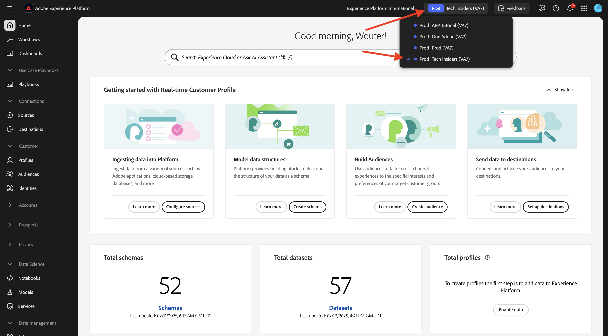
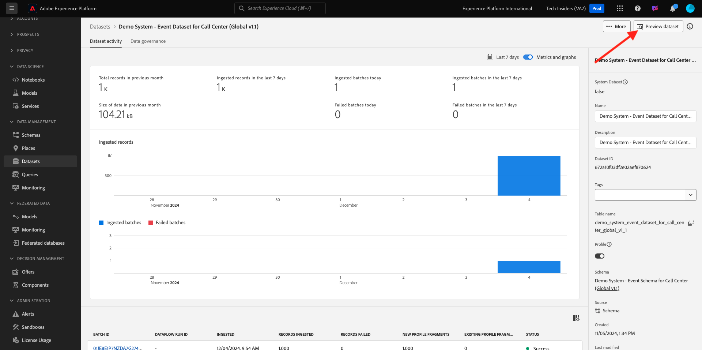
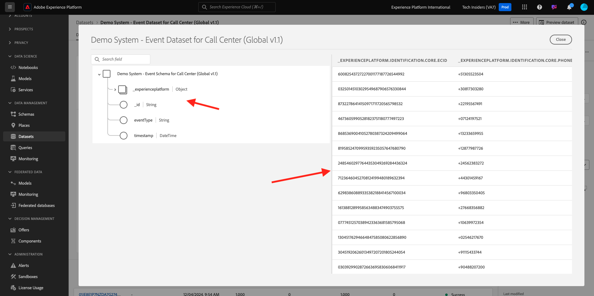
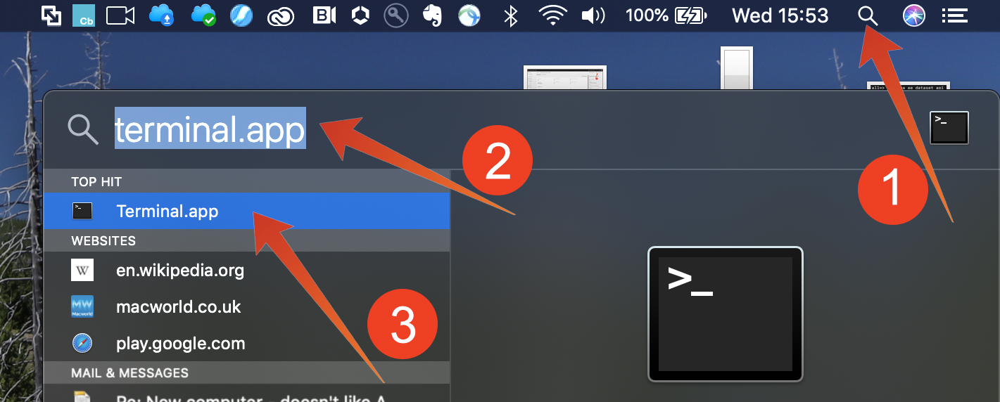

# 5.1.2 시작

## Adobe Experience Platform UI 익히기

[Adobe Experience Platform](https://experience.adobe.com/platform)(으)로 이동합니다. 로그인하면 Adobe Experience Platform 홈페이지에 접속하게 됩니다.

계속하려면 **샌드박스**&#x200B;를 선택해야 합니다. 선택할 샌드박스 이름이 ``--aepSandboxName--``입니다. 적절한 [!UICONTROL 샌드박스]를 선택하면 화면이 변경되고 이제 전용 [!UICONTROL 샌드박스]에 있게 됩니다.

## 플랫폼에서 데이터 탐색

다른 채널에서 데이터를 가져오는 것은 모든 브랜드에 어려운 작업입니다. 또한 이 연습에서는 Citi Signal 고객이 웹 사이트, 모바일 앱에서 Citi Signal과 소통하고 있으며 구매 데이터는 Citi Signal의 판매 지점 시스템에서 수집되고 CRM 및 로열티 데이터가 있습니다. Citi Signal은 Adobe Analytics 및 Adobe Launch를 사용하여 웹 사이트, 모바일 앱 및 POS 시스템 전반에서 데이터를 캡처하므로 이 데이터가 이미 Adobe Experience Platform으로 흘러 들어가고 있습니다. Adobe Experience Platform에 이미 존재하는 Citi Signal의 모든 데이터를 살펴보는 것부터 시작하겠습니다.

왼쪽 메뉴에서 **데이터 세트**(으)로 이동합니다.

Citi Signal에서 Adobe Experience Platform으로 데이터를 스트리밍하고 있으며 이 데이터는 `Demo System - Event Dataset for Website (Global v1.1)` 데이터 집합에서 사용할 수 있습니다. `Demo System - Event Dataset for Website` 검색

Citi Signal의 Callcenter 상호 작용 데이터가 `Demo System - Event Dataset for Call Center (Global v1.1)` 데이터 집합에 캡처됩니다. 검색 상자에서 `Demo System - Event Dataset for Call Center` 데이터를 검색합니다. 데이터 세트 이름을 클릭하여 엽니다.

데이터 세트를 클릭하면 수집된 일괄 처리 및 실패한 일괄 처리와 같은 데이터 세트 활동에 대한 개요를 볼 수 있습니다. `Demo System - Event Dataset for Call Center (Global v1.1)` 데이터 집합에 저장된 데이터 샘플을 보려면 **데이터 집합 미리 보기**&#x200B;를 클릭하십시오.

왼쪽 패널에 이 데이터 세트에 대한 스키마 구조가 표시되며, 오른쪽에는 수집된 데이터 샘플이 표시됩니다.

**닫기**&#x200B;를 클릭하여 **데이터 집합 미리 보기** 창을 닫습니다.

## 쿼리 서비스 소개

쿼리 서비스는 왼쪽 메뉴에서 **쿼리**&#x200B;를 클릭하여 액세스합니다.

**로그**(으)로 이동하면 이 조직에서 실행된 모든 쿼리의 목록을 맨 위에 제공하는 [쿼리 목록] 페이지가 표시됩니다.

목록에서 SQL 쿼리를 클릭하고 오른쪽 레일에 제공된 세부 정보를 확인합니다.

창을 스크롤하여 전체 쿼리를 보거나 아래에 강조 표시된 아이콘을 클릭하여 전체 쿼리를 메모장에 복사할 수 있습니다. 지금은 쿼리를 복사할 필요가 없습니다.

실행된 쿼리를 볼 수만 없고, 이 사용자 인터페이스를 사용하면 쿼리에서 새 데이터 세트를 만들 수 있습니다. 이러한 데이터 세트는 Adobe Experience Platform의 실시간 고객 프로필에 연결하거나 Adobe Experience Platform Data Science Workspace에 대한 입력으로 사용할 수 있습니다.

## PSQL 클라이언트를 쿼리 서비스에 연결

쿼리 서비스는 PostgreSQL용 드라이버가 있는 클라이언트를 지원합니다. 여기서는 명령줄 인터페이스인 PSQL과 Power BI 또는 Tableau를 사용합니다. PSQL에 연결합니다.

**자격 증명**&#x200B;을 클릭합니다.

아래 화면이 표시됩니다. 이 화면에서는 쿼리 서비스에 인증하기 위한 서버 정보 및 자격 증명을 제공합니다. 지금은 PSQL에 대한 connect 명령이 포함된 화면 오른쪽에 초점을 맞춥니다. 복사 버튼을 클릭하여 명령을 클립보드에 복사합니다.

Windows의 경우: Windows 키를 누르고 cmd를 입력한 다음 명령 프롬프트 결과를 클릭하여 명령줄을 엽니다.

macOS의 경우: spotlight 검색을 통해 terminal.app을 엽니다.

쿼리 서비스 UI에서 복사한 connect 명령을 붙여넣고 명령 프롬프트 창에서 enter 키를 누릅니다.

Windows:

MacOS:

이제 PSQL을 사용하여 쿼리 서비스에 연결되어 있습니다.

다음 연습에서는 이 창과 상당한 상호 작용이 있을 것입니다. **PSQL 명령줄 인터페이스**(으)로 참조됩니다.

이제 쿼리 제출을 시작할 준비가 되었습니다.

다음 단계: [5.1.3 쿼리 서비스 사용](./ex3.md)

[모듈 5.1로 돌아가기](./query-service.md)

[모든 모듈로 돌아가기](../../../overview.md)
