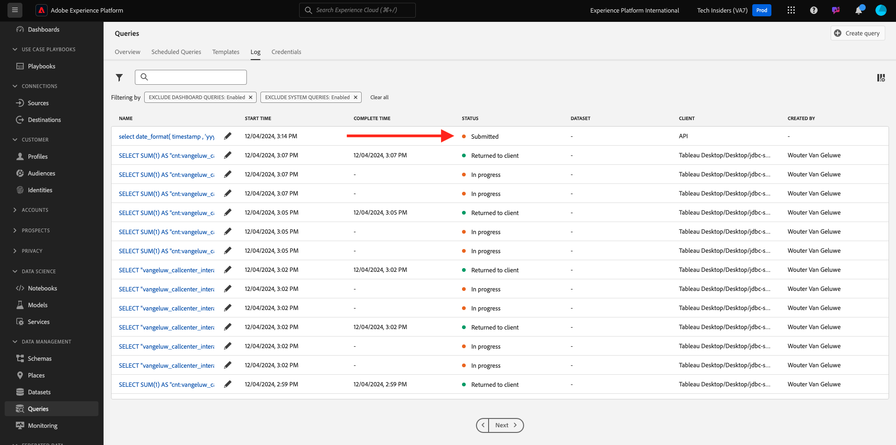

# 5.1.8 쿼리 서비스 API

## 목표

- 쿼리 템플릿 및 쿼리 일정을 관리하려면 쿼리 서비스 API를 사용하십시오

## 컨텍스트

이 연습에서는 API 호출을 실행하여 Postman 컬렉션을 사용하여 쿼리 템플릿 및 쿼리 일정을 관리합니다. 쿼리 템플릿을 정의하고 일반 쿼리 및 CTAS 쿼리를 실행합니다. **CTAS** 쿼리(select 쿼리로 테이블 만들기)는 결과 집합을 명시적 데이터 집합에 저장합니다. 일반 쿼리는 암시적(또는 시스템에서 생성한) 데이터 세트에 저장되지만 일반적으로 Parquet 파일 형식으로 내보내집니다.

## 설명서

- [Adobe Experience Platform 쿼리 서비스 도움말](https://experienceleague.adobe.com/docs/experience-platform/query/api/getting-started.html)
- [쿼리 서비스 API](https://www.adobe.io/apis/experienceplatform/home/api-reference.html#!acpdr/swagger-specs/qs-api.yaml)

## 쿼리 서비스 API

쿼리 서비스 API를 사용하면 Adobe Experience Platform 데이터 레이크에 대한 비대화형 쿼리를 관리할 수 있습니다.

비대화식 은 쿼리 실행 요청이 즉시 응답을 초래하지 않음을 의미합니다. 쿼리가 처리되고 결과 집합이 암시적 또는 명시적(CTAS: select로 테이블 만들기) 데이터 집합에 저장됩니다.

## 샘플 쿼리

샘플 쿼리로 [4.3 - 쿼리, 쿼리, 쿼리... 및 이탈 분석](./ex3.md)에 나열된 첫 번째 쿼리를 사용합니다.

하루에 몇 개의 제품 보기가 있습니까?

**SQL**

```sql
select date_format( timestamp , 'yyyy-MM-dd') AS Day,
       count(*) AS productViews
from   demo_system_event_dataset_for_website_global_v1_1
where  --aepTenantId--.demoEnvironment.brandName IN ('Citi Signal')
and eventType = 'commerce.productViews'
group by Day
limit 10;
```

## 쿼리

컴퓨터에서 Postman을 엽니다. 모듈 2.1의 일부로 Postman 환경을 만들고 Postman 컬렉션을 가져왔습니다. 아직 수행하지 않은 경우 [연습 2.1.3](./../../../modules/rtcdp-b2c/module2.1/ex3.md)의 지침을 따르십시오.

가져온 Postman 컬렉션의 일부로 **3 폴더가 표시됩니다. 쿼리 서비스**. 이 폴더가 표시되지 않으면 [Postman 컬렉션](./../../../assets/postman/postman_profile.zip)을 다시 다운로드하고 [연습 2.1.3](./../../../modules/rtcdp-b2c/module2.1/ex3.md)의 지침에 따라 Postman에서 해당 컬렉션을 다시 가져오십시오.


>[!NOTE]
>
>지금은 **1 폴더만 사용할 수 있습니다.** 쿼리에 요청이 포함되어 있습니다. 다른 요청은 레이어 단계에서 추가됩니다.

해당 폴더를 열고 쿼리 결과 세트를 실행, 모니터링 및 다운로드하기 위한 쿼리 서비스 API 호출에 대해 알아봅니다.

다음 페이로드를 사용하여 [/query/queries]에 대한 POST 호출이 쿼리 실행을 트리거합니다.

### 쿼리 만들기

**1.1 QS - 쿼리 만들기**&#x200B;라는 요청을 클릭하고 **헤더**(으)로 이동합니다. 그러면 다음과 같은 결과가 표시됩니다.


이 헤더 필드에 초점을 맞추겠습니다.

| 키 | 값 |
| ----------- | ----------- |
| x-sandbox-name | `--aepSandboxName--` |

>[!NOTE]
>
>사용 중인 Adobe Experience Platform 샌드박스의 이름을 지정해야 합니다. 헤더 필드 **x-sandbox-name**&#x200B;은(는) `--aepSandboxName--`이어야 합니다.

이 요청의 **본문** 섹션으로 이동하십시오. 이 요청의 **본문**&#x200B;에 다음이 표시됩니다.


```sql
{
    "name" : "ldap - QS API demo - Citi Signal - Product Views Per Day",
	"description": "ldap - QS API demo - Citi Signal - Product Views Per Day",
	"dbName": "--aepSandboxName--:all",
	"sql": "select date_format( timestamp , 'yyyy-MM-dd') AS Day, count(*) AS productViews from demo_system_event_dataset_for_website_global_v1_1 where --aepTenantId--.demoEnvironment.brandName IN ('Citi Signal') and eventType = 'commerce.productViews' group by Day limit 10"
}
```

주의: **ldap**&#x200B;을(를) 특정 **(aepUserLdap—**)로 바꾸어 아래 요청에서 변수 **name**&#x200B;을(를) 업데이트하십시오.

특정 **ldap**&#x200B;를 추가한 후에는 본문이 다음과 유사해야 합니다.

```json
{
    "name" : "vangeluw - QS API demo - Citi Signal - Product Views Per Day",
	"description": "vangeluw - QS API demo - Citi Signal - Product Views Per Day",
	"dbName": "tech-insiders:all",
	"sql": "select date_format( timestamp , 'yyyy-MM-dd') AS Day, count(*) AS productViews from demo_system_event_dataset_for_website_global_v1_1 where _experienceplatform.demoEnvironment.brandName IN ('Citi Signal') and eventType = 'commerce.productViews' group by Day limit 10"
}
```

>[!NOTE]
>
>위의 JSON 본문의 키 **dbName**&#x200B;은(는) Adobe Experience Platform 인스턴스에서 사용되는 샌드박스를 참조합니다. PROD 샌드박스를 사용하는 경우 dbName은 **prod:all**&#x200B;이어야 하고, **tech-insiders** 등의 다른 샌드박스를 사용하는 경우 dbName은 **tech-insiders:all**&#x200B;이어야 합니다.

그런 다음 파란색 **보내기** 단추를 클릭하여 세그먼트를 만들고 그 결과를 확인합니다.


성공하면 POST 요청이 다음 응답을 반환합니다.

```json
{
    "isInsertInto": false,
    "request": {
        "dbName": "module7:all",
        "sql": "select date_format( timestamp , 'yyyy-MM-dd') AS Day, count(*) AS productViews from demo_system_event_dataset_for_website_global_v1_1 where _experienceplatform.demoEnvironment.brandName IN ('Luma Telco', 'Citi Signal') and eventType = 'commerce.productViews' group by Day limit 10",
        "name": "vangeluw - QS API demo - Citi Signal - Product Views Per Day",
        "description": "vangeluw - QS API demo - Citi Signal - Product Views Per Day"
    },
    "clientId": "5a143b5ae4aa4631a1f3b09cd051333f",
    "state": "SUBMITTED",
    "rowCount": 0,
    "errors": [],
    "isCTAS": false,
    "version": 1,
    "id": "8f0d7f25-f7aa-493b-9792-290f884a7e5b",
    "elapsedTime": 0,
    "updated": "2021-01-20T13:23:13.951Z",
    "client": "API",
    "userId": "A3392DB95FFF08EE0A495E87@techacct.adobe.com",
    "created": "2021-01-20T13:23:13.951Z",
    "_links": {
        "self": {
            "href": "https://platform-va7.adobe.io/data/foundation/query/queries/8f0d7f25-f7aa-493b-9792-290f884a7e5b",
            "method": "GET"
        },
        "soft_delete": {
            "href": "https://platform-va7.adobe.io/data/foundation/query/queries/8f0d7f25-f7aa-493b-9792-290f884a7e5b",
            "method": "PATCH",
            "body": "{ \"op\": \"soft_delete\"}"
        },
        "cancel": {
            "href": "https://platform-va7.adobe.io/data/foundation/query/queries/8f0d7f25-f7aa-493b-9792-290f884a7e5b",
            "method": "PATCH",
            "body": "{ \"op\": \"cancel\"}"
        }
    }
}
```

쿼리의 현재 **상태**&#x200B;은(는) **제출됨**&#x200B;입니다. 실행되면 해당 상태는 **성공**&#x200B;이 됩니다.

Adobe Experience Platform UI를 통해 제출된 쿼리를 조회하고 [Adobe Experience Platform](https://experience.adobe.com/#/@experienceplatform/platform/home)을(를) 열고 **쿼리**, **로그**&#x200B;로 이동한 다음 쿼리를 선택할 수도 있습니다.



### 쿼리 가져오기

**1.2 QS - 쿼리 가져오기**&#x200B;라는 요청을 클릭하고 **헤더**(으)로 이동합니다. 그러면 다음과 같은 결과가 표시됩니다.


이 헤더 필드에 초점을 맞추겠습니다.

| 키 | 값 |
| ----------- | ----------- |
| x-sandbox-name | `--aepSandboxName--` |

>[!NOTE]
>
>사용 중인 Adobe Experience Platform 샌드박스의 이름을 지정해야 합니다. 헤더 필드 **x-sandbox-name**&#x200B;은(는) `--aepSandboxName--`이어야 합니다.

**매개 변수**(으)로 이동합니다. 그러면 다음과 같은 결과가 표시됩니다.


**orderby** 매개 변수를 사용하면 **created** 속성을 기반으로 정렬 순서를 지정할 수 있습니다. 만들어짐 앞에 **&#39;-&#39;** 기호가 있습니다. 즉, 쿼리 목록이 반환되는 순서는 만들어진 날짜를 **내림차순** 순서로 사용합니다. 쿼리는 목록의 맨 위에 있어야 합니다.

그런 다음 파란색 **보내기** 단추를 클릭하여 세그먼트를 만들고 그 결과를 확인합니다.


요청이 성공하면 아래 요청과 유사한 응답이 반환됩니다. 응답의 **상태**&#x200B;은(는) **제출됨**, **IN_PROGRESS** 또는 **성공**&#x200B;일 수 있습니다. 쿼리가 **SUCCESS** 상태가 될 때까지 몇 분 정도 걸릴 수 있습니다. **SUCCESS** 상태가 표시될 때까지 이 요청 전송을 여러 번 반복할 수 있습니다.

```json
{
    "queries": [
        {
            "isInsertInto": false,
            "sessionType": "HTTP_SESSION",
            "request": {
                "dbName": "tech-insiders:all",
                "sql": "select date_format( timestamp , 'yyyy-MM-dd') AS Day, count(*) AS productViews from demo_system_event_dataset_for_website_global_v1_1 where _experienceplatform.demoEnvironment.brandName IN ('Citi Signal') and eventType = 'commerce.productViews' group by Day limit 10",
                "name": "vangeluw - QS API demo - Citi Signal - Product Views Per Day",
                "description": "vangeluw - QS API demo - Citi Signal - Product Views Per Day"
            },
            "computeMetrics": null,
            "clientId": "b7d8a1fc396242889bb31dc83644e91d",
            "state": "IN_PROGRESS",
            "rowCount": 0,
            "isService": false,
            "errors": [],
            "isCTAS": false,
            "version": 1,
            "id": "a535234e-dc0c-42ea-bcad-eb09c5997d76",
            "elapsedTime": 8088,
            "updated": "2024-12-04T14:17:10.627Z",
            "client": "API",
            "effectiveSQL": "select date_format( timestamp , 'yyyy-MM-dd') AS Day, count(*) AS productViews from demo_system_event_dataset_for_website_global_v1_1 where _experienceplatform.demoEnvironment.brandName IN ('Citi Signal') and eventType = 'commerce.productViews' group by Day limit 10",
            "userId": "8CD31E54673C49EE0A495E05@techacct.adobe.com",
            "isParentLevel": true,
            "created": "2024-12-04T14:14:22.637Z",
                "version": 1,
    "_links": {
        "next": {
            "href": "https://platform-va7.adobe.io/data/foundation/query/queries?orderby=-created&start=2024-11-22T00:32:04.505Z"
        },
        "prev": {
            "href": "https://platform-va7.adobe.io/data/foundation/query/queries?orderby=-created&start=2024-12-04T14:14:22.637Z&isPrevLink=true"
        }
    }
}
```

상태가 **SUCCESS**&#x200B;인 경우 다음 요청을 계속 진행하십시오.

### 쿼리 상태 가져오기

이름이 **1.3 QS - 쿼리 상태 가져오기**&#x200B;인 요청을 클릭하고 **헤더**(으)로 이동합니다. 그러면 다음과 같은 결과가 표시됩니다.


이 헤더 필드에 초점을 맞추겠습니다.

| 키 | 값 |
| ----------- | ----------- |
| x-sandbox-name | `--aepSandboxName--` |

>[!NOTE]
>
>사용 중인 Adobe Experience Platform 샌드박스의 이름을 지정해야 합니다. 헤더 필드 **x-sandbox-name**&#x200B;은(는) `--aepSandboxName--`이어야 합니다.

그런 다음 파란색 **보내기** 단추를 클릭하여 세그먼트를 만들고 그 결과를 확인합니다.


요청이 성공하면 아래 요청과 유사한 응답이 반환됩니다.

```json
{
    "isInsertInto": false,
    "sessionType": "HTTP_SESSION",
    "request": {
        "dbName": "tech-insiders:all",
        "sql": "select date_format( timestamp , 'yyyy-MM-dd') AS Day, count(*) AS productViews from demo_system_event_dataset_for_website_global_v1_1 where _experienceplatform.demoEnvironment.brandName IN ('Citi Signal') and eventType = 'commerce.productViews' group by Day limit 10",
        "name": "vangeluw - QS API demo - Citi Signal - Product Views Per Day",
        "description": "vangeluw - QS API demo - Citi Signal - Product Views Per Day"
    },
    "computeMetrics": {
        "executorVMSeconds": 138,
        "clusterCpuSeconds": 3312,
        "clusterVMHours": 0.07666666805744171,
        "driverVMSeconds": 138,
        "clusterVMSeconds": 276
    },
    "clientId": "b7d8a1fc396242889bb31dc83644e91d",
    "state": "SUCCESS",
    "rowCount": 1,
    "isService": false,
    "errors": [],
    "isCTAS": false,
    "version": 1,
    "id": "a535234e-dc0c-42ea-bcad-eb09c5997d76",
    "elapsedTime": 199219,
    "updated": "2024-12-04T14:17:41.856Z",
    "client": "API",
    "effectiveSQL": "select date_format( timestamp , 'yyyy-MM-dd') AS Day, count(*) AS productViews from demo_system_event_dataset_for_website_global_v1_1 where _experienceplatform.demoEnvironment.brandName IN ('Citi Signal') and eventType = 'commerce.productViews' group by Day limit 10",
    "userId": "8CD31E54673C49EE0A495E05@techacct.adobe.com",
    "isParentLevel": true,
    "created": "2024-12-04T14:14:22.637Z",
    "_links": {
        "self": {
            "href": "https://platform-va7.adobe.io/data/foundation/query/queries/a535234e-dc0c-42ea-bcad-eb09c5997d76",
            "method": "GET"
        },
        "soft_delete": {
            "href": "https://platform-va7.adobe.io/data/foundation/query/queries/a535234e-dc0c-42ea-bcad-eb09c5997d76",
            "method": "PATCH",
            "body": "{ \"op\": \"soft_delete\"}"
        },
        "referenced_datasets": [
            {
                "id": "672a10b1074ceb2af0aa7034",
                "href": "https://platform-va7.adobe.io/data/foundation/catalog/dataSets/672a10b1074ceb2af0aa7034"
            }
        ]
    }
}
```

쿼리가 **SUCCESS** 상태에 도달하면 **rowCount** 속성을 통해 쿼리에서 검색한 행 수를 응답도 표시합니다. 이 예제에서 10개의 행은 쿼리에 의해 반환됩니다. 다음 섹션에서 10개의 행을 검색하는 방법을 살펴보겠습니다.

### 쿼리 결과 검색

위의 **SUCCESS** 응답에는 쿼리 결과를 저장하는 암시적 데이터 집합을 가리키는 **referenced_dataset** 속성이 포함되어 있습니다. 결과에 액세스하려면 해당 **href** 또는 **id** 속성을 사용합니다.

이름이 **1.4 QS - 쿼리 결과 가져오기**&#x200B;인 요청을 클릭하고 **헤더**(으)로 이동합니다. 그러면 다음과 같은 결과가 표시됩니다.


이 헤더 필드에 초점을 맞추겠습니다.

| 키 | 값 |
| ----------- | ----------- |
| x-sandbox-name | `--aepSandboxName--` |

>[!NOTE]
>
>사용 중인 Adobe Experience Platform 샌드박스의 이름을 지정해야 합니다. 헤더 필드 **x-sandbox-name**&#x200B;은(는) `--aepSandboxName--`이어야 합니다.

그런 다음 파란색 **보내기** 단추를 클릭하여 세그먼트를 만들고 그 결과를 확인합니다.


이 요청의 응답은 데이터 세트 파일을 가리킵니다.

```json
{
    "672a10b1074ceb2af0aa7034": {
        "name": "Demo System - Event Dataset for Website (Global v1.1)",
        "description": "Demo System - Event Dataset for Website (Global v1.1)",
        "enableErrorDiagnostics": false,
        "tags": {
            "adobe/siphon/partition/definition": [
                "day(timestamp, _ACP_DATE)",
                "identity(_ACP_BATCHID)"
            ],
            "adobe/siphon/meta": [
                "acpBufferedFlag::false"
            ],
            "aep/siphon/partitions": [
                "_ACP_DATE",
                "_ACP_BATCHID"
            ],
            "acp_granular_plugin_validation_flags": [
                "identity:enabled",
                "profile:disabled"
            ],
            "adobe/pqs/table": [
                "demo_system_event_dataset_for_website_global_v1_1"
            ],
            "acp_granular_validation_flags": [
                "requiredFieldCheck:enabled"
            ],
            "aep/siphon/cleanup/trash/timestamp": [
                "1733302532212"
            ],
            "acp_validationContext": [
                "enabled"
            ],
            "adobe/siphon/table/format": [
                "delta"
            ],
            "unifiedProfile": [
                "enabled:true",
                "enabledAt:2024-11-05 12:33:59"
            ],
            "aep/siphon/cleanup/meta/timestamp": [
                "1733302532287"
            ],
            "unifiedIdentity": [
                "enabled:true"
            ]
        },
        "state": "ACTIVE",
        "imsOrg": "907075E95BF479EC0A495C73@AdobeOrg",
        "sandboxId": "79e3c8b2-0609-4564-a3c8-b20609a5648c",
        "extensions": {
            "adobe_lakeHouse": {
                "metrics": {
                    "storageSize": 810709,
                    "rowCount": 1141,
                    "asOf": 1732494676514
                }
            },
            "adobe_unifiedProfile": {}
        },
        "version": "1.0.21",
        "created": 1730810034023,
        "updated": 1733302532348,
        "createdClient": "d75039d36ca543c78612f7aac18e6c2b",
        "createdUser": "53FB1E5E66CDC87D0A495FC0@techacct.adobe.com",
        "updatedUser": "acp_foundation_dataTracker@AdobeID",
        "classification": {
            "dataBehavior": "time-series",
            "managedBy": "CUSTOMER"
        },
        "viewId": "672a10b2074ceb2af0aa7035",
        "fileDescription": {
            "format": "parquet"
        },
        "files": "@/dataSetFiles?dataSetId=672a10b1074ceb2af0aa7034",
        "schemaRef": {
            "id": "https://ns.adobe.com/experienceplatform/schemas/d9b88a044ad96154637965a97ed63c7b20bdf2ab3b4f642e",
            "contentType": "application/vnd.adobe.xed-full+json;version=1"
        }
    }
}
```

다음 단계: [요약 및 이점](./summary.md)

[모듈 5.1로 돌아가기](./query-service.md)

[모든 모듈로 돌아가기](../../../overview.md)
