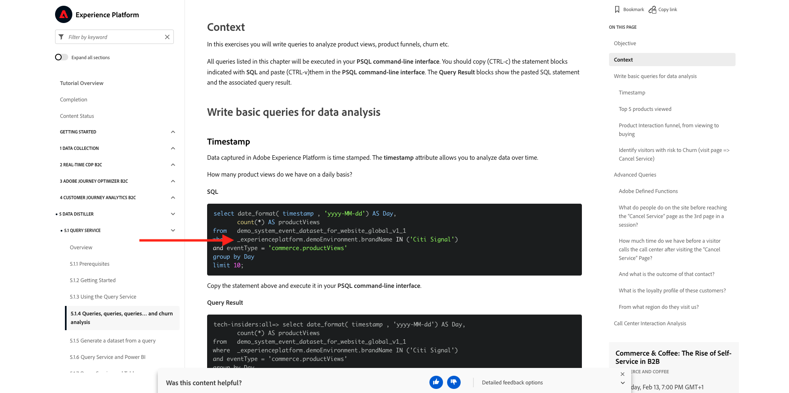

# 0.1 Experience League 설명서용 Chrome 확장 설치

## 0.1.1 Chrome 확장을 만드는 이유는 무엇입니까?

모든 Adobe Experience Platform 인스턴스를 사용하여 누구나 쉽게 재사용할 수 있도록 설명서가 일반화되었습니다.
설명서를 재사용할 수 있게 함으로써 **환경 변수**&#x200B;이 설명서에 도입되었습니다. 즉, 설명서에서 아래 **키**&#x200B;를 찾을 수 있습니다. 모든 키는 특정 환경에 대한 특정 변수이며, Chrome 확장은 해당 변수를 자동으로 변경하므로 자습서 페이지에서 코드와 텍스트를 복사하여 자습서의 일부로 사용할 다양한 사용자 인터페이스에 쉽게 붙여넣을 수 있습니다.

이러한 값의 예는 아래에서 찾을 수 있습니다. 현재 이러한 값을 사용할 수 없지만 Chrome 확장을 설치하고 활성화하면 이러한 변수가 복사하고 다시 사용할 수 있는 &#39;일반&#39; 텍스트로 변경됩니다.

| 이름 | 키 |
|:-------------:| :---------------:|
| AEP IMS 조직 ID | `--aepImsOrgId--` |
| AEP 테넌트 ID | `--aepTenantId--` |
| DCS 입구 ID | `--dcsInletId--` |
| 데모 프로필 LDAP | `--demoProfileLdap--` |

예를 들어 아래 스크린샷에는 `--aepTenantId--`에 대한 참조가 표시됩니다.

확장이 설치되면 동일한 텍스트가 인스턴스별 값을 반영하도록 자동으로 변경됩니다.

또한 확장을 사용하면 다음과 같은 작업을 수행할 수 있습니다.

- 자습서에 등록

## 0.1.2 Chrome 확장 설치

해당 Chrome 확장을 설치하려면 Chrome 브라우저를 열고 [https://chrome.google.com/webstore/detail/platform-learn-configurat/hhnbkfgioecmhimdhooigajdajplinfi/related?hl=en&amp;authuser=0](https://chrome.google.com/webstore/detail/platform-learn-configurat/hhnbkfgioecmhimdhooigajdajplinfi/related?hl=en&amp;authuser=0)(으)로 이동합니다. 그러면 이걸 보게 될 거야.

**Chrome에 추가**&#x200B;를 클릭합니다.

그러면 이걸 보게 될 거야. **확장 추가**&#x200B;를 클릭합니다.

그러면 확장이 설치되고 유사한 알림이 표시됩니다.

**확장** 메뉴에서 **퍼즐 조각** 아이콘을 클릭하고 **플랫폼 학습 - 구성** 확장을 확장 메뉴에 고정합니다.

## 0.1.2 Chrome 확장 구성

[https://experienceleague.adobe.com/docs/platform-learn/comprehensive-technical-tutorial-v22/overview.html?lang=en](https://experienceleague.adobe.com/docs/platform-learn/comprehensive-technical-tutorial-v22/overview.html?lang=en)(으)로 이동한 다음 확장 아이콘을 클릭하여 엽니다.

그러면 이 팝업이 표시됩니다. **+** 아이콘을 클릭합니다.

Adobe Experience Platform 환경을 위해 만든 이름과 구성 ID를 입력합니다. **새로 만들기를 클릭합니다**.

>[!IMPORTANT]
>
>Adobe 직원의 경우: 내부 Github 저장소(https://git.corp.adobe.com/vangeluw/platformenablement)에서 사용할 구성 ID를 찾을 수 있습니다.
>
>Adobe 솔루션 파트너인 경우 솔루션 파트너 담당자에게 문의하거나 **spphelp@adobe.com**(으)로 전자 메일을 보내십시오.

이제 확장의 왼쪽 메뉴에 이니셜이 포함된 아이콘이 표시됩니다. 클릭합니다. 그러면 **환경 변수**&#x200B;와(과) 특정 Adobe Experience Platform 인스턴스 값 간의 매핑이 표시됩니다. **구성 활성화**&#x200B;를 클릭합니다.

구성을 활성화하면 이니셜 옆에 녹색 점이 표시됩니다. 이는 구성 ID가 이제 활성화되었음을 의미합니다. 또한 다양한 추가 메뉴 옵션이 나타납니다.

이제 2가지 옵션이 있습니다.

- 기존 설정을 사용하는 지원의 기존 사용자인 경우 **0.1.3 기존 사용자 - 로그인**(으)로 이동합니다.
- 이 자습서를 처음 시작하는 완전히 새로운 사용자인 경우 **0.1.4 등록**&#x200B;으로 이동하여 **0.1.3 기존 사용자 - 로그인**&#x200B;을 건너뜁니다.

## 0.1.3 기존 사용자 - 로그인

>[!IMPORTANT]
>
>연습 **0.1.3 기존 사용자 - 로그인**&#x200B;은(는) 이전에 이 자습서에 등록한 기존 사용자인 경우에만 작동합니다.

이 Chrome 확장을 처음 설정하는 기존 사용자의 경우 왼쪽 메뉴에서 자주색 아이콘을 클릭합니다. 그러면 이걸 보게 될 거야.

필요에 따라 값을 입력합니다.

>[!IMPORTANT]
>
>**LDAP**&#x200B;은(는) 가장 중요한 필드입니다. 자습서에 처음 등록할 때 사용한 것과 동일한 LDAP를 사용해야 합니다. 이렇게 하면 진행 상황이 성공적으로 로드됩니다. ldap가 무엇인지 확실하지 않은 경우 이메일 주소를 확인합니다. 이메일 주소의 @-symbol 앞에 있는 텍스트를 LDAP로 사용하십시오. 전자 메일 주소가 **techinsiders@adobe.com**&#x200B;인 경우 여기에 입력한 LDAP는 **vangeluw**)이어야 합니다.

**확인**&#x200B;을 클릭합니다.

30초-1분 후 화면이 변경되고 **Home**(으)로 되돌아가며 다음 메시지가 표시됩니다.

이제 Chrome 확장이 구성되었으며 모든 것이 제대로 작동하는지 확인할 수 있습니다.

## 0.1.4 새 사용자 - 등록

>[!IMPORTANT]
>
>연습 **0.1.4 새 사용자 - 등록**&#x200B;은(는) 이 자습서를 처음 시작하는 새 사용자를 위한 것입니다.

이 자습서에 처음 등록한 신규 사용자인 경우 메뉴에서 노란색 아이콘을 클릭합니다. 그러면 이걸 보게 될 거야.

필요에 따라 필드를 채웁니다. **저장**&#x200B;을 클릭합니다.

>[!IMPORTANT]
>
>**LDAP**&#x200B;은(는) 가장 중요한 필드입니다. ldap가 무엇인지 확실하지 않은 경우 이메일 주소를 확인합니다. 이메일 주소의 @-symbol 앞에 있는 텍스트를 LDAP로 사용하십시오. 전자 메일 주소가 **techinsiders@adobe.com**&#x200B;인 경우 여기에 입력한 LDAP는 **vangeluw**)이어야 합니다.

30초-1분 후 화면이 변경되고 **Home**(으)로 되돌아가며 다음 메시지가 표시됩니다.

이제 Chrome 확장이 구성되었으며 모든 것이 제대로 작동하는지 확인할 수 있습니다.

## 0.1.5 튜토리얼 콘텐츠 확인

테스트로 [이 페이지](https://experienceleague.adobe.com/docs/platform-learn/comprehensive-technical-tutorial-v22/module4/ex3.html?lang=en)(으)로 이동하세요.

이제 chrome 확장의 구성 ID를 기반으로 모든 **환경 변수**&#x200B;가 실제 값으로 대체되었습니다.

이제 환경 변수 `--aepTenantId--`이(가) 실제 테넌트 ID로 대체된 아래와 유사한 보기가 있어야 합니다. 이 경우 **_experienceplatform**&#x200B;입니다.

다음 단계: [0.2 다음 데모 시스템을 사용하여 Adobe Experience Platform 데이터 수집 클라이언트 속성을 설정합니다](./ex2.md)

[모듈 0으로 돌아가기](./getting-started.md)

[모든 모듈로 돌아가기](./../../../overview.md)
