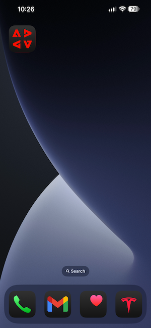

# 0.5 모바일 앱 사용

## 0.5.1 앱 다운로드

컴퓨터의 [https://bit.ly/dx-demo-app](https://bit.ly/dx-demo-app)(으)로 이동합니다. 그러면 이걸 보게 될 거야.

스마트폰의 **카메라** 앱을 사용하여 장치의 OS용 모바일 앱을 설치하십시오. 이 기능을 사용하려면 Adobe Experience Platform Mobile SDK를 사용하는 **버전 2.x**&#x200B;을 설치해야 합니다.

>[!NOTE]
>
>iOS 장치에 앱을 처음 설치한 후 앱을 열려고 하면 다음과 같은 오류 메시지가 표시될 수 있습니다. **신뢰할 수 없는 Enterprise 개발자**. 이 문제를 해결하려면 **설정 > 일반 > 장치 관리 > Adobe Systems Inc.**(으)로 이동하여 **Adobe Systems Inc.**&#x200B;을(를) 클릭해야 합니다.

앱이 설치되면 디바이스의 홈 화면에서 찾을 수 있습니다. 아이콘을 클릭하여 앱을 엽니다.

앱을 처음 사용하는 경우 Adobe ID을 사용하여 로그인하라는 메시지가 표시됩니다. 로그인 프로세스를 완료합니다.

로그인하면 알림 전송 권한을 요청하는 알림이 표시됩니다. 자습서의 일부로 알림을 전송하므로 **허용**&#x200B;을 클릭하세요.

그러면 앱의 홈페이지가 표시됩니다. **설정**(으)로 이동합니다.

설정에서 현재 **공개 프로젝트**&#x200B;가 앱에 로드되어 있습니다. **사용자 지정 프로젝트**&#x200B;를 클릭합니다.

이제 사용자 지정 프로젝트를 로드할 수 있습니다. 프로젝트를 쉽게 로드하려면 QR 코드를 클릭하십시오.

0.1 운동 후, 당신은 이 결과를 얻었습니다. 자동으로 만든 **Mobile Retail 프로젝트**&#x200B;를 열려면 클릭하세요.

실수로 브라우저 창을 닫은 경우 또는 향후 데모 또는 지원 세션을 위해 [https://builder.adobedemo.com/projects](https://builder.adobedemo.com/projects)(으)로 이동하여 웹 사이트 프로젝트에 액세스할 수도 있습니다. Adobe ID으로 로그인하면 이 메시지가 표시됩니다. 모바일 앱 프로젝트를 클릭하여 엽니다.

그러면 이걸 보게 될 거야. **통합**&#x200B;을 클릭합니다.

연습 0.1에서 만든 모바일 데이터 수집 속성을 선택해야 합니다. 그런 다음 **실행**&#x200B;을 클릭합니다.

그러면 QR 코드가 포함된 이 팝업이 표시됩니다. 모바일 앱 내에서 이 QR 코드를 스캔합니다.

그러면 앱에 프로젝트 ID가 표시되고 **저장**&#x200B;을 클릭할 수 있습니다.

이제 앱의 **홈**(으)로 돌아갑니다. 이제 앱을 사용할 준비가 되었습니다.

이제 모듈 0을 완료했습니다.

[모듈 0으로 돌아가기](./getting-started.md)

[모든 모듈로 돌아가기](./../../../overview.md)
