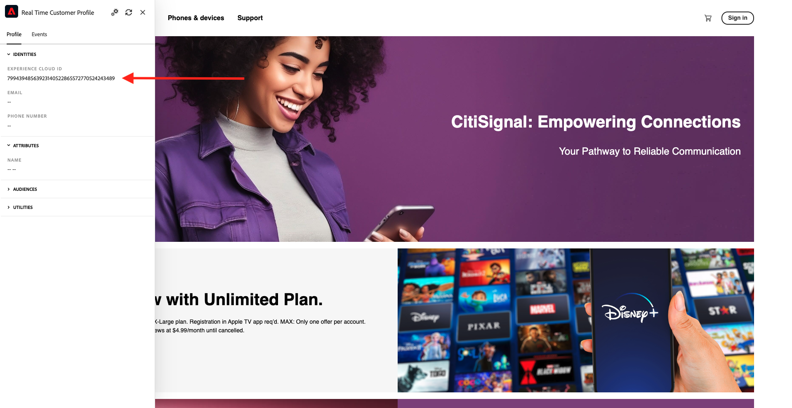
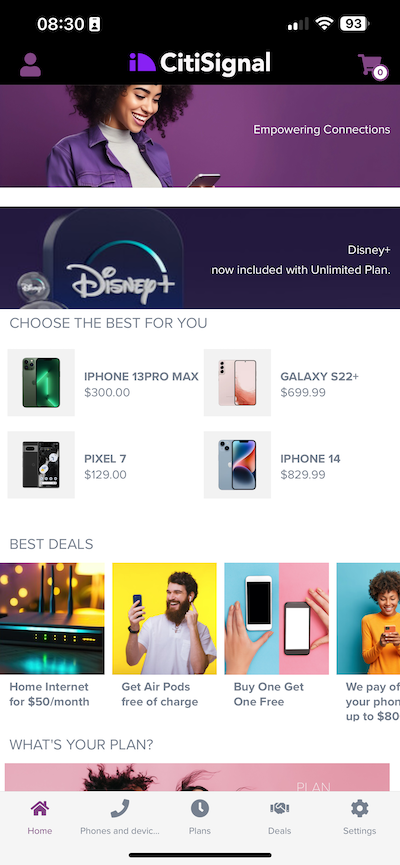

# 2.1.1 알 수 없음에서 웹 사이트에 알려짐

## 컨텍스트

알 수 없음에서 알려짐까지의 여정은 획득에서 유지에 이르는 고객 여정과 마찬가지로 요즘 브랜드 중에서 가장 중요한 주제 중 하나입니다.

Adobe Experience Platform은 이 여정에서 큰 역할을 합니다. 플랫폼은 의사소통을 위한 두뇌이며, &quot;기록의 경험 시스템&quot; 입니다.

플랫폼은 고객이라는 단어가 단지 알려진 고객들보다 더 넓은 환경이다. 웹 사이트에서 알 수 없는 방문자도 플랫폼의 관점에서 고객이며 따라서 알 수 없는 방문자로서의 모든 행동도 Platform으로 전송됩니다. 이러한 접근 방식 덕분에 이 방문자가 결국 알려진 고객이 되면 브랜드는 그 순간 이전에 발생한 사항도 시각화할 수 있습니다. 이는 속성 및 경험 최적화 관점에서 도움을 줍니다.

## 고객 여정 흐름

[https://dsn.adobe.com](https://dsn.adobe.com)(으)로 이동합니다. Adobe ID으로 로그인하면 이 메시지가 표시됩니다. 웹 사이트 프로젝트에서 세 점 **..**&#x200B;을(를) 클릭한 다음 **실행**&#x200B;을(를) 클릭하여 엽니다.

그러면 데모 웹 사이트가 열리는 것을 볼 수 있습니다. URL을 선택하고 클립보드에 복사합니다.

새 시크릿 브라우저 창을 엽니다.

이전 단계에서 복사한 데모 웹 사이트의 URL을 붙여 넣습니다. 그런 다음 Adobe ID을 사용하여 로그인하라는 메시지가 표시됩니다.

계정 유형을 선택하고 로그인 프로세스를 완료합니다.

그러면 웹 사이트가 시크릿 브라우저 창에 로드되는 것을 볼 수 있습니다. 모든 데모에 대해 새로운 시크릿 브라우저 창을 사용하여 데모 웹 사이트 URL을 로드해야 합니다.

화면 왼쪽 상단 모서리에 있는 Adobe 로고 아이콘을 클릭하여 프로필 뷰어를 엽니다.

프로필 뷰어 패널과 현재 알 수 없는 이 고객의 기본 식별자로 **Experience Cloud ID**&#x200B;를 사용하는 실시간 고객 프로필을 살펴보십시오.

또한 고객의 행동을 기반으로 하여 수집한 모든 경험 이벤트를 볼 수 있습니다. 현재 목록이 비어 있지만 곧 변경될 예정입니다.

**휴대폰 및 장치** 제품 범주로 이동합니다. **iPhone 15 Pro** 제품을 클릭합니다.

그러면 제품 세부 사항 페이지가 표시됩니다. 모듈 1에서 검토한 Web SDK 구현을 사용하여 **제품 보기** 유형의 경험 이벤트가 Adobe Experience Platform으로 전송되었습니다.

[Probile 뷰어] 패널을 열고 **경험 이벤트**&#x200B;를 확인합니다.

**휴대폰 및 장치** 범주 페이지로 돌아가서 다른 제품을 클릭합니다. 다른 경험 이벤트가 Adobe Experience Platform으로 전송되었습니다. 프로필 뷰어 패널을 엽니다. 이제 **제품 보기** 유형의 경험 이벤트 2개가 표시됩니다. 적절한 동의를 통해 비헤이비어가 익명화되면 모든 클릭을 추적하고 Adobe Experience Platform에 저장할 수 있습니다. 익명 고객이 알려지면 모든 익명 동작을 알 수 있는 프로필에 자동으로 병합할 수 있습니다.

등록/로그인 페이지로 이동합니다. **로그인**&#x200B;을 클릭합니다.

**계정 만들기**&#x200B;를 클릭합니다.

자세한 내용을 입력하고 **등록**&#x200B;을 클릭하면 이전 페이지로 리디렉션됩니다.

프로필 뷰어 패널을 열고 실시간 고객 프로필로 이동합니다. 프로필 뷰어 패널에 새로 추가된 이메일 및 전화 식별자와 같은 모든 개인 데이터가 표시됩니다.

프로필 뷰어 패널에서 경험 이벤트 로 이동합니다. 프로필 뷰어 패널에 이전에 본 2개의 제품이 표시됩니다. 이제 두 이벤트 모두 &#39;알려진&#39; 프로필에도 연결됩니다.

이제 Adobe Experience Platform에 데이터를 수집했으며 해당 데이터를 ECID 및 이메일 주소와 같은 식별자에 연결했습니다. 이 작업의 목표는 곧 수행하려는 작업의 비즈니스 컨텍스트를 이해하는 것입니다. 다음 연습에서는 이러한 모든 데이터 수집을 가능하게 하는 데 필요한 모든 것을 구성하기 시작합니다.

### 모바일 앱 탐색

알려진 고객이 된 후, 모바일 앱 사용을 시작할 때입니다. iPhone에서 모바일 앱을 연 다음 앱에 로그인합니다.

앱을 더 이상 설치하지 않았거나 설치 방법을 기억하지 못하는 경우 여기를 참조하십시오. [모바일 앱 사용](../../gettingstarted/gettingstarted/ex5.md)

지시에 따라 앱을 설치하면 Citi Signal 브랜드가 로드된 앱의 랜딩 페이지가 표시됩니다. 화면 왼쪽 상단에서 계정 아이콘을 클릭합니다.

로그인 화면에서 데스크탑 웹 사이트에서 사용한 이메일 주소로 로그인합니다. **로그인**&#x200B;을 클릭합니다.

앱의 홈 화면으로 이동한 다음 를 클릭하여 제품을 엽니다.

그러면 제품 세부 사항 페이지가 표시됩니다.

앱의 홈 화면으로 이동하여 화면에서 왼쪽으로 스와이프하여 프로필 뷰어 패널을 표시합니다. 그러면 **경험 이벤트** 섹션에서 방금 본 제품과 이전 웹 사이트 세션의 모든 제품 보기가 표시됩니다.

>[!NOTE]
>
>앱과 웹 사이트에서 통합된 보기를 보려면 몇 분 정도 걸릴 수 있습니다.

이제 데스크탑 컴퓨터로 돌아가서 홈 페이지를 새로 고치면 제품도 표시됩니다.

>[!NOTE]
>
>앱과 웹 사이트에서 통합된 보기를 보려면 몇 분 정도 걸릴 수 있습니다.

이제 Adobe Experience Platform에 데이터를 수집했으며 해당 데이터를 ECID 및 이메일 주소와 같은 식별자에 연결했습니다. 이 연습의 목표는 수행하려는 작업의 비즈니스 맥락을 이해하는 것이었습니다. 이제 실시간 교차 장치 고객 프로필을 효과적으로 빌드했습니다. 다음 연습에서는 Adobe Experience Platform에서 프로필을 시각화합니다.

다음 단계: [2.1.2 실시간 고객 프로필 시각화 - UI](./ex2.md)

[모듈 2.1로 돌아가기](./real-time-customer-profile.md)

[모든 모듈로 돌아가기](../../../overview.md)
