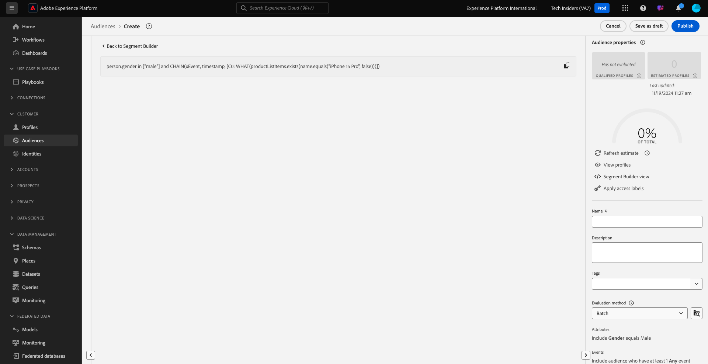

# 2.1.4 세그먼트 만들기 - UI

이 연습에서는 Adobe Experience Platform의 세그먼트 빌더를 사용하여 세그먼트를 만듭니다.

## 스토리

[Adobe Experience Platform](https://experience.adobe.com/platform)(으)로 이동합니다. 로그인하면 Adobe Experience Platform 홈페이지에 접속하게 됩니다.


계속하려면 **샌드박스**&#x200B;를 선택해야 합니다. 선택할 샌드박스 이름이 ``--aepSandboxName--``입니다. 화면 상단의 파란색 선에 있는 텍스트 **[!UICONTROL 프로덕션]**&#x200B;을(를) 클릭하면 됩니다. 적절한 [!UICONTROL 샌드박스]를 선택하면 화면이 변경되고 이제 전용 [!UICONTROL 샌드박스]에 있게 됩니다.


왼쪽의 메뉴에서 **세그먼트**(으)로 이동합니다. 이 페이지에서는 기존의 모든 세그먼트에 대한 개요를 볼 수 있습니다. **+ 세그먼트 만들기** 단추를 클릭하여 새 세그먼트 만들기를 시작합니다.


새 세그먼트 빌더에 들어가면 **특성** 메뉴 옵션과 **XDM 개별 프로필** 참조가 바로 표시됩니다.


XDM은 경험 비즈니스를 지원하는 언어이므로 XDM은 세그먼트 빌더를 위한 기반이기도 합니다. Platform에서 수집되는 모든 데이터는 XDM에 대해 매핑되어야 하며, 따라서 모든 데이터는 해당 데이터의 출처에 관계없이 동일한 데이터 모델의 일부가 됩니다. 이렇게 하면 세그먼트를 작성할 때 이 하나의 세그먼트 빌더 UI에서 동일한 워크플로우의 모든 원본의 데이터를 결합할 수 있으므로 큰 이점이 있습니다. 세그먼트 빌더 내에 빌드된 세그먼트는 활성화를 위해 Adobe Target, Adobe Campaign 및 Adobe Audience Manager과 같은 솔루션으로 보낼 수 있습니다.

모든 **남성** 고객을 포함하는 세그먼트를 만들어 보겠습니다.

젠더 속성에 접근하려면 XDM을 이해하고 알아야 합니다.

성별은 개인의 속성이며 속성에서 찾을 수 있습니다. 먼저 **XDM 개인 프로필**&#x200B;을 클릭하세요. 그러면 이걸 보게 될 거야. **XDM 개인 프로필** 창에서 **개인**&#x200B;을(를) 선택하십시오.


그러면 이걸 보게 될 거야. **사용자**&#x200B;에서 **성별** 특성을 찾을 수 있습니다. 성별 속성을 세그먼트 빌더로 드래그합니다.


이제 미리 채워진 옵션 중에서 특정 성별을 선택할 수 있습니다. 이 경우 **남성**&#x200B;을 선택하세요.


**남**&#x200B;을(를) 선택한 후 **예상 새로 고침** 단추를 눌러 세그먼트의 모집단을 예상할 수 있습니다. 이는 비즈니스 사용자가 특정 속성이 결과 세그먼트 크기에 미치는 영향을 볼 수 있도록 하는 데 매우 유용합니다.


그러면 아래와 같은 추정이 표시됩니다.


다음으로 세그먼트를 약간 세분화해야 합니다. 제품 **Proteus Fitness Jackshirt (Orange)**&#x200B;을(를) 본 모든 남성 고객의 세그먼트를 만들어야 합니다.

이 세그먼트를 작성하려면 경험 이벤트를 추가해야 합니다. **필드** 메뉴 모음에서 **이벤트** 아이콘을 클릭하여 모든 경험 이벤트를 찾을 수 있습니다.


이제 최상위 수준인 **XDM ExperienceEvents** 노드가 표시됩니다. **XDM ExperienceEvent**&#x200B;을 클릭합니다.


**제품 목록 항목**(으)로 이동합니다.


**이름**&#x200B;을(를) 선택하고 왼쪽 메뉴에서 **이름** 개체를 세그먼트 빌더 캔버스로 **이벤트** 섹션으로 끌어서 놓습니다.


그러면 다음과 같은 결과가 표시됩니다.


비교 매개 변수는 **equals**&#x200B;이어야 하며 입력 필드에 **MONTANA WIND JACKET**&#x200B;을(를) 입력하십시오.


세그먼트 빌더에 요소를 추가할 때마다 **예상 새로 고침** 단추를 클릭하여 세그먼트에 있는 모집단의 새 예상 값을 가져올 수 있습니다.

지금까지 UI를 사용하여 세그먼트를 만들었을 뿐 아니라 세그먼트를 만드는 코드 옵션도 있습니다.

세그먼트를 작성할 때 실제로 Profile Query Language(PQL) 쿼리를 작성합니다. PQL 코드를 시각화하려면 세그먼트 빌더의 오른쪽 위 모서리에 있는 **코드 보기** 전환기를 클릭합니다.



이제 전체 PQL 문을 볼 수 있습니다.

```sql
person.gender in ["male"] and CHAIN(xEvent, timestamp, [C0: WHAT(productListItems.exists(name.equals("MONTANA WIND JACKET", false)))])
```

**프로필 보기**&#x200B;를 클릭하여 이 세그먼트에 속하는 고객 프로필 샘플을 미리 볼 수도 있습니다.


마지막으로 세그먼트 이름을 지정하고 저장하겠습니다.

명명 규칙으로 다음을 사용합니다.

- `--aepUserLdap-- - Male customers with interest in Montana Wind Jacket`


그런 다음 **저장 및 닫기** 단추를 클릭하여 세그먼트를 저장한 후 세그먼트 개요 페이지로 돌아갑니다.


이제 다음 연습을 계속 진행하여 API를 통해 세그먼트를 작성할 수 있습니다.

다음 단계: [2.1.5 세그먼트 만들기 - API](./ex5.md)

[모듈 2.1로 돌아가기](./real-time-customer-profile.md)

[모든 모듈로 돌아가기](../../../overview.md)
