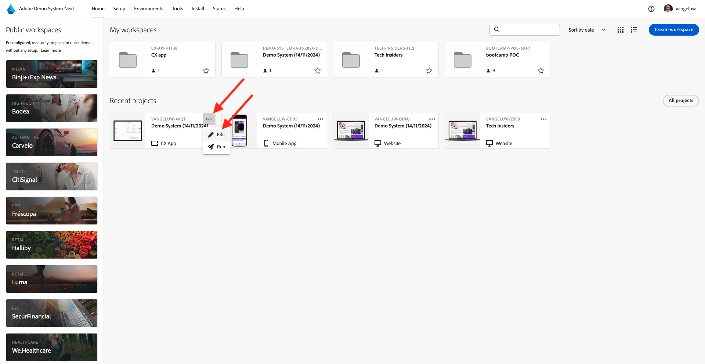
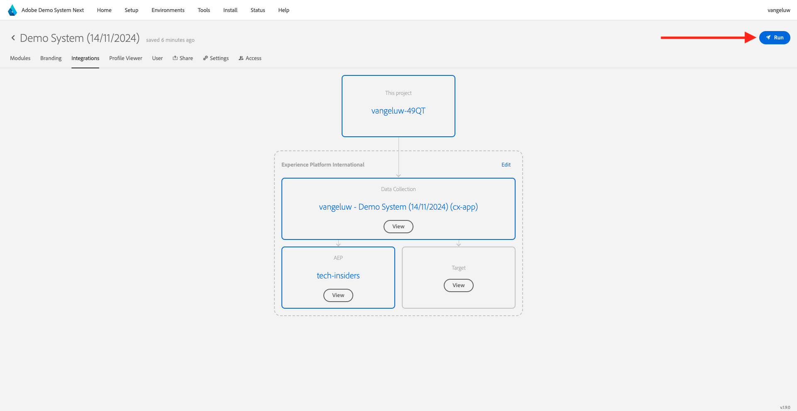

# 2.1.5 콜 센터에서 실시간 고객 프로필 확인

이 연습에서는 고객 여정을 살펴보고 실제 고객처럼 행동하도록 하는 것이 목표입니다.

이 웹 사이트에서는 Adobe Experience Platform을 구현했습니다. 모든 작업은 경험 이벤트로 간주되며 실시간으로 Adobe Experience Platform으로 전송되어 실시간 고객 프로필에 수화를 공급합니다.

이전 연습에서는 사이트를 탐색하는 익명 고객으로 시작하여 몇 단계를 거쳐 알려진 고객이 되었습니다.

결국 동일한 고객이 전화를 받고 콜센터에 문의할 때, 다른 채널의 정보를 즉시 사용할 수 있도록 하여 콜센터 경험이 연관성 있고 개인화될 수 있도록 하는 것이 중요합니다.

## CX 앱 사용

[https://dsn.adobe.com](https://dsn.adobe.com)(으)로 이동합니다. Adobe ID으로 로그인하면 이 메시지가 표시됩니다. CX 앱 프로젝트에서 세 점 **..**&#x200B;을(를) 클릭한 다음 **편집**&#x200B;을(를) 클릭하여 엽니다.

CX 앱 프로젝트에서 **통합**(으)로 이동합니다. **환경 선택**&#x200B;을 클릭합니다.

시작에서 만든 Adobe Experience Platform 데이터 수집 속성을 선택합니다. 이름에 **(cx-app)**&#x200B;이(가) 있는 속성을 선택해야 합니다.

그러면 이걸 보게 될 거야. **실행**&#x200B;을 클릭합니다.

그런 다음 ID와 네임스페이스에 따라 하나를 선택하고 **검색 아이콘**&#x200B;을 클릭합니다.

| 신원 | 네임스페이스 |
|:-------------:| :---------------:|
| Experience Cloud ID (ECID) | 79943948563923140522865572770524243489 |
| Experience Cloud ID (ECID) | 70559351147248820114888181867542007989 |
| 이메일 ID | woutervangeluwe+18112024-01@gmail.com |
| 모바일 번호 ID | +32473622044+18112024-01 |

고객이 콜센터에 전화하면 전화번호를 활용해 고객을 식별할 수 있다. 따라서 이 연습에서는 CX 앱에서 고객 프로필을 검색하기 위해 전화번호를 사용합니다.

이제 콜센터에 이상적으로 표시되는 정보를 볼 수 있으므로 콜센터 직원이 고객과 이야기할 때 즉시 사용할 수 있는 모든 관련 정보를 얻을 수 있습니다.

다음 단계: [요약 및 이점](./summary.md)

[모듈 2.1로 돌아가기](./real-time-customer-profile.md)

[모든 모듈로 돌아가기](../../../overview.md)
