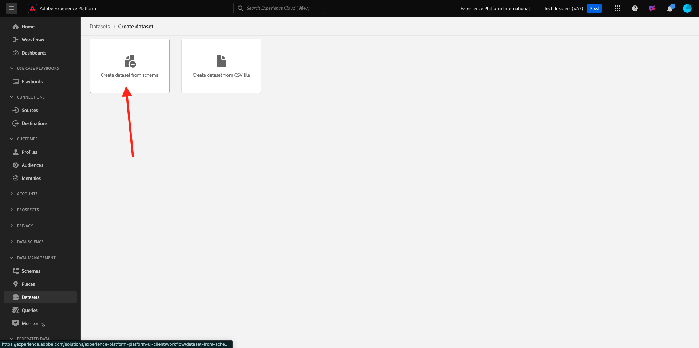

# 2.2.1 Customer AI - 데이터 준비(수집)

인텔리전트 서비스가 마케팅 이벤트 데이터에서 통찰력을 발견하려면 데이터를 의미론적으로 보강하고 표준 구조로 유지 관리해야 합니다. Intelligent Services는 이를 위해 Adobe의 XDM(Experience Data Model) 스키마를 사용합니다.
특히 Intelligent Services에서 사용하는 모든 데이터 세트는 **소비자 경험 이벤트** XDM 스키마를 준수해야 합니다.

## 2.2.1.1 스키마 생성

이 연습에서는 **고객 AI** 지능형 서비스에 필요한 **고객 경험 이벤트 mixin**&#x200B;을(를) 포함하는 스키마를 만듭니다.

URL [https://experience.adobe.com/platform](https://experience.adobe.com/platform)로 이동하여 Adobe Experience Platform에 로그인합니다.

로그인하면 Adobe Experience Platform 홈페이지에 접속하게 됩니다.

계속하려면 **샌드박스**&#x200B;를 선택해야 합니다. 선택할 샌드박스 이름이 ``--module10sandbox--``입니다. 화면 상단의 파란색 선에 있는 텍스트 **[!UICONTROL 프로덕션]**&#x200B;을(를) 클릭하면 됩니다. 적절한 샌드박스를 선택하면 화면이 변경되고 이제 전용 샌드박스에 있습니다.

왼쪽 메뉴에서 **스키마**&#x200B;를 클릭하고 **찾아보기**(으)로 이동합니다. **스키마 만들기**&#x200B;를 클릭합니다.

팝업에서 **XDM ExperienceEvent**&#x200B;을 선택합니다.

그러면 이걸 보게 될 거야.

이 스키마에 추가할 다음 **Mixins**&#x200B;을(를) 검색하여 선택하십시오.

- 고객 경험 이벤트

  

- 최종 사용자 ID 세부 정보

  

**필드 그룹 추가**&#x200B;를 클릭합니다.

그러면 이걸 보게 될 거야. Mixin **최종 사용자 ID 세부 정보**&#x200B;를 선택하십시오.

**endUserID 필드로 이동합니다._experience.emailid.id**.

오른쪽 메뉴에서 필드 **endUserID를 선택합니다._experience.emailid.id**, 아래로 스크롤하여 **ID**&#x200B;에 대한 확인란을 선택하고 **기본 ID**&#x200B;에 대한 확인란을 선택한 다음 **이메일**&#x200B;의 **ID 네임스페이스**&#x200B;를 선택합니다.

**endUserID 필드로 이동합니다._experience.mcid.id**. **ID**&#x200B;에 대한 확인란을 선택하고 **ECID**&#x200B;의 **ID 네임스페이스**&#x200B;를 선택합니다. **적용**&#x200B;을 클릭합니다.

이제 스키마의 이름을 지정하십시오.

스키마의 이름으로 다음을 사용합니다.

- `--aepUserLdap-- - Demo System - Customer Experience Event`

예를 들어 ldap **vangeluw**&#x200B;의 경우 스키마 이름이어야 합니다.

- **vangeluw - 데모 시스템 - 고객 경험 이벤트**

그럼 이런 걸 드시겠네요. 새 **Mixins**&#x200B;을(를) 추가하려면 **+ 추가** 단추를 클릭하십시오.

스키마 이름을 선택합니다. 이제 **프로필** 토글을 클릭하여 **프로필**&#x200B;에 대한 스키마를 사용하도록 설정해야 합니다.

그러면 이걸 보게 될 거야. **사용**&#x200B;을 클릭합니다.

이제 이 항목을 사용할 수 있습니다. 스키마를 저장하려면 **저장**&#x200B;을 클릭하세요.

## 2.2.1.2 데이터 세트 만들기

왼쪽 메뉴에서 **데이터 세트**&#x200B;를 클릭하고 **찾아보기**(으)로 이동합니다. **데이터 집합 만들기**&#x200B;를 클릭합니다.

**스키마에서 데이터 집합 만들기**&#x200B;를 클릭합니다.

다음 화면에서는 이전 연습에서 만든 데이터 세트(**[!UICONTROL ldap - 데모 시스템 - 고객 경험 이벤트]**)를 선택합니다. **다음**&#x200B;을 클릭합니다.

데이터 집합 이름으로 `--aepUserLdap-- - Demo System - Customer Experience Event Dataset`을(를) 사용합니다. **마침을 클릭합니다**.

이제 데이터 세트가 생성됩니다. **프로필** 전환을 사용하도록 설정합니다.

**사용**&#x200B;을 클릭합니다.

이제 다음 항목이 제공됩니다.

이제 고객 경험 이벤트 데이터 수집을 시작하고 고객 AI 서비스를 사용할 준비가 되었습니다.

## 2.2.1.3 경험 이벤트 테스트 데이터 다운로드

**스키마** 및 **데이터 집합**&#x200B;이 구성되면 이제 경험 이벤트 데이터를 수집할 준비가 되었습니다. Customer AI는 **2분기 이상**&#x200B;에 데이터를 필요로 하므로 외부에서 준비한 데이터를 수집해야 합니다.

경험 이벤트를 위해 준비된 데이터는 [소비자 경험 이벤트 XDM Mixin](https://github.com/adobe/xdm/blob/797cf4930d5a80799a095256302675b1362c9a15/docs/reference/context/experienceevent-consumer.schema.md)의 요구 사항 및 스키마를 준수해야 합니다.

[https://dashboard.adobedemo.com/data](https://dashboard.adobedemo.com/data) 위치에서 샘플 데이터가 포함된 파일을 다운로드하십시오. **다운로드** 단추를 클릭합니다.

또는 위의 링크에 액세스할 수 없는 경우 [https://aepmodule10.s3-us-west-2.amazonaws.com/retail-v1-dec2020-xl.json.zip](https://aepmodule10.s3-us-west-2.amazonaws.com/retail-v1-dec2020-xl.json.zip) 위치에서도 파일을 다운로드할 수 있습니다.

이제 **retail-v1-dec2020-xl.json.zip** 파일을 다운로드했습니다. 컴퓨터의 바탕 화면에 파일을 놓고 압축을 해제하면 **retail-v1.json**(이)라는 파일이 표시됩니다. 다음 연습에서는 이 파일이 필요합니다.

## 2.2.1.4 경험 이벤트 테스트 데이터 수집

Adobe Experience Platform에서 **데이터 세트**(으)로 이동하여 **[!UICONTROL ldap - 데모 시스템 - 고객 경험 이벤트 데이터 세트]**(으)로 지정된 데이터 세트를 엽니다.

데이터 집합에서 **파일 선택**&#x200B;을 클릭하여 데이터를 추가합니다.

팝업에서 **retail-v1.json** 파일을 선택하고 **열기**&#x200B;를 클릭합니다.

데이터가 가져오기되고 **로드 중** 상태에서 새 일괄 처리가 만들어집니다. 파일이 업로드될 때까지 이 페이지에서 나가지 마십시오.

파일이 업로드되면 일괄 처리 상태가 **로드 중**&#x200B;에서 **처리 중**(으)로 변경됩니다.

데이터를 수집하고 처리하는 데 10~20분이 걸릴 수 있습니다.

데이터 수집이 성공하면 일괄 처리 상태가 **성공**(으)로 변경됩니다.

다음 단계: [2.2.2 Customer AI - 새 인스턴스 만들기(구성)](./ex2.md)

[모듈 2.2로 돌아가기](./intelligent-services.md)

[모든 모듈로 돌아가기](./../../../overview.md)
