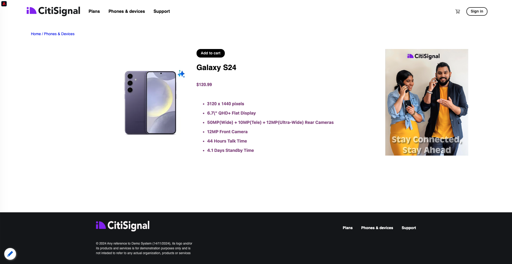

# 2.3.1 대상자 만들기

이 연습에서는 Adobe Experience Platform의 대상 빌더를 사용하여 대상을 만듭니다.

## 컨텍스트

고객의 관심에 응하는 것은 실시간으로 이루어질 필요가 있다. 고객 행동에 실시간으로 대응하는 방법 중 하나는 대상이 실시간으로 자격을 부여받는다는 조건에서 대상을 사용하는 것입니다. 이 연습에서는 사용 중인 웹 사이트의 실제 활동을 고려하여 대상을 빌드해야 합니다.

## 반응할 동작 식별

[https://dsn.adobe.com](https://dsn.adobe.com)(으)로 이동합니다. Adobe ID으로 로그인하면 이 메시지가 표시됩니다. 웹 사이트 프로젝트에서 세 점 **..**&#x200B;을(를) 클릭한 다음 **실행**&#x200B;을(를) 클릭하여 엽니다.

그러면 데모 웹 사이트가 열리는 것을 볼 수 있습니다. URL을 선택하고 클립보드에 복사합니다.

새 시크릿 브라우저 창을 엽니다.

이전 단계에서 복사한 데모 웹 사이트의 URL을 붙여 넣습니다. 그런 다음 Adobe ID을 사용하여 로그인하라는 메시지가 표시됩니다.

계정 유형을 선택하고 로그인 프로세스를 완료합니다.

그러면 웹 사이트가 시크릿 브라우저 창에 로드되는 것을 볼 수 있습니다. 모든 연습에서는 새로운 시크릿 브라우저 창을 사용하여 데모 웹 사이트 URL을 로드해야 합니다.

이 예에서는 특정 제품을 보는 특정 고객에게 응답하려고 합니다.
**Citi Signal** 홈페이지에서 **전화 및 장치**(으)로 이동한 다음 제품 **Galaxy S24**&#x200B;을(를) 클릭합니다.

따라서 누군가가 **Galaxy S24**&#x200B;에 대한 제품 페이지를 방문하면 작업을 수행할 수 있습니다. 조치를 취하기 위해 가장 먼저 해야 할 일은 대상자를 정의하는 것입니다.

## 대상자 만들기

[Adobe Experience Platform](https://experience.adobe.com/platform)(으)로 이동합니다. 로그인하면 Adobe Experience Platform 홈페이지에 접속하게 됩니다.

계속하려면 **샌드박스**&#x200B;를 선택해야 합니다. 선택할 샌드박스 이름이 ``--aepSandboxName--``입니다. 적절한 [!UICONTROL 샌드박스]를 선택하면 화면이 변경되고 이제 전용 [!UICONTROL 샌드박스]에 있게 됩니다.

왼쪽의 메뉴에서 **대상**(으)로 이동한 다음 기존 대상자의 개요를 볼 수 있는 **찾아보기**(으)로 이동합니다. 새 대상을 만들려면 **대상 만들기** 단추를 클릭하십시오.

**규칙 작성**&#x200B;을 선택하고 **만들기**&#x200B;를 클릭합니다.

위에서 언급했듯이 **Galaxy S24** 제품을 본 모든 고객을 대상으로 대상을 구성해야 합니다.

이 대상을 빌드하려면 이벤트를 추가해야 합니다. **대상** 메뉴 모음의 **이벤트** 아이콘을 클릭하면 모든 이벤트를 찾을 수 있습니다.

상위 수준 **XDM ExperienceEvent** 노드가 표시됩니다.

**Galaxy S24** 제품을 방문한 고객을 찾으려면 **XDM ExperienceEvent**&#x200B;을(를) 클릭하십시오.

**제품 목록 항목**(으)로 아래로 스크롤하여 클릭합니다.

**이름**&#x200B;을(를) 선택하고 왼쪽 **제품 목록 항목** 메뉴에서 **이름** 개체를 대상 빌더 캔버스로 **이벤트** 섹션으로 끌어서 놓습니다.

비교 매개 변수는 **equals**&#x200B;이어야 하며 입력 필드에 `Galaxy S24`을(를) 입력하십시오.

**이벤트 규칙**&#x200B;은(는) 이제 다음과 같습니다. 대상 빌더에 요소를 추가할 때마다 **예상 새로 고침** 단추를 클릭하여 대상에 있는 모집단의 새 예상 값을 가져올 수 있습니다.

대상에 이름을 지정하고 **평가 방법**&#x200B;을(를) **Edge**(으)로 설정하십시오.

명명 규칙으로 다음을 사용합니다.

- `--aepUserLdap-- - Interest in Galaxy S24`

**Publish** 단추를 클릭하여 대상자를 저장합니다.

이제 대상 개요 페이지로 돌아갑니다.

다음 단계: [2.3.2 대상을 사용하여 DV360 대상을 구성하는 방법 검토](./ex2.md)

[모듈 2.3으로 돌아가기](./real-time-cdp-build-a-segment-take-action.md)

[모든 모듈로 돌아가기](../../../overview.md)
