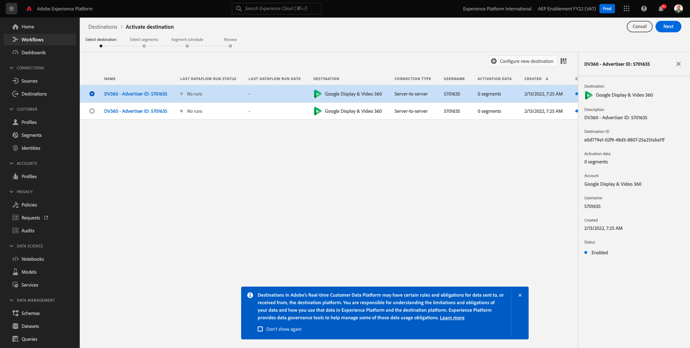

# 2.3.3 조치 취하기: 세그먼트를 DV360으로 보내기

[Adobe Experience Platform](https://experience.adobe.com/platform)(으)로 이동합니다. 로그인하면 Adobe Experience Platform 홈페이지에 접속하게 됩니다.

계속하려면 **샌드박스**&#x200B;를 선택해야 합니다. 선택할 샌드박스 이름이 ``--aepSandboxId--``입니다. 화면 상단의 파란색 선에 있는 텍스트 **[!UICONTROL 프로덕션]**&#x200B;을(를) 클릭하면 됩니다. 적절한 [!UICONTROL 샌드박스]를 선택하면 화면이 변경되고 이제 전용 [!UICONTROL 샌드박스]에 있게 됩니다.

왼쪽 메뉴에서 **대상**(으)로 이동한 다음 **카탈로그**(으)로 이동합니다. 그러면 **대상 카탈로그**&#x200B;가 표시됩니다.

**대상**&#x200B;에서 **Google Display &amp; Video 360** 카드의 **세그먼트 활성화**&#x200B;를 클릭합니다.

대상을 선택하고 **다음**&#x200B;을 클릭하세요.

사용 가능한 세그먼트 목록에서 이전 연습에서 만든 세그먼트를 선택합니다. **다음**&#x200B;을 클릭합니다.

**세그먼트 일정** 페이지에서 **다음**&#x200B;을 클릭하세요.

마지막으로 **검토** 페이지에서 **마침**&#x200B;을 클릭합니다.

이제 세그먼트가 Google DV360에 연결됩니다. 고객이 이 세그먼트에 대한 자격이 될 때마다 Google DV360측의 대상에 해당 고객을 포함하도록 Google DV360에 신호가 전송됩니다.

다음 단계: [2.3.4 조치 취하기: 세그먼트를 S3 대상으로 보내기](./ex4.md)

[모듈 2.3으로 돌아가기](./real-time-cdp-build-a-segment-take-action.md)

[모든 모듈로 돌아가기](../../../overview.md)
