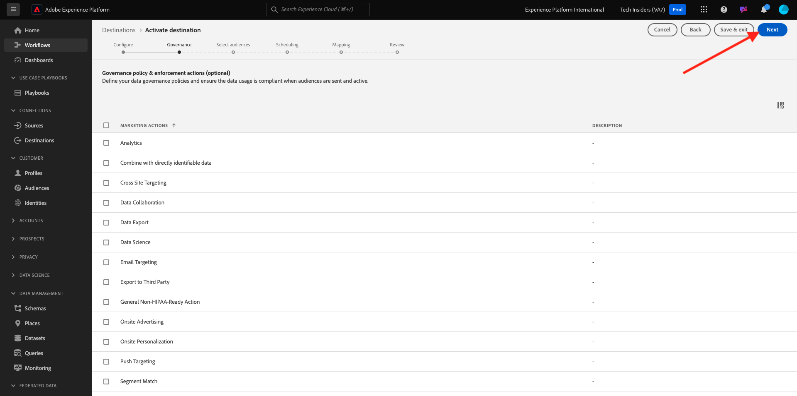

# 2.3.4 조치 취하기: 세그먼트를 S3 대상으로 보내기

Adobe Experience Platform에는 Salesforce Marketing Cloud, Oracle Eloqua, Oracle Responsys 및 Adobe Campaign과 같은 이메일 마케팅 대상에 대상을 공유할 수도 있습니다.

FTP 또는 SFTP를 이러한 각 이메일 마케팅 대상에 대한 전용 대상의 일부로 사용하거나, AWS S3를 사용하여 Adobe Experience Platform과 이러한 이메일 마케팅 대상 간에 고객 목록을 교환할 수 있습니다.

이 모듈에서는 AWS S3 버킷을 사용하여 이러한 대상을 구성합니다.

## 2.3.4.1 S3 버킷 만들기

[https://console.aws.amazon.com](https://console.aws.amazon.com)(으)로 이동하여 이전에 만든 Amazon 계정으로 로그인합니다.

로그인하면 **AWS 관리 콘솔**(으)로 리디렉션됩니다.

**서비스 찾기** 메뉴에서 **s3**&#x200B;을(를) 검색합니다. 첫 번째 검색 결과를 클릭합니다. **S3 - 클라우드의 확장 가능한 저장소**.

그러면 **Amazon S3** 홈 페이지가 표시됩니다. **버킷 만들기**&#x200B;를 클릭합니다.

**버킷 만들기** 화면에서 두 가지를 구성해야 합니다.

- 이름: `aepmodulertcdp--demoProfileLdap--` 이름을 사용합니다. 예를들어, 이 연습에서는 버킷 이름이 **aepdulertcdpvangeluw**&#x200B;입니다.
- 지역: **EU(프랑크푸르트) eu-central-1** 지역 사용

다른 모든 기본 설정은 그대로 둡니다. 아래로 스크롤하여 **버킷 만들기**&#x200B;를 클릭합니다.

그러면 버킷이 만들어지는 것이 보이고 Amazon S3 홈페이지로 리디렉션됩니다.

## 2.3.4.2 S3 버킷에 액세스할 수 있는 권한 설정

다음 단계는 S3 버킷에 대한 액세스를 설정하는 것입니다.

이렇게 하려면 [https://console.aws.amazon.com/iam/home](https://console.aws.amazon.com/iam/home)(으)로 이동하십시오.

AWS 리소스에 대한 액세스는 Amazon Identity and Access Management(IAM)에 의해 제어됩니다.

이제 이 페이지가 표시됩니다.

왼쪽 메뉴에서 **사용자**&#x200B;를 클릭합니다. 그러면 **사용자** 화면이 표시됩니다. **사용자 추가**&#x200B;를 클릭합니다.

그런 다음 사용자를 구성합니다.

- 사용자 이름: `s3_--demoProfileLdap--_rtcdp`을(를) 이름으로 사용하므로 이 예제에서는 이름이 `s3_vangeluw_rtcdp`입니다.
- AWS 액세스 유형: **액세스 키 - 프로그래밍 방식 액세스**&#x200B;를 선택합니다.

**다음: 사용 권한**&#x200B;을 클릭합니다.

그러면 이 권한 화면이 표시됩니다. **기존 정책을 직접 첨부**&#x200B;를 클릭합니다.

모든 관련 S3 정책을 보려면 검색어 **s3**&#x200B;을(를) 입력하십시오. **AmazonS3FullAccess** 정책을 선택하십시오. **다음: 태그**&#x200B;를 클릭합니다.

**태그** 화면에서 아무 것도 구성할 필요가 없습니다. **다음: 검토**&#x200B;를 클릭합니다.

구성을 검토합니다. **사용자 만들기**&#x200B;를 클릭합니다.

이제 사용자가 만들어졌고 S3 환경에 액세스하기 위한 자격 증명이 표시됩니다. 자격 증명을 볼 수 있는 유일한 시간이므로 적어 두십시오.

비밀 액세스 키를 보려면 **표시**&#x200B;를 클릭하세요.

>[!IMPORTANT]
>
>자격 증명을 컴퓨터의 텍스트 파일에 저장합니다.
>
> - 액세스 키 ID: ...
> - 비밀 액세스 키: ...
>
> **닫기**&#x200B;를 클릭하면 자격 증명이 다시 표시되지 않습니다!

Click **Close**.

이제 AWS S3 버킷을 성공적으로 만들었고 이 버킷에 액세스할 수 있는 권한이 있는 사용자를 만들었습니다.

## 2.3.4.3 Adobe Experience Platform에서 대상 구성

[Adobe Experience Platform](https://experience.adobe.com/platform)(으)로 이동합니다. 로그인하면 Adobe Experience Platform 홈페이지에 접속하게 됩니다.

계속하려면 **샌드박스**&#x200B;를 선택해야 합니다. 선택할 샌드박스 이름이 ``--aepSandboxId--``입니다. 화면 상단의 파란색 선에 있는 텍스트 **[!UICONTROL 프로덕션]**&#x200B;을(를) 클릭하면 됩니다. 적절한 [!UICONTROL 샌드박스]를 선택하면 화면이 변경되고 이제 전용 [!UICONTROL 샌드박스]에 있게 됩니다.

왼쪽 메뉴에서 **대상**(으)로 이동한 다음 **카탈로그**(으)로 이동합니다. 그러면 **대상 카탈로그**&#x200B;가 표시됩니다.

**클라우드 저장소**&#x200B;를 클릭한 다음 **Amazon S3** 카드에서 **설정** 단추(또는 환경에 따라 **세그먼트 활성화**&#x200B;에서)를 클릭합니다.

환경에 따라 대상을 만들려면 **+ 새 대상 구성**&#x200B;을 클릭해야 할 수 있습니다.

계정 유형으로 **새 계정**&#x200B;을(를) 선택하십시오. 이전 단계에서 제공된 S3 자격 증명을 사용하십시오.

| 액세스 키 ID | 비밀 액세스 키 |
|:-----------------------:| :-----------------------:|
| AKIA..... | Cm5Ln..... |

**대상에 연결**&#x200B;을 클릭합니다.

그러면 이 대상이 현재 연결되어 있다는 시각적 확인이 표시됩니다.

Adobe Experience Platform이 S3 버킷에 연결할 수 있도록 이름과 폴더를 제공해야 합니다.

명명 규칙으로는 다음을 사용하십시오.

| 액세스 키 ID | 비밀 액세스 키 |
|:-----------------------:| :-----------------------:|
| 이름 | `AWS - S3 - --demoProfileLdap--` |
| 설명 | `AWS - S3 - --demoProfileLdap--` |
| 버킷 이름 | `aepmodulertcdp--demoProfileLdap--` |
| 폴더 경로 | / |

**다음**&#x200B;을 클릭합니다.

이제 선택적으로 새 대상에 데이터 거버넌스 정책을 첨부할 수 있습니다. **다음**&#x200B;을 클릭합니다.

세그먼트 목록에서 연습 1에서 만든 세그먼트를 검색하여 선택합니다. **다음**&#x200B;을 클릭합니다.

그러면 이걸 보게 될 거야. 원하는 경우 **연필** 아이콘을 클릭하여 일정을 편집할 수 있습니다. **일정 만들기**.

선택한 일정을 정의합니다. **증분 파일 내보내기**&#x200B;를 선택하고 **3시간**&#x200B;마다 빈도를 **시간별**(으)로 설정합니다. **만들기**&#x200B;를 클릭합니다.

그럼 이걸로 드셔보세요 **다음**&#x200B;을 클릭합니다.

이제 AWS S3으로 내보내기 속성을 선택할 수 있습니다. **새 필드 추가**&#x200B;를 클릭하고 `--aepTenantId--.identification.core.ecid` 필드가 추가되고 **중복 제거 키**(으)로 표시되는지 확인하십시오.

선택적으로 다른 필드를 필요한 만큼 추가할 수 있습니다.

모든 필드를 추가한 후 **다음**&#x200B;을(를) 클릭합니다.

구성을 검토합니다. 구성을 완료하려면 **마침**&#x200B;을 클릭하세요.

그런 다음 대상 활성화 화면으로 돌아가면 이 대상에 세그먼트가 추가된 것을 볼 수 있습니다.

세그먼트 내보내기를 더 추가하려면 **세그먼트 활성화**&#x200B;를 클릭하여 프로세스를 다시 시작하고 세그먼트를 더 추가할 수 있습니다.

다음 단계: [2.3.5 조치 취하기: 세그먼트를 Adobe Target에 보내기](./ex5.md)

[모듈 2.3으로 돌아가기](./real-time-cdp-build-a-segment-take-action.md)

[모든 모듈로 돌아가기](../../../overview.md)
