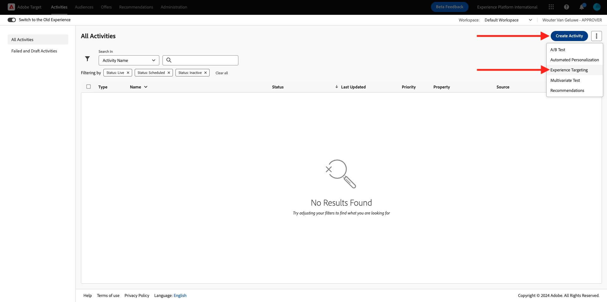
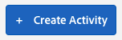

# 2.3.5 조치 취하기: 세그먼트를 Adobe Target에 보내기

[Adobe Experience Platform](https://experience.adobe.com/platform)(으)로 이동합니다. 로그인하면 Adobe Experience Platform 홈페이지에 접속하게 됩니다.


계속하려면 **샌드박스**&#x200B;를 선택해야 합니다. 선택할 샌드박스 이름이 ``--aepSandboxId--``입니다. 화면 상단의 파란색 선에 있는 텍스트 **[!UICONTROL 프로덕션]**&#x200B;을(를) 클릭하면 됩니다. 적절한 [!UICONTROL 샌드박스]를 선택하면 화면이 변경되고 이제 전용 [!UICONTROL 샌드박스]에 있게 됩니다.


## 2.3.5.1 데이터 스트림 확인

Real-Time CDP의 Adobe Target 대상은 데이터를 Adobe 에지 네트워크로 수집하는 데 사용되는 데이터 스트림에 연결됩니다. Adobe Target 대상을 설정하려면 먼저 데이터 스트림이 Adobe Target에 대해 이미 활성화되어 있는지 확인해야 합니다. 데이터 스트림이 [연습 0.2 데이터 스트림 만들기](./../../../modules/gettingstarted/gettingstarted/ex2.md)에서 구성되었으며 이름이 `--demoProfileLdap-- - Demo System Datastream`입니다.

[https://experience.adobe.com/#/data-collection/](https://experience.adobe.com/#/data-collection/)(으)로 이동한 다음 **데이터스트림** 또는 **데이터스트림(Beta)**&#x200B;을 클릭합니다.


화면 오른쪽 상단에서 샌드박스 이름을 선택합니다. 이름은 `--aepSandboxId--`이어야 합니다.


데이터스트림에서 이름이 `--demoProfileLdap-- - Demo System Datastream`인 데이터스트림을 검색합니다. 데이터 스트림을 클릭하여 엽니다.


그러면 **Adobe Experience Platform** 옆에 있는 **..**&#x200B;을 클릭한 다음 **편집**&#x200B;을 클릭합니다.


**Edge 세분화** 및 **Personalization 대상**&#x200B;에 대한 확인란을 모두 선택합니다. **저장**&#x200B;을 클릭합니다.


**+ 서비스 추가**&#x200B;를 클릭합니다.


서비스 **Adobe Target**&#x200B;을(를) 선택하십시오. **저장**&#x200B;을 클릭합니다.


이제 데이터 스트림이 Adobe Target에 대해 구성됩니다.


## 2.3.5.2 Adobe Target 대상 구성

Adobe Target은 Real-Time CDP에서 대상으로 사용할 수 있습니다. Adobe Target 통합을 설정하려면 **대상**, **카탈로그**(으)로 이동하십시오.


**카테고리** 메뉴에서 **Personalization**&#x200B;을(를) 클릭합니다. 그러면 **Adobe Target** 대상 카드가 표시됩니다. **세그먼트 활성화**(또는 환경에 따라 **설정**)를 클릭합니다.


환경에 따라 대상을 만들려면 **+ 새 대상 구성**&#x200B;을 클릭해야 할 수 있습니다.


그러면 이걸 보게 될 거야.


**새 대상 구성** 화면에서 다음 두 가지를 구성해야 합니다.

- 이름: **vangeluw - Adobe Target(웹)**&#x200B;과(와) 같은 이름 `--demoProfileLdap-- - Adobe Target (Web)`을(를) 사용합니다.
- 데이터 스트림 ID: [연습 0.2 데이터 스트림 만들기](./../../../modules/gettingstarted/gettingstarted/ex2.md)에서 구성한 데이터 스트림을 선택해야 합니다. 데이터 스트림의 이름은 `--demoProfileLdap-- - Demo System Datastream`이어야 합니다.

**다음**&#x200B;을 클릭합니다.


다음 화면에서 필요한 경우 거버넌스 정책을 선택할 수 있습니다. 하나를 선택할 필요는 없습니다. 이 경우 하나를 선택할 필요가 없으므로 **만들기**&#x200B;를 클릭하십시오.


이제 대상이 만들어지고 목록에 표시됩니다. 대상을 선택하고 **다음**&#x200B;을 클릭하여 대상으로 세그먼트를 보내기 시작합니다.


사용 가능한 세그먼트 목록에서 [연습 6.1 세그먼트 만들기](./ex1.md)에서 만든 세그먼트를 선택합니다. 이름은 `--demoProfileLdap-- - Interest in PROTEUS FITNESS JACKSHIRT`입니다. 그런 다음 **다음**&#x200B;을 클릭합니다.


다음 페이지에서 **다음**&#x200B;을 클릭합니다.


**마침을 클릭합니다**.


이제 세그먼트가 Adobe Target을 향해 활성화됩니다.


>[!IMPORTANT]
>
>Real-Time CDP에서 Adobe Target 대상을 방금 만든 경우 대상이 활성 상태가 되는 데 최대 1시간이 걸릴 수 있습니다. 백엔드 구성 설정으로 인한 일회성 대기 시간입니다. 초기 1시간 대기 시간 및 백엔드 구성이 완료되면 Adobe Target 대상으로 전송되는 새로 추가된 Edge 세그먼트를 실시간으로 타겟팅할 수 있습니다.

## 2.3.5.3 Adobe Target 양식 기반 활동 구성

이제 Real-Time CDP 세그먼트가 Adobe Target으로 전송되도록 구성되었으므로 Adobe Target에서 경험 타깃팅 활동을 구성할 수 있습니다. 이 연습에서는 양식 기반 활동을 구성합니다.

[https://experiencecloud.adobe.com/](https://experiencecloud.adobe.com/)(으)로 이동하여 Adobe Experience Cloud 홈페이지로 이동합니다. **Target**&#x200B;을 클릭하여 엽니다.


**Adobe Target** 홈 페이지에 기존의 모든 활동이 표시됩니다.



새 활동을 만들려면 **+ 활동 만들기**&#x200B;를 클릭하십시오.



**경험 타깃팅**&#x200B;을 선택합니다.


**양식**&#x200B;을 선택하고 **속성 제한 없음**&#x200B;을 선택합니다. **다음**&#x200B;을 클릭합니다.


이제 양식 기반 활동 작성기입니다.


필드 **LOCATION 1**&#x200B;에 대해 **target-global-mbox**&#x200B;를 선택하십시오.


기본 대상은 현재 **모든 방문자**&#x200B;입니다. **모든 방문자** 옆의 **3개 점**&#x200B;을 클릭하고 **대상 변경**&#x200B;을 클릭합니다.


이제 사용 가능한 대상 목록이 표시되며, 이전에 만들어 Adobe Target에 보낸 Adobe Experience Platform 세그먼트는 이제 이 목록의 일부입니다. 이전에 Adobe Experience Platform에서 만든 세그먼트를 선택합니다. **대상자 할당**&#x200B;을 클릭합니다.


이제 Adobe Experience Platform 세그먼트는 이 경험 타깃팅 활동의 일부입니다.


이제 홈페이지 홈페이지에서 영웅 이미지를 변경하겠습니다. **기본 컨텐츠** 옆에 있는 드롭다운 목록을 클릭하여 열고 **HTML 오퍼 만들기**&#x200B;를 클릭합니다.


다음 코드를 붙여넣습니다. 그런 다음 **다음**&#x200B;을 클릭합니다.

```javascript
<script>document.querySelector("#home > div > div > div > div > div.banner_img.d-none.d-lg-block > img").src="https://parsefiles.back4app.com/hgJBdVOS2eff03JCn6qXXOxT5jJFzialLAHJixD9/ff92fdc3885972c0090ad5419e0ef4d4_Luma - Product - Proteus - Hero Banner.png"; document.querySelector(".banner_text > *").remove()</script>
```


그러면 선택한 대상에 대한 새 이미지에 새 경험이 표시됩니다.


왼쪽 위 모서리에서 활동 제목을 클릭하여 이름을 변경합니다.


이름은 다음을 사용하십시오.

- `--demoProfileLdap-- - RTCDP - XT (Form)`


**다음**&#x200B;을 클릭합니다.


**목표 및 설정** - 페이지에서 **목표 지표**(으)로 이동합니다.


기본 목표를 **참여** - **사이트 시간**(으)로 설정합니다.


**저장 및 닫기**&#x200B;를 클릭합니다.


이제 **활동 개요** 페이지에 있습니다. 활동을 활성화해야 합니다.


**비활성** 필드를 클릭하고 **활성화**&#x200B;를 선택합니다.


그런 다음 활동이 현재 라이브 상태임을 시각적으로 확인할 수 있습니다.


이제 활동이 라이브 상태이며 데모 웹 사이트에서 테스트할 수 있습니다.

>[!IMPORTANT]
>
>Real-Time CDP에서 Adobe Target 대상을 방금 만든 경우 대상이 활성 상태가 되는 데 최대 1시간이 걸릴 수 있습니다. 백엔드 구성 설정으로 인한 일회성 대기 시간입니다. 초기 1시간 대기 시간 및 백엔드 구성이 완료되면 Adobe Target 대상으로 전송되는 새로 추가된 Edge 세그먼트를 실시간으로 타겟팅할 수 있습니다.

이제 데모 웹 사이트로 돌아가 PROTEUS FITNESS JACKSHIRT의 제품 페이지를 방문하면 만든 세그먼트에 즉시 자격이 주어지고 홈 페이지에 Adobe Target 활동이 실시간으로 표시됩니다.


다음 단계: [2.3.6 외부 대상](./ex6.md)

[모듈 2.3으로 돌아가기](./real-time-cdp-build-a-segment-take-action.md)

[모든 모듈로 돌아가기](../../../overview.md)
