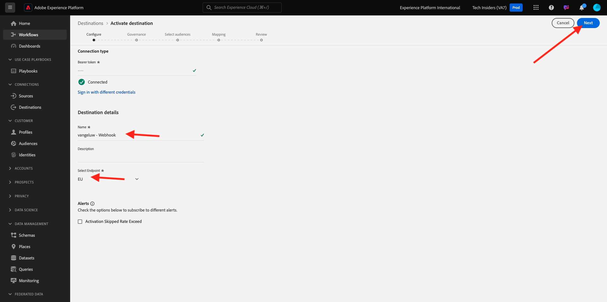
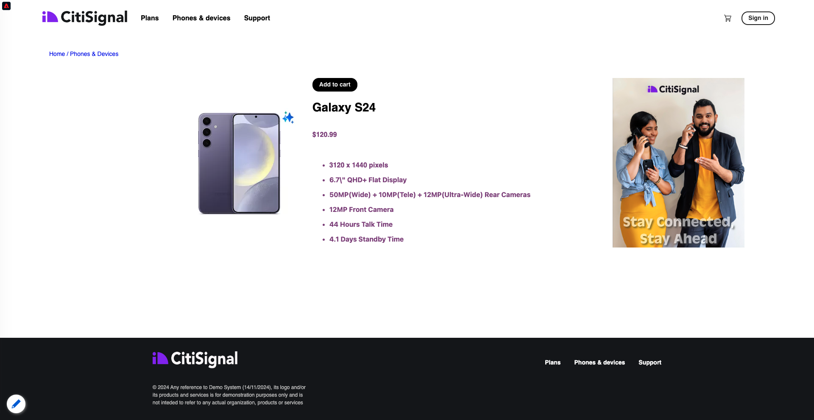

# 2.3.6 대상 SDK

## Adobe I/O 프로젝트 설정

이 연습에서는 Adobe I/O 를 다시 사용하여 Adobe Experience Platform의 API를 쿼리합니다. Adobe I/O 프로젝트를 아직 구성하지 않은 경우 모듈 2.1의 [연습 3](../module2.1/ex3.md)(으)로 돌아가서 지침을 따르십시오.

## Adobe I/O에 대한 Postman 인증

이 연습에서는 Postman을 다시 사용하여 Adobe Experience Platform의 API를 쿼리합니다. 아직 Postman 응용 프로그램을 구성하지 않은 경우 모듈 2.1의 [연습 3](../module2.1/ex3.md)(으)로 돌아가서 지침을 따르십시오.

## 엔드포인트 및 형식 정의

이 연습에서는 대상이 자격을 얻을 때 자격 이벤트가 해당 끝점으로 스트리밍될 수 있도록 를 구성하는 끝점이 필요합니다. 이 연습에서는 [https://pipedream.com/requestbin](https://pipedream.com/requestbin)을(를) 사용하여 샘플 끝점을 사용합니다. [https://pipedream.com/requestbin](https://pipedream.com/requestbin)(으)로 이동하여 계정을 만든 다음 작업 영역을 만듭니다. 작업 영역이 생성되면 이와 유사한 항목이 표시됩니다.

URL을 복사하려면 **복사**&#x200B;를 클릭하세요. 다음 연습에서는 이 URL을 지정해야 합니다. 이 예제의 URL은 `https://eodts05snjmjz67.m.pipedream.net`입니다.


형식에서는 고객 식별자와 같은 메타데이터와 함께 대상 자격 또는 부적격 여부를 스트리밍하는 표준 템플릿을 사용합니다. 특정 끝점의 기대에 맞게 템플릿을 사용자 정의할 수 있지만, 이 연습에서는 표준 템플릿을 재사용하여 이 템플릿과 같은 페이로드가 끝점으로 스트리밍됩니다.

```json
{
  "profiles": [
    {
      "identities": [
        {
          "type": "ecid",
          "id": "64626768309422151580190219823409897678"
        }
      ],
      "AdobeExperiencePlatformSegments": {
        "add": [
          "f58c723c-f1e5-40dd-8c79-7bb4ab47f041"
        ],
        "remove": []
      }
    }
  ]
}
```

## 서버 및 템플릿 구성 만들기

Adobe Experience Platform에서 고유한 대상을 만드는 첫 번째 단계는 Postman을 사용하여 서버 및 템플릿 구성을 만드는 것입니다.

이렇게 하려면 Postman 응용 프로그램을 열고 **대상 작성 API**, **대상 서버 및 템플릿**(으)로 이동한 다음 클릭하여 요청 **POST - 대상 서버 구성 만들기**&#x200B;를 엽니다.

>[!NOTE]
>
>해당 Postman 컬렉션이 없는 경우 모듈 2.1의 [연습 3](../module2.1/ex3.md)(으)로 돌아가 지침을 따라 제공된 Postman 컬렉션으로 Postman을 설정하십시오.

그러면 이걸 보게 될 거야. **Headers**&#x200B;에서 **x-sandbox-name** 키의 값을 수동으로 업데이트하고 `--aepSandboxName--`(으)로 설정해야 합니다. 값 **{{SANDBOX_NAME}}**&#x200B;을(를) 선택하십시오.


`--aepSandboxName--`(으)로 바꾸기


그런 다음 **본문**(으)로 이동합니다. 자리 표시자 **{{body}}**&#x200B;을(를) 선택하십시오.


이제 자리 표시자 **{{body}}**&#x200B;을(를) 아래 코드로 바꾸어야 합니다.

```json
{
    "name": "Custom HTTP Destination",
    "destinationServerType": "URL_BASED",
    "urlBasedDestination": {
        "url": {
            "templatingStrategy": "PEBBLE_V1",
            "value": "yourURL"
        }
    },
    "httpTemplate": {
        "httpMethod": "POST",
        "requestBody": {
            "templatingStrategy": "PEBBLE_V1",
            "value": "{\n    \"profiles\": [\n    \n        {\n            \"identities\": [\n            \n            \n                \n                {\n                    \"type\": \"{{ namespace }}\",\n                    \"id\": \"{{ identity.id }}\"\n                },\n                ,\n            \n            ],\n            \"AdobeExperiencePlatformSegments\": {\n                \"add\": [\n                \n                    \"{{ segment.key }}\",\n                \n                ],\n                \"remove\": [\n                {#- Alternative syntax for filtering segments by status: -#}\n                \n                    \"{{ segment.key }}\",\n                \n                ]\n            }\n        },\n    \n    ]\n}"
        },
        "contentType": "application/json"
    }
}
```

위의 코드를 붙여넣은 후 필드 **urlBasedDestination.url.value**&#x200B;을(를) 수동으로 업데이트해야 하며, 이전 단계에서 만든 웹후크의 url(이 예제의 경우 `https://eodts05snjmjz67.m.pipedream.net`)로 설정해야 합니다.


필드 **urlBasedDestination.url.value**&#x200B;을(를) 업데이트하면 다음과 같이 표시됩니다. **보내기**&#x200B;를 클릭합니다.


>[!NOTE]
>
>Adobe I/O에게 요청을 보내기 전에 유효한 `access_token`이(가) 있어야 합니다. 올바른 `access_token`을(를) 가져오려면 **POST IO - OAuth** 컬렉션에서 **Adobe - 액세스 토큰 가져오기** 요청을 실행하십시오.

**보내기**&#x200B;를 클릭하면 서버 템플릿이 만들어지고 응답의 일부로 **instanceId**(이)라는 필드가 표시됩니다. 다음 단계에서 필요하므로 적어 두십시오. 이 예제에서 **instanceId**은
`52482c90-8a1e-42fc-b729-7f0252e5cebd`.


## 대상 구성 만들기

Postman의 **대상 작성 API**&#x200B;에서 **대상 구성**(으)로 이동한 다음 클릭하여 **POST - 대상 구성 만들기** 요청을 엽니다. 그러면 이걸 보게 될 거야. **Headers**&#x200B;에서 **x-sandbox-name** 키의 값을 수동으로 업데이트하고 `--aepSandboxName--`(으)로 설정해야 합니다. 값 **{{SANDBOX_NAME}}**&#x200B;을(를) 선택하고 `--aepSandboxName--`(으)로 바꿉니다.


그런 다음 **본문**(으)로 이동합니다. 자리 표시자 **{{body}}**&#x200B;을(를) 선택하십시오.


이제 자리 표시자 **{{body}}**&#x200B;을(를) 아래 코드로 바꾸어야 합니다.

```json
{
    "name": "--aepUserLdap-- - Webhook",
    "description": "Exports segment qualifications and identities to a custom webhook via Destination SDK.",
    "status": "TEST",
    "customerAuthenticationConfigurations": [
        {
            "authType": "BEARER"
        }
    ],
    "customerDataFields": [
        {
            "name": "endpointsInstance",
            "type": "string",
            "title": "Select Endpoint",
            "description": "We could manage several instances across the globe for REST endpoints that our customers are provisioned for. Select your endpoint in the dropdown list.",
            "isRequired": true,
            "enum": [
                "US",
                "EU",
                "APAC",
                "NZ"
            ]
        }
    ],
    "uiAttributes": {
        "documentationLink": "https://experienceleague.adobe.com/docs/experience-platform/destinations/home.html?lang=en",
        "category": "streaming",
        "connectionType": "Server-to-server",
        "frequency": "Streaming"
    },
    "identityNamespaces": {
        "ecid": {
            "acceptsAttributes": true,
            "acceptsCustomNamespaces": false
        }
    },
    "segmentMappingConfig": {
        "mapExperiencePlatformSegmentName": true,
        "mapExperiencePlatformSegmentId": true,
        "mapUserInput": false
    },
    "aggregation": {
        "aggregationType": "BEST_EFFORT",
        "bestEffortAggregation": {
            "maxUsersPerRequest": "1000",
            "splitUserById": false
        }
    },
    "schemaConfig": {
        "profileRequired": false,
        "segmentRequired": true,
        "identityRequired": true
    },
    "destinationDelivery": [
        {
            "authenticationRule": "NONE",
            "destinationServerId": "yourTemplateInstanceID"
        }
    ]
}
```


위의 코드를 붙여넣은 후 **destinationDelivery 필드를 수동으로 업데이트해야 합니다. destinationServerId**&#x200B;을(를) 사용하려면 이전 단계에서 만든 대상 서버 템플릿의 **instanceId**(이 예제에서는 `52482c90-8a1e-42fc-b729-7f0252e5cebd`)로 설정해야 합니다. 그런 다음 **보내기**&#x200B;를 클릭합니다.


그러면 이 응답이 표시됩니다.


이제 대상이 Adobe Experience Platform에서 생성되었습니다. 가서 확인해 보자.

[Adobe Experience Platform](https://experience.adobe.com/platform)(으)로 이동합니다. 로그인하면 Adobe Experience Platform 홈페이지에 접속하게 됩니다.


계속하려면 **샌드박스**&#x200B;를 선택해야 합니다. 선택할 샌드박스 이름이 ``--aepSandboxName--``입니다. 적절한 [!UICONTROL 샌드박스]를 선택하면 화면이 변경되고 이제 전용 [!UICONTROL 샌드박스]에 있게 됩니다.


왼쪽 메뉴에서 **대상**(으)로 이동하고 **카탈로그**&#x200B;를 클릭한 다음 **스트리밍** 카테고리로 스크롤합니다. 이제 목적지를 사용할 수 있습니다.


## 대상을 대상에 연결

**대상** > **카탈로그**&#x200B;에서 대상에 대한 **설정**&#x200B;을 클릭하여 새 대상에 대상을 추가합니다.


**전달자 토큰**&#x200B;에 대한 임의의 값을 입력하십시오(예: **1234**). **대상에 연결**&#x200B;을 클릭합니다.


그러면 이걸 보게 될 거야. 대상의 이름으로 `--aepUserLdap-- - Webhook`을(를) 사용합니다. 이 예제 **EU**&#x200B;에서 선택한 끝점을 선택하십시오. **다음**&#x200B;을 클릭합니다.



선택적으로 데이터 거버넌스 정책을 선택할 수 있습니다. **다음**&#x200B;을 클릭합니다.


이전에 만든 대상(`--aepUserLdap-- - Interest in Galaxy S24`)을 선택하십시오. **다음**&#x200B;을 클릭합니다.


그러면 이걸 보게 될 거야. **SOURCE 필드** `--aepTenantId--.identification.core.ecid`을(를) 필드 `Identity: ecid`에 매핑해야 합니다. **다음**&#x200B;을 클릭합니다.


**마침을 클릭합니다**.


이제 대상이 라이브되며, 새로운 대상 자격이 이제 사용자 지정 웹후크로 스트리밍됩니다.


## 대상자 활성화 테스트

[https://dsn.adobe.com](https://dsn.adobe.com)(으)로 이동합니다. Adobe ID으로 로그인하면 이 메시지가 표시됩니다. 웹 사이트 프로젝트에서 세 점 **..**&#x200B;을(를) 클릭한 다음 **실행**&#x200B;을(를) 클릭하여 엽니다.


그러면 데모 웹 사이트가 열리는 것을 볼 수 있습니다. URL을 선택하고 클립보드에 복사합니다.


새 시크릿 브라우저 창을 엽니다.


이전 단계에서 복사한 데모 웹 사이트의 URL을 붙여 넣습니다. 그런 다음 Adobe ID을 사용하여 로그인하라는 메시지가 표시됩니다.


계정 유형을 선택하고 로그인 프로세스를 완료합니다.


그러면 웹 사이트가 시크릿 브라우저 창에 로드되는 것을 볼 수 있습니다. 모든 연습에서는 새로운 시크릿 브라우저 창을 사용하여 데모 웹 사이트 URL을 로드해야 합니다.


이 예에서는 특정 제품을 보는 특정 고객에게 응답하려고 합니다.
**Citi Signal** 홈페이지에서 **전화 및 장치**(으)로 이동한 다음 제품 **Galaxy S24**&#x200B;을(를) 클릭합니다.


이제 Galaxy S24의 제품 페이지가 조회되었으므로, 대상자는 다음 분 이내에 프로필을 확인할 수 있습니다.



프로필 뷰어를 열고 **대상**(으)로 이동하면 대상 자격이 표시됩니다.


이제 [https://eodts05snjmjz67.m.pipedream.net](https://eodts05snjmjz67.m.pipedream.net)에서 열려 있는 웹후크로 돌아가십시오. 여기에서 Adobe Experience Platform에서 시작되고 대상 자격 이벤트가 포함된 새 수신 요청이 표시됩니다.


다음 단계: [요약 및 이점](./summary.md)

[모듈 2.3으로 돌아가기](./real-time-cdp-build-a-segment-take-action.md)

[모든 모듈로 돌아가기](../../../overview.md)
