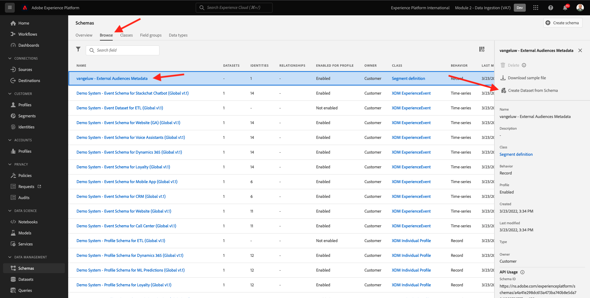
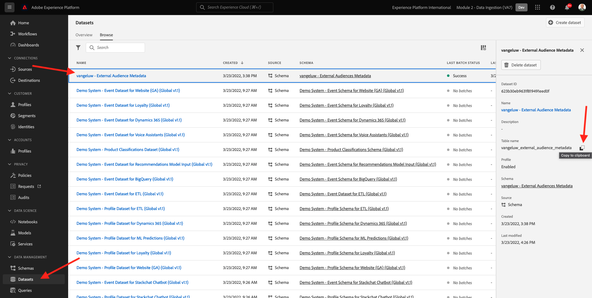
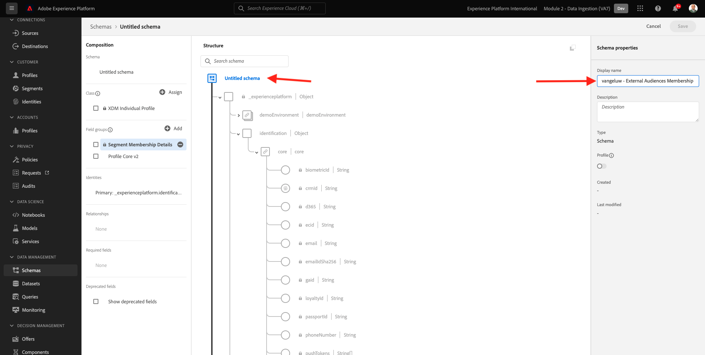
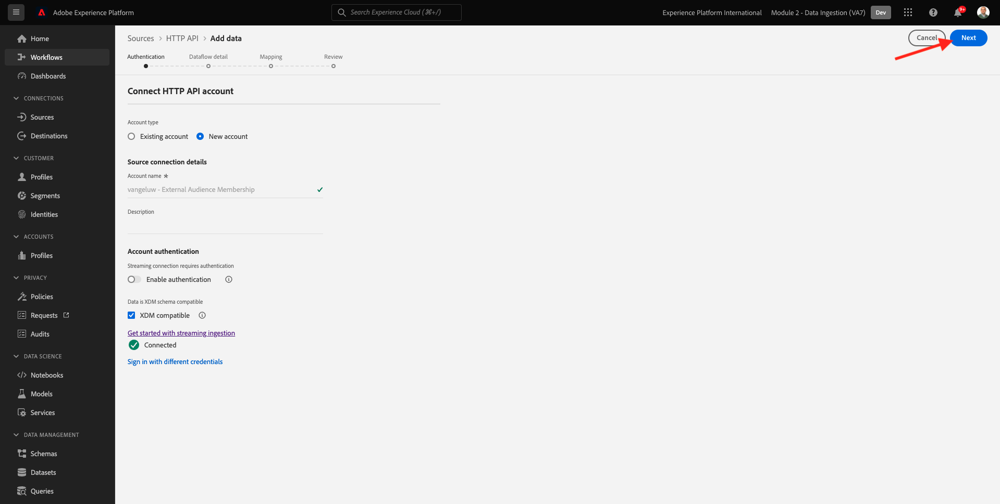
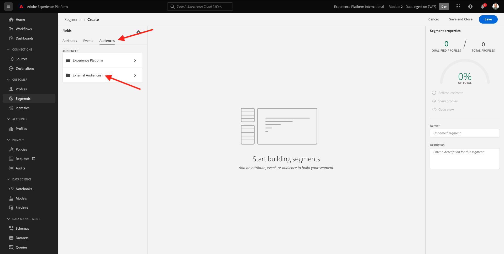

# 2.3.6 외부 대상

대부분의 경우 귀사는 Adobe Experience Platform에서 고객 프로필을 보강하기 위해 다른 애플리케이션의 기존 세그먼트를 사용할 수 있습니다.
이러한 외부 대상은 데이터 과학 모델을 기반으로 하거나 외부 데이터 플랫폼을 사용하여 정의되었을 수 있습니다.

Adobe Experience Platform의 외부 대상 기능을 사용하면 Adobe Experience Platform에서 해당 세그먼트 정의를 자세히 재정의할 필요 없이 외부 대상을 수집하고 활성화하는데 집중할 수 있습니다.

전반적인 프로세스는 다음 세 가지 주요 단계로 나뉩니다.

- 외부 대상 메타데이터 가져오기: 이 단계는 대상 이름과 같은 외부 대상 메타데이터를 Adobe Experience Platform으로 수집하기 위한 것입니다.
- 외부 대상 멤버십을 고객 프로필에 할당합니다. 이 단계는 외부 세그먼트 멤버십 속성으로 고객 프로필을 보강하기 위한 것입니다.
- Adobe Experience Platform에서 세그먼트 만들기: 이 단계는 외부 대상 멤버십을 기반으로 실행 가능한 세그먼트를 만들기 위한 것입니다.

## 2.3.6.1 메타데이터

[Adobe Experience Platform](https://experience.adobe.com/platform)(으)로 이동합니다. 로그인하면 Adobe Experience Platform 홈페이지에 접속하게 됩니다.


>[!IMPORTANT]
>
>이 연습에 사용할 샌드박스는 ``--module2sandbox--``입니다.

계속하려면 **샌드박스**&#x200B;를 선택해야 합니다. 선택할 샌드박스 이름이 ``--module2sandbox--``입니다. 화면 상단의 파란색 선에 있는 텍스트 **[!UICONTROL 프로덕션]**&#x200B;을(를) 클릭하면 됩니다. 적절한 [!UICONTROL 샌드박스]를 선택하면 화면이 변경되고 이제 전용 [!UICONTROL 샌드박스]에 있게 됩니다.


세그먼트 데이터는 프로필이 세그먼트의 일부가 되는 조건을 정의하지만, 세그먼트 메타데이터는 세그먼트의 이름, 설명 및 상태와 같은 세그먼트에 대한 정보입니다. 외부 대상 메타데이터가 Adobe Experience Platform에 저장되므로 ID 네임스페이스를 사용하여 Adobe Experience Platform에서 메타데이터를 수집해야 합니다.

## 2.3.6.1.1 외부 대상을 위한 Id 네임스페이스

**외부 대상**에서 사용할 ID 네임스페이스가 이미 만들어졌습니다.
이미 만들어진 ID를 보려면 **ID**(으)로 이동하여 **외부**&#x200B;를 검색하십시오. &quot;외부 대상&quot; 항목을 클릭합니다.

참고 사항:

- ID 기호 **externalaudiences**&#x200B;은(는) 외부 대상 ID를 참조하기 위해 다음 단계에서 사용됩니다.
- 이 ID 네임스페이스는 고객 프로필이 아닌 세그먼트를 식별하기 위한 것이 아니므로 **비사용자 식별자** 유형이 사용됩니다.


## 2.3.6.1.2 외부 대상 메타데이터 스키마 만들기

외부 대상 메타데이터는 **세그먼트 정의 스키마**&#x200B;를 기반으로 합니다. 자세한 내용은 [XDM Github 저장소](https://github.com/adobe/xdm/blob/master/docs/reference/classes/segmentdefinition.schema.md)를 참조하십시오.

왼쪽 메뉴에서 스키마로 이동합니다. **+ 스키마 만들기**&#x200B;를 클릭한 다음 **찾아보기**&#x200B;를 클릭합니다.


클래스를 할당하려면 **세그먼트 정의**&#x200B;를 검색하세요. **세그먼트 정의** 클래스를 선택하고 **클래스 할당**&#x200B;을 클릭합니다.


그러면 이걸 보게 될 거야. **취소**&#x200B;를 클릭합니다.


그러면 이걸 보게 될 거야. 필드 **_id**&#x200B;을(를) 선택하십시오. 오른쪽 메뉴에서 아래로 스크롤하여 **ID** 및 **기본 ID** 확인란을 사용하도록 설정합니다. **외부 대상** ID 네임스페이스를 선택하십시오. **적용**&#x200B;을 클릭합니다.


그런 다음 스키마 이름 **제목 없는 스키마**&#x200B;를 선택합니다. 이름을 `--demoProfileLdap-- - External Audiences Metadata`(으)로 변경합니다.


**프로필** 토글을 활성화하고 확인하십시오. 마지막으로 **저장**&#x200B;을 클릭합니다.


## 2.3.6.1.3 외부 대상 메타데이터 데이터 세트 만들기

**스키마**&#x200B;에서 **찾아보기**(으)로 이동합니다. 이전 단계에서 만든 `--demoProfileLdap-- - External Audiences Metadata` 스키마를 검색하고 클릭합니다. **스키마에서 데이터 집합 만들기**&#x200B;를 클릭합니다.



필드 **이름**&#x200B;에 `--demoProfileLdap-- - External Audience Metadata`을(를) 입력하십시오. **데이터 집합 만들기**&#x200B;를 클릭합니다.


그러면 이걸 보게 될 거야. **프로필** 전환을 사용하도록 설정하는 것을 잊지 마십시오!


## 2.3.6.1.4 HTTP API Source 연결 만들기

다음으로, 메타데이터를 데이터 세트에 수집하는 데 사용할 HTTP API Source 커넥터를 구성해야 합니다.

**소스**(으)로 이동합니다. 검색 필드에 **HTTP**&#x200B;를 입력합니다. **데이터 추가**&#x200B;를 클릭합니다.


다음 정보를 입력합니다.

- **계정 유형**: **새 계정 선택**
- **계정 이름**: `--demoProfileLdap-- - External Audience Metadata` 입력
- **XDM 호환 확인란** 선택

**소스에 연결**&#x200B;을 클릭합니다.


그러면 이걸 보게 될 거야. **다음**&#x200B;을 클릭합니다.


**기존 데이터 세트**&#x200B;을(를) 선택하고 드롭다운 메뉴에서 데이터 세트 `--demoProfileLdap-- - External Audience Metadata`을(를) 검색하여 선택합니다.

**데이터 흐름 세부 정보**&#x200B;를 확인한 다음 **다음**&#x200B;을 클릭합니다.


그러면 이걸 보게 될 거야.

XDM 호환 페이로드를 HTTP API Source 커넥터로 수집하므로 마법사의 **매핑** 단계가 비어 있으므로 매핑이 필요하지 않습니다. **다음**&#x200B;을 클릭합니다.


**검토** 단계에서 연결 및 매핑 세부 정보를 선택적으로 검토할 수 있습니다. **마침을 클릭합니다**.


그러면 이걸 보게 될 거야.


## 2.3.6.1.5 외부 대상 메타데이터 수집

Source 커넥터 개요 탭에서 **..**&#x200B;을(를) 클릭한 다음 **스키마 페이로드 복사**&#x200B;를 클릭합니다.


컴퓨터에서 텍스트 편집기 응용 프로그램을 열고 방금 복사한 페이로드를 붙여 넣습니다. 이 방법은 다음과 같습니다. 그런 다음 이 페이로드에서 **xdmEntity** 개체를 업데이트해야 합니다.


개체 **xdmEntity**&#x200B;을(를) 아래 코드로 바꿔야 합니다. 아래 코드를 복사하여 텍스트 편집기에서 **xdmEntity** 개체를 대체하여 텍스트 파일에 붙여넣습니다.

```
"xdmEntity": {
    "_id": "--demoProfileLdap---extaudience-01",
    "description": "--demoProfileLdap---extaudience-01 description",
    "segmentIdentity": {
      "_id": "--demoProfileLdap---extaudience-01",
      "namespace": {
        "code": "externalaudiences"
      }
    },
    "segmentName": "--demoProfileLdap---extaudience-01 name",
    "segmentStatus": "ACTIVE",
    "version": "1.0"
  }
```

그런 다음 이 메시지가 표시됩니다.


그런 다음 새 **터미널** 창을 엽니다. 텍스트 편집기에서 모든 텍스트를 복사하여 터미널 창에 붙여넣습니다.


다음으로 **Enter**&#x200B;를 누르십시오.

그러면 터미널 창에 데이터 수집 확인이 표시됩니다.


HTTP API Source 커넥터 화면을 새로 고칩니다. 그러면 데이터가 처리 중인 것을 볼 수 있습니다.


## 2.3.6.1.6 외부 대상 메타데이터 수집 유효성 검사

처리가 완료되면 쿼리 서비스를 사용하여 데이터 세트의 데이터 가용성을 확인할 수 있습니다.

오른쪽 메뉴에서 **데이터 세트**(으)로 이동하여 이전에 만든 `--demoProfileLdap-- - External Audience Metadata` 데이터 세트를 선택합니다.



오른쪽 메뉴에서 쿼리로 이동한 다음 **쿼리 만들기**&#x200B;를 클릭합니다.


다음 코드를 입력한 다음 **SHIFT + ENTER**&#x200B;를 누르십시오.

```
select * from --demoProfileLdap--_external_audience_metadata
```

쿼리 결과에는 수집한 외부 대상의 메타데이터가 표시됩니다.


## 2.3.6.2 세그먼트 멤버십

이제 외부 대상 메타데이터를 사용할 수 있으므로 특정 고객 프로필에 대한 세그먼트 멤버십을 수집할 수 있습니다.

이제 세그먼트 멤버십 스키마에 대해 보강된 프로필 데이터 세트를 준비해야 합니다. 자세한 내용은 [XDM Github 저장소](https://github.com/adobe/xdm/blob/master/docs/reference/datatypes/segmentmembership.schema.md)를 참조하십시오.

## 2.3.6.2.1 외부 대상 멤버십 스키마 만들기

오른쪽 메뉴에서 **스키마**(으)로 이동합니다. **스키마 만들기**&#x200B;를 클릭한 다음 **XDM 개인 프로필**&#x200B;을 클릭합니다.


**필드 그룹 추가** 팝업에서 **프로필 코어**&#x200B;를 검색합니다. **프로필 코어 v2** 필드 그룹을 선택하십시오.


그런 다음 **필드 그룹 추가** 팝업에서 **세그먼트 멤버십**&#x200B;을 검색합니다. **세그먼트 멤버십 세부 정보** 필드 그룹을 선택하십시오. **필드 그룹 추가**&#x200B;를 클릭합니다.


그러면 이걸 보게 될 거야. `--aepTenantId--.identification.core` 필드로 이동합니다. **crmId** 필드를 클릭합니다. 오른쪽 메뉴에서 아래로 스크롤하여 **ID** 및 **기본 ID** 확인란을 선택합니다. **ID 네임스페이스**&#x200B;에 대해 **데모 시스템 - CRMID**&#x200B;을(를) 선택하십시오.

**적용**&#x200B;을 클릭합니다.


그런 다음 스키마 이름 **제목 없는 스키마**&#x200B;를 선택합니다. 표시 이름 필드에 `--demoProfileLdap-- - External Audiences Membership`을(를) 입력합니다.



그런 다음 **프로필** 전환을 활성화하고 확인합니다. **저장**&#x200B;을 클릭합니다.


## 2.3.6.2.2 외부 대상 멤버십 데이터 세트 만들기

**스키마**&#x200B;에서 **찾아보기**(으)로 이동합니다. 이전 단계에서 만든 `--demoProfileLdap-- - External Audiences Membership` 스키마를 검색하고 클릭합니다. **스키마에서 데이터 집합 만들기**&#x200B;를 클릭합니다.


필드 **이름**&#x200B;에 `--demoProfileLdap-- - External Audiences Membership`을(를) 입력하십시오. **데이터 집합 만들기**&#x200B;를 클릭합니다.


그러면 이걸 보게 될 거야. **프로필** 전환을 사용하도록 설정하는 것을 잊지 마십시오!


## 2.3.6.2.3 HTTP API Source 연결 만들기


다음으로, 메타데이터를 데이터 세트에 수집하는 데 사용할 HTTP API Source 커넥터를 구성해야 합니다.

**소스**(으)로 이동합니다. 검색 필드에 **HTTP**&#x200B;를 입력합니다. **데이터 추가**&#x200B;를 클릭합니다.


다음 정보를 입력합니다.

- **계정 유형**: **새 계정 선택**
- **계정 이름**: `--demoProfileLdap-- - External Audience Membership` 입력
- **XDM 호환 확인란** 선택

**소스에 연결**&#x200B;을 클릭합니다.


그러면 이걸 보게 될 거야. **다음**&#x200B;을 클릭합니다.



**기존 데이터 세트**&#x200B;을(를) 선택하고 드롭다운 메뉴에서 데이터 세트 `--demoProfileLdap-- - External Audiences Membership`을(를) 검색하여 선택합니다.

**데이터 흐름 세부 정보**&#x200B;를 확인한 다음 **다음**&#x200B;을 클릭합니다.


그러면 이걸 보게 될 거야.

XDM 호환 페이로드를 HTTP API Source 커넥터로 수집하므로 마법사의 **매핑** 단계가 비어 있으므로 매핑이 필요하지 않습니다. **다음**&#x200B;을 클릭합니다.


**검토** 단계에서 연결 및 매핑 세부 정보를 선택적으로 검토할 수 있습니다. **마침을 클릭합니다**.


그러면 이걸 보게 될 거야.


## 2.3.6.2.4 외부 대상 멤버십 데이터 수집

Source 커넥터 개요 탭에서 **..**&#x200B;을(를) 클릭한 다음 **스키마 페이로드 복사**&#x200B;를 클릭합니다.


컴퓨터에서 텍스트 편집기 응용 프로그램을 열고 방금 복사한 페이로드를 붙여 넣습니다. 이 방법은 다음과 같습니다. 그런 다음 이 페이로드에서 **xdmEntity** 개체를 업데이트해야 합니다.


개체 **xdmEntity**&#x200B;을(를) 아래 코드로 바꿔야 합니다. 아래 코드를 복사하여 텍스트 편집기에서 **xdmEntity** 개체를 대체하여 텍스트 파일에 붙여넣습니다.

```
  "xdmEntity": {
    "_id": "--demoProfileLdap---profile-test-01",
    "_experienceplatform": {
      "identification": {
        "core": {
          "crmId": "--demoProfileLdap---profile-test-01"
        }
      }
    },
    "personID": "--demoProfileLdap---profile-test-01",
    "segmentMembership": {
      "externalaudiences": {
        "--demoProfileLdap---extaudience-01": {
          "status": "realized",
          "lastQualificationTime": "2022-03-05T00:00:00Z"
        }
      }
    }
  }
```

그런 다음 이 메시지가 표시됩니다.


그런 다음 새 **터미널** 창을 엽니다. 텍스트 편집기에서 모든 텍스트를 복사하여 터미널 창에 붙여넣습니다.


다음으로 **Enter**&#x200B;를 누르십시오.

그러면 터미널 창에 데이터 수집 확인이 표시됩니다.


HTTP API Source 커넥터 화면을 새로 고칩니다. 여기서 몇 분 정도 지나면 데이터가 처리되는 것을 볼 수 있습니다.


## 2.3.6.2.5 외부 대상 멤버십 수집 유효성 검사

처리가 완료되면 쿼리 서비스를 사용하여 데이터 세트의 데이터 가용성을 확인할 수 있습니다.

오른쪽 메뉴에서 **데이터 세트**(으)로 이동하여 이전에 만든 `--demoProfileLdap-- - External Audiences Membership ` 데이터 세트를 선택합니다.


오른쪽 메뉴에서 쿼리로 이동한 다음 **쿼리 만들기**&#x200B;를 클릭합니다.


다음 코드를 입력한 다음 **SHIFT + ENTER**&#x200B;를 누르십시오.

```
select * from --demoProfileLdap--_external_audiences_membership
```

쿼리 결과에는 수집한 외부 대상의 메타데이터가 표시됩니다.


## 2.3.6.3 세그먼트 만들기

이제 외부 대상에 대해 조치를 취할 준비가 되었습니다.
Adobe Experience Platform에서 조치를 취하는 것은 세그먼트를 만들고, 각 대상을 채우고, 이러한 대상을 대상에 공유하는 것을 통해 수행됩니다.
이제 방금 만든 외부 대상을 사용하여 세그먼트를 만듭니다.

왼쪽 메뉴에서 **세그먼트**(으)로 이동한 다음 **세그먼트 만들기**&#x200B;를 클릭합니다.


**대상**(으)로 이동합니다. 그러면 이걸 보게 될 거야. **외부 대상**&#x200B;을 클릭합니다.



이전에 만든 외부 대상(`--demoProfileLdap---extaudience-01`)을 선택하십시오. 대상을 캔버스로 드래그하여 놓습니다.


세그먼트 이름을 지정하십시오. `--demoProfileLdap-- - extaudience-01`을(를) 사용하십시오. **저장 후 닫기**&#x200B;를 클릭합니다.


그러면 이걸 보게 될 거야. 또한 세그먼트 멤버십을 수집한 프로필이 **샘플 프로필** 목록에 표시됩니다.


이제 세그먼트가 준비되었으며, 활성화 대상으로 전송할 수 있습니다.

## 2.3.6.4 고객 프로필 시각화

이제 고객 프로필에서 세그먼트 자격을 시각화할 수도 있습니다. **프로필**(으)로 이동하여 ID 네임스페이스 **데모 시스템 - CRMID**&#x200B;을(를) 사용하고 연습 6.6.2.4의 일부로 사용한 ID `--demoProfileLdap---profile-test-01`을(를) 제공하고 **보기**&#x200B;를 클릭합니다. **프로필 ID**&#x200B;를 클릭하여 프로필을 엽니다.


외부 대상이 표시되는 **세그먼트 멤버십**(으)로 이동합니다.


다음 단계: [2.3.7 대상 SDK](./ex7.md)

[모듈 2.3으로 돌아가기](./real-time-cdp-build-a-segment-take-action.md)

[모든 모듈로 돌아가기](../../../overview.md)
