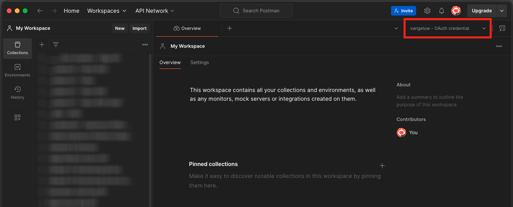
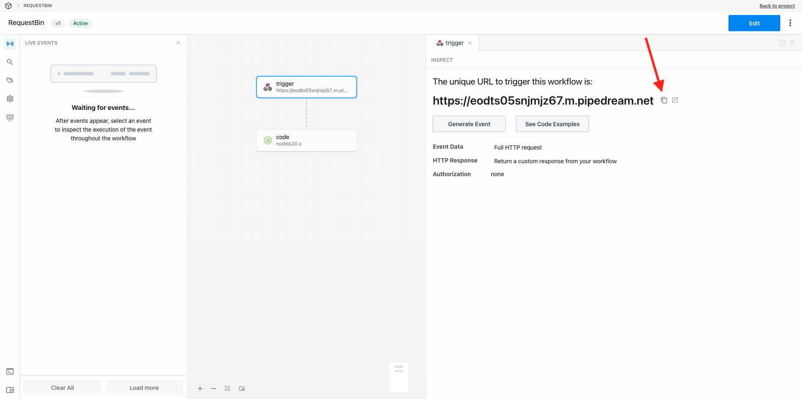
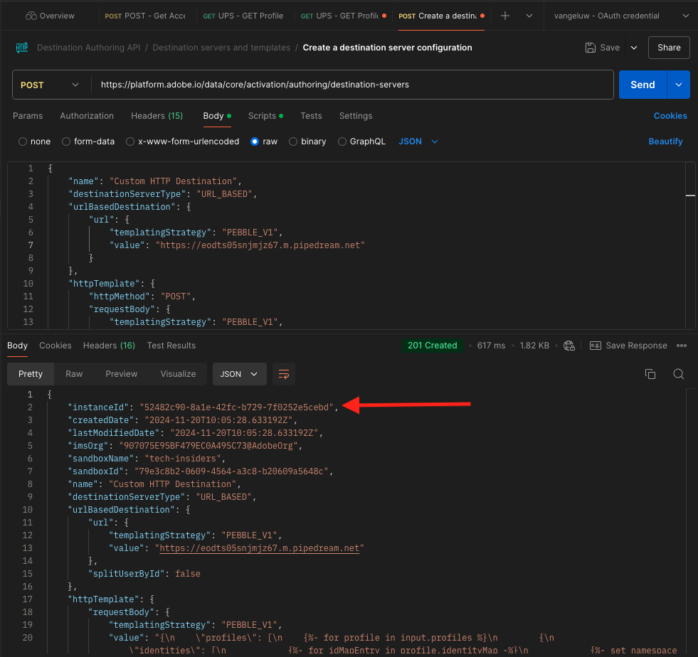
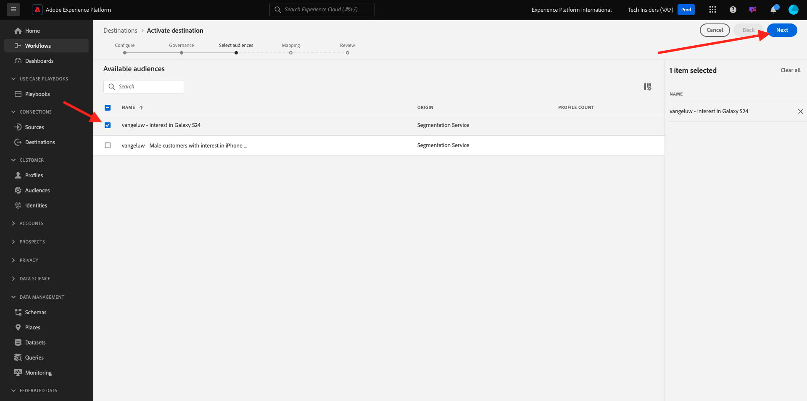

# 2.3.7 대상 SDK

## 2.3.7.1 Adobe I/O 프로젝트 설정

>[!IMPORTANT]
>
>2021년 12월 이후에 Adobe I/O 프로젝트를 만든 경우 해당 프로젝트를 재사용할 수 있습니다. 이 연습을 건너뛰고 즉시 연습 6.7.2로 이동합니다.
>
>2021년 12월 이전에 Adobe I/O 프로젝트를 만든 경우 대상 작성 API와 호환되도록 새 프로젝트를 만드십시오.

이 연습에서는 Platform의 API에 대해 쿼리하기 위해 Adobe I/O을 상당히 집중적으로 사용합니다. Adobe I/O을 설정하려면 아래 단계를 따르십시오.

[https://developer.adobe.com/console/home](https://developer.adobe.com/console/home)(으)로 이동


화면 오른쪽 상단에서 올바른 Adobe Experience Platform 인스턴스를 선택해야 합니다. 인스턴스는 `--envName--`입니다.


**새 프로젝트 만들기**&#x200B;를 클릭합니다.

 또는


**+ 프로젝트에 추가**&#x200B;를 선택하고 **API**&#x200B;를 선택합니다.


그러면 다음과 같은 결과가 표시됩니다.


**Adobe Experience Platform** 아이콘을 클릭합니다.


**Experience Platform API**&#x200B;를 클릭합니다.


**다음**&#x200B;을 클릭합니다.


이제 Adobe I/O에서 보안 키 쌍을 생성하거나 기존 보안 키 쌍을 업로드하도록 선택할 수 있습니다.

**옵션 1 - 키 쌍 생성**&#x200B;을 선택합니다.


**키 쌍 생성**&#x200B;을 클릭합니다.


약 30초 동안 회전체가 보일 겁니다.


그러면 이 메시지가 표시되고 생성된 키 쌍이 zip 파일로 다운로드됩니다. **config.zip**.

데스크톱에서 **config.zip** 파일의 압축을 해제하면 다음 2개의 파일이 포함됩니다.


- **certificate_pub.crt**&#x200B;은 공개 키 인증서입니다. 보안 관점에서, 이것은 온라인 응용 프로그램과의 통합을 설정하는 데 자유롭게 사용되는 인증서입니다.
- **private.key**&#x200B;은(는) 개인 키입니다. 이것은 누구와도 절대 공유되어서는 안 됩니다. 개인 키 는 API 구현을 인증하는 데 사용하며, 암호로 간주됩니다. 개인 키를 누구와도 공유하는 경우 구현에 액세스하고 API를 남용하여 악의적인 데이터를 플랫폼으로 수집하고 플랫폼에 있는 모든 데이터를 추출할 수 있습니다.


다음 단계 및 Adobe I/O 및 Adobe Experience Platform API에 대한 향후 액세스를 위해 필요하므로 **config.zip** 파일을 안전한 위치에 저장하십시오.

**다음**&#x200B;을 클릭합니다.


이제 통합을 위해 **제품 프로필**&#x200B;을(를) 선택해야 합니다.

필요한 제품 프로필을 선택합니다.

**FYI**: Adobe Experience Platform 인스턴스에서 제품 프로필의 이름이 달라집니다. Adobe Admin Console에 설정된 적절한 액세스 권한이 있는 제품 프로필을 하나 이상 선택해야 합니다.


**구성된 API 저장**&#x200B;을 클릭합니다.


몇 초 동안 회전자를 볼 수 있을 겁니다.


그런 다음 통합을 확인할 수 있습니다.


**Postman용 다운로드** 단추를 클릭한 다음 **서비스 계정(JWT)**&#x200B;을 클릭하여 Postman 환경을 다운로드합니다(환경이 다운로드될 때까지 기다리십시오. 몇 초 정도 소요될 수 있습니다).


**서비스 계정(JWT)**&#x200B;이 표시될 때까지 아래로 스크롤합니다. 여기에서 Adobe Experience Platform과의 통합을 구성하는 데 사용되는 모든 통합 세부 정보를 찾을 수 있습니다.


현재 IO 프로젝트에 일반 이름이 있습니다. 통합에 친숙한 이름을 지정해야 합니다. 표시된 대로 **프로젝트 1**(또는 유사한 이름)을 클릭합니다.


**프로젝트 편집**&#x200B;을 클릭합니다.


통합에 사용할 이름과 설명을 입력합니다. 명명 규칙으로 `AEP API --aepUserLdap--`을(를) 사용합니다. ldap를 ldap로 바꿉니다.
예를 들어 ldap가 vangeluw인 경우 통합의 이름과 설명은 AEP API vangeluw가 됩니다.

`AEP API --aepUserLdap--`을(를) **프로젝트 제목**(으)로 입력하십시오. **저장**&#x200B;을 클릭합니다.


이제 Adobe I/O 통합이 완료되었습니다.


## 2.3.7.2 Adobe I/O에 대한 Postman 인증

[https://www.getpostman.com/](https://www.getpostman.com/)(으)로 이동합니다.

**시작하기**&#x200B;를 클릭합니다.


그런 다음 Postman을 다운로드하여 설치합니다.


Postman 설치 후 애플리케이션을 시작합니다.

Postman에는 환경과 컬렉션의 두 가지 개념이 있습니다.

- 환경에는 거의 일관되지 않은 모든 환경 변수가 포함되어 있습니다. 환경에서는 개인 키 및 기타 같은 보안 자격 증명과 함께 플랫폼 환경의 IMSOrg와 같은 것을 찾을 수 있습니다. 환경 파일은 이전 연습에서 Adobe I/O 설정 중에 다운로드한 파일로, 이름은 다음과 같습니다. **service.postman_environment.json**.

- 컬렉션에는 사용할 수 있는 여러 API 요청이 포함되어 있습니다. 2개의 컬렉션을 사용합니다.
   - Adobe I/0 인증을 위한 1개 컬렉션
   - 이 단원의 연습에 대한 컬렉션 1개
   - 대상 작성용 Real-Time CDP 모듈의 연습에 대한 컬렉션 1개

로컬 데스크톱에 [postman.zip](./../../../assets/postman/postman_profile.zip) 파일을 다운로드하십시오.

이 **postman.zip** 파일에서 다음 파일을 찾을 수 있습니다.

- `_Adobe I-O - Token.postman_collection.json`
- `_Adobe Experience Platform Enablement.postman_collection.json`
- `Destination_Authoring_API.json`

**postman.zip** 파일의 압축을 풀고 이 3개의 파일을 Adobe I/O에서 다운로드한 Postman 환경과 함께 데스크톱의 폴더에 저장합니다. 이 폴더에 다음 4개의 파일이 있어야 합니다.


Postman으로 돌아갑니다. **가져오기**&#x200B;를 클릭합니다.


**파일 업로드**&#x200B;를 클릭합니다.


다운로드한 4개의 파일을 추출한 바탕 화면의 폴더로 이동합니다. 이 4개의 파일을 동시에 선택하고 **열기**&#x200B;를 클릭합니다.


**열기**&#x200B;를 클릭하면 Postman에 가져오려는 환경 및 컬렉션에 대한 개요가 표시됩니다. **가져오기**&#x200B;를 클릭합니다.


이제 Postman에서 API를 통해 Adobe Experience Platform과 상호 작용하기 시작하는 데 필요한 모든 것을 갖추고 있습니다.

가장 먼저 해야 할 일은 자신이 제대로 인증되었는지 확인하는 것입니다. 인증을 받으려면 액세스 토큰을 요청해야 합니다.

요청을 실행하기 전에 올바른 환경을 선택했는지 확인하십시오. 오른쪽 상단의 환경 드롭다운 목록을 확인하여 현재 선택한 환경을 확인할 수 있습니다.

선택한 환경의 이름은 다음과 유사해야 합니다.



**눈** 아이콘을 클릭한 다음 **편집**&#x200B;을 클릭하여 환경 파일의 개인 키를 업데이트합니다.


그러면 이걸 보게 될 거야. 필드 **PRIVATE_KEY**&#x200B;을(를) 제외하고 모든 필드가 미리 채워집니다.


Adobe I/O 프로젝트를 만들 때 개인 키가 생성되었습니다. 이 파일은 zip 파일(**config.zip**)로 다운로드되었습니다. 해당 zip 파일을 바탕 화면에 추출합니다.


**config** 폴더를 열고 선택한 텍스트 편집기로 **private.key** 파일을 엽니다.


그러면 이와 유사한 항목이 표시되면 모든 텍스트를 클립보드에 복사합니다.


Postman으로 돌아가서 **초기 값** 및 **현재 값** 열에 대해 **PRIVATE_KEY** 변수 옆에 있는 필드에 개인 키를 붙여 넣습니다. **저장**&#x200B;을 클릭합니다.


이제 Postman 환경 및 컬렉션이 구성되고 작동합니다. 이제 Postman에서 Adobe I/O으로 인증할 수 있습니다.

이를 위해서는 통신의 암호화 및 암호 해독을 처리할 외부 라이브러리를 로드해야 합니다. 이 라이브러리를 로드하려면 이름이 **INIT: RS256**&#x200B;용 암호화 라이브러리 로드인 요청을 실행해야 합니다. **_request - 토큰 컬렉션**&#x200B;에서 이 Adobe I/O을 선택하면 화면 중간에 표시됩니다.


파란색 **보내기** 단추를 클릭합니다. 몇 초 후에 Postman의 **본문** 섹션에 응답이 표시됩니다.


이제 암호화 라이브러리가 로드되면 Adobe I/O을 인증할 수 있습니다.

**\_Request - Token collection**&#x200B;에서 이름이 **IMS: JWT 생성 + Auth**&#x200B;인 Adobe I/O을 선택합니다. 요청 세부 사항이 화면 중간에 다시 표시됩니다.


파란색 **보내기** 단추를 클릭합니다. 몇 초 후에 Postman의 **본문** 섹션에 응답이 표시됩니다.


구성이 성공하면 다음 정보가 포함된 유사한 응답이 표시됩니다.

| 키 | 값 |
|:-------------:| :---------------:| 
| token_type | **전달자** |
| access_token | **eyJ4NXUiOiJpbXNfbmEx..QT7mqZkumN1tdsPEioOEl4087Dg** |
| expires_in | **86399973** |

Adobe I/O에서 특정 값(매우 긴 access_token)과 만료 창이 있는 **전달자** 토큰을 지정했습니다.

우리가 받은 토큰은 이제 24시간 동안 유효합니다. 즉, 24시간 후 Postman을 사용하여 Adobe I/O을 인증하려면 이 요청을 다시 실행하여 새 토큰을 생성해야 합니다.

## 2.3.7.3 끝점 및 형식 정의

이 연습에서는 세그먼트가 자격을 가질 때 자격 이벤트가 해당 끝점으로 스트리밍될 수 있도록 를 구성하는 끝점이 필요합니다. 이 연습에서는 [https://webhook.site/](https://webhook.site/)을(를) 사용하여 샘플 끝점을 사용합니다. [https://webhook.site/](https://webhook.site/)(으)로 이동하십시오. 여기서 이와 유사한 내용을 볼 수 있습니다. URL을 복사하려면 **클립보드에 복사**&#x200B;를 클릭하십시오. 다음 연습에서는 이 URL을 지정해야 합니다. 이 예제의 URL은 `https://webhook.site/e0eb530c-15b4-4a29-8b50-e40877d5490a`입니다.



형식에서는 고객 식별자와 같은 메타데이터와 함께 세그먼트 자격 또는 부적격 여부를 스트리밍하는 표준 템플릿을 사용합니다. 특정 끝점의 기대에 맞게 템플릿을 사용자 정의할 수 있지만, 이 연습에서는 표준 템플릿을 재사용하여 이 템플릿과 같은 페이로드가 끝점으로 스트리밍됩니다.

```json
{
  "profiles": [
    {
      "identities": [
        {
          "type": "ecid",
          "id": "64626768309422151580190219823409897678"
        }
      ],
      "AdobeExperiencePlatformSegments": {
        "add": [
          "f58c723c-f1e5-40dd-8c79-7bb4ab47f041"
        ],
        "remove": []
      }
    }
  ]
}
```

## 2.3.7.4 서버 및 템플릿 구성 만들기

Adobe Experience Platform에서 고유한 대상을 만드는 첫 번째 단계는 서버 및 템플릿 구성을 만드는 것입니다.

이렇게 하려면 **대상 작성 API**, **대상 서버 및 템플릿**(으)로 이동한 다음 클릭하여 요청 **POST - 대상 서버 구성 만들기**&#x200B;를 엽니다. 그러면 이걸 보게 될 거야. **Headers**&#x200B;에서 **x-sandbox-name** 키의 값을 수동으로 업데이트하고 `--aepSandboxName--`(으)로 설정해야 합니다. 값 **{{SANDBOX_NAME}}**&#x200B;을(를) 선택하십시오.


`--aepSandboxName--`(으)로 바꾸기


그런 다음 **본문**(으)로 이동합니다. 자리 표시자 **{{body}}**&#x200B;을(를) 선택하십시오.


이제 자리 표시자 **{{body}}**&#x200B;을(를) 아래 코드로 바꾸어야 합니다.

```json
{
    "name": "Custom HTTP Destination",
    "destinationServerType": "URL_BASED",
    "urlBasedDestination": {
        "url": {
            "templatingStrategy": "PEBBLE_V1",
            "value": "yourURL"
        }
    },
    "httpTemplate": {
        "httpMethod": "POST",
        "requestBody": {
            "templatingStrategy": "PEBBLE_V1",
            "value": "{\n    \"profiles\": [\n    \n        {\n            \"identities\": [\n            \n            \n                \n                {\n                    \"type\": \"{{ namespace }}\",\n                    \"id\": \"{{ identity.id }}\"\n                },\n                ,\n            \n            ],\n            \"AdobeExperiencePlatformSegments\": {\n                \"add\": [\n                \n                    \"{{ segment.key }}\",\n                \n                ],\n                \"remove\": [\n                {#- Alternative syntax for filtering segments by status: -#}\n                \n                    \"{{ segment.key }}\",\n                \n                ]\n            }\n        },\n    \n    ]\n}"
        },
        "contentType": "application/json"
    }
}
```

위의 코드를 붙여넣은 후 필드 **urlBasedDestination.url.value**&#x200B;을(를) 수동으로 업데이트해야 하며, 이전 단계에서 만든 웹후크의 url(이 예제의 경우 `https://webhook.site/e0eb530c-15b4-4a29-8b50-e40877d5490a`)로 설정해야 합니다.


필드 **urlBasedDestination.url.value**&#x200B;을(를) 업데이트하면 다음과 같이 표시됩니다. **보내기**&#x200B;를 클릭합니다.


**보내기**&#x200B;를 클릭하면 서버 템플릿이 만들어지고 응답의 일부로 **instanceId**(이)라는 필드가 표시됩니다. 다음 단계에서 필요하므로 적어 두십시오. 이 예제에서 **instanceId**은
`eb0f436f-dcf5-4993-a82d-0fcc09a6b36c`.



## 2.3.7.5 대상 구성 만들기

Postman의 **대상 작성 API**&#x200B;에서 **대상 구성**(으)로 이동한 다음 클릭하여 **POST - 대상 구성 만들기** 요청을 엽니다. 그러면 이걸 보게 될 거야. **Headers**&#x200B;에서 **x-sandbox-name** 키의 값을 수동으로 업데이트하고 `--aepSandboxName--`(으)로 설정해야 합니다. 값 **{{SANDBOX_NAME}}**&#x200B;을(를) 선택하십시오.


`--aepSandboxName--`(으)로 바꾸기


그런 다음 **본문**(으)로 이동합니다. 자리 표시자 **{{body}}**&#x200B;을(를) 선택하십시오.


이제 자리 표시자 **{{body}}**&#x200B;을(를) 아래 코드로 바꾸어야 합니다.

```json
{
    "name": "--aepUserLdap-- - Webhook",
    "description": "Exports segment qualifications and identities to a custom webhook via Destination SDK.",
    "status": "TEST",
    "customerAuthenticationConfigurations": [
        {
            "authType": "BEARER"
        }
    ],
    "customerDataFields": [
        {
            "name": "endpointsInstance",
            "type": "string",
            "title": "Select Endpoint",
            "description": "We could manage several instances across the globe for REST endpoints that our customers are provisioned for. Select your endpoint in the dropdown list.",
            "isRequired": true,
            "enum": [
                "US",
                "EU",
                "APAC",
                "NZ"
            ]
        }
    ],
    "uiAttributes": {
        "documentationLink": "https://experienceleague.adobe.com/docs/experience-platform/destinations/home.html?lang=en",
        "category": "streaming",
        "connectionType": "Server-to-server",
        "frequency": "Streaming"
    },
    "identityNamespaces": {
        "ecid": {
            "acceptsAttributes": true,
            "acceptsCustomNamespaces": false
        }
    },
    "segmentMappingConfig": {
        "mapExperiencePlatformSegmentName": true,
        "mapExperiencePlatformSegmentId": true,
        "mapUserInput": false
    },
    "aggregation": {
        "aggregationType": "BEST_EFFORT",
        "bestEffortAggregation": {
            "maxUsersPerRequest": "1000",
            "splitUserById": false
        }
    },
    "schemaConfig": {
        "profileRequired": false,
        "segmentRequired": true,
        "identityRequired": true
    },
    "destinationDelivery": [
        {
            "authenticationRule": "NONE",
            "destinationServerId": "yourTemplateInstanceID"
        }
    ]
}
```


위의 코드를 붙여넣은 후 **destinationDelivery 필드를 수동으로 업데이트해야 합니다. destinationServerId**&#x200B;을(를) 사용하려면 이전 단계에서 만든 대상 서버 템플릿의 **instanceId**(이 예제에서는 `eb0f436f-dcf5-4993-a82d-0fcc09a6b36c`)로 설정해야 합니다. 그런 다음 **보내기**&#x200B;를 클릭합니다.


그러면 이 응답이 표시됩니다.


이제 대상이 Adobe Experience Platform에서 생성되었습니다. 가서 확인해 보자.

[Adobe Experience Platform](https://experience.adobe.com/platform)(으)로 이동합니다. 로그인하면 Adobe Experience Platform 홈페이지에 접속하게 됩니다.


계속하려면 **샌드박스**&#x200B;를 선택해야 합니다. 선택할 샌드박스 이름이 ``--aepSandboxName--``입니다. 화면 상단의 파란색 선에 있는 텍스트 **[!UICONTROL 프로덕션]**&#x200B;을(를) 클릭하면 됩니다. 적절한 [!UICONTROL 샌드박스]를 선택하면 화면이 변경되고 이제 전용 [!UICONTROL 샌드박스]에 있게 됩니다.


왼쪽 메뉴에서 **대상**(으)로 이동하고 **카탈로그**&#x200B;를 클릭한 다음 **스트리밍** 카테고리로 스크롤합니다. 이제 목적지를 사용할 수 있습니다.


## 2.3.7.6 세그먼트를 대상에 연결

**대상** > **카탈로그**&#x200B;에서 대상에 대한 **설정**&#x200B;을 클릭하여 새 대상에 세그먼트를 추가하세요.


**1234**&#x200B;과(와) 같은 더미 전달자 토큰을 입력하십시오. **대상에 연결**&#x200B;을 클릭합니다.


그러면 이걸 보게 될 거야. 대상의 이름으로 `--aepUserLdap-- - Webhook`을(를) 사용합니다. 이 예제 **EU**&#x200B;에서 선택한 끝점을 선택하십시오. **다음**&#x200B;을 클릭합니다.


선택적으로 데이터 거버넌스 정책을 선택할 수 있습니다. **다음**&#x200B;을 클릭합니다.


이전에 만든 세그먼트(이름: `--aepUserLdap-- - Interest in PROTEUS FITNESS JACKSHIRT`)를 선택하십시오. **다음**&#x200B;을 클릭합니다.



그러면 이걸 보게 될 거야. **SOURCE 필드** `--aepTenantId--.identification.core.ecid`을(를) 필드 `Identity: ecid`에 매핑해야 합니다. **다음**&#x200B;을 클릭합니다.


**마침을 클릭합니다**.


이제 대상이 활성 상태가 되면 새 세그먼트 자격이 사용자 지정 Webhook으로 스트리밍됩니다.


## 2.3.7.7 세그먼트 활성화 테스트

[https://builder.adobedemo.com/projects](https://builder.adobedemo.com/projects)(으)로 이동합니다. Adobe ID으로 로그인하면 이 메시지가 표시됩니다. 웹 사이트 프로젝트를 클릭하여 엽니다.


이제 아래 흐름을 따라 웹 사이트에 액세스할 수 있습니다. **통합**&#x200B;을 클릭합니다.


**통합** 페이지에서 연습 0.1에서 만든 데이터 수집 속성을 선택해야 합니다.


그러면 데모 웹 사이트가 열리는 것을 볼 수 있습니다. URL을 선택하고 클립보드에 복사합니다.


새 시크릿 브라우저 창을 엽니다.


이전 단계에서 복사한 데모 웹 사이트의 URL을 붙여 넣습니다. 그런 다음 Adobe ID을 사용하여 로그인하라는 메시지가 표시됩니다.


계정 유형을 선택하고 로그인 프로세스를 완료합니다.


그러면 웹 사이트가 시크릿 브라우저 창에 로드되는 것을 볼 수 있습니다. 모든 데모에 대해 새로운 시크릿 브라우저 창을 사용하여 데모 웹 사이트 URL을 로드해야 합니다.


**Luma** 홈페이지에서 **Men**(으)로 이동하여 제품 **PROTEUS FITNESS JACKSHIRT**&#x200B;을(를) 클릭하십시오.


이제 **PROTEUS FITNESS JACKSHIRT**&#x200B;의 제품 페이지를 방문했습니다. 이는 이 연습에서 이전에 만든 세그먼트를 사용할 수 있음을 의미합니다.


프로필 뷰어를 열고 **세그먼트**(으)로 이동하면 세그먼트 자격이 표시됩니다.


이제 [https://webhook.site/](https://webhook.site/)에서 열려 있는 웹후크로 돌아가십시오. 여기에서 Adobe Experience Platform에서 시작되고 세그먼트 자격 이벤트가 포함된 새로운 수신 요청이 표시됩니다.


다음 단계: [요약 및 이점](./summary.md)

[모듈 2.3으로 돌아가기](./real-time-cdp-build-a-segment-take-action.md)

[모든 모듈로 돌아가기](../../../overview.md)
