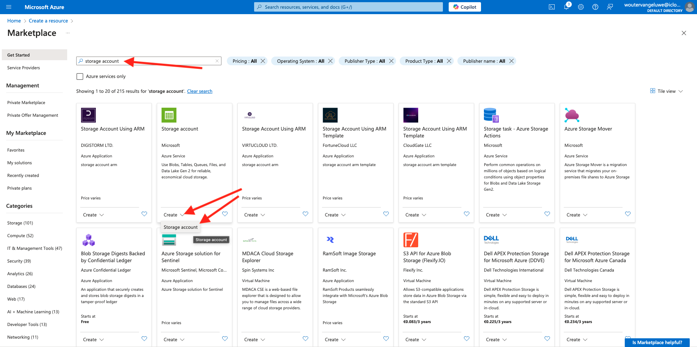

# 2.4.2 Microsoft Azure EventHub 환경 구성

Azure Event Hubs는 초당 수백만 개의 이벤트를 수집하여 여러 애플리케이션으로 스트리밍할 수 있는 확장성이 뛰어난 게시 구독 서비스입니다. 이를 통해 연결된 장치 및 애플리케이션에서 생성된 방대한 양의 데이터를 처리하고 분석할 수 있습니다.

## Azure 이벤트 허브란 무엇입니까?

Azure Event Hubs는 빅 데이터 스트리밍 플랫폼 및 이벤트 수집 서비스입니다. 초당 수백만 개의 이벤트를 수신하고 처리할 수 있습니다. 이벤트 허브로 전송된 데이터는 모든 실시간 분석 공급자나 일괄 처리/저장소 어댑터를 사용하여 변환하거나 저장할 수 있습니다.

Event Hubs는 솔루션 아키텍처에서 이벤트 수집기라고도 하는 이벤트 파이프라인의 **앞문**&#x200B;을(를) 나타냅니다. 이벤트 수집기는 이벤트 게시자(예: Adobe Experience Platform RTCDP)와 이벤트 소비자 사이에 개재되어 이벤트 스트림의 생성과 해당 이벤트의 소비를 분리하는 구성 요소 또는 서비스입니다. 이벤트 허브는 시간 유지 버퍼가 있는 통합 스트리밍 플랫폼을 제공하여 이벤트 소비자로부터 이벤트 생산자를 분리합니다.

## 이벤트 허브 네임스페이스 만들기

[https://portal.azure.com/#home](https://portal.azure.com/#home)(으)로 이동하여 **리소스 만들기**&#x200B;를 선택합니다.

리소스 화면에서 검색 창에 **Event**&#x200B;을(를) 입력합니다. **이벤트 허브** 카드를 찾아 **만들기**&#x200B;를 클릭한 다음 **이벤트 허브**&#x200B;를 클릭합니다.

Azure에서 리소스를 처음 만드는 경우 새 **리소스 그룹**&#x200B;을 만들어야 합니다. 이미 리소스 그룹이 있는 경우 리소스 그룹을 선택하거나 새로 만들 수 있습니다.

**새로 만들기**&#x200B;를 클릭하고 그룹 이름을 `--aepUserLdap---aep-enablement`로 지정한 후 **확인**&#x200B;을 클릭하세요.

표시된 대로 나머지 필드를 완료합니다.

- 네임스페이스 : 네임스페이스를 정의하고 고유해야 하며 다음 패턴 `--aepUserLdap---aep-enablement`을(를) 사용합니다.
- 위치: 원하는 위치 선택
- 가격 책정 계층: **기본**
- 처리량 단위: **1**

**검토 + 만들기**&#x200B;를 클릭합니다.

**만들기**&#x200B;를 클릭합니다.

리소스 그룹을 배포하는 데 1~2분 정도 걸릴 수 있습니다. 성공하면 다음 화면이 표시됩니다.

## Azure에서 이벤트 허브 설정

[https://portal.azure.com/#home](https://portal.azure.com/#home)(으)로 이동하여 **모든 리소스**&#x200B;를 선택합니다.

리소스 목록에서 `--aepUserLdap---aep-enablement` 이벤트 허브 네임스페이스를 클릭합니다.

`--aepUserLdap---aep-enablement` 세부 정보 화면에서 **엔터티**(으)로 이동하여 **이벤트 허브**&#x200B;를 클릭합니다.

**+ 이벤트 허브**&#x200B;를 클릭합니다.

`--aepUserLdap---aep-enablement-event-hub`을(를) 이름으로 사용하고 **검토 + 만들기**&#x200B;를 클릭합니다.

**만들기**&#x200B;를 클릭합니다.

이제 이벤트 허브 네임스페이스 아래의 **이벤트 허브**&#x200B;에 **이벤트 허브**&#x200B;이(가) 나열됩니다.

## Azure 스토리지 계정 설정

이후 연습에서 Azure 이벤트 허브 함수를 디버깅하려면 Visual Studio 코드 프로젝트 설정의 일부로 Azure 저장소 계정을 제공해야 합니다. 이제 Azure 스토리지 계정을 만듭니다.

[https://portal.azure.com/#home](https://portal.azure.com/#home)(으)로 이동하여 **리소스 만들기**&#x200B;를 선택합니다.

검색에 **저장소 계정**&#x200B;을(를) 입력하고 **저장소 계정**&#x200B;에 대한 카드를 찾은 다음 **저장소 계정**&#x200B;을(를) 클릭합니다.

**리소스 그룹**(이 연습 시작 시 생성됨)을(를) 지정하고 `--aepUserLdap--aepstorage`을(를) 저장소 계정 이름으로 사용하고 **LRS(로컬 중복 저장소)**&#x200B;을(를) 선택한 다음 **검토 + 만들기**&#x200B;를 클릭합니다.

**만들기**&#x200B;를 클릭합니다.

저장소 계정을 만드는 데 몇 초 정도 소요됩니다.

완료되면 화면에 **리소스로 이동** 단추가 표시됩니다.

**홈**&#x200B;을 클릭합니다.

이제 저장소 계정이 **최근 리소스**&#x200B;에 표시됩니다.

다음 단계: [2.4.3 Adobe Experience Platform에서 Azure Event Hub 대상 구성](./ex3.md)

[모듈 2.4로 돌아가기](./segment-activation-microsoft-azure-eventhub.md)

[모든 모듈로 돌아가기](./../../../overview.md)
