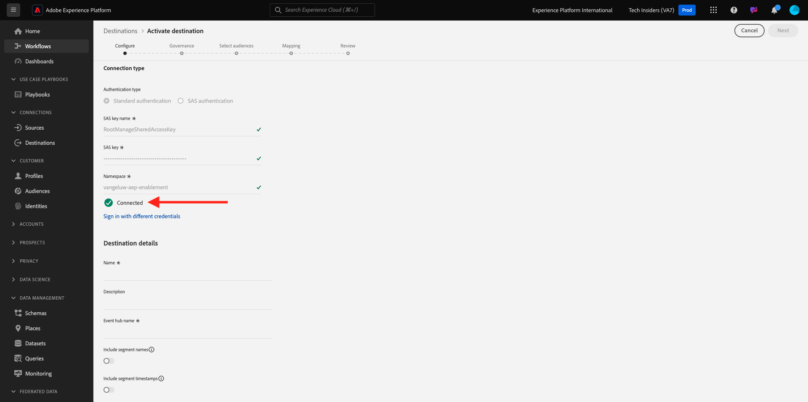

# 2.4.3 Adobe Experience Platform에서 Azure Event Hub 대상 구성

## 필요한 Azure 연결 매개 변수 식별

Adobe Experience Platform에서 이벤트 허브 대상을 구성하려면 다음이 필요합니다.

- 이벤트 허브 네임스페이스
- 이벤트 허브
- Azure SAS 키 이름
- Azure SAS 키

Event Hub 및 EventHub 네임스페이스가 이전 연습에서 정의되었습니다. [Azure에서 Event Hub 설정](./ex2.md)

### 이벤트 허브 네임스페이스

Azure 포털에서 위의 정보를 조회하려면 [https://portal.azure.com/#home](https://portal.azure.com/#home)(으)로 이동합니다. 올바른 Azure 계정을 사용하고 있는지 확인하세요.

Azure 포털에서 **모든 리소스**&#x200B;를 클릭합니다.

목록에서 **Event Hubs 네임스페이스**&#x200B;를 찾아 클릭합니다.

이제 **이벤트 허브 네임스페이스**&#x200B;의 이름이 명확하게 표시됩니다. `--aepUserLdap---aep-enablement`과(와) 유사해야 합니다.

### 이벤트 허브

**이벤트 허브 네임스페이스** 페이지에서 **엔터티 > 이벤트 허브**&#x200B;을(를) 클릭하여 이벤트 허브 네임스페이스에 정의된 이벤트 허브 목록을 가져옵니다. 이전 연습에서 사용한 이름 지정 규칙을 따랐으면 `--aepUserLdap---aep-enablement-event-hub`(이)라는 이벤트 허브를 찾을 수 있습니다. 기록해 두십시오. 다음 연습에서 필요할 것입니다.

### SAS 키 이름

**이벤트 허브 네임스페이스** 페이지에서 **설정 > 공유 액세스 정책**&#x200B;을 클릭합니다. 공유 액세스 정책 목록이 표시됩니다. 찾고 있는 SAS 키는 **RootManageSharedAccessKey**(**SAS 키 이름)입니다. 적어 주세요.

### SAS 키 값

그런 다음 **RootManageSharedAccessKey**&#x200B;을(를) 클릭하여 SAS 키 값을 가져옵니다. **클립보드에 복사** 아이콘을 눌러 **기본 키**(이 경우 `pqb1jEC0KLazwZzIf2gTHGr75Z+PdkYgv+AEhObbQEY=`)를 복사합니다.

### 대상 값 요약

이 시점에서 Adobe Experience Platform Real-time CDP에서 Azure Event Hub 대상을 정의하는 데 필요한 모든 값을 식별했어야 합니다.

| 대상 속성 이름 | 대상 속성 값 | 예제 값 |
|---|---|---|
| sasKeyName | SAS 키 이름 | RootManageSharedAccessKey |
| sasKey | SAS 키 값 | pqb1jEC0KLazwZzIf2gTHGr75Z+PdkYgv+AEhObbQEY= |
| 네임스페이스 | 이벤트 허브 네임스페이스 | `--aepUserLdap---aep-enablement` |
| 이벤트 허브 이름 | 이벤트 허브 | `--aepUserLdap---aep-enablement-event-hub` |

## Adobe Experience Platform에서 Azure Event Hub 대상 만들기

URL [https://experience.adobe.com/platform](https://experience.adobe.com/platform)로 이동하여 Adobe Experience Platform에 로그인합니다.

로그인하면 Adobe Experience Platform 홈페이지에 접속하게 됩니다.

계속하려면 **샌드박스**&#x200B;를 선택해야 합니다. 선택할 샌드박스 이름이 ``--aepSandboxName--``입니다. 적절한 샌드박스를 선택하면 화면이 변경되고 이제 전용 샌드박스에 있습니다.

**대상**(으)로 이동한 다음 **카탈로그**(으)로 이동합니다. **클라우드 저장소**&#x200B;를 선택하고 **Azure Event Hubs**(으)로 이동한 다음 **설정**&#x200B;을 클릭합니다.

**표준 인증**&#x200B;을 선택하세요. 이전 연습에서 수집한 연결 세부 사항을 입력합니다. **대상에 연결**&#x200B;을 클릭합니다.

자격 증명이 올바르면 **연결됨**&#x200B;이 표시됩니다.

이제 `--aepUserLdap---aep-enablement` 형식으로 이름과 설명을 입력해야 합니다. **eventHubName**&#x200B;을(를) 입력하고(이전 연습 참조, `--aepUserLdap---aep-enablement-event-hub` 모양) **다음**&#x200B;을(를) 클릭합니다.

선택적으로 데이터 거버넌스 정책을 선택할 수 있습니다. **저장 및 종료**&#x200B;를 클릭합니다.

이제 대상이 만들어지고 Adobe Experience Platform에서 사용할 수 있습니다.

다음 단계: [2.4.4 대상 만들기](./ex4.md)

[모듈 2.4로 돌아가기](./segment-activation-microsoft-azure-eventhub.md)

[모든 모듈로 돌아가기](./../../../overview.md)
