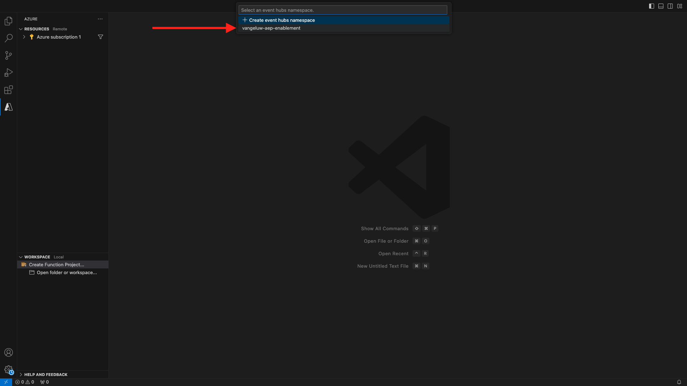

# 2.4.5 Microsoft Azure 프로젝트 만들기

## 2.4.5.1 Azure Event Hub 기능 익히기

Azure 함수를 사용하면 응용 프로그램 인프라에 대한 걱정 없이 작은 코드 조각(**함수**)을 실행할 수 있습니다. Azure 기능을 사용하면 클라우드 인프라에서 규모에 맞게 애플리케이션을 실행하는 데 필요한 모든 최신 서버를 제공합니다.

특정 유형의 이벤트에 의해 함수가 **트리거됨**&#x200B;됩니다. 지원되는 트리거에는 데이터 변경 사항에 응답, 메시지(예: 이벤트 허브)에 응답, 일정에 따라 실행 또는 HTTP 요청의 결과가 포함됩니다.

Azure Functions는 인프라를 명시적으로 프로비전하거나 관리하지 않고도 이벤트 트리거 코드를 실행할 수 있는 서버를 사용하지 않는 계산 서비스입니다.

Azure 이벤트 허브는 서버를 사용하지 않는 아키텍처를 위해 Azure 기능과 통합됩니다.

## 2.4.5.2 Visual Studio Code and Logon to Azure 열기

Visual Studio 코드를 사용하면 다음 작업을 쉽게 수행할 수 있습니다.

- azure 기능을 정의하고 이벤트 허브에 바인딩합니다.
- 로컬에서 테스트
- azure에 배포
- 원격 로그 기능 실행

### Visual Studio 코드 열기

Visual Studio 코드를 열려면 운영 체제의 검색(OSX의 Spotlight 검색, Window의 Taskbar에서 검색)에 **visual**&#x200B;을 입력합니다. 찾을 수 없으면 [연습 0 - 전제 조건](./ex0.md)에 설명된 단계를 반복해야 합니다.


### Azure에 로그온

[연습 0 - 필수 구성 요소](./ex0.md)에 등록하는 데 사용한 Azure 계정으로 로그온하면 Visual Studio 코드를 사용하여 모든 이벤트 허브 리소스를 찾고 바인딩할 수 있습니다.

Visual Studio 코드에서 **Azure** 아이콘을 클릭합니다. 이 옵션이 없는 경우 필수 확장 설치에 문제가 발생했을 수 있습니다.

다음으로 **Azure에 로그인**&#x200B;을 선택합니다.


로그인하려면 브라우저로 리디렉션됩니다. 등록하는 데 사용한 Azure 계정을 선택해야 합니다.


브라우저에 다음 화면이 표시되면 Visual Code Studio로 로그인됩니다.


Visual Code Studio로 돌아갑니다. Azure 구독 이름이 표시됩니다(예: **Azure 구독 1**).


## 2.4.5.3 Azure 프로젝트 만들기

**Azure 구독 1** 위로 마우스를 가져가면 메뉴가 섹션 위에 나타납니다. **새 프로젝트 만들기...**:


프로젝트를 저장할 로컬 폴더를 선택하고 **선택**&#x200B;을 클릭합니다.


이제 프로젝트 만들기 마법사로 들어갑니다. **Javascript**&#x200B;을(를) 프로젝트 언어로 선택:


**Azure Event Hub 트리거**&#x200B;를 프로젝트의 첫 번째 함수 템플릿으로 선택합니다.


함수의 이름을 입력하고 `--aepUserLdap---aep-event-hub-trigger` 형식을 사용한 후 Enter 키를 누르십시오.


**새 로컬 앱 설정 만들기** 선택:


이벤트 허브 네임스페이스를 선택하면 **연습 2**&#x200B;에서 정의한 이벤트 허브가 표시됩니다. 이 예제에서 Event Hub 네임스페이스는 **vangeluw-aep-enablement**&#x200B;입니다.



이벤트 허브를 선택하면 **연습 2**&#x200B;에서 정의한 이벤트 허브가 표시됩니다. 이 예제에서는 **vangeluw-aep-enablement-event-hub**&#x200B;입니다.


**RootManageSharedAccessKey**&#x200B;을(를) 이벤트 허브 정책으로 선택합니다.


**$Default**&#x200B;을(를) 사용하려면 입력하세요.


프로젝트를 여는 방법에 대해 **작업 영역에 추가**&#x200B;를 선택하십시오.


프로젝트를 만든 후 **index.js**&#x200B;을(를) 클릭하여 편집기에서 파일을 엽니다.


Adobe Experience Platform이 이벤트 허브에 전송하는 페이로드에는 세그먼트 ID가 포함됩니다.

```json
[{
"segmentMembership": {
"ups": {
"ca114007-4122-4ef6-a730-4d98e56dce45": {
"lastQualificationTime": "2020-08-31T10:59:43Z",
"status": "realized"
},
"be2df7e3-a6e3-4eb4-ab12-943a4be90837": {
"lastQualificationTime": "2020-08-31T10:59:56Z",
"status": "realized"
},
"39f0feef-a8f2-48c6-8ebe-3293bc49aaef": {
"lastQualificationTime": "2020-08-31T10:59:56Z",
"status": "realized"
}
}
},
"identityMap": {
"ecid": [{
"id": "08130494355355215032117568021714632048"
}]
}
}]
```

Visual Studio Code의 index.js 코드를 아래 코드로 바꿉니다. 이 코드는 Real-Time CDP가 세그먼트 자격을 이벤트 허브 대상에 보낼 때마다 실행됩니다. 이 예제에서 코드는 수신된 페이로드를 표시하고 개선하는 것입니다. 하지만 실시간으로 세그먼트 자격을 처리하는 모든 기능을 상상할 수 있습니다.

```javascript
// Marc Meewis - Solution Consultant Adobe - 2020
// Adobe Experience Platform Enablement - Module 13

// Main function
// -------------
// This azure function is fired for each segment activated to the Adobe Exeperience Platform Real-time CDP Azure 
// Eventhub destination
// This function enriched the received segment payload with the name fo the segment. 
// You can replace this function with any logic that is require to process and deliver
// Adobe Experience Platform segments in real-time to any application or platform that 
// would need to act upon an AEP segment qualiification.
// 

module.exports = async function (context, eventHubMessages) {

    return new Promise (function (resolve, reject) {

        context.log('Message : ' + JSON.stringify(eventHubMessages, null, 2));

        resolve();

    });    

};
```

결과는 다음과 같아야 합니다.


## 2.4.5.4 Azure 프로젝트 실행

이제 프로젝트를 실행할 차례입니다. 이 단계에서는 Azure에 프로젝트를 배포하지 않습니다. 디버그 모드에서 로컬로 실행합니다. 실행 아이콘을 선택하고 녹색 화살표를 클릭합니다.


디버그 모드에서 프로젝트를 처음 실행할 때 Azure 저장소 계정을 첨부해야 합니다. **저장소 계정 선택**&#x200B;을 클릭하세요.


저장소 계정 목록에서 [13.1.4 Azure 저장소 계정 설정](./ex1.md)의 일부로 만든 계정을 선택합니다. 저장소 계정 이름은 `--aepUserLdap--aepstorage`입니다(예: **mmewisaepstorage**).


이제 프로젝트가 실행 중이고 이벤트 허브에서 이벤트 목록을 작성하고 있습니다. 다음 연습에서는 Luma 데모 웹 사이트에서 이러한 세그먼트에 대한 자격을 부여하는 동작을 보여 줍니다. 그 결과 이벤트 허브 트리거 기능의 터미널에서 세그먼트 자격 페이로드를 받게 됩니다.


## 2.4.5.5 Azure 프로젝트 중지

프로젝트를 중지하려면 **터미널** 탭을 선택하고 터미널 창을 클릭한 다음 OSX에서 **CMD-C** 또는 Windows에서 **CTRL-C**&#x200B;을 누르십시오.


다음 단계: [2.4.6 전체 시나리오](./ex6.md)

[모듈 2.4로 돌아가기](./segment-activation-microsoft-azure-eventhub.md)

[모든 모듈로 돌아가기](./../../../overview.md)
