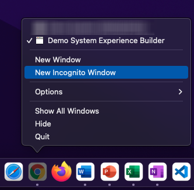

# 2.4.7 전체 시나리오

## Azure 이벤트 허브 트리거 시작

대상 자격 조건 시 Adobe Experience Platform Real-time CDP에서 Azure Event Hub로 보내는 페이로드를 표시하려면 간단한 Azure Event Hub 트리거 기능을 시작해야 합니다. 이 함수는 Visual Studio 코드의 콘솔에 페이로드를 &quot;덤프&quot;합니다. 그러나 이 함수는 전용 API 및 프로토콜을 사용하여 모든 종류의 환경과 상호 작용할 수 있도록 어떤 방식으로든 확장할 수 있습니다.

### Visual Studio 코드를 시작하고 프로젝트를 시작합니다.

Visual Studio 코드 프로젝트가 열려 있고 실행 중인지 확인합니다.

Visual Studio 코드에서 Azure 기능을 시작/중지/다시 시작하려면 이전 연습을 참조하십시오.

Visual Studio 코드의 **터미널**&#x200B;에서는 다음과 유사한 내용을 언급해야 합니다.

```code
[2024-11-20T20:07:12.316Z] Debugger listening on ws://127.0.0.1:9229/86c8e251-8e2f-4c65-a063-cda77edbf2ca
[2024-11-20T20:07:12.318Z] For help, see: https://nodejs.org/en/docs/inspector
[2024-11-20T20:07:12.343Z] Worker process started and initialized.
[2024-11-20T20:07:12.359Z] Debugger attached.

Functions:

        vangeluw-aep-event-hub-trigger: eventHubTrigger

For detailed output, run func with --verbose flag.
[2024-11-20T20:07:18.150Z] Host lock lease acquired by instance ID '000000000000000000000000000C19D8'.
```

## Citi Signal 웹 사이트 로드

[https://dsn.adobe.com](https://dsn.adobe.com)(으)로 이동합니다. Adobe ID으로 로그인하면 이 메시지가 표시됩니다. 웹 사이트 프로젝트에서 세 점 **..**&#x200B;을(를) 클릭한 다음 **실행**&#x200B;을(를) 클릭하여 엽니다.


그러면 데모 웹 사이트가 열리는 것을 볼 수 있습니다. URL을 선택하고 클립보드에 복사합니다.


새 시크릿 브라우저 창을 엽니다.



이전 단계에서 복사한 데모 웹 사이트의 URL을 붙여 넣습니다. 그런 다음 Adobe ID을 사용하여 로그인하라는 메시지가 표시됩니다.


계정 유형을 선택하고 로그인 프로세스를 완료합니다.


그러면 웹 사이트가 시크릿 브라우저 창에 로드되는 것을 볼 수 있습니다. 모든 연습에서는 새로운 시크릿 브라우저 창을 사용하여 데모 웹 사이트 URL을 로드해야 합니다.


## 대상 자격 요건

**계획** 페이지로 이동합니다. 이 작업은 `--aepUserLdap-- - Interest in Plans` 대상에 대한 자격을 부여합니다.


확인하려면 프로필 뷰어 패널을 엽니다. 이제 `--aepUserLdap-- - Interest in Plans`의 멤버여야 합니다. 대상자 멤버십이 프로필 뷰어 패널에서 아직 업데이트되지 않은 경우 다시 로드 단추를 클릭합니다.


Visual Studio 코드로 다시 전환하고 **TERMINAL** 탭을 보면 특정 **ECID**&#x200B;에 대한 대상 목록이 표시됩니다. 이 활성화 페이로드는 `--aepUserLdap-- - Interest in Plans` 대상에 대한 자격이 주어지면 바로 이벤트 허브에 전달됩니다.

대상 페이로드를 자세히 살펴보면 `--aepUserLdap-- - Interest in Plans`이(가) **실현됨** 상태입니다.

대상자 상태가 **실현됨**&#x200B;이면 프로필이 대상자의 일부이고, **종료됨** 상태는 프로필이 대상자에서 제거되었음을 의미합니다.


다음 단계: [요약 및 이점](./summary.md)

[모듈 2.4로 돌아가기](./segment-activation-microsoft-azure-eventhub.md)

[모든 모듈로 돌아가기](./../../../overview.md)
