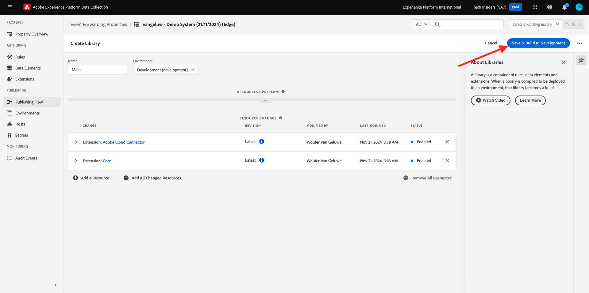

# 2.5.1 Adobe Experience Platform 데이터 수집 이벤트 전달 속성 만들기

## Adobe Experience Platform 데이터 수집 이벤트 전달 속성이란 무엇입니까?

일반적으로 Adobe Experience Platform 데이터 수집을 사용하여 데이터를 수집하면 **클라이언트측**&#x200B;에서 수집됩니다. **클라이언트측**&#x200B;은(는) 웹 사이트 또는 모바일 응용 프로그램과 같은 환경입니다. 시작 및 데이터 수집에서는 Adobe Experience Platform 데이터 수집 클라이언트 속성의 구성에 대해 자세히 논의했으며, 고객이 웹 사이트 및 모바일 애플리케이션과 상호 작용할 때 해당 위치에서 데이터를 수집할 수 있도록 Adobe Experience Platform 데이터 수집 클라이언트 속성을 웹 사이트 및 모바일 애플리케이션에 구현했습니다.

Adobe Experience Platform 데이터 수집 클라이언트 속성에 의해 상호 작용 데이터가 수집되면 웹 사이트 또는 모바일 앱에서 Adobe의 Edge에 요청을 전송합니다. Edge은 Adobe의 데이터 수집 환경이며 Adobe 에코시스템에 대한 클릭스트림 데이터의 진입점입니다. 그런 다음 Edge에서 수집된 데이터는 Adobe Experience Platform, Adobe Analytics, Adobe Audience Manager 또는 Adobe Target과 같은 애플리케이션으로 전송됩니다.

이제 Adobe Experience Platform 데이터 수집 이벤트 전달 속성을 추가하여 Edge에서 들어오는 데이터를 수신하는 Adobe Experience Platform 데이터 수집 속성을 구성할 수 있습니다. Edge에서 실행 중인 Adobe Experience Platform 데이터 수집 이벤트 전달 속성에 수신 데이터가 표시되면 해당 데이터를 사용하여 다른 곳으로 전달하는 기능이 있습니다. 이제 다른 곳에서 Adobe이 아닌 외부 웹후크를 사용할 수도 있으므로 해당 데이터를 원하는 데이터 레이크, 의사 결정 애플리케이션 또는 웹후크를 열 수 있는 기능이 있는 다른 애플리케이션으로 보낼 수 있습니다.

Adobe Experience Platform 데이터 수집 이벤트 전달 속성을 구성하면 클라이언트측 속성에 익숙해지며 Adobe Experience Platform 데이터 수집 클라이언트 속성을 사용하여 과거와 마찬가지로 데이터 요소 및 규칙을 구성할 수 있습니다. 그러나 사용 사례에 따라 데이터에 액세스하고 사용하는 방법이 약간 달라집니다.

먼저 Adobe Experience Platform 데이터 수집 이벤트 전달 속성을 생성해 보겠습니다.

## Adobe Experience Platform 데이터 수집 이벤트 전달 속성 만들기

[https://experience.adobe.com/#/data-collection/](https://experience.adobe.com/#/data-collection/)(으)로 이동합니다. 왼쪽 메뉴에서 **이벤트 전달**&#x200B;을 클릭합니다. 그러면 사용 가능한 모든 Adobe Experience Platform 데이터 수집 이벤트 전달 속성에 대한 개요가 표시됩니다. **속성 만들기** 단추를 클릭합니다.

또는 다른 이벤트 전달 속성이 이미 만들어진 경우 UI가 약간 다르게 표시됩니다. 이 경우 **새 속성**&#x200B;을 클릭하세요.

이제 Adobe Experience Platform 데이터 수집 이벤트 전달 속성의 이름을 입력해야 합니다. 명명 규칙으로 `--aepUserLdap-- - Demo System (DD/MM/YYYY) (Edge)`을(를) 사용합니다. 예를 들어, 이 예제에서 이름은 **vangeluw - Demo System(22/02/2022)(Edge)**&#x200B;입니다. **저장**&#x200B;을 클릭합니다.

그러면 Adobe Experience Platform 데이터 수집 이벤트 전달 속성 목록으로 돌아갑니다. 방금 만든 속성을 열려면 클릭합니다.

## Adobe 클라우드 커넥터 확장 구성

왼쪽 메뉴에서 **확장**(으)로 이동합니다. **Core** 확장이 이미 구성되어 있습니다.

**카탈로그**(으)로 이동합니다. **Adobe 클라우드 커넥터** 확장 및 기타 많은 확장이 표시됩니다. **설치**&#x200B;를 클릭하여 설치합니다.

그런 다음 확장이 추가됩니다. 이 단계에서는 수행할 구성이 없습니다. 설치된 확장의 개요로 돌아갑니다.

## 2.5.1.3 Adobe Experience Platform 데이터 수집 이벤트 전달 속성 배포

왼쪽 메뉴에서 **게시 흐름**(으)로 이동합니다. **라이브러리 추가**&#x200B;를 클릭합니다.

이름 **Main**&#x200B;을(를) 입력하고 환경 **개발(개발)**&#x200B;을(를) 선택한 다음 **+ 변경된 모든 리소스 추가**&#x200B;를 클릭합니다.

그러면 이걸 보게 될 거야. **개발을 위한 저장 및 구축**&#x200B;을 클릭합니다.

그런 다음 라이브러리가 구축되며, 이는 1~2분 정도 소요될 수 있습니다.

다음 단계: [2.5.2 데이터 수집 이벤트 전달 속성에서 데이터를 사용할 수 있도록 데이터 스트림 업데이트](./ex2.md)

[모듈 2.5로 돌아가기](./aep-data-collection-ssf.md)

[모든 모듈로 돌아가기](./../../../overview.md)
