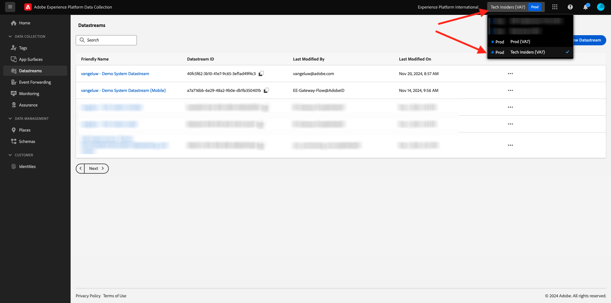

# 2.5.2 데이터 스트림을 업데이트하여 Adobe Experience Platform 데이터 수집 서버 속성에 데이터를 사용할 수 있도록 합니다

## 2.5.2.1 데이터스트림 업데이트

[연습 0.2](./../../gettingstarted/gettingstarted/ex2.md)에서 고유한 **[!UICONTROL 데이터스트림]**&#x200B;을 만들었습니다. 그런 다음 `--aepUserLdap-- - Demo System Datastream` 이름을 사용했습니다.

이 연습에서는 **[!DNL Data Collection Server property]**&#x200B;에서 작동하도록 해당 **[!UICONTROL 데이터 스트림]**&#x200B;을 구성해야 합니다.

이렇게 하려면 [https://experience.adobe.com/#/data-collection/](https://experience.adobe.com/#/data-collection/)(으)로 이동하십시오. 그러면 이걸 보게 될 거야. 왼쪽 메뉴에서 **[!UICONTROL 데이터스트림]**&#x200B;을 클릭합니다.

화면 오른쪽 상단에서 샌드박스 이름을 선택합니다. 이름은 `--aepSandboxName--`이어야 합니다.

이름이 `--aepUserLdap-- - Demo System Datastream`인 **[!UICONTROL 데이터스트림]**&#x200B;을 검색합니다. **[!UICONTROL 데이터 스트림]**&#x200B;을 클릭하여 엽니다.

그러면 이걸 보게 될 거야. **[!UICONTROL + 서비스 추가]**&#x200B;를 클릭합니다.

서비스 **이벤트 전달**&#x200B;을 선택하십시오. 2개의 추가 설정이 표시됩니다. 이전 연습에서 만든 이름이 `--aepUserLdap-- - Demo System (DD/MM/YYYY) (Edge)`인 이벤트 전달 속성을 선택합니다. 그런 다음 **환경**&#x200B;에서 **개발**&#x200B;을 선택합니다. **저장**&#x200B;을 클릭합니다.

이제 데이터 스트림이 업데이트되어 사용할 준비가 되었습니다.

이제 데이터 스트림이 **[!DNL Event Forwarding property]**&#x200B;에서 작동할 준비가 되었습니다.

다음 단계: [2.5.3 사용자 지정 Webhook 만들기 및 구성](./ex3.md)

[모듈 2.5로 돌아가기](./aep-data-collection-ssf.md)

[모든 모듈로 돌아가기](./../../../overview.md)
