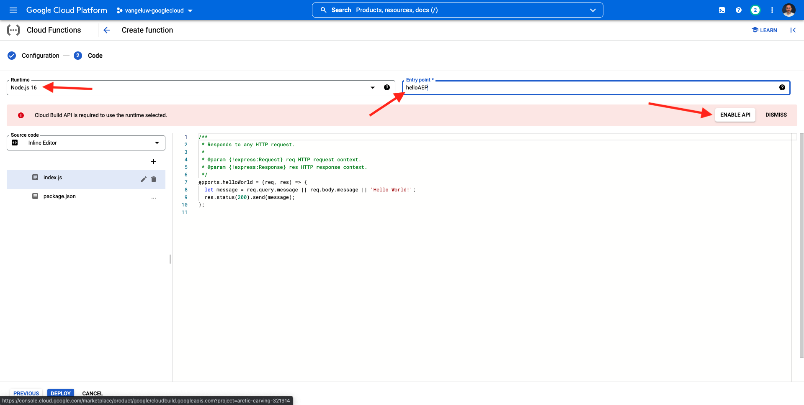

# 2.5.4 Google Cloud 기능 만들기 및 구성

## 2.5.4.1 Google 클라우드 기능 만들기

[https://console.cloud.google.com/](https://console.cloud.google.com/)(으)로 이동합니다. **클라우드 함수**(으)로 이동합니다.


그러면 이걸 보게 될 거야. **함수 만들기**&#x200B;를 클릭합니다.


그러면 이걸 보게 될 거야.


다음과 같이 선택하십시오.

- **함수 이름**: `--aepUserLdap---event-forwarding`
- **지역**: 지역을 선택하십시오.
- **트리거 유형**: **HTTP** 선택
- **인증**: **인증되지 않은 호출 허용** 선택

이제 이 항목을 사용할 수 있습니다. **저장**&#x200B;을 클릭합니다.


**다음**&#x200B;을 클릭합니다.


그러면 다음과 같은 결과가 표시됩니다.


다음과 같이 선택하십시오.

- **런타임**: **Node.js 16**(또는 최신 버전)을 선택하십시오.
- **시작 지점**: **helloAEP** 입력

**Cloud Build API**&#x200B;를 사용하려면 **API 사용**&#x200B;을 클릭하세요. 그러면 새 창이 표시됩니다. 새 창에서 다시 **사용**&#x200B;을 클릭하세요.



그러면 이걸 보게 될 거야. **사용**&#x200B;을 클릭합니다.


**Cloud Build API**&#x200B;를 활성화하면 이 메시지가 표시됩니다.


**클라우드 함수**(으)로 돌아갑니다.
클라우드 함수 인라인 편집기에서 다음 코드가 있는지 확인하십시오.

```javascript
/**
 * Responds to any HTTP request.
 *
 * @param {!express:Request} req HTTP request context.
 * @param {!express:Response} res HTTP response context.
 */
exports.helloAEP = (req, res) => {
  let message = req.query.message || req.body.message || 'Hello World!';
  res.status(200).send(message);
};
```

**배포**&#x200B;를 클릭합니다.


그러면 이걸 보게 될 거야. 이제 클라우드 기능이 생성되고 있습니다. 몇 분 정도 걸릴 수 있습니다.


함수가 만들어지고 실행되면 이 오류가 표시됩니다. 함수 이름을 클릭하여 엽니다.


그러면 이걸 보게 될 거야. **트리거**(으)로 이동합니다. 그러면 Launch Server Side에서 끝점을 정의하는 데 사용할 **트리거 URL**&#x200B;이 표시됩니다.


다음과 같은 트리거 URL을 복사합니다. **https://europe-west1-dazzling-pillar-273812.cloudfunctions.net/vangeluw-event-forwarding**.

다음 단계에서는 Adobe Experience Platform Cloud 함수에 **페이지 보기 수**&#x200B;에 대한 특정 정보를 스트리밍하도록 Google 데이터 수집 서버를 구성합니다. 전체 페이로드를 그대로 전달하는 대신 **ECID**, **타임스탬프** 및 **페이지 이름**&#x200B;과 같은 항목만 Google 클라우드 함수로 보냅니다.

다음은 위에서 언급한 변수를 필터링하기 위해 구문 분석해야 하는 페이로드의 예입니다.

```json
{
  "events": [
    {
      "xdm": {
        "eventType": "web.webpagedetails.pageViews",
        "web": {
          "webPageDetails": {
            "URL": "https://builder.adobedemo.com/run/vangeluw-OCUC",
            "name": "vangeluw-OCUC",
            "viewName": "vangeluw-OCUC",
            "pageViews": {
              "value": 1
            }
          },
          "webReferrer": {
            "URL": "https://builder.adobedemo.com/run/vangeluw-OCUC/equipment"
          }
        },
        "device": {
          "screenHeight": 1080,
          "screenWidth": 1920,
          "screenOrientation": "landscape"
        },
        "environment": {
          "type": "browser",
          "browserDetails": {
            "viewportWidth": 1920,
            "viewportHeight": 451
          }
        },
        "placeContext": {
          "localTime": "2022-02-23T06:51:07.140+01:00",
          "localTimezoneOffset": -60
        },
        "timestamp": "2022-02-23T05:51:07.140Z",
        "implementationDetails": {
          "name": "https://ns.adobe.com/experience/alloy/reactor",
          "version": "2.8.0+2.9.0",
          "environment": "browser"
        },
        "_experienceplatform": {
          "identification": {
            "core": {
              "ecid": "08346969856929444850590365495949561249"
            }
          },
          "demoEnvironment": {
            "brandName": "vangeluw-OCUC"
          },
          "interactionDetails": {
            "core": {
              "channel": "web"
            }
          }
        }
      },
      "query": {
        "personalization": {
          "schemas": [
            "https://ns.adobe.com/personalization/html-content-item",
            "https://ns.adobe.com/personalization/json-content-item",
            "https://ns.adobe.com/personalization/redirect-item",
            "https://ns.adobe.com/personalization/dom-action"
          ],
          "decisionScopes": [
            "eyJ4ZG06YWN0aXZpdHlJZCI6Inhjb3JlOm9mZmVyLWFjdGl2aXR5OjE0YzA1MjM4MmUxYjY1MDUiLCJ4ZG06cGxhY2VtZW50SWQiOiJ4Y29yZTpvZmZlci1wbGFjZW1lbnQ6MTRiZjA5ZGM0MTkwZWJiYSJ9",
            "__view__"
          ]
        }
      }
    }
  ],
  "query": {
    "identity": {
      "fetch": [
        "ECID"
      ]
    }
  },
  "meta": {
    "state": {
      "domain": "adobedemo.com",
      "cookiesEnabled": true,
      "entries": [
        {
          "key": "kndctr_907075E95BF479EC0A495C73_AdobeOrg_identity",
          "value": "CiYwODM0Njk2OTg1NjkyOTQ0NDg1MDU5MDM2NTQ5NTk0OTU2MTI0OVIPCPn66KfyLxgBKgRJUkwx8AH5-uin8i8="
        },
        {
          "key": "kndctr_907075E95BF479EC0A495C73_AdobeOrg_consent_check",
          "value": "1"
        },
        {
          "key": "kndctr_907075E95BF479EC0A495C73_AdobeOrg_consent",
          "value": "general=in"
        }
      ]
    }
  }
}
```

다음은 구문 분석해야 하는 정보가 포함된 필드입니다.

- ECID: **events.xdm._experienceplatform.identification.core.ecid**
- 타임스탬프: **타임스탬프**
- 페이지 이름: **events.xdm.web.webPageDetails.name**

이제 Adobe Experience Platform 데이터 수집 서버로 이동하여 이를 가능하게 하도록 데이터 요소를 구성하겠습니다.

## 2.5.4.2 이벤트 전달 속성 업데이트: 데이터 요소

[https://experience.adobe.com/#/data-collection/](https://experience.adobe.com/#/data-collection/)(으)로 이동한 다음 **이벤트 전달**(으)로 이동합니다. 이벤트 전달 속성을 검색하고 클릭하여 엽니다.


왼쪽 메뉴에서 **데이터 요소**(으)로 이동합니다. **데이터 요소 추가**&#x200B;를 클릭합니다.


그러면 구성할 새 데이터 요소가 표시됩니다.


다음을 선택합니다.

- **Name**(으)로 **customerECID**&#x200B;을(를) 입력하십시오.
- **확장**(으)로 **코어**&#x200B;을(를) 선택합니다.
- **데이터 요소 형식**(으)로 **경로**&#x200B;을(를) 선택하십시오.
- **경로**(으)로 `arc.event.xdm.--aepTenantId--.identification.core.ecid`을(를) 입력하십시오. 이 경로를 입력하면 웹 사이트 또는 모바일 앱에서 Adobe Edge으로 보낸 이벤트 페이로드에서 필드 **ecid**&#x200B;을(를) 필터링합니다.

>[!NOTE]
>
>위 및 아래 경로에서 **arc**&#x200B;이(가) 참조되었습니다. **arc**&#x200B;은(는) Adobe 리소스 컨텍스트를 의미하며 **arc**&#x200B;은(는) 항상 서버측 컨텍스트에서 사용 가능한 가장 높은 사용 가능한 개체를 의미합니다. Adobe Experience Platform 데이터 수집 서버 함수를 사용하여 해당 **arc** 개체에 보강 및 변환을 추가할 수 있습니다.
>
>위 및 아래 경로에서 **event**&#x200B;을(를) 참조합니다. **event**&#x200B;은(는) 고유한 이벤트를 의미하며 Adobe Experience Platform 데이터 수집 서버는 항상 모든 이벤트를 개별적으로 평가합니다. 경우에 따라 Web SDK Client Side에서 보낸 페이로드에 **events**&#x200B;에 대한 참조가 표시될 수 있지만, Adobe Experience Platform 데이터 수집 서버에서는 모든 이벤트가 개별적으로 평가됩니다.

이제 이 음식을 드실 수 있습니다. **저장**&#x200B;을 클릭합니다.


**데이터 요소 추가**&#x200B;를 클릭합니다.


그러면 구성할 새 데이터 요소가 표시됩니다.


다음을 선택합니다.

- **Name**(으)로 **eventTimestamp**&#x200B;을(를) 입력하십시오.
- **확장**(으)로 **코어**&#x200B;을(를) 선택합니다.
- **데이터 요소 형식**(으)로 **경로**&#x200B;을(를) 선택하십시오.
- **경로**(으)로 **arc.event.xdm.timestamp**&#x200B;를 입력하십시오. 이 경로를 입력하면 웹 사이트 또는 모바일 앱에서 Adobe Edge으로 보낸 이벤트 페이로드에서 **타임스탬프** 필드를 필터링합니다.

이제 이 음식을 드실 수 있습니다. **저장**&#x200B;을 클릭합니다.


**데이터 요소 추가**&#x200B;를 클릭합니다.


그러면 구성할 새 데이터 요소가 표시됩니다.


다음을 선택합니다.

- **Name**(으)로 **pageName**&#x200B;을(를) 입력하십시오.
- **확장**(으)로 **코어**&#x200B;을(를) 선택합니다.
- **데이터 요소 형식**(으)로 **경로**&#x200B;을(를) 선택하십시오.
- **경로**(으)로 **arc.event.xdm.web.webPageDetails.name**&#x200B;을(를) 입력하십시오. 이 경로를 입력하면 웹 사이트 또는 모바일 앱에서 Adobe Edge으로 보낸 이벤트 페이로드에서 필드 **name**&#x200B;을(를) 필터링합니다.

이제 이 음식을 드실 수 있습니다. **저장**&#x200B;을 클릭합니다.


이제 다음 데이터 요소를 만들었습니다.


## 2.5.4.3 이벤트 전달 속성 업데이트: 규칙 업데이트

왼쪽 메뉴에서 **규칙**(으)로 이동합니다. 이전 연습에서는 **모든 페이지** 규칙을 만들었습니다. 해당 규칙을 클릭하여 엽니다.


그럼 이렇게 해 새 작업을 추가하려면 **작업** 아래의 **+** 아이콘을 클릭하십시오.


그러면 이걸 보게 될 거야.


다음을 선택합니다.

- **확장**: **Adobe 클라우드 커넥터**&#x200B;를 선택하십시오.
- **작업 유형**&#x200B;을 선택합니다. **가져오기 호출**.

그러면 **이름**: **Adobe 클라우드 커넥터 - 가져오기 호출**&#x200B;이 제공됩니다. 이제 다음이 표시됩니다.


그런 다음 다음을 구성합니다.

- 요청 프로토콜을 GET에서 **POST**(으)로 변경
- 이전 단계 중 하나에서 만든 Google 클라우드 함수의 URL을 입력하십시오. **https://europe-west1-dazzling-pillar-273812.cloudfunctions.net/vangeluw-event-forwarding**

이제 이 항목을 사용할 수 있습니다. 그런 다음 **본문**(으)로 이동합니다.


그러면 이걸 보게 될 거야. **JSON**&#x200B;에 대한 라디오 단추를 클릭합니다.


다음과 같이 **Body**&#x200B;을(를) 구성합니다.

| 키 | 값 |
|--- |--- |
| customerECID | {{customerECID}} |
| pageName | {{pageName}} |
| event타임스탬프 | {{eventTimestamp}} |

그러면 이걸 보게 될 거야. **변경 내용 유지**&#x200B;를 클릭합니다.


그러면 이걸 보게 될 거야. **저장**&#x200B;을 클릭합니다.


이제 Adobe Experience Platform 데이터 수집 서버 속성에서 기존 규칙을 업데이트합니다. 변경 내용을 게시하려면 **흐름 게시**(으)로 이동하십시오. 표시된 대로 **편집**&#x200B;을 클릭하여 개발 라이브러리 **Main**&#x200B;을(를) 엽니다.


**변경된 모든 리소스 추가** 단추를 클릭하면 이 라이브러리에 규칙 및 데이터 요소가 나타납니다. **개발을 위한 저장 및 빌드**&#x200B;를 클릭합니다. 변경 사항이 배포되고 있습니다.


몇 분 후에 배포가 완료되고 테스트할 준비가 되었음을 알 수 있습니다.


## 2.5.3.4 구성 테스트

[https://builder.adobedemo.com/projects](https://builder.adobedemo.com/projects)(으)로 이동합니다. Adobe ID으로 로그인하면 이 메시지가 표시됩니다. 웹 사이트 프로젝트를 클릭하여 엽니다.


이제 아래 흐름을 따라 웹 사이트에 액세스할 수 있습니다. **통합**&#x200B;을 클릭합니다.


**통합** 페이지에서 연습 0.1에서 만든 데이터 수집 속성을 선택해야 합니다.


그러면 데모 웹 사이트가 열리는 것을 볼 수 있습니다. URL을 선택하고 클립보드에 복사합니다.


새 시크릿 브라우저 창을 엽니다.


이전 단계에서 복사한 데모 웹 사이트의 URL을 붙여 넣습니다. 그런 다음 Adobe ID을 사용하여 로그인하라는 메시지가 표시됩니다.


계정 유형을 선택하고 로그인 프로세스를 완료합니다.


그러면 웹 사이트가 시크릿 브라우저 창에 로드되는 것을 볼 수 있습니다. 모든 데모에 대해 새로운 시크릿 브라우저 창을 사용하여 데모 웹 사이트 URL을 로드해야 합니다.


브라우저 개발자 보기를 열면 아래에 표시된 대로 네트워크 요청을 검사할 수 있습니다. **상호 작용** 필터를 사용하면 Adobe Experience Platform 데이터 수집 클라이언트에서 Adobe Edge으로 보내는 네트워크 요청이 표시됩니다.


보기를 Google 클라우드 함수로 전환하고 **LOGS**(으)로 이동합니다. 이제 많은 로그 항목이 표시되는 이와 유사한 보기가 있어야 합니다. **함수 실행이 시작됨**&#x200B;을 볼 때마다 들어오는 트래픽이 Google 클라우드 함수에서 수신되었음을 의미합니다.


들어오는 데이터로 작업할 수 있도록 함수를 약간 업데이트하고 Adobe Experience Platform 데이터 수집 서버에서 받은 정보를 표시해 보겠습니다. **SOURCE**(으)로 이동하여 **편집**&#x200B;을 클릭합니다.


다음 화면에서 **다음**&#x200B;을 클릭합니다.


다음과 같이 코드를 업데이트합니다.

```javascript
/**
 * Responds to any HTTP request.
 *
 * @param {!express:Request} req HTTP request context.
 * @param {!express:Response} res HTTP response context.
 */
exports.helloAEP = (req, res) => {
  console.log('>>>>> Function has started. The following information was received from Event Forwarding:');
  console.log(req.body);

  let message = req.query.message || req.body.message || 'Hello World!';
  res.status(200).send(message);
};
```

그럼 이걸로 드셔보세요 **배포**&#x200B;를 클릭합니다.


몇 분 후에 함수가 다시 배포됩니다. 함수 이름을 클릭하여 엽니다.


데모 웹 사이트에서 **DEIRDRE RELAXED-FIT CAPRI**&#x200B;와 같은 제품으로 이동합니다.


보기를 Google 클라우드 함수로 전환하고 **LOGS**(으)로 이동합니다. 이제 많은 로그 항목이 표시되는 이와 유사한 보기가 있어야 합니다.

이제 데모 웹 사이트의 모든 페이지 보기에 대해 수신된 정보를 보여 주는 Google Cloud 함수의 로그에 새 로그 항목이 표시됩니다.


이제 Adobe Experience Platform 데이터 수집에서 실시간으로 수집한 데이터를 Google 클라우드 기능 엔드포인트로 성공적으로 보냈습니다. 여기에서 저장 및 보고 또는 머신 러닝 사용 사례에 대한 BigQuery와 같은 모든 Google Cloud Platform 애플리케이션에서 해당 데이터를 사용할 수 있습니다.

다음 단계: [2.5.5 AWS 에코시스템을 위한 이벤트 전달](./ex5.md)

[모듈 2.5로 돌아가기](./aep-data-collection-ssf.md)

[모든 모듈로 돌아가기](./../../../overview.md)
