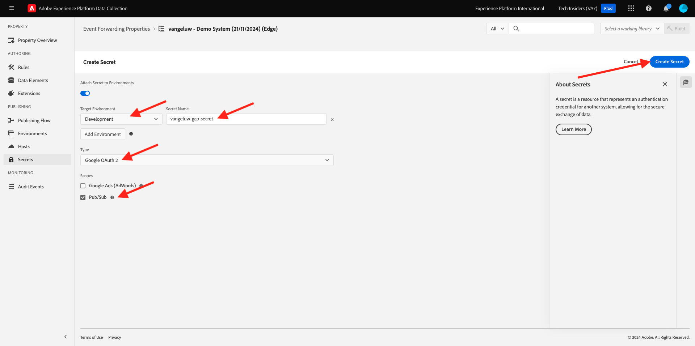
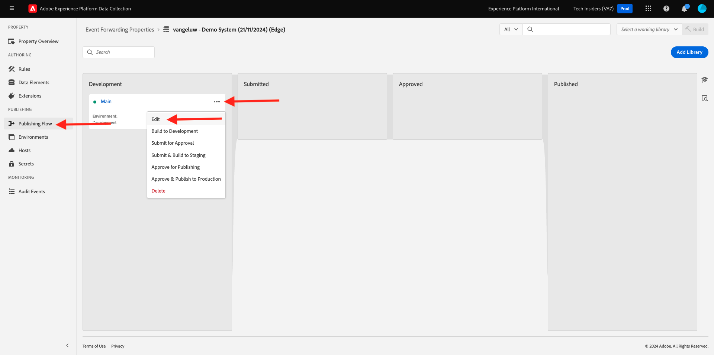

# 2.5.4 GCP Pub/Sub로 이벤트 전달

>[!NOTE]
>
>이 연습을 수행하려면 Google 클라우드 플랫폼 환경에 액세스해야 합니다. 아직 GCP에 액세스할 수 없는 경우 개인 이메일 주소를 사용하여 새 계정을 만드십시오.

## Google Cloud Pub/하위 항목 만들기

[https://console.cloud.google.com/](https://console.cloud.google.com/)(으)로 이동합니다. 검색 창에서 `pub/sub`을(를) 입력합니다. 검색 결과 **Pub/Sub - Global Real-Time Messaging**&#x200B;을 클릭합니다.

그러면 이걸 보게 될 거야. **주제 만들기**&#x200B;를 클릭합니다.

그러면 이걸 보게 될 거야. 주제 ID는 `--aepUserLdap---event-forwarding`을(를) 사용합니다. **만들기**&#x200B;를 클릭합니다.

이제 주제가 생성되었습니다. 주제의 **구독 ID**&#x200B;를 클릭합니다.

그러면 이걸 보게 될 거야. **주제 이름**&#x200B;을(를) 클립보드에 복사한 다음 다음 연습에서 필요할 때 저장합니다.

이제 Adobe Experience Platform 데이터 수집 이벤트 전달로 이동하여 이벤트 전달 속성을 업데이트하고 이벤트를 Pub/Sub로 전달합니다.

## 이벤트 전달 속성 업데이트: 암호

이벤트 전달 속성의 **암호**&#x200B;은(는) 외부 API에 대해 인증하는 데 사용할 자격 증명을 저장하는 데 사용됩니다. 이 예제에서는 Google Cloud Platform OAuth 토큰을 저장하도록 암호를 구성해야 합니다. 이 토큰은 Pub/Sub를 사용하여 데이터를 GCP로 스트리밍할 때 인증하는 데 사용됩니다.

[https://experience.adobe.com/#/data-collection/](https://experience.adobe.com/#/data-collection/)(으)로 이동한 다음 **암호**(으)로 이동합니다. **새 암호 만들기**&#x200B;를 클릭합니다.

그러면 이걸 보게 될 거야. 다음 지침을 따르십시오.

- 이름: `--aepUserLdap---gcp-secret` 사용
- 대상 환경: **개발** 선택
- 유형: **Google OAuth 2**
- **Pub/Sub**&#x200B;에 대한 확인란 선택

**암호 만들기**&#x200B;를 클릭합니다.

**암호 만들기**&#x200B;를 클릭하면 이벤트 전달 속성의 암호와 Google 간에 인증을 설정하는 팝업이 표시됩니다. **Google으로 암호 만들기 및 승인 `--aepUserLdap---gcp-secret`을(를) 클릭합니다**.

Google 계정을 선택하려면 를 클릭합니다.

**계속을 클릭합니다**.

>[!NOTE]
>
>팝업 메시지는 다를 수 있습니다. 연습을 계속하려면 요청된 액세스 권한을 승인/허용하십시오.

인증에 성공하면 이 메시지가 표시됩니다.

이제 암호가 성공적으로 구성되었으며 데이터 요소에서 사용할 수 있습니다.

## 이벤트 전달 속성 업데이트: 데이터 요소

이벤트 전달 속성에서 암호를 사용하려면 암호 값을 저장할 데이터 요소를 만들어야 합니다.

[https://experience.adobe.com/#/data-collection/](https://experience.adobe.com/#/data-collection/)(으)로 이동한 다음 **이벤트 전달**(으)로 이동합니다. 이벤트 전달 속성을 검색하고 클릭하여 엽니다.

왼쪽 메뉴에서 **데이터 요소**(으)로 이동합니다. **데이터 요소 추가**&#x200B;를 클릭합니다.

다음과 같이 데이터 요소를 구성합니다.

- 이름: **GCP 암호**
- 확장: **코어**
- 데이터 요소 유형: **암호**
- 개발 암호: 만든 암호(`--aepUserLdap---gcp-secret`)를 선택합니다.

**Save**&#x200B;를 클릭합니다

## 이벤트 전달 속성 업데이트: 확장

보안 및 데이터 요소가 구성되면 이제 이벤트 전달 속성에서 Google Cloud Platform용 확장을 설정할 수 있습니다.

[https://experience.adobe.com/#/data-collection/](https://experience.adobe.com/#/data-collection/)(으)로 이동하고 **이벤트 전달**(으)로 이동하여 이벤트 전달 속성을 엽니다.

**확장**, **카탈로그**(으)로 이동합니다. **Google Cloud Platform** 확장을 클릭하고 **설치**&#x200B;를 클릭합니다.

그러면 이걸 보게 될 거야. 데이터 요소 아이콘을 클릭합니다.

이전 연습에서 만든 데이터 요소(**GCP 암호**)를 선택하십시오. **선택**&#x200B;을 클릭합니다.

그러면 이걸 보게 될 거야. **저장**&#x200B;을 클릭합니다.

## 이벤트 전달 속성 업데이트: 규칙 업데이트

이제 Google Cloud Platform 확장이 구성되었으므로 이벤트 데이터를 Pub/Sub 주제에 전달하기 시작하는 규칙을 정의할 수 있습니다. 이렇게 하려면 이전 연습 중 하나에서 만든 **모든 페이지** 규칙을 업데이트해야 합니다.

왼쪽 메뉴에서 **규칙**(으)로 이동합니다. 이전 연습에서는 **모든 페이지** 규칙을 만들었습니다. 해당 규칙을 클릭하여 엽니다.

그럼 이렇게 해 새 작업을 추가하려면 **작업** 아래의 **+** 아이콘을 클릭하십시오.

그러면 이걸 보게 될 거야. 다음을 선택합니다.

- **확장**: **Google Cloud Platform**&#x200B;을 선택합니다.
- **작업 유형** 선택: **Cloud Pub/Sub로 데이터 보내기**.

이렇게 하면 다음 **이름**&#x200B;이 제공됩니다. **Google 클라우드 플랫폼 - Cloud Pub/Sub로 데이터 보내기**. 이제 다음이 표시됩니다.

이제 이전에 만든 Pub/Sub 주제를 구성해야 합니다.

**항목 이름**&#x200B;은(는) 여기에서 찾을 수 있습니다. 복사하십시오.

규칙 구성에 **주제 이름**&#x200B;을(를) 붙여 넣습니다. **데이터(필수)** 필드 옆에 있는 데이터 요소 아이콘을 클릭합니다.

**XDM 이벤트**&#x200B;를 선택하고 **선택**&#x200B;을 클릭합니다.

그러면 이걸 보게 될 거야. **변경 내용 유지**&#x200B;를 클릭합니다.

**저장**&#x200B;을 클릭합니다.

그러면 이걸 보게 될 거야.

## 변경 사항 Publish

이제 구성이 완료되었습니다. 변경 내용을 게시하려면 **흐름 게시**(으)로 이동하십시오. 표시된 대로 **편집**&#x200B;을 클릭하여 개발 라이브러리 **Main**&#x200B;을(를) 엽니다.

**변경된 모든 리소스 추가** 단추를 클릭하면 이 라이브러리에 규칙 및 데이터 요소가 나타납니다. **개발을 위한 저장 및 빌드**&#x200B;를 클릭합니다. 변경 사항이 배포되고 있습니다.

몇 분 후에 배포가 완료되고 테스트할 준비가 되었음을 알 수 있습니다.

## 구성 테스트

[https://dsn.adobe.com](https://dsn.adobe.com)(으)로 이동합니다. Adobe ID으로 로그인하면 이 메시지가 표시됩니다. 웹 사이트 프로젝트에서 세 점 **..**&#x200B;을(를) 클릭한 다음 **실행**&#x200B;을(를) 클릭하여 엽니다.

그러면 데모 웹 사이트가 열리는 것을 볼 수 있습니다. URL을 선택하고 클립보드에 복사합니다.

새 시크릿 브라우저 창을 엽니다.

이전 단계에서 복사한 데모 웹 사이트의 URL을 붙여 넣습니다. 그런 다음 Adobe ID을 사용하여 로그인하라는 메시지가 표시됩니다.

계정 유형을 선택하고 로그인 프로세스를 완료합니다.

그러면 웹 사이트가 시크릿 브라우저 창에 로드되는 것을 볼 수 있습니다. 모든 연습에서는 새로운 시크릿 브라우저 창을 사용하여 데모 웹 사이트 URL을 로드해야 합니다.

보기를 Google Cloud Pub/Sub로 전환하고 **메시지**(으)로 이동합니다. **끌어오기**&#x200B;를 클릭하면 몇 초 후에 목록에 일부 메시지가 표시됩니다. 콘텐츠를 시각화하려면 메시지를 클릭하십시오.

이제 Google Pub/Sub에서 이벤트의 XDM 페이로드를 볼 수 있습니다. 이제 Adobe Experience Platform 데이터 수집에서 실시간으로 수집한 데이터를 Google Cloud Pub/Sub 엔드포인트로 성공적으로 보냈습니다. 여기에서 저장 및 보고 또는 머신 러닝 사용 사례에 대한 BigQuery와 같은 모든 Google Cloud Platform 애플리케이션에서 해당 데이터를 사용할 수 있습니다.

다음 단계: [2.5.5 이벤트를 AWS Kinesis 및 AWS S3에 전달](./ex5.md)

[모듈 2.5로 돌아가기](./aep-data-collection-ssf.md)

[모든 모듈로 돌아가기](./../../../overview.md)
