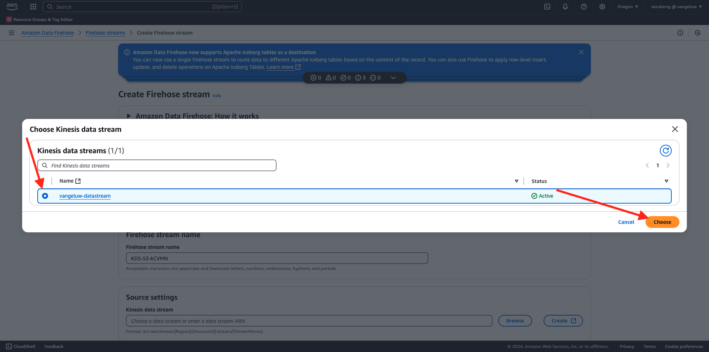
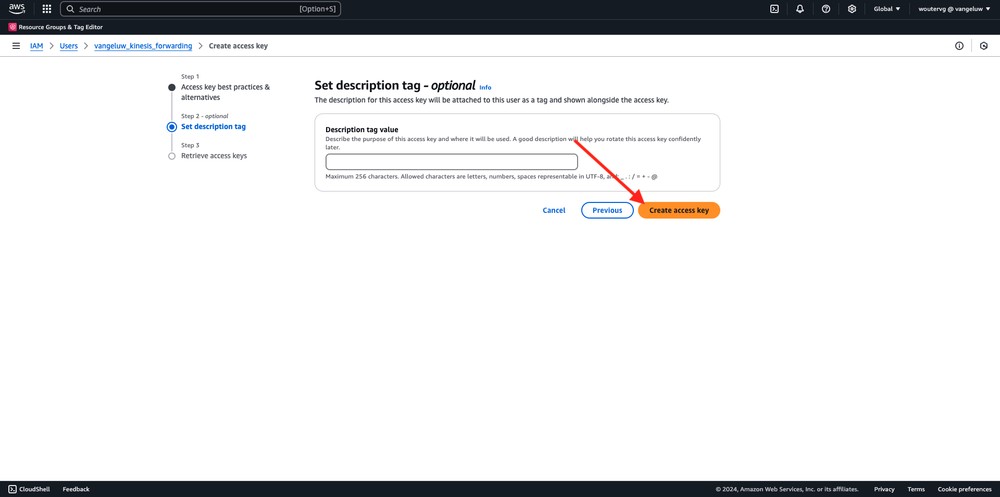

# 2.5.5 AWS Kinesis 및 AWS S3에 이벤트 전달

>[!IMPORTANT]
>
>이 연습의 완료는 선택 사항이며 AWS Kinesis을 사용하는 데 비용이 소요됩니다. AWS은 많은 서비스를 비용 없이 테스트하고 구성할 수 있는 프리 티어 계정을 제공하지만 AWS Kinesis은 해당 프리 티어 계정에 속하지 않습니다. 따라서 이 연습을 구현하고 테스트하려면 AWS Kinesis을 사용하는 데 비용이 소요됩니다.

## 알아 둘 사항

Adobe Experience Platform은 다양한 Amazon 서비스를 대상으로 지원합니다.
Kinesis과 S3는 모두 [프로필 내보내기 대상](https://experienceleague.adobe.com/docs/experience-platform/destinations/destination-types.html?lang=en)이며 Adobe Experience Platform Real-Time CDP의 일부로 사용할 수 있습니다.
고가치 세그먼트 이벤트 및 관련 프로필 속성을 선택한 시스템에 쉽게 제공할 수 있습니다.

이 연습에서는 고유한 Amazon Kinesis 스트림을 설정하여 Adobe Experience Platform Edge 에코시스템에서 오는 이벤트 데이터를 Amazon S3와 같은 클라우드 스토리지 대상으로 스트리밍하는 방법에 대해 알아봅니다. 이 기능은 웹 및 모바일 속성에서 경험 이벤트를 수집하고 분석 및 운영 보고를 위해 데이터 레이크에 푸시하려는 경우에 유용합니다. 데이터 수집은 일반적으로 큰 일별 파일 가져오기로 일괄 처리 방식으로 데이터를 수집하지만, 이벤트 전달과 함께 사용할 수 있는 공개 http 끝점은 노출하지 않습니다.

위의 사용 사례를 지원한다는 것은 스트리밍된 데이터를 파일에 쓰기 전에 버퍼링하거나 큐에 넣어야 함을 의미합니다. 여러 프로세스에서 쓰기 액세스를 위해 파일을 열지 않도록 주의해야 합니다. 이 작업을 전용 시스템에 위임하는 것은 우수한 수준의 서비스를 보장하면서도 규모에 맞게 확장할 수 있는 이상적인 옵션이며, Kinesis이 이 문제를 해결하는 데 도움이 됩니다.

Amazon Kinesis Data Streams는 데이터 스트림 수집 및 저장에 중점을 둡니다. Kinesis Data Firehose는 S3 버킷과 같은 선택 대상으로 데이터 스트림을 전달하는 데 중점을 둡니다.

이 연습의 일부로, 다음을 수행합니다.

- Kinesis 데이터 스트림의 기본 설정 수행
- Firehose 게재 스트림을 만들고 S3 버킷을 대상으로 사용
- Amazon API 게이트웨이를 rest api 끝점으로 구성하여 이벤트 데이터 수신
- 원시 이벤트 데이터를 Adobe의 Edge에서 Kinesis 스트림으로 전달

## AWS S3 버킷 구성

[https://console.aws.amazon.com](https://console.aws.amazon.com)(으)로 이동하여 Amazon 계정으로 로그인합니다.

로그인하면 **AWS 관리 콘솔**(으)로 리디렉션됩니다.

**서비스 찾기** 메뉴에서 **s3**&#x200B;을(를) 검색합니다. 첫 번째 검색 결과를 클릭합니다. **S3 - 클라우드의 확장 가능한 저장소**.

그러면 **Amazon S3** 홈 페이지가 표시됩니다. **버킷 만들기**&#x200B;를 클릭합니다.

**버킷 만들기** 화면에서 두 가지를 구성해야 합니다.

- 이름: `eventforwarding---aepUserLdap--` 이름을 사용합니다.

다른 모든 기본 설정은 그대로 둡니다. 아래로 스크롤하여 **버킷 만들기**&#x200B;를 클릭합니다.

그러면 버킷이 만들어지는 것이 보이고 Amazon S3 홈페이지로 리디렉션됩니다.

## AWS Kinesis 데이터 스트림 구성

**서비스 찾기** 메뉴에서 **kinesis**&#x200B;을(를) 검색합니다. 첫 번째 검색 결과를 클릭합니다. **Kinesis - 실시간 스트리밍 데이터 작업**.

**Kinesis 데이터 스트림**&#x200B;을 선택하십시오. **데이터 스트림 만들기**&#x200B;를 클릭합니다.

**데이터 스트림 이름**&#x200B;에 대해 `--aepUserLdap---datastream`을(를) 사용합니다.

다른 설정을 변경할 필요가 없습니다. 아래로 스크롤하여 **데이터 스트림 만들기**&#x200B;를 클릭합니다.

그러면 이걸 보게 될 거야. 데이터 스트림이 성공적으로 만들어지면 다음 연습으로 이동할 수 있습니다.

## AWS Firehose 전송 스트림 구성

**서비스 찾기** 메뉴에서 **kinesis**&#x200B;을(를) 검색합니다. **Kinesis Data Firehose**&#x200B;를 클릭합니다.

**Firehose 스트림 만들기**&#x200B;를 클릭합니다.

**Source**&#x200B;의 경우 **Amazon Kinesis 데이터 스트림**&#x200B;을 선택하세요. **대상**&#x200B;에 대해 **Amazon S3**&#x200B;을(를) 선택하십시오. 데이터 스트림을 선택하려면 **찾아보기**&#x200B;를 클릭하세요.

데이터 스트림을 선택합니다. **선택**&#x200B;을 클릭합니다.

그러면 이걸 보게 될 거야. **Firehose 스트림 이름**&#x200B;은 나중에 필요할 때 기억하십시오.

**대상 설정**&#x200B;이 표시될 때까지 아래로 스크롤합니다. **찾아보기**&#x200B;를 클릭하여 S3 버킷을 선택합니다.

S3 버킷을 선택하고 **선택**&#x200B;을 클릭합니다.

그러면 이런 것을 보게 될 겁니다. 다음 설정을 업데이트합니다.

- 새 줄 구분 기호: **사용**(으)로 설정
- 동적 분할: **활성화되지 않음**(으)로 설정

아래로 조금 더 스크롤하여 **Firehose 스트림 만들기**&#x200B;를 클릭하세요.

몇 분 후에 Firehose 스트림이 만들어지고 **Active**&#x200B;됩니다.

## IAM 사용자 만들기

왼쪽 AWS IAM 메뉴에서 **사용자**&#x200B;를 클릭합니다. 그러면 **사용자** 화면이 표시됩니다. **사용자 만들기**&#x200B;를 클릭합니다.

그런 다음 사용자를 구성합니다.

- 사용자 이름: `--aepUserLdap--_kinesis_forwarding` 사용

**다음**&#x200B;을 클릭합니다.

그러면 이 권한 화면이 표시됩니다. **직접 정책 첨부**&#x200B;를 클릭합니다.

모든 관련 정책을 보려면 검색어 **kinessfirehose**&#x200B;를 입력하십시오. **AmazonKinesisFirehoseFullAccess** 정책을 선택하십시오. 아래로 스크롤하여 **다음**&#x200B;을 클릭합니다.

구성을 검토합니다. **사용자 만들기**&#x200B;를 클릭합니다.

그러면 이걸 보게 될 거야. **사용자 보기**&#x200B;를 클릭합니다.

**권한 추가**&#x200B;를 클릭하고 **인라인 정책 만들기**&#x200B;를 클릭합니다.

그러면 이걸 보게 될 거야. 서비스 **Kinesis**&#x200B;을(를) 선택하십시오.

**쓰기**(으)로 이동하여 **PutRecord**&#x200B;에 대한 확인란을 선택하세요.

**리소스**(으)로 스크롤한 다음 **모두**&#x200B;를 선택합니다. **다음**&#x200B;을 클릭합니다.

정책 이름을 **Kinesis_PutRecord**&#x200B;로 지정하고 **정책 만들기**&#x200B;를 클릭합니다.

그러면 이걸 보게 될 거야. **보안 자격 증명**&#x200B;을 클릭합니다.

**액세스 키 만들기**&#x200B;를 클릭합니다.

**AWS 외부에서 실행 중인 응용 프로그램**&#x200B;을 선택합니다. 아래로 스크롤하여 **다음**&#x200B;을 클릭합니다.

**액세스 키 만들기** 클릭

그러면 이걸 보게 될 거야. 비밀 액세스 키를 보려면 **표시**&#x200B;를 클릭하세요.

**비밀 액세스 키**&#x200B;이(가) 표시됩니다.

>[!IMPORTANT]
>
>자격 증명을 컴퓨터의 텍스트 파일에 저장합니다.
>
> - 액세스 키 ID: ...
> - 비밀 액세스 키: ...
>
> **완료**&#x200B;를 클릭하면 자격 증명이 다시 표시되지 않습니다!

**완료**&#x200B;를 클릭합니다.

이제 적절한 권한으로 IAM 사용자를 성공적으로 만들었습니다. 이 권한은 이벤트 전달 속성에서 AWS 확장을 구성할 때 지정해야 합니다.

## 이벤트 전달 속성 업데이트: 확장

보안 및 데이터 요소가 구성되면 이제 이벤트 전달 속성에서 Google Cloud Platform용 확장을 설정할 수 있습니다.

[https://experience.adobe.com/#/data-collection/](https://experience.adobe.com/#/data-collection/)(으)로 이동하고 **이벤트 전달**(으)로 이동하여 이벤트 전달 속성을 엽니다.

**확장**, **카탈로그**(으)로 이동합니다. **AWS** 확장을 클릭하고 **설치**&#x200B;를 클릭합니다.

이전 연습에서 생성한 IAM 사용자 자격 증명을 입력합니다. **저장**&#x200B;을 클릭합니다.

그런 다음 이벤트 데이터를 Kinesis에 전달하기 시작하는 규칙을 구성해야 합니다.

## 이벤트 전달 속성 업데이트: 규칙

왼쪽 메뉴에서 **규칙**(으)로 이동합니다. 이전 연습 중 하나에서 만든 **모든 페이지** 규칙을 열려면 클릭하세요.

그러면 이걸 보게 될 거야. 새 작업을 추가하려면 **+** 아이콘을 클릭하십시오.

그러면 이걸 보게 될 거야. 다음을 선택합니다.

- **확장** 선택: **AWS**
- **작업 유형** 선택: **Kinesis 데이터 스트림으로 데이터 보내기**
- 이름: **AWS - Kinesis 데이터 스트림으로 데이터 보내기**

이제 다음이 표시됩니다.

그런 다음 다음을 구성합니다.

- 스트림 이름: `--aepUserLdap---datastream`
- AWS 지역: AWS 데이터 스트림 설정에서 지역을 확인합니다
- 파티션 키: **0**

여기에서 AWS 지역을 볼 수 있습니다.

이제 이 항목을 사용할 수 있습니다. 그런 다음 **데이터** 필드에 대한 데이터 요소 아이콘을 클릭합니다.

**XDM 이벤트**&#x200B;를 선택하고 **선택**&#x200B;을 클릭합니다.

그럼 이걸로 드셔보세요 **변경 내용 유지**&#x200B;를 클릭합니다.

그러면 이걸 보게 될 거야. **저장**&#x200B;을 클릭합니다.

변경 내용을 게시하려면 **흐름 게시**(으)로 이동하십시오.
**기본**&#x200B;을 클릭하여 개발 라이브러리를 엽니다.

**변경된 모든 리소스 추가** 단추를 클릭하면 이 라이브러리에 규칙 및 데이터 요소 변경 내용이 표시됩니다. **개발을 위한 저장 및 빌드**&#x200B;를 클릭합니다. 변경 사항이 배포되고 있습니다.

몇 분 후에 배포가 완료되고 테스트할 준비가 되었음을 알 수 있습니다.

## 구성 테스트

[https://dsn.adobe.com](https://dsn.adobe.com)(으)로 이동합니다. Adobe ID으로 로그인하면 이 메시지가 표시됩니다. 웹 사이트 프로젝트에서 세 점 **..**&#x200B;을(를) 클릭한 다음 **실행**&#x200B;을(를) 클릭하여 엽니다.

그러면 데모 웹 사이트가 열리는 것을 볼 수 있습니다. URL을 선택하고 클립보드에 복사합니다.

새 시크릿 브라우저 창을 엽니다.

이전 단계에서 복사한 데모 웹 사이트의 URL을 붙여 넣습니다. 그런 다음 Adobe ID을 사용하여 로그인하라는 메시지가 표시됩니다.

계정 유형을 선택하고 로그인 프로세스를 완료합니다.

그러면 웹 사이트가 시크릿 브라우저 창에 로드되는 것을 볼 수 있습니다. 모든 연습에서는 새로운 시크릿 브라우저 창을 사용하여 데모 웹 사이트 URL을 로드해야 합니다.

보기를 **AWS**(으)로 전환합니다. 데이터 스트림을 열고 **모니터링** 탭으로 이동하면 들어오는 트래픽이 표시됩니다.

그런 다음 Data Firehose 스트림을 열고 **모니터링** 탭으로 이동하면 들어오는 트래픽도 표시됩니다.

마지막으로 S3 버킷을 보면 데이터 수집의 결과로 파일이 생성되는 것을 알 수 있습니다.

이러한 파일을 다운로드하고 텍스트 편집기를 사용하여 열면 전달된 이벤트의 XDM 페이로드가 포함되어 있습니다.

>[!IMPORTANT]
>
>설정이 예상대로 작동하면 AWS Kinesis 데이터 스트림 및 Data Firehose를 꺼서 요금이 부과되지 않도록 하십시오.

다음 단계: [요약 및 이점](./summary.md)

[모듈 2.5로 돌아가기](./aep-data-collection-ssf.md)

[모든 모듈로 돌아가기](./../../../overview.md)

