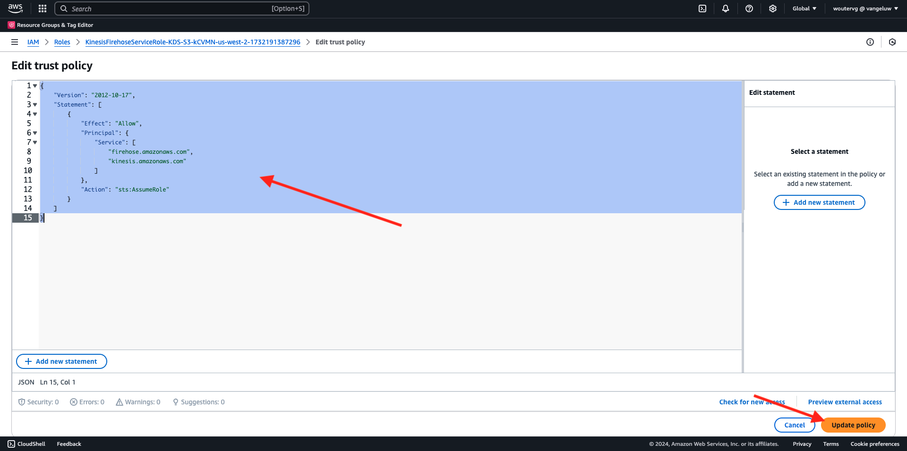

# 2.5.5 AWS 에코시스템을 위한 전달 이벤트

>[!IMPORTANT]
>
>이 연습의 완료는 선택 사항이며 AWS Kinesis을 사용하는 데 비용이 소요됩니다. AWS은 많은 서비스를 비용 없이 테스트하고 구성할 수 있는 프리 티어 계정을 제공하지만 AWS Kinesis은 해당 프리 티어 계정에 속하지 않습니다. 따라서 이 연습을 구현하고 테스트하려면 AWS Kinesis을 사용하는 데 비용이 소요됩니다.

## 알아 둘 사항

Adobe Experience Platform은 다양한 Amazon 서비스를 대상으로 지원합니다.
Kinesis과 S3는 모두 [프로필 내보내기 대상](https://experienceleague.adobe.com/docs/experience-platform/destinations/destination-types.html?lang=en)이며 Adobe Experience Platform Real-Time CDP의 일부로 사용할 수 있습니다.
고가치 세그먼트 이벤트 및 관련 프로필 속성을 선택한 시스템에 쉽게 제공할 수 있습니다.

이 노트에서는 고유한 Amazon Kinesis 스트림을 설정하여 Adobe Experience Platform Edge 에코시스템에서 오는 이벤트 데이터를 Amazon S3와 같은 클라우드 스토리지 대상으로 스트리밍하는 방법에 대해 알아봅니다. 이 기능은 웹 및 모바일 속성에서 경험 이벤트를 수집하고 분석 및 운영 보고를 위해 데이터 레이크에 푸시하려는 경우에 유용합니다. 데이터 수집은 일반적으로 큰 일별 파일 가져오기로 일괄 처리 방식으로 데이터를 수집하지만, 이벤트 전달과 함께 사용할 수 있는 공개 http 끝점은 노출하지 않습니다.

위의 사용 사례를 지원한다는 것은 스트리밍된 데이터를 파일에 쓰기 전에 버퍼링하거나 큐에 넣어야 함을 의미합니다. 여러 프로세스에서 쓰기 액세스를 위해 파일을 열지 않도록 주의해야 합니다. 이 작업을 전용 시스템에 위임하는 것은 우수한 수준의 서비스를 보장하면서도 규모에 맞게 확장할 수 있는 이상적인 옵션이며, Kinesis이 이 문제를 해결하는 데 도움이 됩니다.

Amazon Kinesis Data Streams는 데이터 스트림 수집 및 저장에 중점을 둡니다. Kinesis Data Firehose는 S3 버킷과 같은 선택 대상으로 데이터 스트림을 전달하는 데 중점을 둡니다.

이 연습의 일부로, 다음을 수행합니다.

- Kinesis 데이터 스트림의 기본 설정 수행
- Firehose 게재 스트림을 만들고 S3 버킷을 대상으로 사용
- Amazon API 게이트웨이를 rest api 끝점으로 구성하여 이벤트 데이터 수신
- 원시 이벤트 데이터를 Adobe의 Edge에서 Kinesis 스트림으로 전달

## 2.5.5.1 AWS S3 버킷 구성

[https://console.aws.amazon.com](https://console.aws.amazon.com)(으)로 이동하여 이전에 만든 Amazon 계정으로 로그인합니다.


로그인하면 **AWS 관리 콘솔**(으)로 리디렉션됩니다.


**서비스 찾기** 메뉴에서 **s3**&#x200B;을(를) 검색합니다. 첫 번째 검색 결과를 클릭합니다. **S3 - 클라우드의 확장 가능한 저장소**.


그러면 **Amazon S3** 홈 페이지가 표시됩니다. **버킷 만들기**&#x200B;를 클릭합니다.


**버킷 만들기** 화면에서 두 가지를 구성해야 합니다.

- 이름: `eventforwarding---demoProfileLdap--` 이름을 사용합니다. 예를들어, 이 연습에서는 버킷 이름이 **aepdulertcdpvangeluw**&#x200B;입니다.
- 지역: **EU(프랑크푸르트) eu-central-1** 지역 사용


다른 모든 기본 설정은 그대로 둡니다. 아래로 스크롤하여 **버킷 만들기**&#x200B;를 클릭합니다.


그러면 버킷이 만들어지는 것이 보이고 Amazon S3 홈페이지로 리디렉션됩니다.


## 2.5.5.2 AWS Kinesis 데이터 스트림 구성

**서비스 찾기** 메뉴에서 **kinesis**&#x200B;을(를) 검색합니다. 첫 번째 검색 결과를 클릭합니다. **Kinesis - 실시간 스트리밍 데이터 작업**.


**Kinesis 데이터 스트림**&#x200B;을 선택하십시오. **데이터 스트림 만들기**&#x200B;를 클릭합니다.


**데이터 스트림 이름**&#x200B;에 대해 `--demoProfileLdap---datastream`을(를) 사용합니다.


다른 설정을 변경할 필요가 없습니다. 아래로 스크롤하여 **데이터 스트림 만들기**&#x200B;를 클릭합니다.


그러면 이걸 보게 될 거야. 데이터 스트림이 성공적으로 만들어지면 다음 연습으로 이동할 수 있습니다.


## 2.5.5.3 AWS Firehose 전달 스트림 구성

**서비스 찾기** 메뉴에서 **kinesis**&#x200B;을(를) 검색합니다. **Kinesis Data Firehose**&#x200B;를 클릭합니다.


**게재 스트림 만들기**&#x200B;를 클릭합니다.


**Source**&#x200B;의 경우 **Amazon Kinesis 데이터 스트림**&#x200B;을 선택하세요. **대상**&#x200B;에 대해 **Amazon S3**&#x200B;을(를) 선택하십시오. 데이터 스트림을 선택하려면 **찾아보기**&#x200B;를 클릭하세요.


데이터 스트림을 선택합니다. **선택**&#x200B;을 클릭합니다.


그러면 이걸 보게 될 거야. **게재 스트림 이름**&#x200B;은 나중에 필요할 때 기억하십시오.


**대상 설정**&#x200B;이 표시될 때까지 아래로 스크롤합니다. **찾아보기**&#x200B;를 클릭하여 S3 버킷을 선택합니다.


S3 버킷을 선택하고 **선택**&#x200B;을 클릭합니다.


그러면 이런 것을 보게 될 겁니다. 다음 설정을 업데이트합니다.

- 동적 분할: **사용**(으)로 설정
- 다중 레코드 집계 해제: **사용 안 함**(으)로 설정
- 새 줄 구분 기호: **사용**(으)로 설정
- JSON에 대한 인라인 구문 분석: **사용**(으)로 설정


아래로 조금 스크롤하면 이 항목이 표시됩니다. 다음 설정을 업데이트합니다.

- 동적 파티션 키
   - 키 이름: **dynamicPartitioningKey**
   - JQ 식: **.dynamicPartitioningKey**
- S3 버킷 접두사: 다음 코드를 추가합니다.

```bash
!{partitionKeyFromQuery:dynamicPartitioningKey}/!{timestamp:yyyy}/!{timestamp:MM}/!{timestamp:dd}/!{timestamp:HH}/}
```

- S3 버킷 오류 출력 접두사: **오류**(으)로 설정


마지막으로 아래로 조금 더 스크롤하여 **게재 스트림 만들기**&#x200B;를 클릭하세요.


몇 분 후에 게재 스트림이 만들어지고 **활성**&#x200B;됩니다.


## 2.5.5.4 AWS IAM 역할 구성

**서비스 찾기** 메뉴에서 **iam**&#x200B;을(를) 검색합니다. **API 게이트웨이**&#x200B;를 클릭합니다.


**역할**&#x200B;을 클릭합니다.


**KinesisFirehose** 역할을 검색합니다. 클릭하여 엽니다.


사용 권한 정책 이름을 클릭하여 엽니다.


열리는 새 화면에서 **정책 편집**&#x200B;을 클릭합니다.


**Kinesis** - **작업**&#x200B;에서 **PutRecord**&#x200B;에 대한 **쓰기** 권한이 활성화되어 있는지 확인하십시오. **정책 검토**&#x200B;를 클릭합니다.


**변경 내용 저장**&#x200B;을 클릭합니다.


그럼 다시 여기로 오십시오. **역할**&#x200B;을 클릭합니다.


**KinesisFirehose** 역할을 검색합니다. 클릭하여 엽니다.


**트러스트 관계**(으)로 이동한 다음 **트러스트 정책 편집**&#x200B;을 클릭합니다.


다음 코드를 붙여넣어 기존 코드를 대체하여 현재 트러스트 정책을 덮어씁니다.

```json
{
	"Version": "2012-10-17",
	"Statement": [
		{
			"Effect": "Allow",
			"Principal": {
				"Service": [
                    "firehose.amazonaws.com",
                    "kinesis.amazonaws.com",
                    "apigateway.amazonaws.com"
                ]
			},
			"Action": "sts:AssumeRole"
		}
	]
}
```

**정책 업데이트** 클릭



그러면 이걸 보게 될 거야. 다음 단계에서 이 역할에 대해 **ARN**&#x200B;을(를) 지정해야 합니다.


## 2.5.5.5 AWS API 게이트웨이 구성

Amazon API Gateway는 REST, HTTP 및 WebSocket API를 규모에 관계없이 만들고, 게시하고, 유지 관리하고, 모니터링하고, 보안을 유지하기 위한 AWS 서비스입니다. API 개발자는 AWS Cloud에 저장된 데이터뿐만 아니라 AWS 또는 기타 웹 서비스에 액세스하는 API를 만들 수 있습니다.

이제 HTTPS 끝점을 통해 Kinesis 데이터 스트림을 인터넷에 노출하여 이벤트 전달과 같은 Adobe 서비스에서 직접 사용할 수 있습니다.

**서비스 찾기** 메뉴에서 **api 게이트웨이**&#x200B;를 검색합니다. **API 게이트웨이**&#x200B;를 클릭합니다.


그러면 이런 것을 보게 될 겁니다. **API 만들기**&#x200B;를 클릭합니다.


**REST API** 카드에서 **빌드**&#x200B;를 클릭합니다.


그러면 이걸 보게 될 거야. 다음과 같이 설정을 작성합니다.

- 프로토콜 선택: **REST** 선택
- 새 API 만들기: **새 API 선택**
- 설정:
   - API 이름: `--demoProfileLdap---eventforwarding` 사용
   - 끝점 유형: **지역** 선택

**API 만들기**&#x200B;를 클릭합니다.


그러면 이걸 보게 될 거야. **작업**&#x200B;을 클릭한 다음 **리소스 만들기**&#x200B;를 클릭합니다.


그러면 이걸 보게 될 거야. **리소스 이름**&#x200B;을(를) **스트림**(으)로 설정합니다. **리소스 만들기**&#x200B;를 클릭합니다.


그러면 이걸 보게 될 거야. **작업**&#x200B;을 클릭한 다음 **메서드 만들기**&#x200B;를 클릭합니다.


드롭다운에서 **POST**&#x200B;을(를) 선택하고 **v** 단추를 클릭합니다.


그러면 이걸 보게 될 거야. 다음과 같이 설정을 작성합니다.

- 통합 유형: **AWS 서비스**
- AWS 지역: Kinesis 데이터 스트림에서 사용하는 지역을 선택합니다. 이 경우 **us-west-2**
- AWS 서비스: **Kinesis** 선택
- AWS 하위 도메인: 비워 둠
- HTTP 메서드: **POST** 선택
- 작업 유형: **작업 이름 사용** 선택
- 작업: **PutRecord** 입력
- 실행 역할: 이전 연습에서 지시한 대로 Kinesis Data Firehose에서 사용하는 실행 역할의 **ARN**&#x200B;을(를) 붙여 넣습니다.
- 콘텐트 처리: **통과** 선택
- 기본 시간 초과 사용: 확인란을 활성화합니다.

**저장**&#x200B;을 클릭합니다.


그러면 이걸 보게 될 거야. **통합 요청**&#x200B;을 클릭합니다.


**HTTP 헤더**&#x200B;를 클릭합니다.


아래로 스크롤하여 **헤더 추가**&#x200B;를 클릭하세요.


**Name**&#x200B;을(를) **Content-Type**(으)로 설정하고 **Mapped from**&#x200B;에서 `'application/x-amz-json-1.1'`(으)로 설정합니다. **v** 아이콘을 클릭하여 변경 내용을 저장합니다.


그러면 이걸 보게 될 거야. **본문 통과 요청**&#x200B;에 대해 **정의된 템플릿이 없으면(권장)**&#x200B;을(를) 선택하십시오. **매핑 템플릿 추가**&#x200B;를 클릭합니다.


**Content-Type**&#x200B;에서 **application/json**&#x200B;을(를) 입력하십시오. **v** 아이콘을 클릭하여 변경 내용을 저장합니다.


아래로 스크롤하여 코드 편집기 창을 찾습니다. 아래 코드를 붙여넣습니다.

```json
{
  "StreamName": "$input.path('StreamName')",
  "Data": "$util.base64Encode($input.json('$.Data'))",
  "PartitionKey": "$input.path('$.PartitionKey')"
}
```

**저장**&#x200B;을 클릭합니다.


그런 다음 위로 스크롤하여 **&lt;- 메서드 실행**&#x200B;을 클릭하여 돌아갑니다.


**테스트**&#x200B;를 클릭합니다.


아래로 스크롤하여 **요청 본문** 아래에 이 코드를 붙여넣습니다. **테스트**&#x200B;를 클릭합니다.

```json
{
  "Data": {
    "message": "Hello World",
    "dynamicPartitioningKey": "v2"
  },
  "PartitionKey": "1",
  "StreamName": "--demoProfileLdap---datastream"
}
```


그러면 유사한 결과가 표시됩니다.


그러면 이걸 보게 될 거야. **작업**&#x200B;을 클릭한 다음 **API 배포**&#x200B;를 클릭합니다.


**배포 단계**&#x200B;에 대해 **새 단계**&#x200B;를 선택하십시오. **단계 이름**(으)로 **prod**&#x200B;를 입력하십시오. **배포**&#x200B;를 클릭합니다.


그러면 이걸 보게 될 거야. **변경 내용 저장**&#x200B;을 클릭합니다. 참고: 이미지의 URL은 로 데이터를 전송하는 데 사용할 URL입니다(이 예에서는 https://vv1i5vwg2k.execute-api.us-west-2.amazonaws.com/prod).


아래 cURL 요청을 사용하여 설정을 테스트할 수 있습니다. 필요한 작업은 아래 URL을 사용자 URL로 바꾸고, 이 예제에서는 `https://vv1i5vwg2k.execute-api.us-west-2.amazonaws.com/prod`을(를) URL 끝에 `/stream`을(를) 추가하는 것입니다.

```json
curl --location --request POST 'https://vv1i5vwg2k.execute-api.us-west-2.amazonaws.com/prod/stream' \
--header 'Content-Type: application/json' \
--data-raw '{
    "Data": {
        "userid": "--demoProfileLdap--@adobe.com",
        "firstName":"--demoProfileLdap--",
        "offerName":"10% off on outdoor gears",
        "offerCode": "10OFF-SPRING",
        "dynamicPartitioningKey": "campaign"
    },
    "PartitionKey": "1",
    "StreamName": "--demoProfileLdap---datastream"
}'
```

위의 업데이트된 코드를 터미널 창에 붙여넣고 enter 키를 누릅니다. 그러면 위의 테스트 시 표시되는 응답과 유사한 이 응답이 표시됩니다.


## 2.5.5.6 이벤트 전달 속성 업데이트

이제 AWS API Gateway를 통해 AWS Kinesis 데이터 스트림을 활성화할 수 있으므로 원시 경험 이벤트를 AWS 에코시스템에 전송할 수 있습니다. 이제 Real-Time CDP 연결 및 이벤트 전달을 사용하여 새로 만든 AWS API Gateway 끝점에 이벤트 전달을 쉽게 활성화할 수 있습니다.

### 2.5.5.6.1 이벤트 전달 속성 업데이트: 데이터 요소 만들기

[https://experience.adobe.com/#/data-collection/](https://experience.adobe.com/#/data-collection/)(으)로 이동한 다음 **이벤트 전달**(으)로 이동합니다. 이벤트 전달 속성을 검색하고 클릭하여 엽니다.


왼쪽 메뉴에서 **데이터 요소**(으)로 이동합니다. **데이터 요소 추가**&#x200B;를 클릭합니다.


그러면 구성할 새 데이터 요소가 표시됩니다.


다음을 선택합니다.

- **Name**(으)로 **awsDataObject**&#x200B;을(를) 입력하십시오.
- **확장**(으)로 **코어**&#x200B;을(를) 선택합니다.
- **데이터 요소 형식**(으)로 **사용자 지정 코드**&#x200B;를 선택합니다.

이제 이 음식을 드실 수 있습니다. **&lt;/> 편집기 열기**&#x200B;를 클릭합니다.


편집기에서 3행에 다음 코드를 붙여넣습니다. **저장**&#x200B;을 클릭합니다.

```javascript
const newObj = {...arc.event.xdm, dynamicPartitioningKey: "event_forwarding"}
return JSON.stringify(newObj);
```


>[!NOTE]
>
>위의 경로에서 **arc**&#x200B;을(를) 참조합니다. **arc**&#x200B;은(는) Adobe 리소스 컨텍스트를 의미하며 **arc**&#x200B;은(는) 항상 서버측 컨텍스트에서 사용 가능한 가장 높은 사용 가능한 개체를 의미합니다. Adobe Experience Platform 데이터 수집 서버 함수를 사용하여 해당 **arc** 개체에 보강 및 변환을 추가할 수 있습니다.
>
>위의 경로에서 **event**&#x200B;을(를) 참조합니다. **event**&#x200B;은(는) 고유한 이벤트를 의미하며 Adobe Experience Platform 데이터 수집 서버는 항상 모든 이벤트를 개별적으로 평가합니다. 경우에 따라 Web SDK Client Side에서 보낸 페이로드에 **events**&#x200B;에 대한 참조가 표시될 수 있지만, Adobe Experience Platform 데이터 수집 이벤트 전달에서는 모든 이벤트가 개별적으로 평가됩니다.

그럼 다시 여기로 오십시오. **저장** 또는 **라이브러리에 저장**&#x200B;을 클릭합니다.


### 2.5.5.6.2 Adobe Experience Platform 데이터 수집 서버 속성 업데이트: 규칙 업데이트

왼쪽 메뉴에서 **규칙**(으)로 이동합니다. 이전 연습 중 하나에서 만든 **모든 페이지** 규칙을 열려면 클릭하세요.


그러면 이걸 보게 될 거야. 새 작업을 추가하려면 **+** 아이콘을 클릭하십시오.


그러면 이걸 보게 될 거야. 다음을 선택합니다.

- **확장**: **Adobe 클라우드 커넥터**&#x200B;를 선택하십시오.
- **작업 유형**&#x200B;을 선택합니다. **가져오기 호출**.

그러면 **이름**: **Adobe 클라우드 커넥터 - 가져오기 호출**&#x200B;이 제공됩니다. 이제 다음이 표시됩니다.


그런 다음 다음을 구성합니다.

- 요청 메서드를 GET에서 **POST**(으)로 변경
- 이전 단계 중 하나에서 만든 AWS API 게이트웨이 끝점의 URL을 입력하십시오. `https://vv1i5vwg2k.execute-api.us-west-2.amazonaws.com/prod/stream`

이제 이 항목을 사용할 수 있습니다. 그런 다음 **머리글**(으)로 이동합니다.


헤더 아래에 키 **Content-Type** 및 값 **application/json**&#x200B;이(가) 있는 새 헤더를 추가합니다. 그런 다음 **본문**(으)로 이동합니다.


그러면 이걸 보게 될 거야. **본문(Raw)** 필드에 다음 코드를 붙여넣습니다. **변경 내용 유지**&#x200B;를 클릭합니다.

```json
{
    "Data":{{awsDataObject}},
    "PartitionKey": "1",
    "StreamName": "--demoProfileLdap---datastream"
}
```


그러면 다시 이리로 돌아오게 될 겁니다. **저장** 또는 **라이브러리에 저장**&#x200B;을 클릭합니다.


이제 이벤트 전달 속성에서 첫 번째 규칙을 구성했습니다. 변경 내용을 게시하려면 **흐름 게시**(으)로 이동하십시오.
**기본**&#x200B;을 클릭하여 개발 라이브러리를 엽니다.


**변경된 모든 리소스 추가** 단추를 클릭하면 이 라이브러리에 규칙 및 데이터 요소 변경 내용이 표시됩니다. **개발을 위한 저장 및 빌드**&#x200B;를 클릭합니다. 변경 사항이 배포되고 있습니다.


몇 분 후에 배포가 완료되고 테스트할 준비가 되었음을 알 수 있습니다.


## 2.5.5.7 구성 테스트

[https://builder.adobedemo.com/projects](https://builder.adobedemo.com/projects)(으)로 이동합니다. Adobe ID으로 로그인하면 이 메시지가 표시됩니다. 웹 사이트 프로젝트를 클릭하여 엽니다.


이제 아래 흐름을 따라 웹 사이트에 액세스할 수 있습니다. **통합**&#x200B;을 클릭합니다.


**통합** 페이지에서 연습 0.1에서 만든 데이터 수집 속성을 선택해야 합니다.


그러면 데모 웹 사이트가 열리는 것을 볼 수 있습니다. URL을 선택하고 클립보드에 복사합니다.


새 시크릿 브라우저 창을 엽니다.


이전 단계에서 복사한 데모 웹 사이트의 URL을 붙여 넣습니다. 그런 다음 Adobe ID을 사용하여 로그인하라는 메시지가 표시됩니다.


계정 유형을 선택하고 로그인 프로세스를 완료합니다.


그러면 웹 사이트가 시크릿 브라우저 창에 로드되는 것을 볼 수 있습니다. 모든 데모에 대해 새로운 시크릿 브라우저 창을 사용하여 데모 웹 사이트 URL을 로드해야 합니다.


브라우저 개발자 보기를 열면 아래에 표시된 대로 네트워크 요청을 검사할 수 있습니다. **상호 작용** 필터를 사용하면 Adobe Experience Platform 데이터 수집 클라이언트에서 Adobe Edge으로 보내는 네트워크 요청이 표시됩니다.


원시 페이로드를 선택한 경우 [https://jsonformatter.org/json-pretty-print](https://jsonformatter.org/json-pretty-print)(으)로 이동하여 페이로드를 붙여 넣으십시오. **예쁘게 만들기**&#x200B;를 클릭하세요. 그러면 JSON 페이로드, **events** 개체 및 **xdm** 개체가 표시됩니다. 이전 단계 중 하나에서 데이터 요소를 정의할 때 참조 **arc.event.xdm**&#x200B;을(를) 사용했습니다. 그러면 이 페이로드의 **xdm** 개체가 구문 분석됩니다.


보기를 **AWS**(으)로 전환합니다. 데이터 스트림을 열고 **모니터링** 탭으로 이동하면 들어오는 트래픽이 표시됩니다.


게재 스트림을 열고 **모니터링** 탭으로 이동하면 들어오는 트래픽도 표시됩니다.


마지막으로 S3 버킷을 보면 데이터 수집의 결과로 파일이 생성되는 것을 알 수 있습니다.


이러한 파일을 다운로드하고 텍스트 편집기를 사용하여 열면 전달된 이벤트의 XDM 페이로드가 포함되어 있습니다.


다음 단계: [요약 및 이점](./summary.md)

[모듈 2.5로 돌아가기](./aep-data-collection-ssf.md)

[모든 모듈로 돌아가기](./../../../overview.md)
